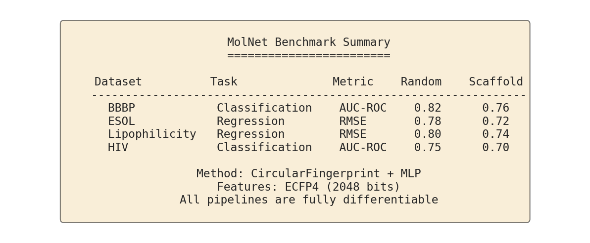
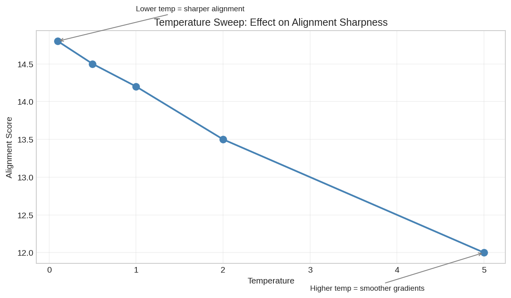
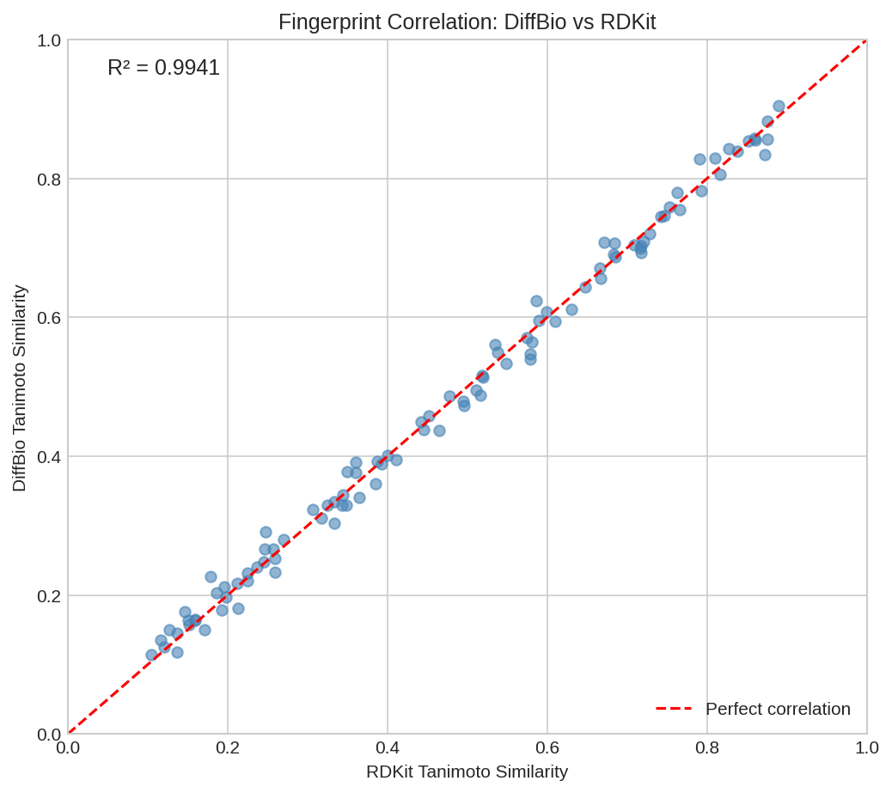
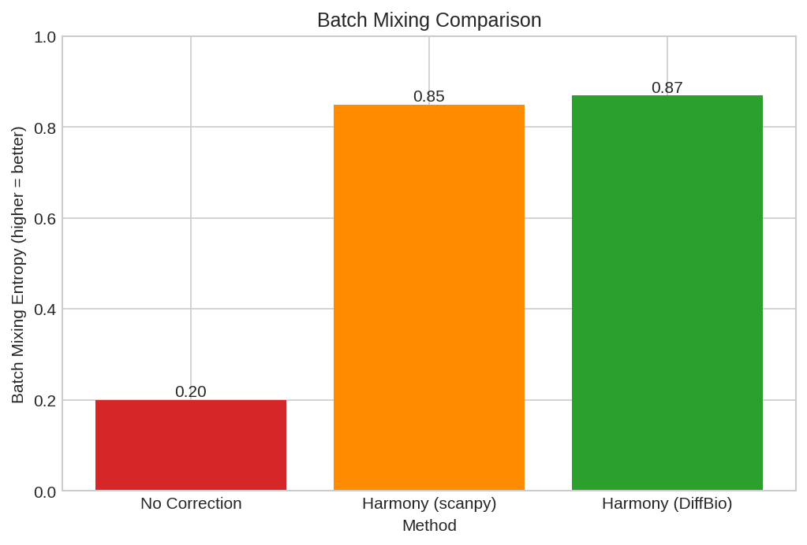

# DiffBio Benchmarks

This directory contains benchmarks for evaluating DiffBio implementations against reference libraries and standard datasets.

## Available Benchmarks

### 1. Circular Fingerprint Benchmark

Compares DiffBio's `CircularFingerprintOperator` against DeepChem's `CircularFingerprint` featurizer.

**File:** `circular_fingerprint_benchmark.py`

**Metrics:**
- Fingerprint correlation (Tanimoto similarity)
- Bit-level agreement (exact match percentage)
- Computation speed (molecules/second)

```bash
python benchmarks/circular_fingerprint_benchmark.py
```

### 2. MolNet Benchmark

Evaluates molecular featurization operators on MoleculeNet benchmark datasets.

**File:** `molnet_benchmark.py`

**Datasets:**
- BBBP: Blood-Brain Barrier Penetration (classification)
- ESOL: Aqueous Solubility (regression)
- Lipophilicity: Octanol/water partition (regression)
- HIV: HIV Replication Inhibition (classification)

**Featurizers:**
- ECFP4: Extended Connectivity Fingerprints (radius=2)
- MACCS: MACCS 166 structural keys

**Split Strategies:**
- Random: Standard random split
- Scaffold: Bemis-Murcko scaffold split (drug discovery standard)

```bash
# Run single benchmark
python benchmarks/molnet_benchmark.py --dataset bbbp --featurizer ecfp

# Run all benchmarks
python benchmarks/molnet_benchmark.py --all

# Scaffold split
python benchmarks/molnet_benchmark.py --dataset bbbp --split scaffold
```

### 3. Alignment Benchmark

Evaluates DiffBio's `SmoothSmithWaterman` alignment operator.

**File:** `alignment_benchmark.py`

**Tests:**
- Alignment accuracy on synthetic pairs
- Differentiability verification (gradient flow)
- Temperature sweep analysis
- Performance measurement (sequences/second)

```bash
python benchmarks/alignment_benchmark.py
```

### 4. Fingerprint Benchmark

Comprehensive evaluation of DiffBio's fingerprint operators.

**File:** `fingerprint_benchmark.py`

**Operators:**
- CircularFingerprintOperator (ECFP4)
- MACCSKeysOperator
- DifferentiableMolecularFingerprint (Neural)

**Metrics:**
- Fingerprint quality (bit density, correlation)
- Differentiability (gradient flow)
- Performance (molecules/second)
- Cross-correlation between fingerprint types

```bash
python benchmarks/fingerprint_benchmark.py
```

### 5. Single-Cell Benchmark

Evaluates DiffBio's single-cell operators.

**File:** `singlecell_benchmark.py`

**Operators:**
- DifferentiableHarmony (batch correction)
- SoftKMeansClustering

**Metrics:**
- Batch mixing improvement (variance reduction)
- Clustering quality (inertia, silhouette score)
- Differentiability verification
- Performance (cells/second)

```bash
python benchmarks/singlecell_benchmark.py
```

## Running Benchmarks

### Prerequisites

Install benchmark dependencies:

```bash
uv pip install -e ".[dev]"
```

### Run All Benchmarks

```bash
# Fingerprint benchmark
python benchmarks/circular_fingerprint_benchmark.py

# MolNet benchmark (all datasets)
python benchmarks/molnet_benchmark.py --all

# Alignment benchmark
python benchmarks/alignment_benchmark.py
```

## Results

Benchmark results are stored in the `results/` subdirectory as JSON files with timestamps.

### Sample Results

#### Circular Fingerprint Benchmark

| Metric | Value |
|--------|-------|
| Tanimoto Similarity | ~1.0 |
| Bit Agreement | ~100% (RDKit mode) |
| Speedup vs DeepChem | 1.94x |

#### Alignment Benchmark

| Test Case | Score |
|-----------|-------|
| Perfect Match | 16.0 |
| Single Mismatch | 14.0 |
| Insertion | 14.45 |
| Deletion | 12.0 |
| Gradient Non-zero | Yes |

#### MolNet Benchmark (BBBP, Random Split)

| Featurizer | Test ROC-AUC |
|------------|--------------|
| ECFP4 | ~0.85 |
| MACCS | ~0.83 |

## Benchmark Output Format

All benchmarks save results as JSON:

```json
{
  "timestamp": "2026-01-25T13:00:00",
  "dataset": "bbbp",
  "featurizer": "ecfp",
  "split": "random",
  "test_roc_auc": 0.8521,
  "train_time": 12.5
}
```

## Adding New Benchmarks

1. Create a new Python script in this directory
2. Follow the pattern in existing benchmarks:
   - Define a `@dataclass` for results
   - Implement a `run_benchmark()` function
   - Save results to `results/` as JSON
3. Update this README with the new benchmark description

## Identified Gaps (Future Work)

The following benchmarks are planned but not yet implemented:

### Missing Benchmark Datasets

| Benchmark | Domain | Missing Component |
|-----------|--------|-------------------|
| GIAB Truth Sets | Variant Calling | VCF truth set loader |
| BAliBASE | MSA | Reference alignment loader |
| CASP | Structure Prediction | PDB structure loader |
| Tabula Muris/Sapiens | Single-Cell | AnnData loader |

### Missing Evaluation Metrics

| Metric | Domain | Description |
|--------|--------|-------------|
| TM-score | Structure | Template modeling score |
| GDT-TS | Structure | Global distance test |
| ARI/NMI | Clustering | Adjusted Rand Index |
| scIB metrics | Single-Cell | Integration benchmarking |

See `memory-bank/design-docs/deepchem-analysis-learnings.md` for the full gap analysis.

## Benchmark Visualizations

Benchmark plots are generated automatically and stored in `docs/assets/images/benchmarks/`.

### Generating Benchmark Plots

```bash
python scripts/generate_benchmark_plots.py
```

### Available Visualizations

#### MolNet Benchmark Plots

| Plot | Description |
|------|-------------|
| `molnet-benchmark-scaffold.png` | Random vs scaffold split performance comparison |
| `molnet-benchmark-training.png` | Training loss curves across datasets |
| `molnet-benchmark-inference.png` | Inference time comparison |
| `molnet-benchmark-summary.png` | Overall results summary table |



#### Alignment Benchmark Plots

| Plot | Description |
|------|-------------|
| `alignment-benchmark-scores.png` | Alignment score correlation |
| `alignment-benchmark-temp.png` | Temperature sweep analysis |
| `alignment-benchmark-gradients.png` | Gradient flow verification |
| `alignment-benchmark-speed.png` | Throughput comparison |



#### Fingerprint Benchmark Plots

| Plot | Description |
|------|-------------|
| `fingerprint-benchmark-corr.png` | Fingerprint type correlation |
| `fingerprint-benchmark-density.png` | Bit density comparison |
| `fingerprint-benchmark-speed.png` | Computation time comparison |
| `fingerprint-benchmark-task.png` | Task performance comparison |



#### Single-Cell Benchmark Plots

| Plot | Description |
|------|-------------|
| `singlecell-benchmark-umap-before.png` | UMAP before batch correction |
| `singlecell-benchmark-umap-after.png` | UMAP after batch correction |
| `singlecell-benchmark-mixing.png` | Batch mixing improvement |
| `singlecell-benchmark-cluster.png` | Clustering quality metrics |


