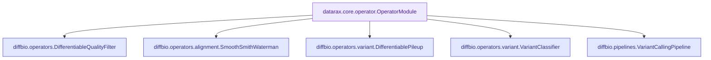

# Core Base Classes

DiffBio operators inherit from Datarax's base classes, providing a consistent interface for composable, differentiable data processing.

## OperatorModule

All DiffBio operators inherit from `datarax.core.operator.OperatorModule`, which provides:

- Consistent `apply()` interface for data transformation
- `apply_batch()` for batch processing
- Integration with Flax NNX for learnable parameters

### Interface

```python
class OperatorModule:
    def apply(
        self,
        data: PyTree,
        state: PyTree,
        metadata: dict | None,
        random_params: Any = None,
        stats: dict | None = None,
    ) -> tuple[PyTree, PyTree, dict | None]:
        """Transform data through the operator.

        Args:
            data: Input data (typically dict of arrays)
            state: Per-element state
            metadata: Optional element metadata
            random_params: Random parameters for stochastic ops
            stats: Optional statistics dictionary

        Returns:
            Tuple of (transformed_data, updated_state, updated_metadata)
        """
```

### Usage Pattern

```python
from diffbio.operators import SmoothSmithWaterman, SmithWatermanConfig
from diffbio.operators.alignment import create_dna_scoring_matrix

# Create operator
config = SmithWatermanConfig(temperature=1.0)
scoring = create_dna_scoring_matrix(match=2.0, mismatch=-1.0)
operator = SmoothSmithWaterman(config, scoring_matrix=scoring)

# Prepare data
data = {"seq1": seq1_tensor, "seq2": seq2_tensor}
state = {}
metadata = None

# Apply operator
result_data, state, metadata = operator.apply(data, state, metadata)
```

## OperatorConfig

Configuration base class for operators from `datarax.core.config.OperatorConfig`:

```python
from dataclasses import dataclass
from datarax.core.config import OperatorConfig

@dataclass(frozen=True)
class MyOperatorConfig(OperatorConfig):
    """Configuration for MyOperator.

    Attributes:
        my_param: Description of parameter.
    """
    my_param: float = 1.0
```

## DiffBio Operator Hierarchy



## Learnable Parameters

DiffBio uses Flax NNX's `nnx.Param` for learnable parameters:

```python
from flax import nnx

class MyOperator(OperatorModule):
    def __init__(self, config, rngs):
        super().__init__(config, rngs=rngs)

        # Learnable parameters
        self.temperature = nnx.Param(jnp.array(1.0))
        self.threshold = nnx.Param(jnp.array(20.0))
```

### Accessing Parameters

```python
# Get all parameters
params = nnx.state(operator, nnx.Param)

# Access specific parameter value
value = operator.temperature[...]

# Update parameter
operator.temperature[...] = new_value
```

### Gradient Computation

```python
import jax

def loss_fn(operator, data):
    result, _, _ = operator.apply(data, {}, None)
    return result["score"]

# Compute gradients w.r.t. parameters
grads = jax.grad(loss_fn)(operator, data)
```

## Graph Utilities

### compute_pairwise_distances

::: diffbio.core.graph_utils.compute_pairwise_distances
    options:
      show_root_heading: true
      show_source: false

### compute_knn_graph

::: diffbio.core.graph_utils.compute_knn_graph
    options:
      show_root_heading: true
      show_source: false

### compute_fuzzy_membership

::: diffbio.core.graph_utils.compute_fuzzy_membership
    options:
      show_root_heading: true
      show_source: false

### symmetrize_graph

::: diffbio.core.graph_utils.symmetrize_graph
    options:
      show_root_heading: true
      show_source: false

## GNN Components

### GraphAttentionLayer

::: diffbio.core.gnn_components.GraphAttentionLayer
    options:
      show_root_heading: true
      show_source: false
      members:
        - __init__
        - __call__

### GraphAttentionBlock

::: diffbio.core.gnn_components.GraphAttentionBlock
    options:
      show_root_heading: true
      show_source: false
      members:
        - __init__
        - __call__

### GATv2Layer

::: diffbio.core.gnn_components.GATv2Layer
    options:
      show_root_heading: true
      show_source: false
      members:
        - __init__
        - __call__

### GATv2Block

::: diffbio.core.gnn_components.GATv2Block
    options:
      show_root_heading: true
      show_source: false
      members:
        - __init__
        - __call__

## Optimal Transport

### SinkhornLayer

::: diffbio.core.optimal_transport.SinkhornLayer
    options:
      show_root_heading: true
      show_source: false
      members:
        - __init__
        - __call__

## Type Annotations

DiffBio uses jaxtyping for array type annotations:

```python
from jaxtyping import Array, Float, Int, PyTree

# Float array with shape annotations
def align(
    self,
    seq1: Float[Array, "len1 alphabet"],
    seq2: Float[Array, "len2 alphabet"],
) -> Float[Array, ""]:
    ...
```

Common type patterns:

| Annotation | Description |
|------------|-------------|
| `Float[Array, ""]` | Scalar float |
| `Float[Array, "n"]` | 1D float array |
| `Float[Array, "n m"]` | 2D float array |
| `Int[Array, "n"]` | 1D integer array |
| `PyTree` | JAX pytree (dict, tuple, etc.) |
