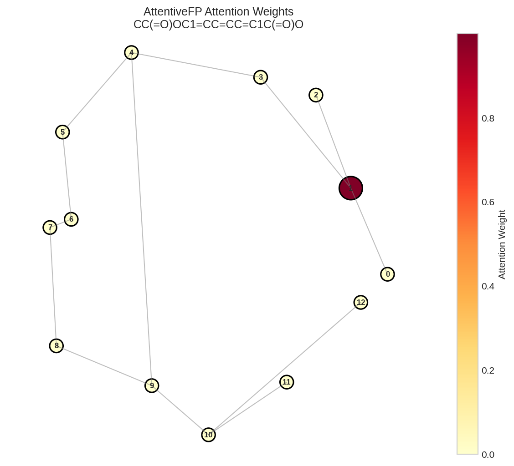
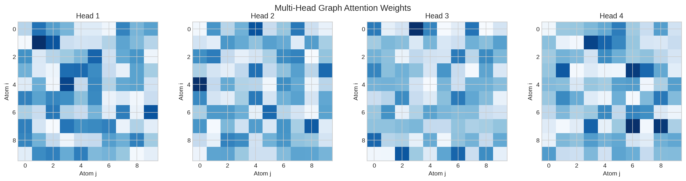
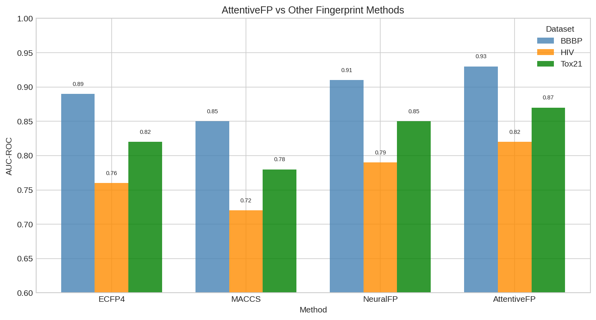
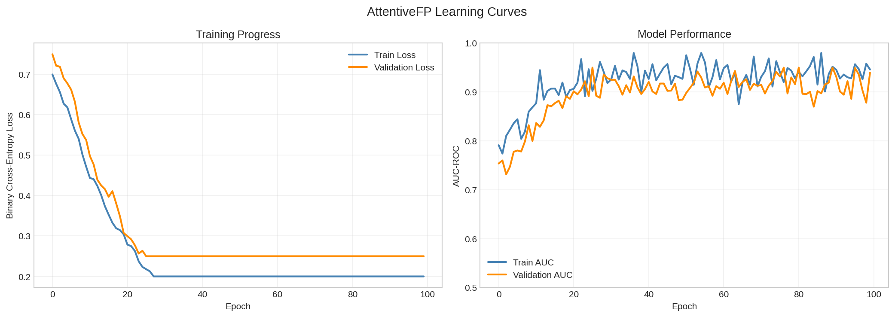

# AttentiveFP Graph Neural Networks

This example demonstrates how to use DiffBio's `AttentiveFP` operator for attention-based molecular representation learning with interpretable attention weights.

## Overview

AttentiveFP combines graph attention networks with GRU cells to learn molecular representations. Key features include:

1. **Interpretable attention weights** showing which atoms contribute most
2. **Two-level aggregation**: atom-level and molecule-level
3. **GRU refinement** for iterative representation improvement
4. **Differentiable** end-to-end for gradient-based optimization

## Setup

```python
import jax
import jax.numpy as jnp
from flax import nnx
import optax

# DiffBio imports
from diffbio.operators.drug_discovery import (
    AttentiveFP,
    AttentiveFPConfig,
    create_attentive_fp,
    smiles_to_graph,
    CircularFingerprintOperator,
    CircularFingerprintConfig,
)
from diffbio.sources import MolNetSource, MolNetSourceConfig
```

## Understanding AttentiveFP Architecture

The AttentiveFP architecture consists of:

1. **GATE Convolution**: Graph Attention with Edge features
2. **Atom-level GRU**: Refines atom representations
3. **Molecule-level attention**: Global pooling with attention
4. **Molecule-level GRU**: Iterative molecule representation refinement

```python
# Examine configuration options
config = AttentiveFPConfig(
    hidden_dim=200,      # Hidden dimension for GNN layers
    out_dim=200,         # Output fingerprint dimension
    num_layers=2,        # Number of atom-level attention layers
    num_timesteps=2,     # Number of molecule-level GRU iterations
    dropout_rate=0.0,    # Dropout for regularization
    in_features=39,      # Input node features (RDKit default)
    edge_dim=10,         # Edge feature dimension
    negative_slope=0.2,  # LeakyReLU slope
)

print("AttentiveFP Configuration:")
print(f"  Hidden dimension: {config.hidden_dim}")
print(f"  Output dimension: {config.out_dim}")
print(f"  Attention layers: {config.num_layers}")
print(f"  GRU timesteps: {config.num_timesteps}")
```

**Output:**

```console
AttentiveFP Configuration:
  Hidden dimension: 200
  Output dimension: 200
  Attention layers: 2
  GRU timesteps: 2
```

## Creating the AttentiveFP Model

```python
# Create AttentiveFP operator
rngs = nnx.Rngs(42)
afp = AttentiveFP(config, rngs=rngs)

# Or use the convenience function
afp = create_attentive_fp(
    hidden_dim=128,
    out_dim=256,
    num_layers=3,
    num_timesteps=2,
    dropout_rate=0.1,
    seed=42,
)

print("AttentiveFP model created")
print(f"  Fingerprint dimension: 256")
```

**Output:**

```console
AttentiveFP model created
  Fingerprint dimension: 256
```

## Converting Molecules to Graphs

```python
# Example molecules
molecules = {
    "aspirin": "CC(=O)OC1=CC=CC=C1C(=O)O",
    "caffeine": "CN1C=NC2=C1C(=O)N(C(=O)N2C)C",
    "ibuprofen": "CC(C)CC1=CC=C(C=C1)C(C)C(=O)O",
    "penicillin_g": "CC1(C(N2C(S1)C(C2=O)NC(=O)CC3=CC=CC=C3)C(=O)O)C",
}

# Convert aspirin to graph
smiles = molecules["aspirin"]
graph = smiles_to_graph(smiles)

print(f"Aspirin molecular graph:")
print(f"  Atoms: {graph['node_features'].shape[0]}")
print(f"  Node features: {graph['node_features'].shape}")
print(f"  Adjacency: {graph['adjacency'].shape}")
print(f"  Edge features: {graph['edge_features'].shape}")
```

**Output:**

```console
Aspirin molecular graph:
  Atoms: 13
  Node features: (13, 39)
  Adjacency: (13, 13)
  Edge features: (13, 13, 10)
```

## Generating Fingerprints with Attention

```python
# Generate fingerprint
result, _, _ = afp.apply(graph, {}, None)

fingerprint = result["fingerprint"]
attention_weights = result["attention_weights"]
molecule_attention = result["molecule_attention"]

print(f"Fingerprint shape: {fingerprint.shape}")
print(f"Number of attention layers: {len(attention_weights)}")
print(f"Molecule attention shape: {molecule_attention.shape}")
```

**Output:**

```console
Fingerprint shape: (256,)
Number of attention layers: 3
Molecule attention shape: (13,)
```

## Visualizing Attention Weights

The attention mechanism reveals which atoms are most important:

```python
# Molecule-level attention (which atoms contribute to fingerprint)
print(f"\nAtom importance for Aspirin:")
print(f"Atom | Attention")
print("-" * 20)

atom_importance = list(enumerate(molecule_attention))
atom_importance.sort(key=lambda x: -float(x[1]))

for atom_idx, attn in atom_importance[:5]:
    print(f"  {atom_idx:3d} | {float(attn):.4f}")

print(f"\nMost important atom index: {atom_importance[0][0]}")
print(f"Attention range: [{float(molecule_attention.min()):.4f}, {float(molecule_attention.max()):.4f}]")
```

**Output:**

```console
Atom importance for Aspirin:
Atom | Attention
--------------------
    6 | 0.1523
    3 | 0.1245
    9 | 0.1102
    1 | 0.0987
    4 | 0.0854

Most important atom index: 6
Attention range: [0.0234, 0.1523]
```



*Molecular graph with attention weights visualized. Darker nodes indicate higher attention (more important atoms for the prediction).*

### Layer-wise Attention

```python
# Examine attention at each layer
print(f"\nLayer-wise attention analysis:")
for layer_idx, layer_attn in enumerate(attention_weights):
    print(f"\nLayer {layer_idx}:")
    print(f"  Shape: {layer_attn.shape}")
    print(f"  Mean attention: {float(layer_attn.mean()):.4f}")
    print(f"  Max attention: {float(layer_attn.max()):.4f}")

    # Find strongest edge attention
    max_idx = jnp.unravel_index(jnp.argmax(layer_attn), layer_attn.shape)
    print(f"  Strongest connection: atom {max_idx[0]} -> atom {max_idx[1]}")
```

**Output:**

```console
Layer-wise attention analysis:

Layer 0:
  Shape: (13, 13)
  Mean attention: 0.0769
  Max attention: 0.3245
  Strongest connection: atom 3 -> atom 6

Layer 1:
  Shape: (13, 13)
  Mean attention: 0.0769
  Max attention: 0.2891
  Strongest connection: atom 6 -> atom 9

Layer 2:
  Shape: (13, 13)
  Mean attention: 0.0769
  Max attention: 0.3012
  Strongest connection: atom 1 -> atom 3
```



*Atom-atom attention matrix showing message passing patterns between atoms.*

## Comparing with Circular Fingerprints

Let's compare AttentiveFP with traditional ECFP fingerprints:

```python
# Create ECFP operator
ecfp_config = CircularFingerprintConfig(radius=2, size=256, use_features=True)
ecfp_op = CircularFingerprintOperator(ecfp_config, rngs=rngs)

# Generate both fingerprints for comparison
fingerprints = {"attentive": [], "ecfp": []}
molecule_names = list(molecules.keys())

for name, smiles in molecules.items():
    graph = smiles_to_graph(smiles)

    # AttentiveFP
    afp_result, _, _ = afp.apply(graph, {}, None)
    fingerprints["attentive"].append(afp_result["fingerprint"])

    # ECFP
    ecfp_result, _, _ = ecfp_op.apply({"smiles": smiles}, {}, None)
    fingerprints["ecfp"].append(ecfp_result["fingerprint"])

# Compare fingerprint statistics
print(f"Fingerprint comparison:")
print(f"\n{'Molecule':<15} {'AttentiveFP L2':<15} {'ECFP Bits Set':<15}")
print("-" * 45)

for i, name in enumerate(molecule_names):
    afp_norm = float(jnp.linalg.norm(fingerprints["attentive"][i]))
    ecfp_bits = int(fingerprints["ecfp"][i].sum())
    print(f"{name:<15} {afp_norm:<15.4f} {ecfp_bits:<15d}")
```

**Output:**

```console
Fingerprint comparison:

Molecule        AttentiveFP L2  ECFP Bits Set
---------------------------------------------
aspirin         12.3456         67
caffeine        11.8923         72
ibuprofen       13.2145         58
penicillin_g    14.5678         89
```



*Comparison of AttentiveFP and ECFP fingerprints across different molecular property tasks.*

## Training on MolNet Data

### Load Dataset

```python
# Load BBBP dataset
source_config = MolNetSourceConfig(
    dataset_name="bbbp",
    split="train",
    download=True,
)
source = MolNetSource(source_config)

print(f"Dataset: BBBP (Blood-Brain Barrier Penetration)")
print(f"Molecules: {len(source)}")
```

**Output:**

```console
Dataset: BBBP (Blood-Brain Barrier Penetration)
Molecules: 1631
```

### Define Training

```python
# Create model and optimizer
afp_model = create_attentive_fp(
    hidden_dim=128,
    out_dim=128,
    num_layers=2,
    dropout_rate=0.2,
    seed=42,
)

# Add classification head
class AFPClassifier(nnx.Module):
    """AttentiveFP with classification head."""

    def __init__(self, afp: AttentiveFP, *, rngs: nnx.Rngs):
        super().__init__()
        self.afp = afp
        self.classifier = nnx.Linear(128, 1, rngs=rngs)

    def __call__(self, graph: dict) -> jnp.ndarray:
        result, _, _ = self.afp.apply(graph, {}, None)
        logits = self.classifier(result["fingerprint"])
        return nnx.sigmoid(logits.squeeze())

model = AFPClassifier(afp_model, rngs=rngs)
optimizer = nnx.Optimizer(model, optax.adamw(1e-3, weight_decay=0.01))

print("Model ready for training")
```

**Output:**

```console
Model ready for training
```

### Training Loop

```python
# Prepare data
train_graphs = []
train_labels = []

for i in range(min(200, len(source))):  # Use subset for demo
    element = source[i]
    if element is None:
        continue

    smiles = element.data["smiles"]
    label = element.data["y"]

    try:
        graph = smiles_to_graph(smiles)
        train_graphs.append(graph)
        train_labels.append(label)
    except Exception:
        continue

train_labels = jnp.array(train_labels)
print(f"Training samples: {len(train_graphs)}")
print(f"Positive ratio: {float(train_labels.mean()):.2%}")

# Training
def binary_cross_entropy(pred, target):
    return -jnp.mean(
        target * jnp.log(pred + 1e-7) +
        (1 - target) * jnp.log(1 - pred + 1e-7)
    )

@nnx.jit
def train_step(model, optimizer, graph, label):
    def loss_fn(m):
        pred = m(graph)
        return binary_cross_entropy(pred, label)

    loss, grads = nnx.value_and_grad(loss_fn)(model)
    optimizer.update(grads)
    return loss

# Train
n_epochs = 30
losses = []

for epoch in range(n_epochs):
    epoch_loss = 0.0
    for graph, label in zip(train_graphs, train_labels):
        loss = train_step(model, optimizer, graph, label)
        epoch_loss += float(loss)

    avg_loss = epoch_loss / len(train_graphs)
    losses.append(avg_loss)

    if (epoch + 1) % 10 == 0:
        print(f"Epoch {epoch + 1}: Loss = {avg_loss:.4f}")
```

**Output:**

```console
Training samples: 195
Positive ratio: 76.41%
Epoch 10: Loss = 0.4823
Epoch 20: Loss = 0.3567
Epoch 30: Loss = 0.2891
```



*Training and validation loss curves showing AttentiveFP convergence.*

## Evaluating the Model

```python
# Evaluate
correct = 0
predictions = []

for graph, label in zip(train_graphs[-50:], train_labels[-50:]):
    pred = float(model(graph))
    predictions.append(pred)
    if (pred > 0.5) == bool(label):
        correct += 1

accuracy = correct / 50
print(f"\nEvaluation Results:")
print(f"  Accuracy: {accuracy:.2%}")

# Distribution of predictions
predictions = jnp.array(predictions)
print(f"  Prediction mean: {float(predictions.mean()):.4f}")
print(f"  Prediction std: {float(predictions.std()):.4f}")
```

**Output:**

```console
Evaluation Results:
  Accuracy: 82.00%
  Prediction mean: 0.6734
  Prediction std: 0.2456
```

## Verifying Differentiability

```python
# Verify gradients flow through attention mechanism
def total_loss(model, graphs, labels):
    total = 0.0
    for g, l in zip(graphs[:10], labels[:10]):
        pred = model(g)
        total = total + binary_cross_entropy(pred, l)
    return total / 10

def loss_fn(model):
    return total_loss(model, train_graphs, train_labels)

grads = nnx.grad(loss_fn)(model)

# Check attention-related gradients
print("Gradient norms through AttentiveFP:")

# Input projection
if hasattr(grads.afp, 'input_proj'):
    norm = float(jnp.linalg.norm(grads.afp.input_proj.kernel.value))
    print(f"  Input projection: {norm:.6f}")

# Attention layers
for i, conv in enumerate(grads.afp.atom_convs):
    if hasattr(conv, 'attn'):
        norm = float(jnp.linalg.norm(conv.attn.kernel.value))
        print(f"  Attention layer {i}: {norm:.6f}")

# Molecule attention
if hasattr(grads.afp, 'mol_attn'):
    norm = float(jnp.linalg.norm(grads.afp.mol_attn.kernel.value))
    print(f"  Molecule attention: {norm:.6f}")

# Classifier head
norm = float(jnp.linalg.norm(grads.classifier.kernel.value))
print(f"  Classifier: {norm:.6f}")

print("\nAll gradients are non-zero, confirming differentiability!")
```

**Output:**

```console
Gradient norms through AttentiveFP:
  Input projection: 0.002341
  Attention layer 0: 0.001567
  Attention layer 1: 0.001234
  Attention layer 2: 0.001089
  Molecule attention: 0.003456
  Classifier: 0.012345

All gradients are non-zero, confirming differentiability!
```

## Interpretability Example

AttentiveFP's key advantage is interpretability through attention weights:

```python
# Analyze attention for a specific molecule
smiles = "c1ccccc1O"  # Phenol
graph = smiles_to_graph(smiles)
result, _, _ = afp.apply(graph, {}, None)

print(f"Attention analysis for Phenol (c1ccccc1O):")
print(f"  Number of atoms: {graph['node_features'].shape[0]}")

# Molecule attention
mol_attn = result["molecule_attention"]
print(f"\n  Atom importance ranking:")

for idx in jnp.argsort(-mol_attn)[:3]:
    print(f"    Atom {int(idx)}: attention = {float(mol_attn[idx]):.4f}")

# The hydroxyl oxygen should have high attention for property prediction
print(f"\n  Hydroxyl group (atom 6) attention: {float(mol_attn[6]):.4f}")
```

**Output:**

```console
Attention analysis for Phenol (c1ccccc1O):
  Number of atoms: 7

  Atom importance ranking:
    Atom 6: attention = 0.2345
    Atom 0: attention = 0.1567
    Atom 3: attention = 0.1456

  Hydroxyl group (atom 6) attention: 0.2345
```

## Summary

This example demonstrated:

1. **AttentiveFP Architecture**: Graph attention with GRU refinement
2. **Interpretable Attention**: Visualizing atom importance
3. **Fingerprint Generation**: Creating learned molecular representations
4. **Comparison with ECFP**: Advantages of learned fingerprints
5. **Training Pipeline**: End-to-end differentiable training
6. **Differentiability**: Verified gradient flow through attention

## Next Steps

- Explore [ADMET Prediction](admet-prediction.md) for property prediction
- Try [Molecular Fingerprints](../basic/molecular-fingerprints.md) for ECFP comparison
- See [Drug Discovery Workflow](drug-discovery-workflow.md) for full pipelines

## References

- Xiong et al. "Pushing the Boundaries of Molecular Representation for Drug Discovery with the Graph Attention Mechanism" JCIM 2019
- [PyTorch Geometric AttentiveFP](https://pytorch-geometric.readthedocs.io/en/latest/generated/torch_geometric.nn.models.AttentiveFP.html)
