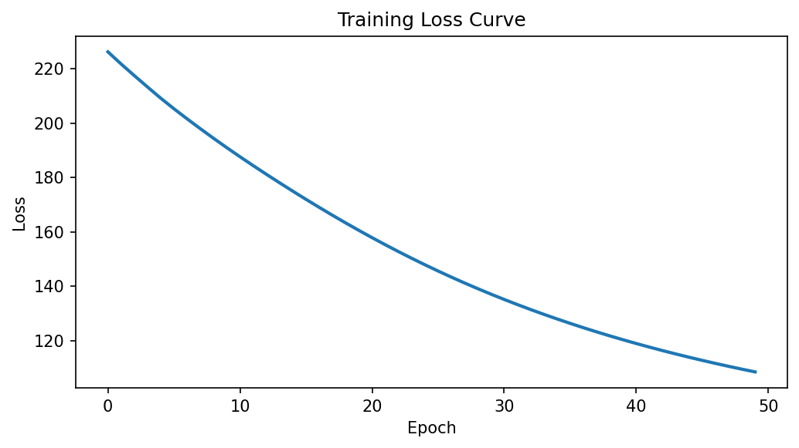
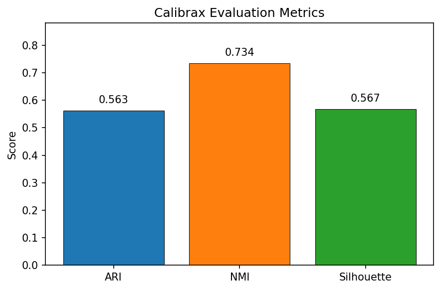
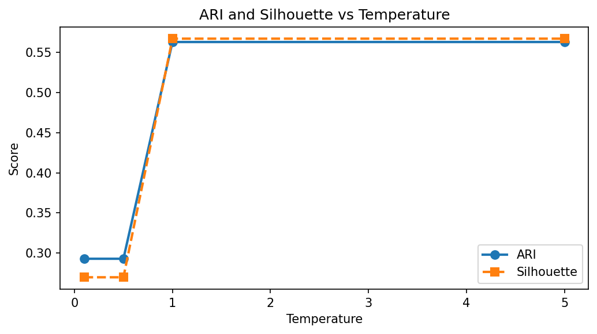

# Calibrax Metrics for Evaluation

**Duration:** 25 min | **Level:** Advanced | **Device:** CPU-compatible

## Overview

Demonstrates the training-vs-evaluation metric split: trains `SoftKMeansClustering` using `ClusteringCompactnessLoss` (differentiable surrogate), then evaluates with calibrax's exact clustering metrics (ARI, NMI, silhouette). Also shows `DifferentiableAUROC` vs `ExactAUROC` and `ShannonDiversityLoss` as a training regularizer. Explores combined compactness+diversity training and temperature effects on clustering quality.

## Quick Start

```bash
source ./activate.sh
uv run python examples/ecosystem/calibrax_metrics.py
```

## Key Code

```python
from diffbio.losses import ClusteringCompactnessLoss, DifferentiableAUROC, ExactAUROC
from calibrax.metrics.functional.clustering import (
    adjusted_rand_index, normalized_mutual_information_clustering, silhouette_score,
)

# Training: differentiable loss
compactness_loss = ClusteringCompactnessLoss(separation_weight=1.0, min_separation=2.0)

# Evaluation: exact calibrax metrics
ari = adjusted_rand_index(true_labels, predicted_labels)
nmi = normalized_mutual_information_clustering(true_labels, predicted_labels)
sil = silhouette_score(embeddings, predicted_labels)
```

## Results



Loss decreases from 226.2 to 108.5 over 50 epochs using `ClusteringCompactnessLoss`, confirming gradient-based centroid optimization.



Bar chart of calibrax evaluation metrics after training with compactness loss only: ARI=0.563, NMI=0.734, Silhouette=0.567 -- cluster structure is partially recovered.



Combined compactness+diversity training at different temperatures shows ARI peaking at T=1.0 (0.563) with silhouette following a similar pattern, demonstrating the temperature trade-off between assignment sharpness and optimization landscape smoothness.

```
=== AUROC Comparison ===
  DifferentiableAUROC (training):  0.6112
  ExactAUROC (evaluation):         0.9660
  Difference:                      0.3548
DifferentiableAUROC gradient shape: (100,)
DifferentiableAUROC gradient non-zero: True
DifferentiableAUROC gradient finite: True
Synthetic data: 60 cells, 20 genes, 3 true clusters
Embeddings shape: (60, 20)
True labels distribution: [20, 20, 20]
=== Training Clustering ===
  Epoch   0: loss=226.1697
  Epoch  10: loss=187.6027
  Epoch  20: loss=157.8661
  Epoch  30: loss=135.1579
  Epoch  40: loss=118.9609
  Epoch  49: loss=108.5208
=== Calibrax Evaluation Metrics ===
  Adjusted Rand Index (ARI): 0.5630
  Normalized Mutual Info:    0.7337
  Silhouette Score:          0.5671
  Predicted cluster sizes: [40, 20, 0]
=== Diversity Metrics on Trained Clusters ===
  Shannon entropy (higher = more diverse): 0.0000
  Max Shannon entropy (log 3):            1.0986
  Simpson index (lower = more diverse):    1.0000
Shannon diversity gradient shape: (3, 20)
Shannon diversity gradient non-zero: True
Shannon diversity gradient finite: True
=== Combined Training: Compactness + Diversity ===
  Epoch   0: total=223.9254, compact=218.2747, diversity=0.0042
  Epoch  10: total=173.1884, compact=168.8271, diversity=0.0000
  Epoch  20: total=133.9442, compact=130.5298, diversity=0.0000
  Epoch  30: total=103.5113, compact=100.8919, diversity=-0.0000
  Epoch  40: total=80.2800, compact=78.2876, diversity=-0.0000
  Epoch  49: total=64.1580, compact=62.5974, diversity=-0.0000
  Evaluation (calibrax):
    ARI:        1.0000
    NMI:        1.0000
    Silhouette: 0.8462
=== JIT-Compiled Training Losses ===
  Compactness loss (JIT):       62.5974
  Shannon diversity (JIT):      -0.0000
  DifferentiableAUROC (JIT):    0.6112
  Calibrax ARI (eager):         1.0000
  Calibrax NMI (eager):         1.0000
  Calibrax Silhouette (eager):  0.8462
=== Experiment: Temperature vs Clustering Quality ===
  T= 0.1: ARI=0.2929, Silhouette=0.2698, Shannon=0.0000
  T= 0.5: ARI=0.2929, Silhouette=0.2698, Shannon=0.0000
  T= 1.0: ARI=0.5630, Silhouette=0.5671, Shannon=0.0000
  T= 5.0: ARI=0.5630, Silhouette=0.5671, Shannon=0.0001
```

## Next Steps

- [scVI Benchmark](scvi-benchmark.md) -- VAE training with calibrax evaluation
- [Single-Cell Pipeline](singlecell-pipeline.md) -- five-operator end-to-end pipeline
- [API Reference: Metric Losses](../../api/losses/metric.md)
