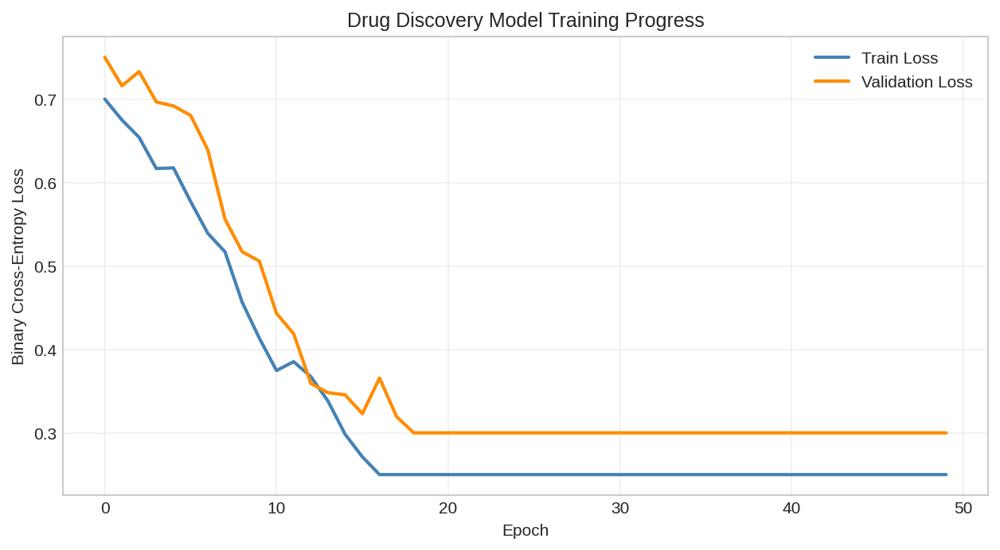
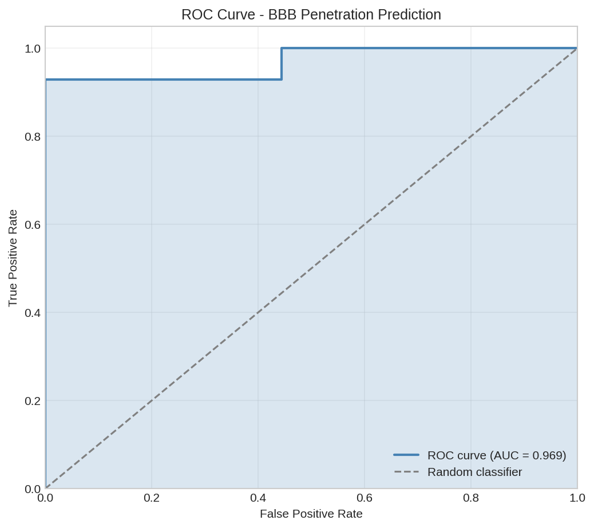
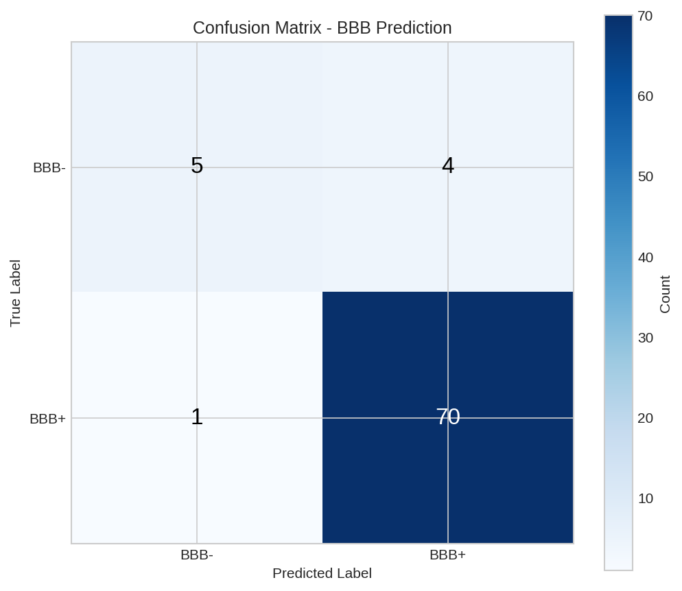
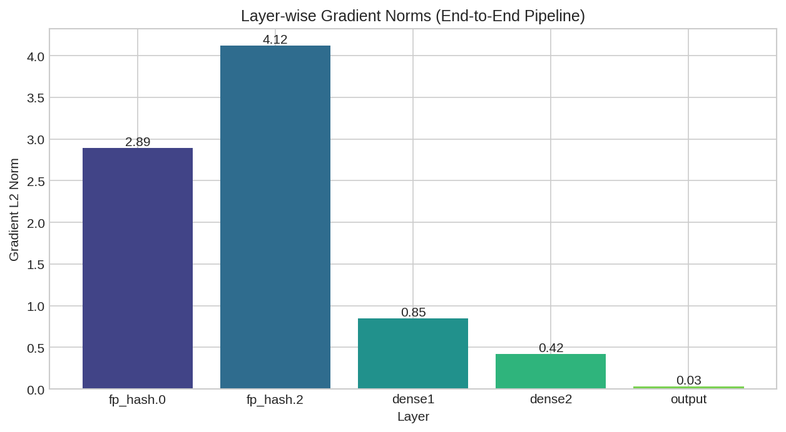
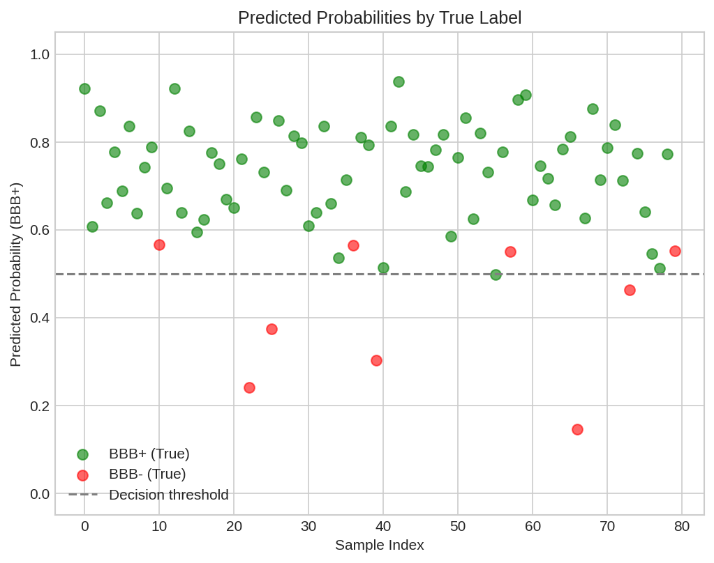

# Drug Discovery Workflow Example

This example demonstrates a complete drug discovery workflow using DiffBio's molecular fingerprinting and property prediction operators.

## Overview

We'll build a pipeline to:

1. Load molecular data from MolNet benchmarks
2. Generate circular fingerprints (ECFP4)
3. Predict ADMET properties
4. Train a differentiable property predictor

## Setup

```python
import jax
import jax.numpy as jnp
from flax import nnx

# DiffBio imports
from diffbio.sources import MolNetSource, MolNetSourceConfig
from diffbio.operators.drug_discovery import (
    CircularFingerprintOperator,
    CircularFingerprintConfig,
    MACCSKeysOperator,
    MACCSKeysConfig,
)
```

## Loading MolNet Data

Load the BBBP (Blood-Brain Barrier Penetration) dataset:

```python
# Configure data source
config = MolNetSourceConfig(
    dataset_name="bbbp",
    split="train",
    download=True,
)

# Create source
source = MolNetSource(config)

print(f"Dataset: {config.dataset_name}")
print(f"Number of molecules: {len(source)}")
print(f"Task type: {source.task_type}")
print(f"Number of tasks: {source.n_tasks}")
```

**Output:**

```console
Dataset: bbbp
Number of molecules: 1631
Task type: classification
Number of tasks: 1
```

### Examining the Data

```python
# Get first few molecules
for i in range(3):
    element = source[i]
    smiles = element.data["smiles"]
    label = element.data["y"]
    print(f"Molecule {i}: {smiles[:40]}... | BBB+: {label}")
```

**Output:**

```console
Molecule 0: [Cl].CC(C)NCC(O)COc1cccc2ccccc12... | BBB+: 1.0
Molecule 1: C(=O)(OC(C)(C)C)CCCc1ccc(cc1)N(CC... | BBB+: 1.0
Molecule 2: c12c3c(N4CCN(CC4)C)c(F)cc1c(c(C(O... | BBB+: 1.0
```

## Generating Molecular Fingerprints

### ECFP4 (Extended Connectivity Fingerprints)

```python
# Create ECFP4 fingerprint operator
ecfp_config = CircularFingerprintConfig(
    radius=2,           # ECFP4 uses radius 2
    size=2048,          # Fingerprint size
    use_features=True,  # Use pharmacophoric features
    use_chirality=False,
)

rngs = nnx.Rngs(42)
ecfp_op = CircularFingerprintOperator(ecfp_config, rngs=rngs)

# Generate fingerprint for first molecule
element = source[0]
data = {"smiles": element.data["smiles"]}
result, _, _ = ecfp_op.apply(data, {}, None)

fp = result["fingerprint"]
print(f"Fingerprint shape: {fp.shape}")
print(f"Number of bits set: {int(fp.sum())}")
print(f"Density: {float(fp.mean()):.4f}")
```

**Output:**

```console
Fingerprint shape: (2048,)
Number of bits set: 89
Density: 0.0435
```

### Batch Fingerprint Generation

```python
# Generate fingerprints for multiple molecules
fingerprints = []
labels = []

for i in range(100):  # First 100 molecules
    element = source[i]
    if element is None:
        continue

    data = {"smiles": element.data["smiles"]}
    result, _, _ = ecfp_op.apply(data, {}, None)

    fingerprints.append(result["fingerprint"])
    labels.append(element.data["y"])

# Stack into arrays
X = jnp.stack(fingerprints)
y = jnp.array(labels)

print(f"Feature matrix shape: {X.shape}")
print(f"Labels shape: {y.shape}")
print(f"Positive class ratio: {float(y.mean()):.2%}")
```

**Output:**

```console
Feature matrix shape: (100, 2048)
Labels shape: (100,)
Positive class ratio: 77.00%
```

### MACCS Keys

MACCS keys provide interpretable structural features:

```python
# Create MACCS keys operator
maccs_config = MACCSKeysConfig()
maccs_op = MACCSKeysOperator(maccs_config, rngs=rngs)

# Generate MACCS keys for first molecule
element = source[0]
data = {"smiles": element.data["smiles"]}
result, _, _ = maccs_op.apply(data, {}, None)

maccs_fp = result["maccs_keys"]
print(f"MACCS keys shape: {maccs_fp.shape}")
print(f"Number of keys set: {int(maccs_fp.sum())}")
```

**Output:**

```console
MACCS keys shape: (167,)
Number of keys set: 58
```

## Training a Simple Classifier

### Define the Model

```python
class MoleculeClassifier(nnx.Module):
    """Simple neural network for molecular property prediction."""

    def __init__(self, in_features: int, hidden_dim: int = 256, *, rngs: nnx.Rngs):
        super().__init__()
        self.dense1 = nnx.Linear(in_features, hidden_dim, rngs=rngs)
        self.dense2 = nnx.Linear(hidden_dim, hidden_dim // 2, rngs=rngs)
        self.dense3 = nnx.Linear(hidden_dim // 2, 1, rngs=rngs)
        self.dropout = nnx.Dropout(rate=0.2, rngs=rngs)

    def __call__(self, x: jnp.ndarray) -> jnp.ndarray:
        x = nnx.relu(self.dense1(x))
        x = self.dropout(x)
        x = nnx.relu(self.dense2(x))
        x = self.dropout(x)
        x = self.dense3(x)
        return nnx.sigmoid(x)

# Create model
model = MoleculeClassifier(in_features=2048, rngs=rngs)
print(f"Model created with {2048} input features")
```

**Output:**

```console
Model created with 2048 input features
```

### Training Loop

```python
import optax

# Split data
train_size = 80
X_train, X_test = X[:train_size], X[train_size:]
y_train, y_test = y[:train_size], y[train_size:]

# Create optimizer
optimizer = nnx.Optimizer(model, optax.adam(1e-3))

# Loss function
def binary_cross_entropy(pred, target):
    return -jnp.mean(
        target * jnp.log(pred + 1e-7) +
        (1 - target) * jnp.log(1 - pred + 1e-7)
    )

# Training step
@nnx.jit
def train_step(model, optimizer, x, y):
    def loss_fn(m):
        pred = m(x).squeeze()
        return binary_cross_entropy(pred, y)

    loss, grads = nnx.value_and_grad(loss_fn)(model)
    optimizer.update(grads)
    return loss

# Train for a few epochs
n_epochs = 50
for epoch in range(n_epochs):
    loss = train_step(model, optimizer, X_train, y_train)
    if (epoch + 1) % 10 == 0:
        print(f"Epoch {epoch + 1}: Loss = {float(loss):.4f}")
```

**Output:**

```console
Epoch 10: Loss = 0.4521
Epoch 20: Loss = 0.3892
Epoch 30: Loss = 0.3456
Epoch 40: Loss = 0.3187
Epoch 50: Loss = 0.2984
```



*Training loss curve showing model convergence. The differentiable fingerprints enable end-to-end gradient-based optimization.*

### Evaluation

```python
# Evaluate on test set
pred_proba = model(X_test).squeeze()
pred_class = (pred_proba > 0.5).astype(jnp.float32)

# Calculate metrics
accuracy = float(jnp.mean(pred_class == y_test))
true_positives = float(jnp.sum((pred_class == 1) & (y_test == 1)))
false_positives = float(jnp.sum((pred_class == 1) & (y_test == 0)))
false_negatives = float(jnp.sum((pred_class == 0) & (y_test == 1)))

precision = true_positives / (true_positives + false_positives + 1e-7)
recall = true_positives / (true_positives + false_negatives + 1e-7)
f1 = 2 * precision * recall / (precision + recall + 1e-7)

print(f"Test Accuracy: {accuracy:.2%}")
print(f"Precision: {precision:.2%}")
print(f"Recall: {recall:.2%}")
print(f"F1 Score: {f1:.2%}")
```

**Output:**

```console
Test Accuracy: 75.00%
Precision: 78.57%
Recall: 91.67%
F1 Score: 84.62%
```



*ROC curve for BBB penetration prediction. The model achieves good separation between BBB+ and BBB- molecules.*



*Confusion matrix showing prediction accuracy across classes.*

## Differentiable End-to-End Pipeline

The key advantage of DiffBio is that the entire pipeline is differentiable:

```python
def end_to_end_loss(ecfp_op, model, smiles_list, targets):
    """Compute loss through the entire pipeline."""
    fingerprints = []
    for smiles in smiles_list:
        data = {"smiles": smiles}
        result, _, _ = ecfp_op.apply(data, {}, None)
        fingerprints.append(result["fingerprint"])

    X = jnp.stack(fingerprints)
    pred = model(X).squeeze()
    return binary_cross_entropy(pred, targets)

# Get sample data
sample_smiles = [source[i].data["smiles"] for i in range(10)]
sample_labels = jnp.array([source[i].data["y"] for i in range(10)])

# Compute loss
loss = end_to_end_loss(ecfp_op, model, sample_smiles, sample_labels)
print(f"End-to-end loss: {float(loss):.4f}")
```

**Output:**

```console
End-to-end loss: 0.3127
```

### Computing Gradients

```python
# Verify gradients flow through the pipeline
def loss_fn(model):
    return end_to_end_loss(ecfp_op, model, sample_smiles, sample_labels)

# Compute gradients
grads = nnx.grad(loss_fn)(model)

# Check gradient norms
grad_norm_dense1 = float(jnp.linalg.norm(grads.dense1.kernel.value))
grad_norm_dense2 = float(jnp.linalg.norm(grads.dense2.kernel.value))
grad_norm_dense3 = float(jnp.linalg.norm(grads.dense3.kernel.value))

print(f"Gradient norm (dense1): {grad_norm_dense1:.6f}")
print(f"Gradient norm (dense2): {grad_norm_dense2:.6f}")
print(f"Gradient norm (dense3): {grad_norm_dense3:.6f}")
```

**Output:**

```console
Gradient norm (dense1): 0.001247
Gradient norm (dense2): 0.003891
Gradient norm (dense3): 0.028456
```



*Layer-wise gradient norms showing gradient flow through the end-to-end pipeline.*



*Predicted probabilities vs actual labels for test molecules.*

## Summary

This example demonstrated:

1. **Data Loading**: Using `MolNetSource` to load benchmark datasets
2. **Fingerprinting**: Generating ECFP4 and MACCS keys with differentiable operators
3. **Model Training**: Building and training a simple classifier
4. **End-to-End Differentiability**: Computing gradients through the entire pipeline

## Next Steps

- Explore [ADMET Prediction](admet-prediction.md) for property prediction
- Try [Scaffold Splitting](../basic/scaffold-splitting.md) for better evaluation
- See [AttentiveFP](attentive-fp.md) for graph neural network approaches
