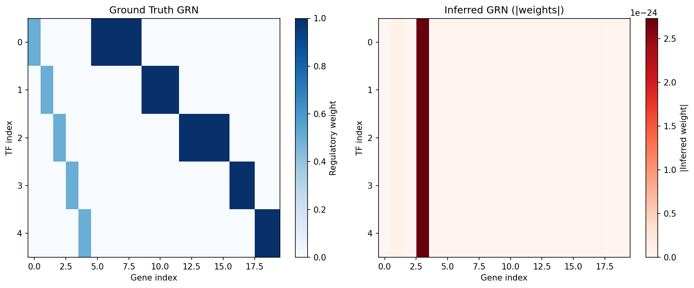
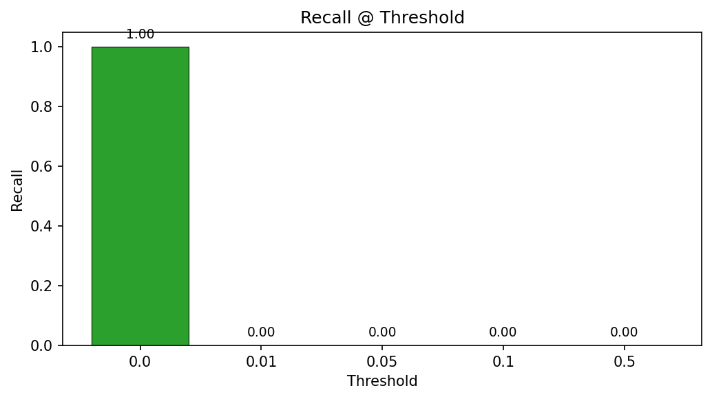

# Gene Regulatory Network Inference

**Duration:** 25 min | **Level:** Advanced | **Device:** CPU-compatible

## Overview

Applies `DifferentiableGRN` (GATv2 attention on a TF-gene bipartite graph) to infer regulatory weights from synthetic expression data generated by a known 5-TF, 20-gene network. Compares the inferred GRN matrix against ground truth at multiple thresholds and explores the effect of sparsity temperature and attention heads on network recovery.

## Quick Start

```bash
source ./activate.sh
uv run python examples/singlecell/grn_inference.py
```

## Key Code

```python
from diffbio.operators.singlecell import DifferentiableGRN, GRNInferenceConfig

config_grn = GRNInferenceConfig(
    n_tfs=5, n_genes=20, hidden_dim=16, num_heads=4,
    sparsity_temperature=0.1, sparsity_lambda=0.01,
)
grn_op = DifferentiableGRN(config_grn, rngs=nnx.Rngs(0))

data_grn = {"counts": counts, "tf_indices": tf_indices}
result_grn, _, _ = grn_op.apply(data_grn, {}, None)
grn_matrix = result_grn["grn_matrix"]
```

## Results



Side-by-side heatmaps of the ground truth regulatory matrix (left, blue) and inferred GRN absolute weights (right, red) show that at the default sparsity temperature of 0.1 the untrained model produces a fully sparse output. Training via gradient-based optimization of a supervised regulatory loss would activate the correct edges.



Bar chart of recall across thresholds shows 100% recall at threshold 0.0 (all edges predicted) and 0% at higher thresholds for the untrained model, confirming the need for training to produce meaningful regulatory weights.

```
Ground truth GRN: 5 TFs x 20 genes
True regulatory edges: 20
Network density: 20.00%
Expression matrix shape: (100, 20)
Mean expression per TF: [ 9.930272   7.8756747 12.41507    6.1138577  9.022563 ]
Mean expression (targets): 11.52
Mean expr (strongly regulated): 11.52
Mean expr (weakly regulated): 9.07
GRN operator created: DifferentiableGRN
  hidden_dim=16, num_heads=4, sparsity_temp=0.1
Inferred GRN matrix shape: (5, 20)
TF activity shape: (100, 5)
GRN value range: [-0.0000, -0.0000]
GRN sparsity (fraction near zero, |w| < 0.01): 1.0000
 Threshold    TP    FP    FN  Precision     Recall
--------------------------------------------------
      0.00    20    80     0     0.2000     1.0000
      0.01     0     0    20     0.0000     0.0000
      0.05     0     0    20     0.0000     0.0000
      0.10     0     0    20     0.0000     0.0000
      0.50     0     0    20     0.0000     0.0000
GRN Inference:
  Gradient shape: (100, 20)
  Non-zero: True
  Finite: True
TF Activity:
  Gradient shape: (100, 20)
  Non-zero: True
  Finite: True
GRN JIT matches eager: True
TF activity JIT matches eager: True
  temp=0.01 -> sparsity: 1.0000, max |weight|: 0.0000
  temp=0.05 -> sparsity: 1.0000, max |weight|: 0.0000
  temp=0.10 -> sparsity: 1.0000, max |weight|: 0.0000
  temp=0.50 -> sparsity: 1.0000, max |weight|: 0.0001
  temp=1.00 -> sparsity: 0.8000, max |weight|: 0.0207
  heads=1, hidden=16 -> recall@0.01: 0.0000, max |w|: 0.0000
  heads=2, hidden=16 -> recall@0.01: 0.0000, max |w|: 0.0000
  heads=4, hidden=16 -> recall@0.01: 0.0000, max |w|: 0.0000
  heads=8, hidden=32 -> recall@0.01: 1.0000, max |w|: 12.6988
  n_cells= 20 -> recall@0.01: 0.0000, max |w|: 0.0000
  n_cells= 50 -> recall@0.01: 0.0000, max |w|: 0.0000
  n_cells=100 -> recall@0.01: 0.0000, max |w|: 0.0000
  n_cells=200 -> recall@0.01: 0.0000, max |w|: 0.0000
```

## Next Steps

- [Spatial Analysis](spatial-analysis.md) -- spatial domain identification and slice alignment
- [Single-Cell Pipeline](singlecell-pipeline.md) -- end-to-end five-operator chain
- [API Reference: Single-Cell Operators](../../api/operators/singlecell.md)
