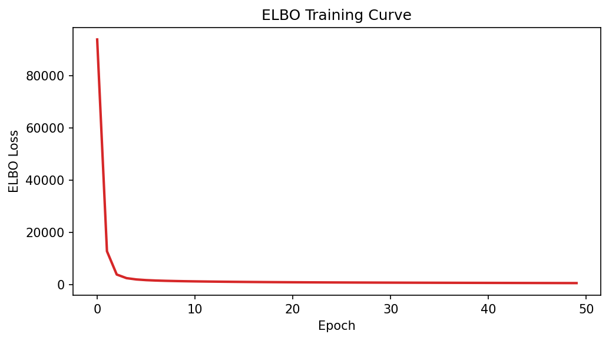
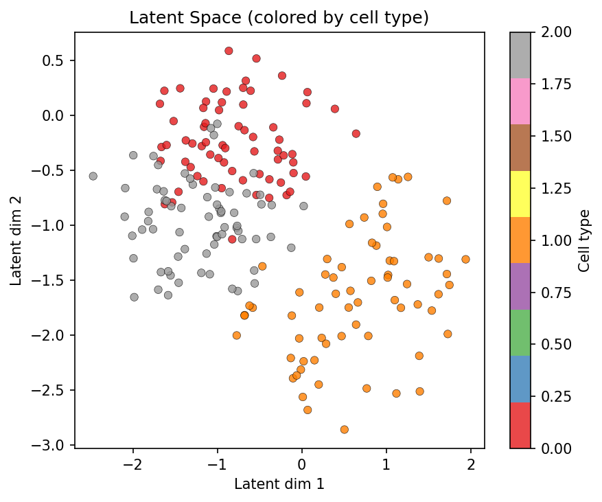
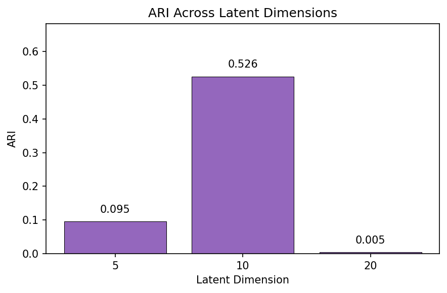
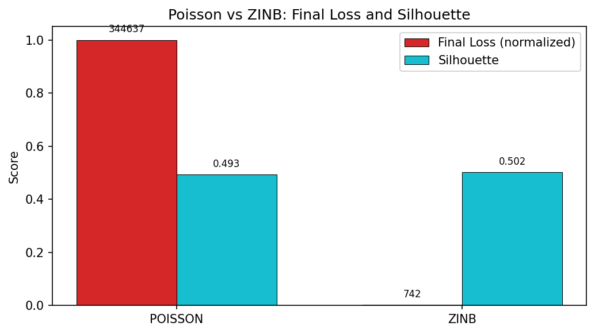

# scVI-Style VAE Benchmark

**Duration:** 30 min | **Level:** Advanced | **Device:** CPU-compatible

## Overview

Trains a `VAENormalizer` with ZINB likelihood (scVI architecture) on synthetic PBMC-like data with 3 cell types and 2 batches. Evaluates latent space quality using calibrax metrics (ARI, NMI, silhouette, batch ASW). Also demonstrates `DifferentiableMultiOmicsVAE` with Product-of-Experts latent fusion for RNA+ATAC integration, and compares latent dimension and likelihood choices.

## Quick Start

```bash
source ./activate.sh
uv run python examples/ecosystem/scvi_benchmark.py
```

## Key Code

```python
from diffbio.operators.normalization import VAENormalizer, VAENormalizerConfig

vae_config = VAENormalizerConfig(
    n_genes=100, latent_dim=10, hidden_dims=[64], likelihood="zinb",
)
model = VAENormalizer(vae_config, rngs=nnx.Rngs(42))

@nnx.jit
def train_step(m, opt, counts_batch, library_size_batch):
    def loss_fn(model_inner):
        losses = jax.vmap(model_inner.compute_elbo_loss)(counts_batch, library_size_batch)
        return jnp.mean(losses)
    loss, grads = nnx.value_and_grad(loss_fn, argnums=nnx.DiffState(0, nnx.Param))(m)
    opt.update(m, grads)
    return loss
```

## Results



ELBO loss decreases from 93873 to 560 over 50 epochs, confirming successful VAE training with ZINB likelihood.



Scatter plot of the first two latent dimensions colored by cell type shows partial separation of 3 cell types (bio silhouette=0.50), with batch effects reduced (batch ASW=0.72).



Bar chart of ARI across latent dimensions (5, 10, 20) shows latent_dim=10 achieving the best cluster recovery (ARI=0.53), while dim=5 and dim=20 underperform.



Grouped bar chart comparing Poisson and ZINB likelihoods: ZINB achieves dramatically lower final loss (742 vs 344637) with comparable silhouette scores, confirming ZINB is more appropriate for overdispersed count data.

```
Cells: 200, Genes: 100
Batches: 2, Cell types: 3
Counts shape: (200, 100)
Mean library size: 2503
Fraction zeros: 0.116
VAENormalizer: latent_dim=10, hidden=[64], likelihood=zinb
=== Training VAENormalizer (ZINB) ===
  Epoch   0: ELBO loss = 93872.89
  Epoch  10: ELBO loss = 1215.51
  Epoch  20: ELBO loss = 878.13
  Epoch  30: ELBO loss = 730.63
  Epoch  40: ELBO loss = 634.08
  Epoch  49: ELBO loss = 559.75
  First loss:  93872.89
  Final loss:  559.75
  Loss decreased: True
Latent representations: (200, 10)
Reconstructed counts: (200, 100)
Reconstruction MSE: 3046336.2500
=== Calibrax Evaluation Metrics ===
  Biological conservation:
    Silhouette (cell types): 0.4995
    ARI:                     0.2687
    NMI:                     0.3851
  Batch correction:
    Batch silhouette:        0.2819
    Batch ASW (1-|sil|):     0.7181
=== apply() Output Keys ===
  counts: shape=(100,), dtype=float32
  latent_logvar: shape=(10,), dtype=float32
  latent_mean: shape=(10,), dtype=float32
  latent_z: shape=(10,), dtype=float32
  library_size: shape=(), dtype=float32
  log_rate: shape=(100,), dtype=float32
  normalized: shape=(100,), dtype=float32
=== Gradient Verification ===
  fc_mean weight gradient shape: (64, 10)
  Gradient non-zero: True
  Gradient finite:   True
  Gradient abs mean: 10.490328
  fc_output gradient shape: (64, 100)
  fc_output gradient non-zero: True
=== MultiOmicsVAE Output ===
  atac_counts: shape=(200, 40)
  atac_reconstructed: shape=(200, 40)
  elbo_loss: shape=()
  joint_latent: shape=(200, 8)
  joint_logvar: shape=(200, 8)
  joint_mu: shape=(200, 8)
  rna_counts: shape=(200, 80)
  rna_reconstructed: shape=(200, 80)
=== Training MultiOmicsVAE ===
  Epoch   0: ELBO loss = 1475.50
  Epoch  10: ELBO loss = 1384.70
  Epoch  20: ELBO loss = 1238.36
  Epoch  29: ELBO loss = 1046.26
  First loss: 1475.50
  Final loss: 1046.26
  Loss decreased: True
=== Experiment: Latent Dimension ===
  latent_dim= 5: ARI=0.0952, Silhouette=0.4016
  latent_dim=10: ARI=0.5255, Silhouette=0.5023
  latent_dim=20: ARI=0.0047, Silhouette=0.4833
=== Experiment: Likelihood Comparison ===
  poisson : final_loss= 344637.16, MSE=19712766.0000, Silhouette=0.4932
  zinb    : final_loss=    741.85, MSE=7885788.0000, Silhouette=0.5023
```

## Next Steps

- [Calibrax Metrics](calibrax-metrics.md) -- training vs evaluation metric split
- [Single-Cell Pipeline](singlecell-pipeline.md) -- five-operator end-to-end pipeline
- [API Reference: Normalization Operators](../../api/operators/normalization.md)
