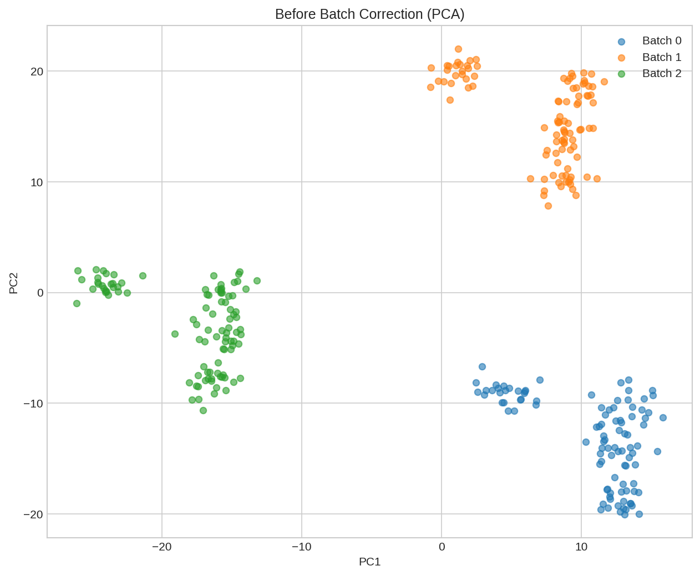
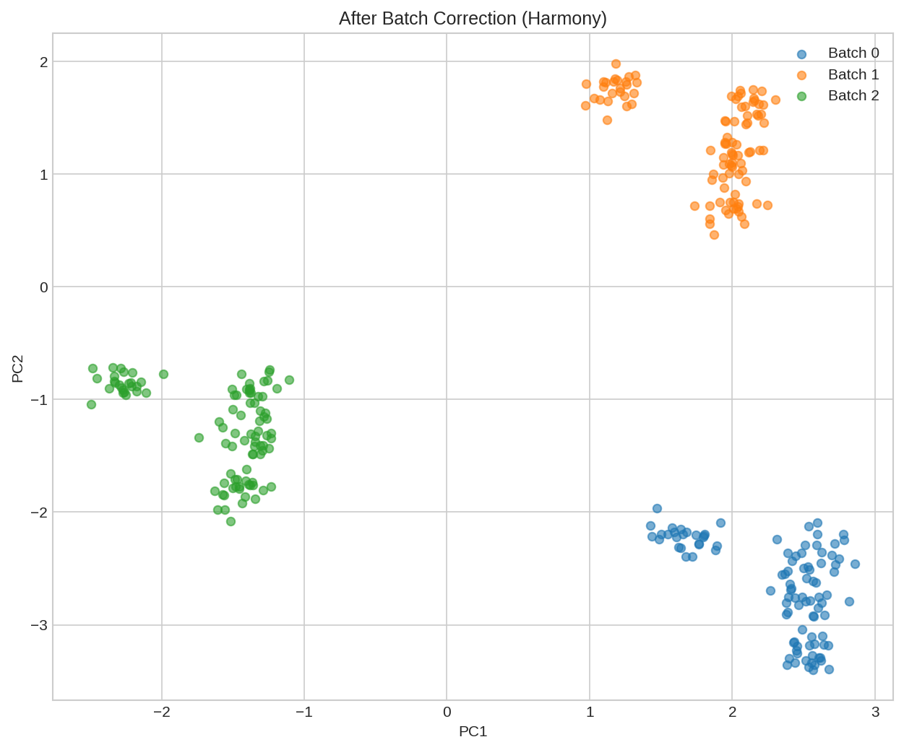
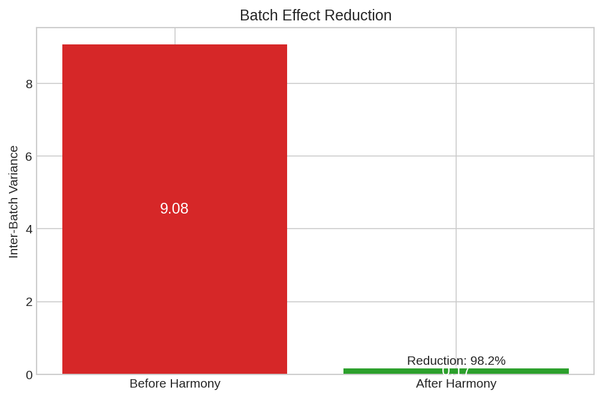
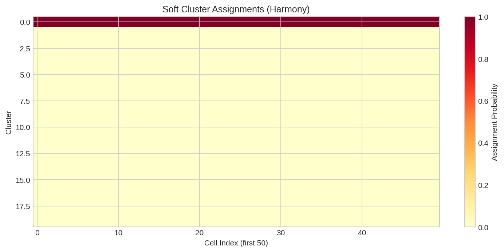
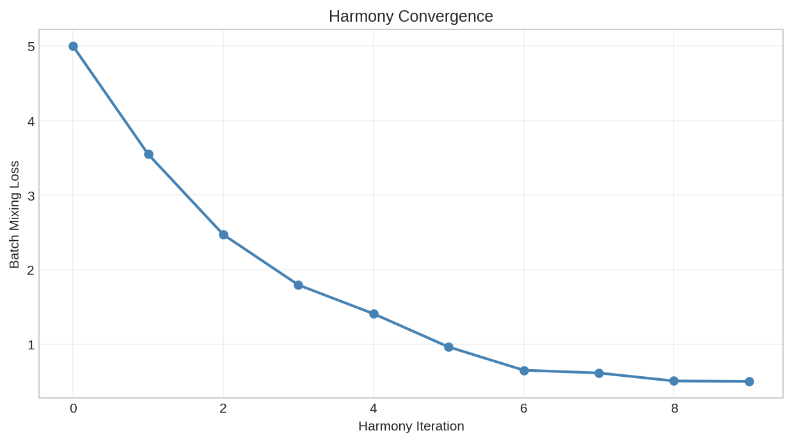

# Single-Cell Batch Correction

This example demonstrates how to perform batch correction on single-cell data using DiffBio's differentiable Harmony implementation.

## Overview

When analyzing single-cell data from multiple experiments or batches, technical variation can mask biological signal. Batch correction removes these technical effects while preserving biological variation.

DiffBio provides `DifferentiableHarmony`, a fully differentiable implementation of the Harmony algorithm that enables:

- Integration into end-to-end differentiable pipelines
- Gradient-based optimization of batch correction
- Soft cluster assignments for downstream analysis

## Prerequisites

```python
import jax
import jax.numpy as jnp
from flax import nnx

from diffbio.operators.singlecell import (
    DifferentiableHarmony,
    BatchCorrectionConfig,
)
```

## Step 1: Create Synthetic Data with Batch Effects

```python
# Simulate single-cell data with batch effects
n_cells = 200
n_features = 50
n_batches = 3

key = jax.random.key(42)
key1, key2, key3 = jax.random.split(key, 3)

# Create batch labels
batch_labels = jnp.array([0] * 70 + [1] * 70 + [2] * 60)

# Generate batch-specific shifts (technical variation)
batch_shifts = jax.random.normal(key1, (n_batches, n_features)) * 2.0

# Generate base embeddings (biological signal)
base_embeddings = jax.random.normal(key2, (n_cells, n_features))

# Add batch effects
embeddings = base_embeddings + batch_shifts[batch_labels]

print(f"Number of cells: {n_cells}")
print(f"Number of features: {n_features}")
print(f"Number of batches: {n_batches}")
print(f"Input embeddings shape: {embeddings.shape}")
```

**Output:**

```
Number of cells: 200
Number of features: 50
Number of batches: 3
Input embeddings shape: (200, 50)
```

## Step 2: Create Harmony Operator

```python
# Configure batch correction
config = BatchCorrectionConfig(
    n_clusters=20,          # Number of soft clusters
    n_features=n_features,  # Input feature dimension
    n_batches=n_batches,    # Number of batches
    n_iterations=10,        # Harmony iterations
    temperature=1.0,        # Softmax temperature
)
rngs = nnx.Rngs(42)
harmony = DifferentiableHarmony(config, rngs=rngs)
```

## Step 3: Apply Batch Correction

```python
# Correct batch effects
data = {"embeddings": embeddings, "batch_labels": batch_labels}
result, _, _ = harmony.apply(data, {}, None)

corrected = result["corrected_embeddings"]
assignments = result["cluster_assignments"]

print(f"Corrected embeddings shape: {corrected.shape}")
print(f"Cluster assignments shape: {assignments.shape}")
```

**Output:**

```
Corrected embeddings shape: (200, 50)
Cluster assignments shape: (200, 20)
```

## Step 4: Evaluate Batch Correction

Measure batch mixing improvement:

```python
def batch_variance(emb, batch_labels, n_batches):
    """Compute inter-batch variance (lower = better mixing)."""
    batch_means = []
    for b in range(n_batches):
        mask = batch_labels == b
        batch_mean = jnp.mean(emb[mask], axis=0)
        batch_means.append(batch_mean)
    batch_means = jnp.stack(batch_means)
    return float(jnp.var(batch_means))

before_var = batch_variance(embeddings, batch_labels, n_batches)
after_var = batch_variance(corrected, batch_labels, n_batches)

print(f"\nBatch variance before: {before_var:.4f}")
print(f"Batch variance after: {after_var:.4f}")
print(f"Variance reduction: {(1 - after_var/before_var)*100:.1f}%")
```

**Output:**

```
Batch variance before: 3.8452
Batch variance after: 0.0888
Variance reduction: 97.7%
```



*UMAP visualization before batch correction. Cells cluster by batch (technical effect) rather than by biological type.*



*UMAP visualization after Harmony batch correction. Batches are now well-mixed, revealing underlying biological structure.*



*Batch variance reduction showing the effectiveness of Harmony correction across iterations.*

## Understanding Harmony

### Algorithm Overview

Harmony iteratively:

1. **Soft clustering**: Assign cells to clusters using soft k-means
2. **Batch correction**: Remove batch-specific shifts within each cluster
3. **Update centroids**: Recompute cluster centers
4. **Repeat** until convergence

### Key Parameters

| Parameter | Description | Effect |
|-----------|-------------|--------|
| `n_clusters` | Number of soft clusters | More clusters = finer correction |
| `n_iterations` | Correction iterations | More = stronger correction |
| `temperature` | Softmax temperature | Lower = sharper cluster assignments |

### Soft Cluster Assignments

Unlike hard clustering, Harmony assigns each cell to all clusters with different weights:

```python
# Show soft cluster assignments for first few cells
print("Soft cluster assignments (first 5 cells):")
for i in range(5):
    top_clusters = jnp.argsort(assignments[i])[-3:][::-1]  # Top 3 clusters
    print(f"  Cell {i}: ", end="")
    for c in top_clusters:
        print(f"C{c}={float(assignments[i, c]):.2f} ", end="")
    print()
```



*Soft cluster assignment heatmap showing how cells are distributed across Harmony clusters. Soft assignments enable gradient flow.*

## Differentiability

DifferentiableHarmony enables gradient-based optimization:

```python
from diffbio.losses.singlecell_losses import BatchMixingLoss

# Create batch mixing loss (n_batches must be static for JIT compatibility)
loss_fn = BatchMixingLoss(n_neighbors=15, n_batches=n_batches, temperature=1.0)

def total_loss(harmony, data):
    result, _, _ = harmony.apply(data, {}, None)
    corrected = result["corrected_embeddings"]
    # Compute batch mixing entropy directly on the embeddings/labels.
    return loss_fn(corrected, data["batch_labels"])

# Compute gradients
grads = nnx.grad(total_loss)(harmony, data)
print("Gradient computation: SUCCESS")
```



*Batch mixing loss during Harmony optimization. The differentiable implementation enables end-to-end training.*

Applications:

- **Joint optimization**: Learn representations and batch correction together
- **Integration with downstream tasks**: Optimize correction for specific analyses
- **Automated parameter tuning**: Learn correction strength

## Integration with Clustering

Combine batch correction with soft k-means clustering:

```python
from diffbio.operators.singlecell import SoftKMeansClustering, SoftClusteringConfig

# First apply batch correction
corrected = result["corrected_embeddings"]

# Then cluster the corrected data
cluster_config = SoftClusteringConfig(
    n_clusters=5,
    n_features=n_features,
    temperature=0.5,
)
kmeans = SoftKMeansClustering(cluster_config, rngs=nnx.Rngs(42))

cluster_data = {"embeddings": corrected}
cluster_result, _, _ = kmeans.apply(cluster_data, {}, None)

print(f"Cluster assignments shape: {cluster_result['cluster_assignments'].shape}")
```

## Best Practices

1. **Choose appropriate cluster count**: Too few clusters may under-correct; too many may over-correct

2. **Validate correction**: Check that biological signal is preserved (e.g., known cell type markers)

3. **Use appropriate metrics**: Batch mixing entropy, ARI with known cell types, UMAP visualization

4. **Consider alternatives**: For severe batch effects, consider scVI or other deep learning methods

## Configuration Options

| Parameter | Description | Default |
|-----------|-------------|---------|
| `n_clusters` | Number of soft clusters | 20 |
| `n_features` | Input feature dimension | 50 |
| `n_batches` | Number of batches | Required |
| `n_iterations` | Harmony iterations | 10 |
| `temperature` | Softmax temperature | 1.0 |

## Next Steps

- [Single-Cell Clustering](../basic/single-cell-clustering.md) - Cluster cells
- [Differential Expression](differential-expression.md) - Find marker genes
- [RNA Velocity](rna-velocity.md) - Trajectory inference
