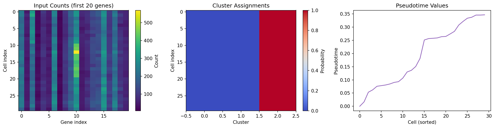

# End-to-End Single-Cell Pipeline

**Duration:** 30 min | **Level:** Advanced | **Device:** CPU-compatible

## Overview

Chains five DiffBio operators -- `DifferentiableSimulator`, `DifferentiableAmbientRemoval`, `DifferentiableDiffusionImputer`, `SoftKMeansClustering`, and `DifferentiablePseudotime` -- into a full single-cell analysis pipeline. Demonstrates data dictionary key passing between operators, end-to-end gradient flow through the deterministic sub-chain, and JIT compilation of the multi-operator pipeline.

## Quick Start

```bash
source ./activate.sh
uv run python examples/pipelines/singlecell_pipeline.py
```

## Key Code

```python
def deterministic_pipeline(input_counts: jax.Array) -> dict[str, jax.Array]:
    imp_out, _, _ = imputer.apply({"counts": input_counts}, {}, None)
    clust_out, _, _ = clusterer.apply(
        {"embeddings": imp_out["imputed_counts"]}, {}, None,
    )
    pt_out, _, _ = pseudotime_op.apply(
        {"embeddings": imp_out["imputed_counts"]}, {}, None,
    )
    return {
        "imputed_counts": imp_out["imputed_counts"],
        "cluster_assignments": clust_out["cluster_assignments"],
        "pseudotime": pt_out["pseudotime"],
    }
```

## Results



Three-panel figure showing (left) simulated input count heatmap with 30 cells x 20 genes, (center) soft cluster assignment probabilities across 3 clusters, and (right) sorted pseudotime values showing monotonic ordering from root cell.

```
Simulator: 30 cells x 40 genes, 3 groups
Ambient remover: latent_dim=8, hidden=[32, 16]
Imputer: n_neighbors=5, diffusion_t=2
Clusterer: 3 clusters, temperature=1.0
Pseudotime: n_neighbors=5, n_components=3, root=cell 0
=== Step 1: Simulation ===
  Output keys: ['batch_labels', 'counts', 'de_mask', 'gene_means', 'group_labels']
  counts: shape=(30, 40), dtype=float32
  group_labels: shape=(30,)
  Mean expression: 147.66
  Fraction zeros: 0.000
=== Step 2: Ambient Removal ===
  Output keys: ['ambient_profile', 'contamination_fraction', 'counts',
                'decontaminated_counts', 'latent', 'latent_logvar',
                'latent_mean', 'reconstructed']
  decontaminated_counts: shape=(30, 40)
  contamination_fraction: shape=(30,)
  Mean contamination: 0.1587
  Decontaminated mean: 0.00
=== Step 3: Diffusion Imputation ===
  Output keys: ['counts', 'diffusion_operator', 'imputed_counts']
  imputed_counts: shape=(30, 40)
  diffusion_operator: shape=(30, 30)
  Imputed mean: 147.47
  Input variance:   8259.58
  Imputed variance: 7730.03
=== Step 4: Clustering ===
  Output keys: ['centroids', 'cluster_assignments', 'cluster_labels', 'embeddings']
  cluster_assignments: shape=(30, 3)
  cluster_labels: shape=(30,)
  centroids: shape=(3, 40)
    Cluster 0: 0 cells
    Cluster 1: 0 cells
    Cluster 2: 30 cells
=== Step 5: Pseudotime ===
  Output keys: ['diffusion_components', 'embeddings', 'pseudotime', 'transition_matrix']
  pseudotime: shape=(30,)
  transition_matrix: shape=(30, 30)
  diffusion_components: shape=(30, 3)
  Root cell pseudotime: 0.000000
Deterministic pipeline output keys:
  cluster_assignments: (30, 3)
  cluster_labels: (30,)
  imputed_counts: (30, 40)
  pseudotime: (30,)
=== End-to-End Gradient Verification ===
  Gradient shape: (30, 40)
  Gradient is non-zero: True
  Gradient is finite:   True
  Gradient abs mean:    0.001040
=== JIT Compilation Verification ===
  cluster_assignments: shape=(30, 3), JIT matches eager: True
  cluster_labels: shape=(30,), JIT matches eager: True
  imputed_counts: shape=(30, 40), JIT matches eager: True
=== Experiment: Diffusion Time ===
  t=1: imputed variance=7738.6895
  t=2: imputed variance=7730.0312
  t=4: imputed variance=7729.3330
=== Experiment: Clustering Temperature ===
  T=0.1: mean assignment entropy=-0.0000
  T=1.0: mean assignment entropy=-0.0000
  T=10.0: mean assignment entropy=0.0000
```

## Next Steps

- [Calibrax Metrics](calibrax-metrics.md) -- training vs evaluation metric comparison
- [scVI Benchmark](scvi-benchmark.md) -- VAE normalization with calibrax evaluation
- [API Reference: Single-Cell Operators](../../api/operators/singlecell.md)
