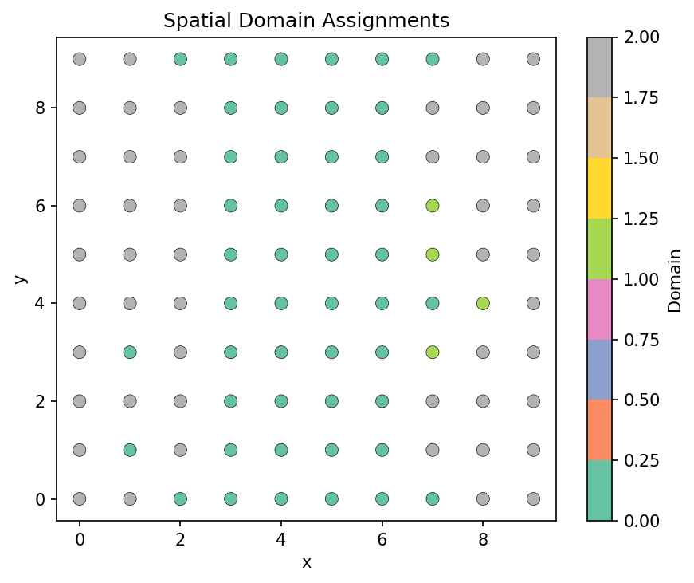
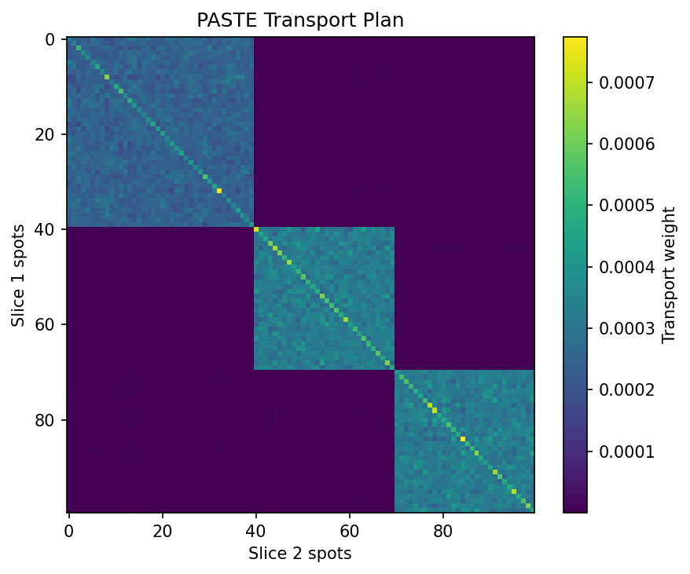
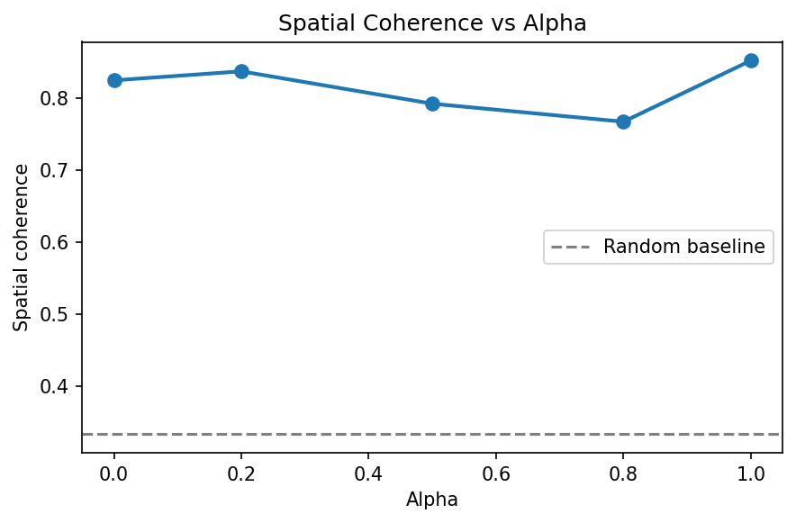

# Spatial Transcriptomics: Domain Identification and Slice Alignment

**Duration:** 25 min | **Level:** Advanced | **Device:** CPU-compatible

## Overview

Applies `DifferentiableSpatialDomain` (STAGATE-inspired GATv2 autoencoder) for spatial domain identification on a synthetic 10x10 grid with 3 known domains, and `DifferentiablePASTEAlignment` (Sinkhorn optimal transport) for aligning two synthetic tissue slices. Evaluates spatial coherence, transport plan quality, and the effect of the alpha parameter on domain detection.

## Quick Start

```bash
source ./activate.sh
uv run python examples/singlecell/spatial_analysis.py
```

## Key Code

```python
from diffbio.operators.singlecell import DifferentiableSpatialDomain, SpatialDomainConfig

config_domain = SpatialDomainConfig(
    n_genes=30, hidden_dim=32, num_heads=4, n_domains=3, alpha=0.8, n_neighbors=8,
)
domain_op = DifferentiableSpatialDomain(config_domain, rngs=nnx.Rngs(0))

data_domain = {"counts": counts, "spatial_coords": spatial_coords}
result_domain, _, _ = domain_op.apply(data_domain, {}, None)
assignments = result_domain["domain_assignments"]
```

## Results



Scatter plot of the 10x10 spatial grid colored by predicted domain shows spatially coherent regions with 0.77 neighbor-level coherence (vs 0.33 random baseline).



Heatmap of the Sinkhorn transport plan between two slices shows concentrated diagonal structure, indicating correct spot-to-spot matching with mean alignment error of 2.69 and transport plan sum of 1.0.



Spatial coherence varies between 0.77-0.85 as alpha sweeps from 0.0 to 1.0, with alpha=1.0 (pruned mutual k-NN only) achieving highest coherence at 0.85 and highest confidence at 0.64.

```
Spatial coords shape: (100, 2)
Domain distribution: [40 30 30]
Expression shape: (100, 30)
SpatialDomain operator created: DifferentiableSpatialDomain
  hidden_dim=32, num_heads=4, n_domains=3
Domain assignments shape: (100, 3)
Spatial embeddings shape: (100, 32)
Predicted domain distribution: [47  4 49]
Spatial coherence (fraction of neighbors with same domain): 0.7675
  Random baseline (1/3): 0.3333
Mean assignment confidence: 0.5835
PASTE alignment operator created: DifferentiablePASTEAlignment
Transport plan shape: (100, 100)
Aligned coords shape: (100, 2)
Transport plan sum: 1.0000 (should be ~1.0)
Alignment error (mean Euclidean distance): 2.6868
Alignment error (max): 4.7633
Transport plan entropy: 8.1529 (max uniform: 92103.4062)
SpatialDomain:
  Gradient shape (counts): (100, 30)
  Non-zero: True
  Finite: True
PASTE Alignment:
  Gradient shape (slice1_counts): (100, 30)
  Non-zero: True
  Finite: True
SpatialDomain JIT matches eager: True
PASTE JIT matches eager: True
  alpha=0.0 -> coherence: 0.8250, confidence: 0.4500
  alpha=0.2 -> coherence: 0.8375, confidence: 0.4290
  alpha=0.5 -> coherence: 0.7925, confidence: 0.4846
  alpha=0.8 -> coherence: 0.7675, confidence: 0.5835
  alpha=1.0 -> coherence: 0.8525, confidence: 0.6415
  alpha=0.0 -> alignment error: 2.6705, plan max: 0.000895
  alpha=0.1 -> alignment error: 2.6868, plan max: 0.000774
  alpha=0.3 -> alignment error: 2.7177, plan max: 0.000601
  alpha=0.5 -> alignment error: 2.7602, plan max: 0.000554
  alpha=0.9 -> alignment error: 3.4396, plan max: 0.000327
```

## Next Steps

- [GRN Inference](grn-inference.md) -- gene regulatory network inference
- [Single-Cell Pipeline](singlecell-pipeline.md) -- end-to-end five-operator chain
- [API Reference: Single-Cell Operators](../../api/operators/singlecell.md)
