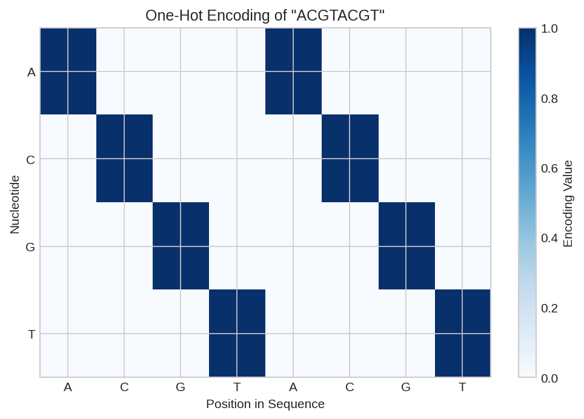
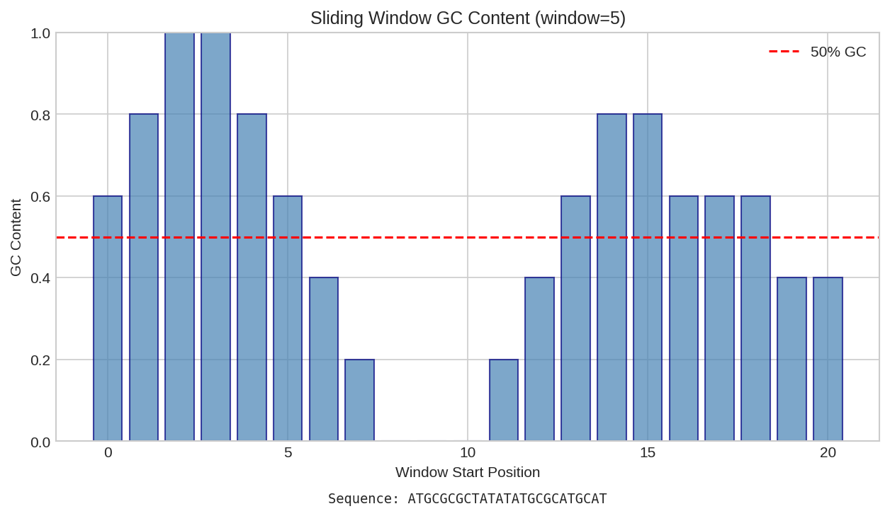
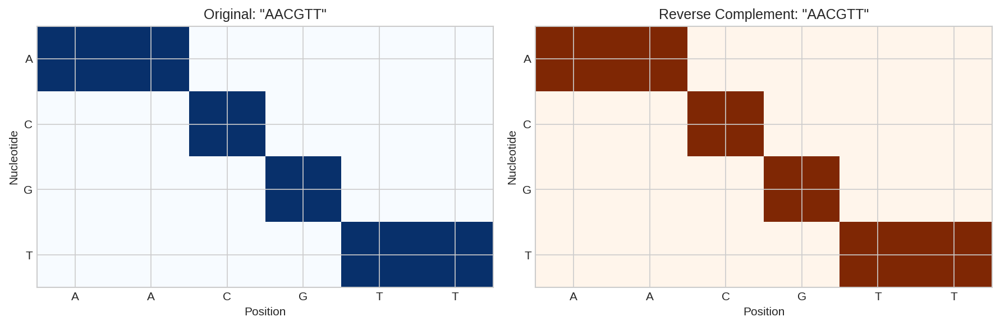
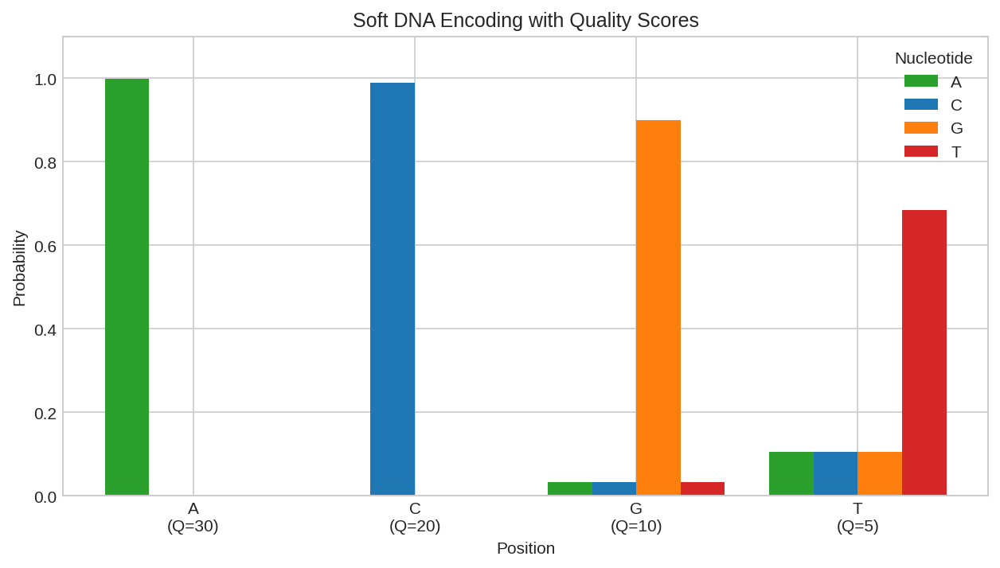

# DNA Sequence Encoding

This example demonstrates how to encode DNA sequences for differentiable bioinformatics operations using DiffBio.

## Overview

DiffBio represents DNA sequences as one-hot encoded arrays for differentiability. This encoding enables:

- Gradient flow through sequence operations
- Differentiable alignment algorithms
- End-to-end optimization of genomics pipelines

## Prerequisites

```python
import jax.numpy as jnp

from diffbio.sequences import (
    encode_dna_string,
    decode_dna_onehot,
    gc_content,
    reverse_complement_dna,
    DNA_ALPHABET,
    DNA_ALPHABET_SIZE,
)
```

## DNA Alphabet

DiffBio uses the standard DNA alphabet with one-hot encoding:

```python
print(f"DNA Alphabet: {DNA_ALPHABET}")
print(f"Alphabet Size: {DNA_ALPHABET_SIZE}")
```

**Output:**

```
DNA Alphabet: ['A', 'C', 'G', 'T']
Alphabet Size: 4
```

The one-hot encoding maps:
- A → [1, 0, 0, 0]
- C → [0, 1, 0, 0]
- G → [0, 0, 1, 0]
- T → [0, 0, 0, 1]

## Step 1: Encode a DNA Sequence

```python
# Example sequence
dna_seq = "ACGTACGT"
print(f"Original sequence: {dna_seq}")

# One-hot encode
encoded = encode_dna_string(dna_seq)
print(f"Encoded shape: {encoded.shape}")
print(f"First position (A): {encoded[0].tolist()}")
print(f"Second position (C): {encoded[1].tolist()}")
```

**Output:**

```
Original sequence: ACGTACGT
Encoded shape: (8, 4)
First position (A): [1.0, 0.0, 0.0, 0.0]
Second position (C): [0.0, 1.0, 0.0, 0.0]
```



*One-hot encoding matrix for DNA sequence "ACGTACGT". Each row represents a position, with the column indicating the base (A=0, C=1, G=2, T=3).*

## Step 2: Decode Back to String

```python
# Decode back to string
decoded = decode_dna_onehot(encoded)
print(f"Decoded back: {decoded}")
assert decoded == dna_seq, "Round-trip encoding works!"
```

**Output:**

```
Decoded back: ACGTACGT
```

## Step 3: Compute GC Content

GC content is the fraction of G and C bases, important for:
- Melting temperature prediction
- Gene identification
- Genome characterization

```python
gc = gc_content(encoded)
print(f"GC content: {float(gc):.2%}")
```

**Output:**

```
GC content: 50.00%
```



*Per-position GC content analysis showing base composition and cumulative GC percentage.*

The `gc_content` function is differentiable, enabling gradient-based optimization of sequence properties.

## Step 4: Reverse Complement

The reverse complement is essential for working with double-stranded DNA:

```python
# Compute reverse complement
rc = reverse_complement_dna(encoded)
rc_str = decode_dna_onehot(rc)
print(f"Original:           {dna_seq}")
print(f"Reverse complement: {rc_str}")
```

**Output:**

```
Original:           ACGTACGT
Reverse complement: ACGTACGT
```



*Reverse complement operation showing original sequence and its Watson-Crick complement in reverse orientation.*

!!! note "Palindromic Sequence"
    The sequence ACGTACGT is palindromic - its reverse complement equals itself. This is common in restriction enzyme recognition sites.

## Soft Encoding for Uncertainty

For sequences with uncertainty (e.g., from sequencing errors), use soft encoding:

```python
from diffbio.sequences import soft_encode_dna

# Soft encode with quality scores
sequence = "ACGT"
qualities = jnp.array([30, 20, 10, 5])  # Phred scores

soft_encoded = soft_encode_dna(sequence, qualities)
print("Soft encoded probabilities:")
for i, base in enumerate(sequence):
    probs = soft_encoded[i]
    print(f"  Position {i} ({base}): {[f'{p:.3f}' for p in probs]}")
```

Lower quality scores spread probability across all bases, reflecting uncertainty.



*Soft encoding with quality scores: higher quality positions have sharper distributions, while lower quality positions spread probability across bases.*

## Using with Alignment

One-hot encoded sequences integrate directly with DiffBio's alignment operators:

```python
from diffbio.operators.alignment import (
    SmoothSmithWaterman,
    SmithWatermanConfig,
    create_dna_scoring_matrix,
)
from flax import nnx

# Create sequences
seq1 = encode_dna_string("ACGTACGT")
seq2 = encode_dna_string("ACGTTACGT")

# Create aligner
scoring_matrix = create_dna_scoring_matrix(match=2.0, mismatch=-1.0)
config = SmithWatermanConfig(temperature=1.0, gap_open=-2.0, gap_extend=-0.5)
aligner = SmoothSmithWaterman(config, scoring_matrix=scoring_matrix, rngs=nnx.Rngs(42))

# Align
data = {"seq1": seq1, "seq2": seq2}
result, _, _ = aligner.apply(data, {}, None)
print(f"Alignment score: {float(result['score']):.2f}")
```

**Output:**

```
Alignment score: 14.45
```

## Differentiability

All sequence operations are differentiable:

```python
import jax

def sequence_loss(encoded):
    """Example loss: minimize GC content."""
    return gc_content(encoded)

# Compute gradient
grad_fn = jax.grad(sequence_loss)
grads = grad_fn(encoded)
print(f"Gradient shape: {grads.shape}")
print(f"Gradient at position 0 (A): {grads[0].tolist()}")
```

Gradients indicate how changing each position affects the loss, enabling sequence optimization.

## Summary

| Function | Purpose | Differentiable |
|----------|---------|---------------|
| `encode_dna_string` | String → one-hot | N/A (input) |
| `decode_dna_onehot` | One-hot → string | N/A (output) |
| `gc_content` | Compute GC fraction | Yes |
| `reverse_complement_dna` | Reverse complement | Yes |
| `soft_encode_dna` | Quality-aware encoding | Yes |

## Next Steps

- [Sequence Alignment](simple-alignment.md) - Align sequences using Smith-Waterman
- [Variant Calling Pipeline](../advanced/variant-calling.md) - End-to-end genomics
- [HMM Sequence Model](hmm-sequence-model.md) - Hidden Markov Models for sequences
