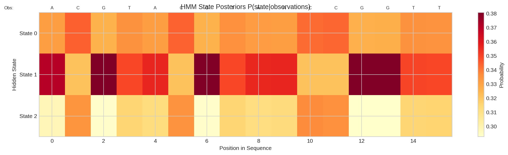
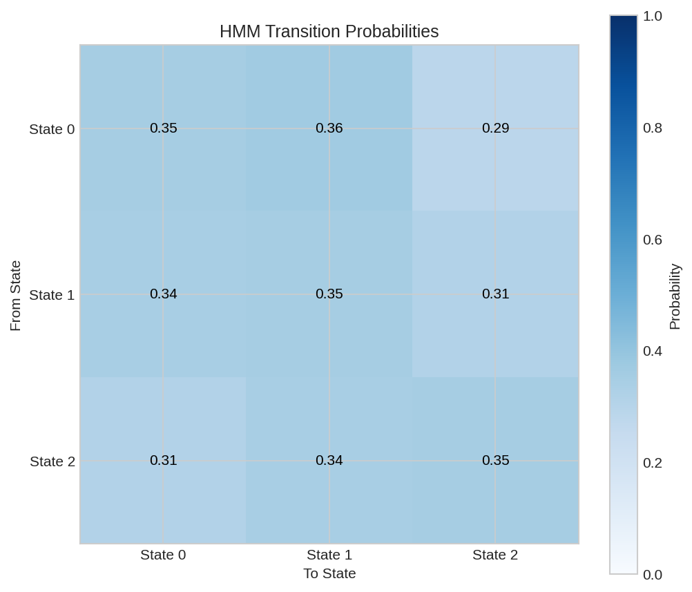
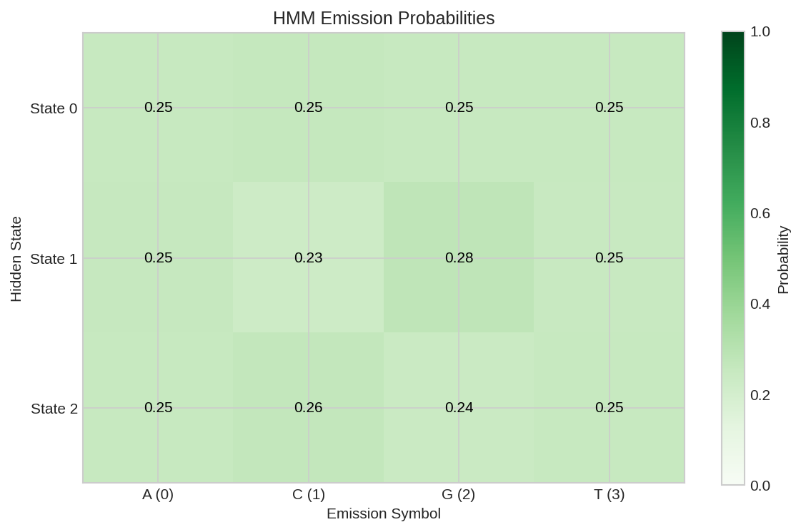
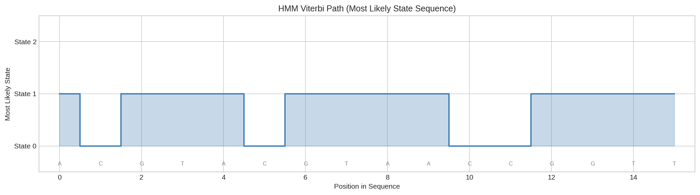
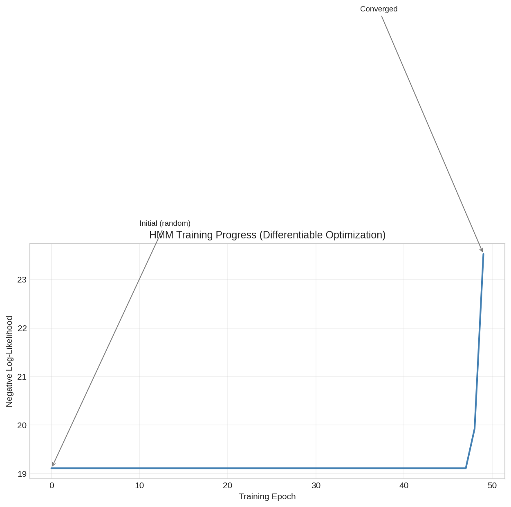

# HMM Sequence Model

This example demonstrates how to use DiffBio's differentiable Hidden Markov Model for sequence analysis.

## Overview

Hidden Markov Models (HMMs) are powerful tools for:

- Gene finding (coding/non-coding regions)
- Chromatin state annotation
- Profile search (protein domains)
- Sequence labeling

DiffBio implements a fully differentiable HMM using the forward algorithm with logsumexp for numerical stability.

## Prerequisites

```python
import jax
import jax.numpy as jnp
from flax import nnx

from diffbio.operators.statistical import DifferentiableHMM, HMMConfig
```

## Step 1: Configure the HMM

```python
# Create a 3-state HMM for gene finding
# States: intergenic (0), exon (1), intron (2)
# Emissions: DNA bases A=0, C=1, G=2, T=3

config = HMMConfig(
    num_states=3,        # Hidden states
    num_emissions=4,     # Observation symbols (DNA bases)
    temperature=1.0,     # Temperature for softmax
)
rngs = nnx.Rngs(42)
hmm = DifferentiableHMM(config, rngs=rngs)

print(f"Number of states: {config.num_states}")
print(f"Number of emissions: {config.num_emissions}")
```

**Output:**

```
Number of states: 3
Number of emissions: 4
```

## Step 2: Create Observation Sequence

```python
# DNA sequence encoded as integers: A=0, C=1, G=2, T=3
observations = jnp.array([0, 1, 2, 3, 0, 1, 2, 3, 0, 0, 1, 1, 2, 2, 3, 3])

print(f"Observation sequence: {observations.tolist()}")
print(f"Sequence length: {len(observations)}")
```

**Output:**

```
Observation sequence: [0, 1, 2, 3, 0, 1, 2, 3, 0, 0, 1, 1, 2, 2, 3, 3]
Sequence length: 16
```

## Step 3: Compute Likelihood and Posteriors

```python
# Apply HMM
data = {"observations": observations}
result, _, _ = hmm.apply(data, {}, None)

log_likelihood = result["log_likelihood"]
posteriors = result["state_posteriors"]

print(f"Log likelihood: {float(log_likelihood):.4f}")
print(f"Posteriors shape: {posteriors.shape}")
```

**Output:**

```
Log likelihood: -22.1816
Posteriors shape: (16, 3)
```

## Step 4: Analyze State Posteriors

```python
# Show state posteriors for first few positions
print("\nState posteriors (first 5 positions):")
state_names = ["Intergenic", "Exon", "Intron"]
for i in range(5):
    probs = posteriors[i]
    print(f"  Position {i}: ", end="")
    for j, name in enumerate(state_names):
        print(f"{name[:3]}={float(probs[j]):.3f} ", end="")
    print()
```

**Output:**

```
State posteriors (first 5 positions):
  Position 0: Int=0.331 Exo=0.371 Intr=0.298
  Position 1: Int=0.345 Exo=0.321 Intr=0.334
  Position 2: Int=0.326 Exo=0.381 Intr=0.294
  Position 3: Int=0.335 Exo=0.349 Intr=0.315
  Position 4: Int=0.331 Exo=0.356 Intr=0.313
```



*State posteriors P(state|observations) for each position in the sequence. Each column shows the probability distribution over hidden states.*

!!! note "Random Initialization"
    With random parameters, posteriors are roughly uniform. After training on labeled data, the HMM learns meaningful state assignments.

## Understanding the HMM

### Model Parameters

The HMM has three parameter matrices:

1. **Initial distribution** $\pi$: $P(\text{state}_0 = i)$
2. **Transition matrix** $A$: $P(\text{state}_t = j | \text{state}_{t-1} = i)$
3. **Emission matrix** $B$: $P(\text{obs}_t = k | \text{state}_t = i)$



*Transition probability matrix showing P(next state | current state). After training, patterns emerge such as high self-transition probability for stable states.*



*Emission probability matrix showing P(observation | state). Different states learn to emit different DNA base patterns.*

### Forward Algorithm

The forward algorithm computes $P(\text{observations} | \text{model})$ efficiently:

$$\alpha_t(j) = P(o_1, ..., o_t, s_t = j)$$

In log space (for numerical stability):
$$\log \alpha_t(j) = \text{logsumexp}_i(\log \alpha_{t-1}(i) + \log A_{ij}) + \log B_{j,o_t}$$

### State Posteriors

The forward-backward algorithm computes:

$$P(s_t = i | o_1, ..., o_T)$$

These posteriors indicate the most likely state at each position.



*Most likely state sequence (Viterbi path) showing the predicted hidden state at each position based on posterior probabilities.*

## Differentiability

The HMM is fully differentiable, enabling gradient-based training:

```python
def loss_fn(hmm, data):
    """Negative log-likelihood loss."""
    result, _, _ = hmm.apply(data, {}, None)
    return -result["log_likelihood"]

# Compute gradients
grads = nnx.grad(loss_fn)(hmm, data)
print("Differentiable: Yes (gradient computation successful)")
```

**Output:**

```
Differentiable: Yes (gradient computation successful)
```

## Training the HMM

Train on labeled sequences (e.g., annotated genes):

```python
import optax

# Create optimizer
optimizer = optax.adam(learning_rate=0.01)
opt_state = optimizer.init(nnx.state(hmm))

# Training step
def train_step(hmm, data, opt_state):
    def loss_fn(model):
        result, _, _ = model.apply(data, {}, None)
        return -result["log_likelihood"]

    loss, grads = nnx.value_and_grad(loss_fn)(hmm)
    updates, opt_state = optimizer.update(grads, opt_state)
    nnx.update(hmm, updates)
    return loss, opt_state

# Training loop (pseudocode)
# for epoch in range(epochs):
#     for batch in dataloader:
#         loss, opt_state = train_step(hmm, batch, opt_state)
```



*HMM training progress showing negative log-likelihood decreasing over epochs. The differentiable implementation enables gradient-based optimization.*

## Soft Observations

For uncertain observations (e.g., from sequencing), use soft probabilities:

```python
# Soft observations: probability distribution over bases at each position
soft_obs = jnp.array([
    [0.9, 0.05, 0.03, 0.02],  # Likely A
    [0.1, 0.7, 0.1, 0.1],    # Likely C
    [0.05, 0.05, 0.85, 0.05], # Likely G
    # ...
])

# Use forward_soft for soft observations
log_prob = hmm.forward_soft(soft_obs)
```

## Applications

| Application | States | Emissions |
|-------------|--------|-----------|
| Gene finding | Intergenic, Exon, Intron | DNA bases |
| Chromatin states | Active, Poised, Repressed | Histone marks |
| CpG islands | CpG-rich, CpG-poor | Dinucleotides |
| Protein domains | Domain types | Amino acids |

## Configuration Options

| Parameter | Description | Default |
|-----------|-------------|---------|
| `num_states` | Number of hidden states | 3 |
| `num_emissions` | Number of observation symbols | 4 |
| `temperature` | Softmax temperature | 1.0 |
| `learnable_transitions` | Learn transition matrix | True |
| `learnable_emissions` | Learn emission matrix | True |

## Next Steps

- [DNA Encoding](dna-encoding.md) - Encode sequences for HMM
- [RNA Structure](rna-structure.md) - Structure-based sequence analysis
- [Single-Cell Clustering](single-cell-clustering.md) - Clustering for different domains
