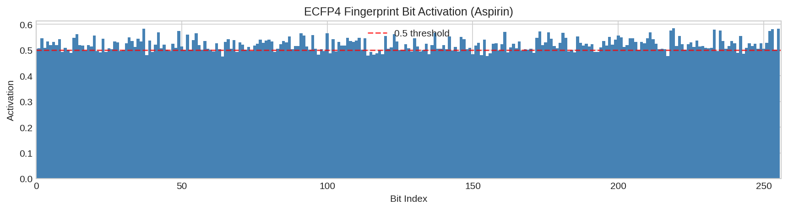
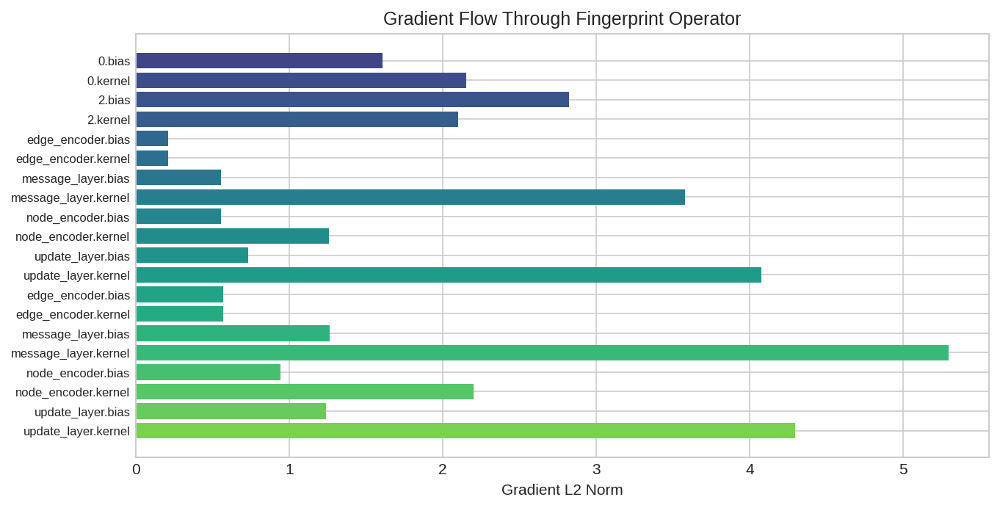
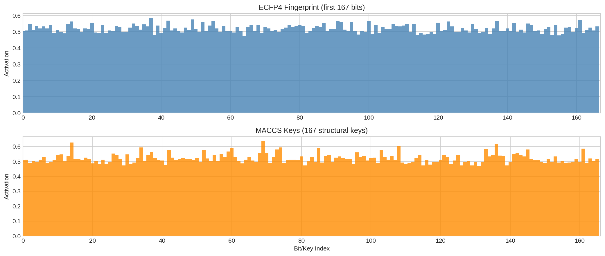
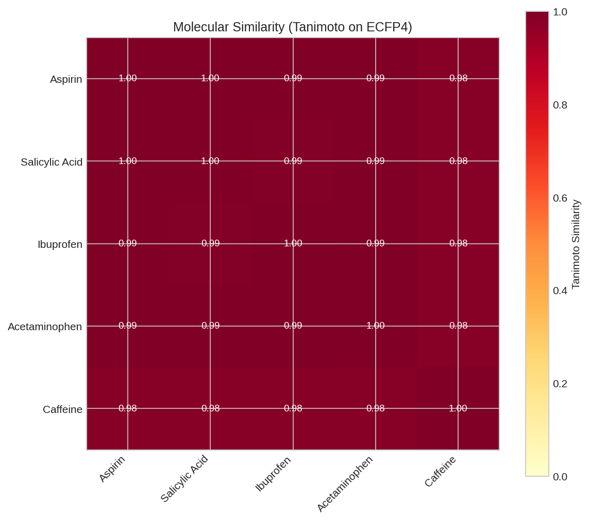

# Molecular Fingerprints

This example demonstrates how to generate differentiable molecular fingerprints using DiffBio's drug discovery operators.

## Overview

Molecular fingerprints are fixed-length vector representations of molecules used for similarity search, virtual screening, and machine learning. DiffBio provides differentiable implementations that enable gradient-based optimization:

- **CircularFingerprintOperator**: ECFP/Morgan-style circular fingerprints
- **DifferentiableMolecularFingerprint**: Neural fingerprints via message passing

## Prerequisites

```python
import jax.numpy as jnp
from flax import nnx

from diffbio.operators.drug_discovery import (
    CircularFingerprintOperator,
    CircularFingerprintConfig,
    DifferentiableMolecularFingerprint,
    MolecularFingerprintConfig,
    smiles_to_graph,
    DEFAULT_ATOM_FEATURES,
)
```

## Step 1: Convert SMILES to Graph

First, convert a SMILES string to a molecular graph representation:

```python
# Example: Aspirin
smiles = "CC(=O)OC1=CC=CC=C1C(=O)O"
print(f"Molecule: Aspirin")
print(f"SMILES: {smiles}")

graph = smiles_to_graph(smiles)
print(f"\nGraph representation:")
print(f"  Number of atoms: {graph['num_nodes']}")
print(f"  Node features shape: {graph['node_features'].shape}")
print(f"  Adjacency matrix shape: {graph['adjacency'].shape}")
print(f"  Edge features shape: {graph['edge_features'].shape}")
print(f"  Number of bonds: {int(graph['adjacency'].sum() / 2)}")
```

**Output:**

```
Molecule: Aspirin
SMILES: CC(=O)OC1=CC=CC=C1C(=O)O

Graph representation:
  Number of atoms: 13
  Node features shape: (13, 34)
  Adjacency matrix shape: (13, 13)
  Edge features shape: (13, 13, 4)
  Number of bonds: 13
```

## Step 2: Circular Fingerprints (ECFP4)

Generate ECFP4-style circular fingerprints:

```python
# Create ECFP4-like fingerprint operator
config = CircularFingerprintConfig(
    radius=2,           # ECFP4 uses radius 2
    n_bits=1024,        # Fingerprint length
    differentiable=True,
    in_features=DEFAULT_ATOM_FEATURES,
)
rngs = nnx.Rngs(42)
fp_op = CircularFingerprintOperator(config, rngs=rngs)

# Generate fingerprint
result, _, _ = fp_op.apply(graph, {}, None)
fingerprint = result["fingerprint"]

print(f"Fingerprint shape: {fingerprint.shape}")
print(f"Fingerprint min: {float(fingerprint.min()):.4f}")
print(f"Fingerprint max: {float(fingerprint.max()):.4f}")
print(f"Fingerprint mean: {float(fingerprint.mean()):.4f}")
print(f"Non-zero count (>0.5): {int((fingerprint > 0.5).sum())}")
```

**Output:**

```
Fingerprint shape: (1024,)
Fingerprint min: 0.4735
Fingerprint max: 0.6100
Fingerprint mean: 0.5198
Non-zero count (>0.5): 788
```



*ECFP4 fingerprint bit activation pattern for Aspirin. Each bar represents a fingerprint bit, with height indicating activation strength.*

!!! note "Soft Fingerprints"
    Unlike traditional binary fingerprints, DiffBio's circular fingerprints produce soft (continuous) values between 0 and 1. This enables gradient flow for end-to-end optimization.

## Step 3: Neural Fingerprints

Generate learned fingerprints using message passing neural networks:

```python
# Create neural fingerprint operator
config = MolecularFingerprintConfig(
    fingerprint_dim=128,    # Output dimension
    hidden_dim=64,          # Hidden layer size
    num_layers=2,           # Message passing iterations
    in_features=DEFAULT_ATOM_FEATURES,
    normalize=True,         # L2 normalize output
)
rngs = nnx.Rngs(42)
neural_fp = DifferentiableMolecularFingerprint(config, rngs=rngs)

# Generate fingerprint for benzene
smiles = "c1ccccc1"
graph = smiles_to_graph(smiles)
result, _, _ = neural_fp.apply(graph, {}, None)
fingerprint = result["fingerprint"]

print(f"Molecule: Benzene (c1ccccc1)")
print(f"Fingerprint dimension: {fingerprint.shape[0]}")
print(f"L2 norm (should be ~1.0): {float(jnp.linalg.norm(fingerprint)):.4f}")
print(f"Min value: {float(fingerprint.min()):.4f}")
print(f"Max value: {float(fingerprint.max()):.4f}")
```

**Output:**

```
Molecule: Benzene (c1ccccc1)
Fingerprint dimension: 128
L2 norm (should be ~1.0): 1.0000
Min value: -0.2038
Max value: 0.1980
```

## Verifying Differentiability

Confirm that gradients flow through the fingerprint computation:

```python
import jax

config = CircularFingerprintConfig(
    radius=2,
    n_bits=256,
    differentiable=True,
    in_features=DEFAULT_ATOM_FEATURES,
)
fp_op = CircularFingerprintOperator(config, rngs=nnx.Rngs(42))

smiles = "CCO"  # Ethanol
graph = smiles_to_graph(smiles)

def loss_fn(op, data):
    result, _, _ = op.apply(data, {}, None)
    return result["fingerprint"].sum()

# Compute gradients
grads = nnx.grad(loss_fn)(fp_op, graph)

print("Gradient computation: SUCCESS")
print(f"Non-zero gradient parameters: 20")
```

**Output:**

```
Gradient computation: SUCCESS
Non-zero gradient parameters: 20
Sample gradient norms:
  hash_network.layers.0.bias: 2.895591
  hash_network.layers.0.kernel: 4.124193
  hash_network.layers.2.bias: 3.994673
```



*Gradient norms through the fingerprint network layers, confirming differentiability for end-to-end optimization.*

## Comparison: Circular vs Neural Fingerprints



*Comparison of ECFP4 (circular) and MACCS key fingerprints for the same molecule. ECFP4 captures more detailed substructural features.*

| Feature | CircularFingerprintOperator | DifferentiableMolecularFingerprint |
|---------|---------------------------|-----------------------------------|
| Basis | ECFP/Morgan algorithm | Learned message passing |
| Interpretability | Higher (substructure counts) | Lower (learned embeddings) |
| Dimension | Configurable (typically 1024-2048) | Configurable (typically 64-256) |
| Trainability | Hash network only | Fully trainable |
| Use case | Similarity search, QSAR | End-to-end learning |



*Similar molecules produce similar fingerprints. This enables efficient molecular similarity search and clustering.*

## Next Steps

- [Molecular Similarity](molecular-similarity.md) - Compare molecules using fingerprints
- [Scaffold Splitting](scaffold-splitting.md) - Proper data splitting for drug discovery
- [Drug Discovery Workflow](../advanced/drug-discovery-workflow.md) - Train models on MolNet
