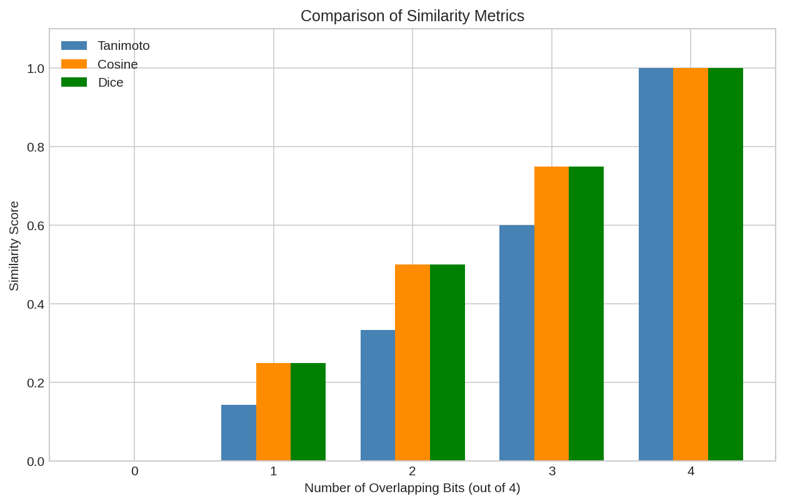
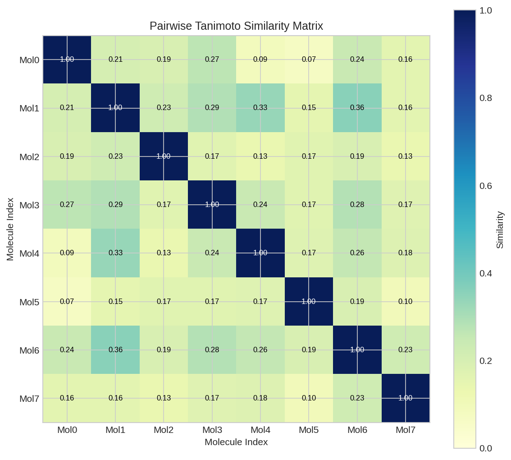
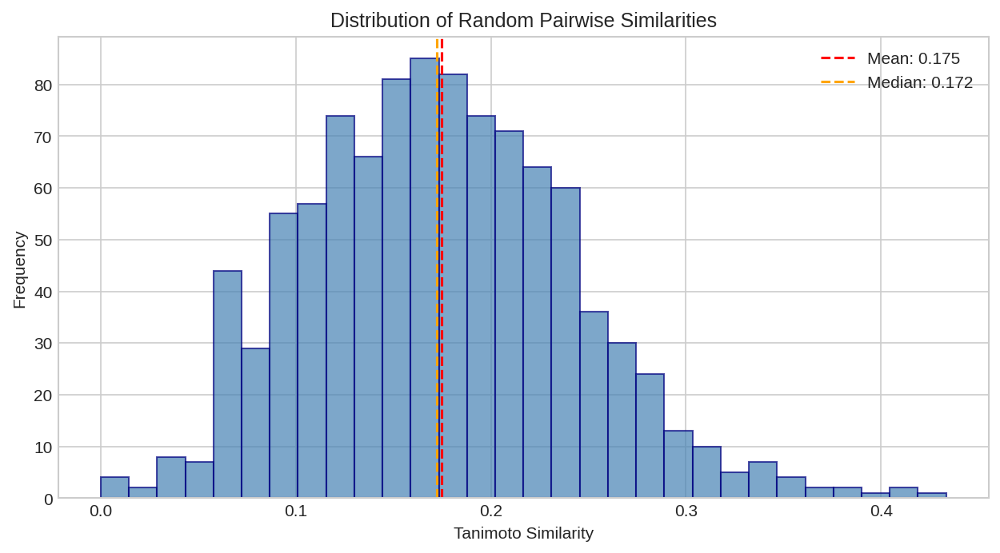

# Molecular Similarity

This example demonstrates how to compute molecular similarity using DiffBio's differentiable similarity metrics.

## Overview

Molecular similarity is fundamental to drug discovery, enabling:

- Virtual screening of compound libraries
- Nearest neighbor search for lead optimization
- Clustering molecules by structural features

DiffBio provides differentiable similarity functions that enable gradient-based optimization of similarity-based objectives.

## Prerequisites

```python
import jax.numpy as jnp
from flax import nnx

from diffbio.operators.drug_discovery import (
    tanimoto_similarity,
    cosine_similarity,
    dice_similarity,
    CircularFingerprintOperator,
    CircularFingerprintConfig,
    smiles_to_graph,
    DEFAULT_ATOM_FEATURES,
)
```

## Basic Similarity Functions

Compare two fingerprint vectors using different similarity metrics:

```python
# Create two example fingerprints
fp1 = jnp.array([1.0, 1.0, 0.0, 1.0, 0.0, 0.0, 1.0, 0.0])
fp2 = jnp.array([1.0, 0.0, 1.0, 1.0, 0.0, 1.0, 0.0, 0.0])

print("Fingerprint 1:", [int(x) for x in fp1])
print("Fingerprint 2:", [int(x) for x in fp2])
print(f"\nTanimoto similarity: {float(tanimoto_similarity(fp1, fp2)):.4f}")
print(f"Cosine similarity: {float(cosine_similarity(fp1, fp2)):.4f}")
print(f"Dice similarity: {float(dice_similarity(fp1, fp2)):.4f}")
```

**Output:**

```
Fingerprint 1: [1, 1, 0, 1, 0, 0, 1, 0]
Fingerprint 2: [1, 0, 1, 1, 0, 1, 0, 0]

Tanimoto similarity: 0.3333
Cosine similarity: 0.5000
Dice similarity: 0.5000
```



*Comparison of Tanimoto, Cosine, and Dice similarity metrics across different fingerprint pairs.*

## Similarity Metrics Explained

### Tanimoto Similarity (Jaccard Index)

$$T(A, B) = \frac{|A \cap B|}{|A \cup B|} = \frac{\sum \min(a_i, b_i)}{\sum \max(a_i, b_i)}$$

- Most common metric for molecular fingerprints
- Range: 0 (no overlap) to 1 (identical)
- Industry standard for chemical similarity

### Cosine Similarity

$$\cos(A, B) = \frac{A \cdot B}{\|A\| \|B\|}$$

- Measures angle between vectors
- Range: -1 to 1 (0 to 1 for positive fingerprints)
- Good for comparing continuous (neural) fingerprints

### Dice Similarity

$$D(A, B) = \frac{2|A \cap B|}{|A| + |B|}$$

- Related to Tanimoto: $D = 2T / (1 + T)$
- More weight to shared features
- Range: 0 to 1

## Computing Similarity Between Molecules

Compare actual molecules using fingerprints:

```python
# Create fingerprint operator
config = CircularFingerprintConfig(
    radius=2,
    n_bits=1024,
    differentiable=True,
    in_features=DEFAULT_ATOM_FEATURES,
)
rngs = nnx.Rngs(42)
fp_op = CircularFingerprintOperator(config, rngs=rngs)

# Generate fingerprints for molecules
molecules = [
    ("Aspirin", "CC(=O)OC1=CC=CC=C1C(=O)O"),
    ("Ibuprofen", "CC(C)Cc1ccc(cc1)C(C)C(=O)O"),
    ("Acetaminophen", "CC(=O)Nc1ccc(O)cc1"),
]

fingerprints = []
for name, smiles in molecules:
    graph = smiles_to_graph(smiles)
    result, _, _ = fp_op.apply(graph, {}, None)
    fingerprints.append(result["fingerprint"])

# Compute pairwise similarities
print("Pairwise Tanimoto Similarities:")
print("-" * 40)
for i, (name_i, _) in enumerate(molecules):
    for j, (name_j, _) in enumerate(molecules):
        if i < j:
            sim = tanimoto_similarity(fingerprints[i], fingerprints[j])
            print(f"{name_i} vs {name_j}: {float(sim):.4f}")
```

## Similarity Matrix

Build a full similarity matrix for a set of molecules:

```python
import jax.numpy as jnp

def compute_similarity_matrix(fingerprints, similarity_fn=tanimoto_similarity):
    """Compute pairwise similarity matrix."""
    n = len(fingerprints)
    matrix = jnp.zeros((n, n))

    for i in range(n):
        for j in range(n):
            matrix = matrix.at[i, j].set(
                similarity_fn(fingerprints[i], fingerprints[j])
            )

    return matrix

# Compute similarity matrix
sim_matrix = compute_similarity_matrix(fingerprints)
print("Similarity Matrix:")
print(sim_matrix)
```



*Pairwise Tanimoto similarity matrix for a set of drug molecules. Darker colors indicate higher similarity.*

## Differentiability

All similarity functions are fully differentiable, enabling:

```python
import jax

def similarity_loss(fp1, fp2, target_similarity=0.8):
    """Loss to make two fingerprints more similar."""
    current_sim = tanimoto_similarity(fp1, fp2)
    return (current_sim - target_similarity) ** 2

# Compute gradient of similarity with respect to fingerprint
grad_fn = jax.grad(lambda fp: float(tanimoto_similarity(fp, fp2)))
grads = grad_fn(fp1)
print(f"Gradient shape: {grads.shape}")
print(f"Gradient norm: {float(jnp.linalg.norm(grads)):.4f}")
```

## Choosing a Similarity Metric

| Use Case | Recommended Metric |
|----------|-------------------|
| Virtual screening | Tanimoto |
| Binary fingerprints | Tanimoto or Dice |
| Neural fingerprints | Cosine |
| Gradient-based optimization | Any (all differentiable) |
| Asymmetric comparison | Tversky (not shown) |



*Distribution of similarity scores across a molecular library. Most molecule pairs have low similarity, with a long tail of similar pairs.*

## Next Steps

- [Scaffold Splitting](scaffold-splitting.md) - Use Tanimoto clustering for splitting
- [Molecular Fingerprints](molecular-fingerprints.md) - Generate fingerprints
- [Drug Discovery Workflow](../advanced/drug-discovery-workflow.md) - Train similarity-based models
