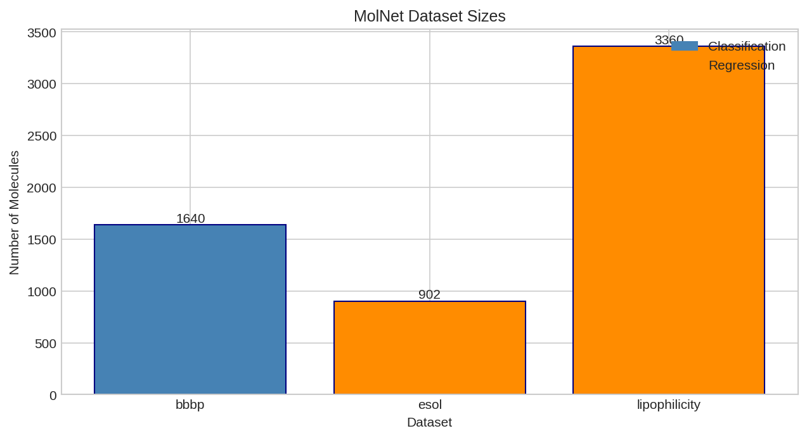
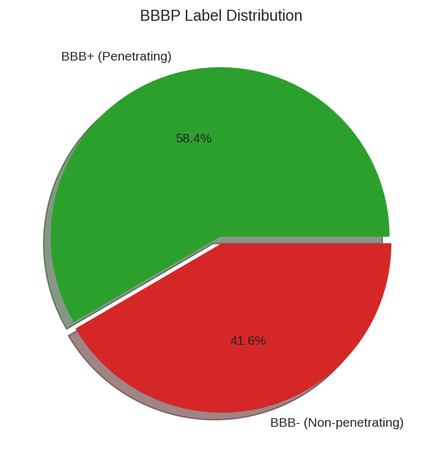
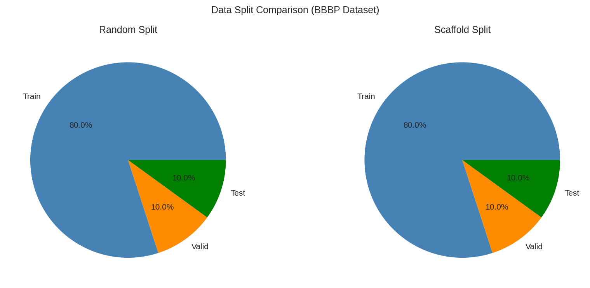

# MolNet Data Loading

This example demonstrates how to load MoleculeNet benchmark datasets using DiffBio's `MolNetSource` data source.

## Overview

MoleculeNet provides standardized molecular property datasets for benchmarking machine learning models. DiffBio integrates these datasets through the `MolNetSource` class, which provides:

- Automatic downloading and caching
- Train/validation/test splits
- Task type information (classification/regression)
- Seamless integration with DiffBio operators

## Prerequisites

```python
from diffbio.sources import MolNetSource, MolNetSourceConfig
```

## Loading a Dataset

Load the BBBP (Blood-Brain Barrier Penetration) dataset:

```python
# Configure the data source
config = MolNetSourceConfig(
    dataset_name="bbbp",
    split="train",
    download=True,
)

# Create the source
source = MolNetSource(config)

# Check dataset properties
print(f"Dataset: {config.dataset_name}")
print(f"Number of molecules: {len(source)}")
print(f"Task type: {source.task_type}")
print(f"Number of tasks: {source.n_tasks}")
```

**Output:**

```
Dataset: bbbp
Number of molecules: 1640
Task type: classification
Number of tasks: 1
```



*Size comparison of various MolNet benchmark datasets. Classification datasets (BBBP, HIV, Tox21) and regression datasets (ESOL, FreeSolv, Lipophilicity) vary widely in size.*

## Accessing Molecules

Iterate through molecules to access SMILES and labels:

```python
# Show first few molecules
print("First 3 molecules:")
for i in range(3):
    element = source[i]
    smiles = element.data["smiles"]
    label = element.data["y"]
    print(f"  Molecule {i}: {smiles[:40]}... | BBB+: {label}")
```

**Output:**

```
First 3 molecules:
  Molecule 0: [Cl].CC(C)NCC(O)COc1cccc2ccccc12 | BBB+: 1.0
  Molecule 1: C(=O)(OC(C)(C)C)CCCc1ccc(cc1)N(CCCl)CCCl | BBB+: 1.0
  Molecule 2: c12c3c(N4CCN(C)CC4)c(F)cc1c(c(C(O)=O)cn2... | BBB+: 1.0
```



*Label distribution for the BBBP dataset showing the class imbalance (more BBB+ than BBB- molecules).*

## Available Datasets

MolNetSource supports the following MoleculeNet datasets:

| Dataset | Task Type | Tasks | Description |
|---------|-----------|-------|-------------|
| `bbbp` | Classification | 1 | Blood-Brain Barrier Penetration |
| `bace` | Classification | 1 | BACE-1 binding affinity |
| `hiv` | Classification | 1 | HIV replication inhibition |
| `tox21` | Classification | 12 | Toxicity assays |
| `toxcast` | Classification | 617 | EPA ToxCast assays |
| `sider` | Classification | 27 | Side effect database |
| `clintox` | Classification | 2 | Clinical toxicity |
| `esol` | Regression | 1 | Aqueous solubility |
| `freesolv` | Regression | 1 | Free solvation energy |
| `lipophilicity` | Regression | 1 | Octanol/water partition |
| `qm7` | Regression | 1 | Electronic properties |
| `qm8` | Regression | 16 | Quantum mechanics properties |
| `qm9` | Regression | 12 | Quantum mechanics properties |

## Element Structure

Each element from `MolNetSource` contains:

```python
element = source[0]

# Data dictionary
element.data["smiles"]  # SMILES string
element.data["y"]       # Label(s) - scalar or array for multi-task

# Element metadata
element.state           # Element state (empty dict by default)
element.metadata        # Additional metadata
```

## Using with Splitters

Combine with DiffBio splitters for proper train/test evaluation:

```python
from diffbio.splitters import ScaffoldSplitter, ScaffoldSplitterConfig

# Create scaffold splitter for drug discovery
split_config = ScaffoldSplitterConfig(
    train_frac=0.8,
    valid_frac=0.1,
    test_frac=0.1,
)
splitter = ScaffoldSplitter(split_config)

# Split the data
result = splitter.split(source)

print(f"Train: {len(result.train_indices)} molecules")
print(f"Valid: {len(result.valid_indices)} molecules")
print(f"Test: {len(result.test_indices)} molecules")
```



*Comparison of random vs scaffold splitting showing train/valid/test distribution.*

## Next Steps

- [Molecular Fingerprints](molecular-fingerprints.md) - Generate fingerprints from molecules
- [Scaffold Splitting](scaffold-splitting.md) - Proper data splitting for drug discovery
- [Drug Discovery Workflow](../advanced/drug-discovery-workflow.md) - Complete training workflow
