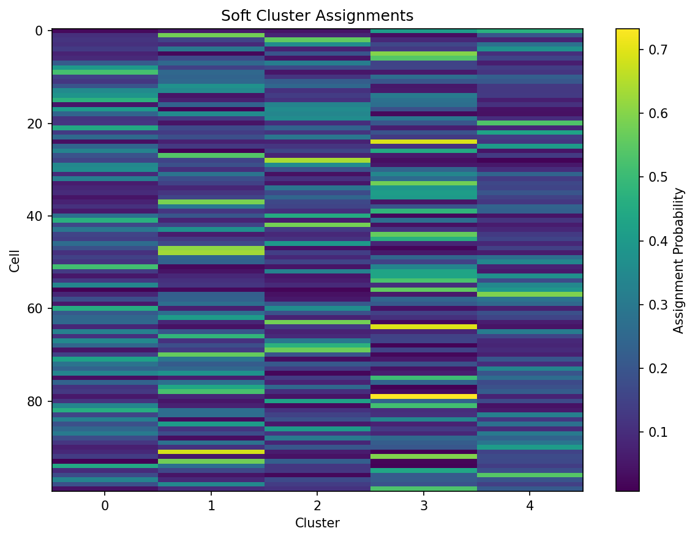

# The DiffBio Operator Pattern

**Duration:** 5 min | **Level:** Basic | **Device:** CPU-compatible

## Overview

Demonstrates the universal Config -> Construct -> Apply pattern using `SoftKMeansClustering`. Covers output inspection, gradient flow verification, JIT compilation, and parameter extraction.

## Quick Start

```bash
source ./activate.sh
uv run python examples/basics/operator_pattern.py
```

## Key Code

```python
from diffbio.operators.singlecell import SoftClusteringConfig, SoftKMeansClustering

config = SoftClusteringConfig(n_clusters=5, n_features=20, temperature=1.0)
operator = SoftKMeansClustering(config, rngs=nnx.Rngs(42))

data = {"embeddings": jax.random.normal(jax.random.key(0), (100, 20))}
result, state, metadata = operator.apply(data, {}, None)
```

## Results



The heatmap shows soft assignment probabilities for each cell (row) across 5 clusters (columns), with brighter colors indicating higher membership probability.

```
Config: n_clusters=5, n_features=20
Operator: SoftKMeansClustering
Input shape: (100, 20)
Input dtype: float32
Output keys and shapes:
  embeddings: shape=(100, 20), dtype=float32
  cluster_assignments: shape=(100, 5), dtype=float32
  cluster_labels: shape=(100,), dtype=int32
  centroids: shape=(5, 20), dtype=float32
Assignment row sums (should be ~1.0): min=1.000000, max=1.000000
Cluster label distribution: {0: 19, 1: 23, 2: 17, 3: 25, 4: 16}
Gradient shape: (100, 20)
Gradient is non-zero: True
Gradient is finite: True
Gradient mean magnitude: 0.000000
Assignments match (eager vs JIT): True
Labels match (eager vs JIT): True
Learnable parameters:
  centroids: shape=(5, 20), dtype=float32
Centroid matrix shape: (5, 20)
Centroid value range: [-0.2287, 0.2658]
```

## Next Steps

- [Single-Cell Clustering](single-cell-clustering.md) -- train soft k-means on structured data
- [Imputation](../intermediate/imputation.md) -- MAGIC-style diffusion imputation
- [API Reference: Single-Cell Operators](../../api/operators/singlecell.md)
