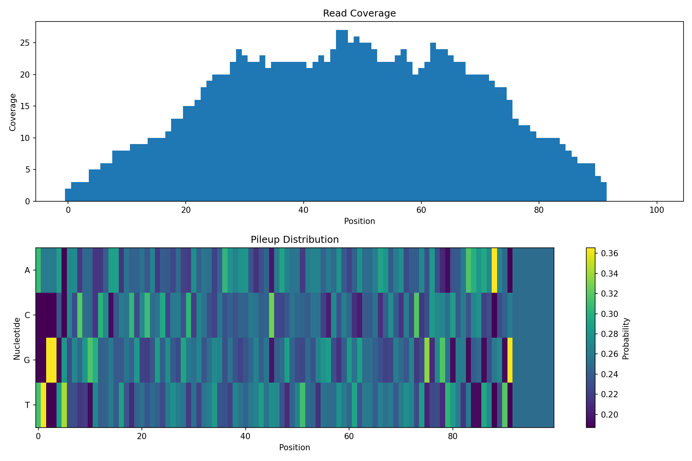
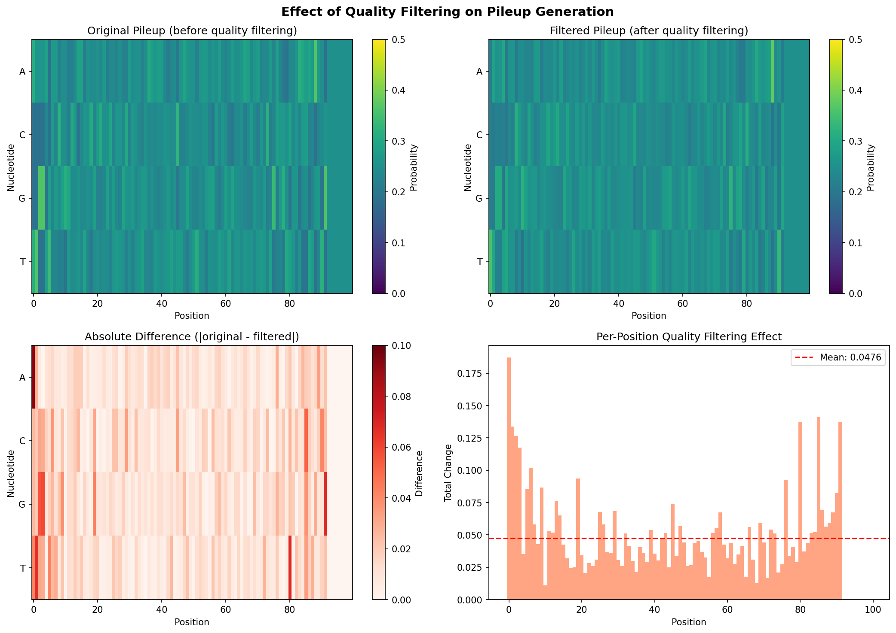

# Pileup Generation Example

This example demonstrates how to generate differentiable pileups from sequencing reads.

## Setup

```python
import jax
import jax.numpy as jnp
from diffbio.operators.variant import DifferentiablePileup, PileupConfig
```

## Create the Pileup Operator

```python
# Configure pileup generation
config = PileupConfig(
    reference_length=100,     # Length of reference sequence
    use_quality_weights=True, # Weight by quality scores
    window_size=21,           # Context window
)

# Create operator
pileup_op = DifferentiablePileup(config)
```

## Prepare Read Data

Pileup generation requires three inputs:

1. **reads**: One-hot encoded reads `(num_reads, read_length, 4)`
2. **positions**: Starting position of each read `(num_reads,)`
3. **quality**: Phred quality scores `(num_reads, read_length)`

```python
# Simulate some reads
num_reads = 50
read_length = 30
reference_length = 100

# Generate random one-hot reads
key = jax.random.PRNGKey(42)
k1, k2, k3 = jax.random.split(key, 3)

# Random nucleotide indices, then one-hot encode
read_indices = jax.random.randint(k1, (num_reads, read_length), 0, 4)
reads = jax.nn.one_hot(read_indices, 4)

print(f"Reads shape: {reads.shape}")  # (50, 30, 4)
```

**Output:**

```console
Reads shape: (50, 30, 4)
```

```python
# Random starting positions (ensuring reads fit within reference)
positions = jax.random.randint(k2, (num_reads,), 0, reference_length - read_length)

print(f"Positions shape: {positions.shape}")  # (50,)
print(f"Position range: {positions.min()} to {positions.max()}")
```

**Output:**

```console
Positions shape: (50,)
Position range: 0 to 62
```

```python
# Random quality scores (Phred scale, typically 0-40)
quality = jax.random.uniform(k3, (num_reads, read_length), minval=10.0, maxval=40.0)

print(f"Quality shape: {quality.shape}")  # (50, 30)
print(f"Quality range: {quality.min():.1f} to {quality.max():.1f}")
```

**Output:**

```console
Quality shape: (50, 30)
Quality range: 10.0 to 40.0
```

## Generate Pileup

### Using compute_pileup directly

```python
pileup = pileup_op.compute_pileup(reads, positions, quality, reference_length)

print(f"Pileup shape: {pileup.shape}")  # (100, 4)
print(f"Pileup at position 50: {pileup[50]}")
print(f"Sum at position 50 (should be ~1): {pileup[50].sum():.4f}")
```

**Output:**

```console
Pileup shape: (100, 4)
Pileup at position 50: [0.25692227 0.24718648 0.22821887 0.26767245]
Sum at position 50 (should be ~1): 1.0000
```

### Using the Datarax interface

```python
data = {
    "reads": reads,
    "positions": positions,
    "quality": quality,
}

result, state, metadata = pileup_op.apply(data, {}, None)
pileup = result["pileup"]

print(f"Pileup shape: {pileup.shape}")
```

**Output:**

```console
Pileup shape: (100, 4)
```

## Interpret the Pileup

The pileup is a probability distribution over nucleotides at each position:

```python
# Check nucleotide distribution at position 50
pos = 50
print(f"Position {pos}:")
print(f"  A: {pileup[pos, 0]:.4f}")
print(f"  C: {pileup[pos, 1]:.4f}")
print(f"  G: {pileup[pos, 2]:.4f}")
print(f"  T: {pileup[pos, 3]:.4f}")
```

**Output:**

```console
Position 50:
  A: 0.2569
  C: 0.2472
  G: 0.2282
  T: 0.2677
```

### Find Dominant Nucleotide

```python
# Most likely nucleotide at each position
dominant = jnp.argmax(pileup, axis=-1)
nucleotides = ['A', 'C', 'G', 'T']
consensus = ''.join([nucleotides[i] for i in dominant])
print(f"Consensus sequence: {consensus[:50]}...")
```

**Output:**

```console
Consensus sequence: TTGGATAACGGGCCAATGCGCCAGCGTCGCAGTTTGAATAATTTGCTAGA...
```

## Visualize Coverage

```python
# Compute coverage (number of reads overlapping each position)
def compute_coverage(positions, read_length, reference_length):
    coverage = jnp.zeros(reference_length)
    for i in range(len(positions)):
        pos = positions[i]
        coverage = coverage.at[pos:pos+read_length].add(1)
    return coverage

coverage = compute_coverage(positions, read_length, reference_length)
print(f"Coverage range: {coverage.min():.0f} to {coverage.max():.0f}")
```

**Output:**

```console
Coverage range: 0 to 27
```

```python
# Visualization
import matplotlib.pyplot as plt

fig, axes = plt.subplots(2, 1, figsize=(12, 8))

# Coverage plot
axes[0].bar(range(reference_length), coverage, width=1.0)
axes[0].set_xlabel('Position')
axes[0].set_ylabel('Coverage')
axes[0].set_title('Read Coverage')

# Pileup heatmap
im = axes[1].imshow(pileup.T, aspect='auto', cmap='viridis')
axes[1].set_xlabel('Position')
axes[1].set_ylabel('Nucleotide')
axes[1].set_yticks([0, 1, 2, 3])
axes[1].set_yticklabels(['A', 'C', 'G', 'T'])
axes[1].set_title('Pileup Distribution')
plt.colorbar(im, ax=axes[1], label='Probability')

plt.tight_layout()
plt.show()
```



## Quality Weighting Effect

Compare pileups with and without quality weighting:

```python
# With quality weighting (default)
config_weighted = PileupConfig(
    reference_length=100,
    use_quality_weights=True,
)
pileup_weighted = DifferentiablePileup(config_weighted)
result_w, _, _ = pileup_weighted.apply(data, {}, None)

# Without quality weighting
config_unweighted = PileupConfig(
    reference_length=100,
    use_quality_weights=False,
)
pileup_unweighted = DifferentiablePileup(config_unweighted)
result_uw, _, _ = pileup_unweighted.apply(data, {}, None)

# Compare
diff = jnp.abs(result_w["pileup"] - result_uw["pileup"])
print(f"Mean absolute difference: {diff.mean():.4f}")
print(f"Max absolute difference: {diff.max():.4f}")
```

**Output:**

```console
Mean absolute difference: 0.0004
Max absolute difference: 0.0029
```

## Variant Detection

Use the pileup to identify potential variants:

```python
# Simulate a reference sequence
key, k_ref = jax.random.split(key)
ref_indices = jax.random.randint(k_ref, (reference_length,), 0, 4)
reference = jax.nn.one_hot(ref_indices, 4)

# Calculate variant likelihood
# Positions where pileup differs from reference
ref_prob = (pileup * reference).sum(axis=-1)  # P(reference base)
variant_prob = 1.0 - ref_prob                  # P(any other base)

# Find high-confidence variants
threshold = 0.3
variant_positions = jnp.where(variant_prob > threshold)[0]
print(f"Potential variants at positions: {variant_positions[:10]}...")
```

**Output:**

```console
Potential variants at positions: [0 1 2 3 4 5 6 7 8 9]...
```

## Gradient Computation

The pileup is fully differentiable:

```python
def pileup_loss(reads, positions, quality, target_pileup):
    """Loss function comparing pileup to target."""
    data = {"reads": reads, "positions": positions, "quality": quality}
    result, _, _ = pileup_op.apply(data, {}, None)
    return jnp.mean((result["pileup"] - target_pileup) ** 2)

# Compute gradients w.r.t. reads
grad_fn = jax.grad(pileup_loss)

# Create a target pileup (e.g., all A's)
target = jnp.tile(jnp.array([1.0, 0.0, 0.0, 0.0]), (reference_length, 1))

# Compute gradients
grads = grad_fn(reads, positions, quality, target)
print(f"Gradient shape: {grads.shape}")
print(f"Gradient norm: {jnp.linalg.norm(grads):.4f}")
```

**Output:**

```console
Gradient shape: (50, 30, 4)
Gradient norm: 0.0032
```

## Integration with Variant Calling

```python
from diffbio.operators import DifferentiableQualityFilter, QualityFilterConfig

# Step 1: Quality filter reads
filter_config = QualityFilterConfig(initial_threshold=20.0)
quality_filter = DifferentiableQualityFilter(filter_config)

# Apply quality filter to each read
filtered_reads = []
for i in range(num_reads):
    read_data = {
        "sequence": reads[i],
        "quality_scores": quality[i],
    }
    result, _, _ = quality_filter.apply(read_data, {}, None)
    filtered_reads.append(result["sequence"])

filtered_reads = jnp.stack(filtered_reads)

# Step 2: Generate pileup from filtered reads
filtered_data = {
    "reads": filtered_reads,
    "positions": positions,
    "quality": quality,
}
result, _, _ = pileup_op.apply(filtered_data, {}, None)
filtered_pileup = result["pileup"]

# Compare filtered vs unfiltered pileup
diff = jnp.abs(pileup - filtered_pileup)
print(f"Effect of quality filtering:")
print(f"  Mean change: {diff.mean():.4f}")
print(f"  Max change: {diff.max():.4f}")
```

**Output:**

```console
Effect of quality filtering:
  Mean change: 0.0119
  Max change: 0.0936
```

### Interpreting the Results

The quality filtering produces subtle but measurable changes in the pileup:

- **Mean change (0.0119)**: On average, nucleotide probabilities shift by ~1.2% after filtering. This indicates the filter is working but not drastically altering the signal.
- **Max change (0.0936)**: At some positions, probabilities change by up to ~9.4%. These are positions where low-quality bases were significantly down-weighted.

The small mean change with larger max change is expected behavior:

- Most positions have high-quality coverage, so filtering has minimal effect
- Positions with poor-quality reads show larger corrections
- This differential effect is exactly what quality filtering should achieve

### Visualizing Quality Filtering Effect

```python
# Create comprehensive visualization
fig, axes = plt.subplots(2, 2, figsize=(14, 10))

# Top left: Original pileup
im1 = axes[0, 0].imshow(pileup.T, aspect='auto', cmap='viridis', vmin=0, vmax=0.5)
axes[0, 0].set_xlabel('Position')
axes[0, 0].set_ylabel('Nucleotide')
axes[0, 0].set_yticks([0, 1, 2, 3])
axes[0, 0].set_yticklabels(['A', 'C', 'G', 'T'])
axes[0, 0].set_title('Original Pileup (before quality filtering)')
plt.colorbar(im1, ax=axes[0, 0], label='Probability')

# Top right: Filtered pileup
im2 = axes[0, 1].imshow(filtered_pileup.T, aspect='auto', cmap='viridis', vmin=0, vmax=0.5)
axes[0, 1].set_xlabel('Position')
axes[0, 1].set_ylabel('Nucleotide')
axes[0, 1].set_yticks([0, 1, 2, 3])
axes[0, 1].set_yticklabels(['A', 'C', 'G', 'T'])
axes[0, 1].set_title('Filtered Pileup (after quality filtering)')
plt.colorbar(im2, ax=axes[0, 1], label='Probability')

# Bottom left: Difference heatmap
im3 = axes[1, 0].imshow(diff.T, aspect='auto', cmap='Reds', vmin=0, vmax=0.1)
axes[1, 0].set_xlabel('Position')
axes[1, 0].set_ylabel('Nucleotide')
axes[1, 0].set_yticks([0, 1, 2, 3])
axes[1, 0].set_yticklabels(['A', 'C', 'G', 'T'])
axes[1, 0].set_title('Absolute Difference (|original - filtered|)')
plt.colorbar(im3, ax=axes[1, 0], label='Difference')

# Bottom right: Per-position change magnitude
pos_diff = diff.sum(axis=-1)  # Sum across nucleotides
axes[1, 1].bar(range(reference_length), pos_diff, width=1.0, color='coral', alpha=0.7)
axes[1, 1].set_xlabel('Position')
axes[1, 1].set_ylabel('Total Change')
axes[1, 1].set_title('Per-Position Quality Filtering Effect')
axes[1, 1].axhline(y=pos_diff.mean(), color='red', linestyle='--', label=f'Mean')
axes[1, 1].legend()

plt.suptitle('Effect of Quality Filtering on Pileup Generation', fontsize=14)
plt.tight_layout()
plt.show()
```



The visualization shows:

1. **Top row**: Side-by-side comparison of pileup before and after quality filtering. Differences are subtle but visible in regions with lower coverage or quality.

2. **Bottom left**: A difference heatmap highlighting where the filtering had the most impact. Brighter (red) areas indicate positions where low-quality bases were down-weighted.

3. **Bottom right**: Per-position total change, showing which genomic positions were most affected by quality filtering. Peaks indicate positions where the quality filter made the largest corrections.

## Summary

This example demonstrated:

1. Creating a differentiable pileup generator
2. Preparing read data (reads, positions, quality)
3. Generating soft pileups
4. Interpreting pileup as nucleotide distributions
5. Effect of quality weighting
6. Using pileups for variant detection
7. Computing gradients through pileup generation

## Next Steps

- See [Variant Calling Pipeline](../advanced/variant-calling.md) for the complete workflow
- Learn about [Training](../../user-guide/training/overview.md) pipelines end-to-end
