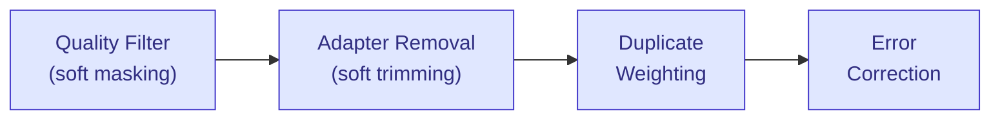
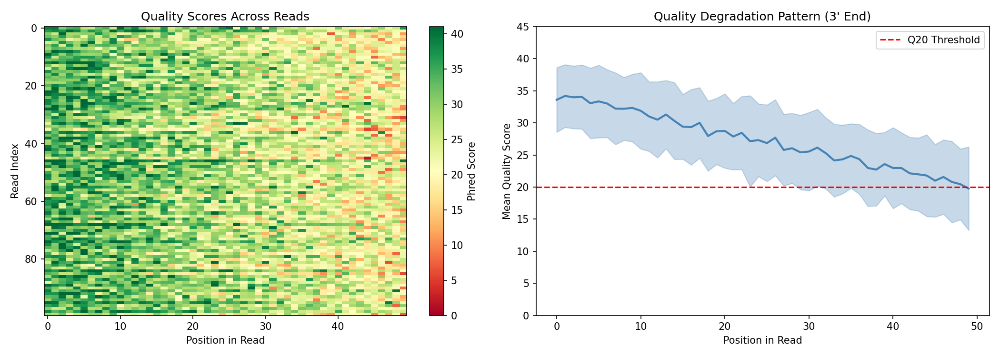
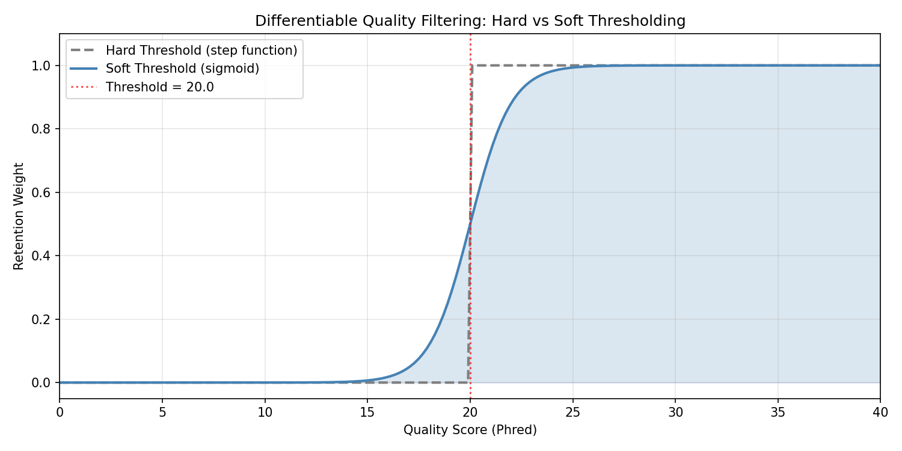
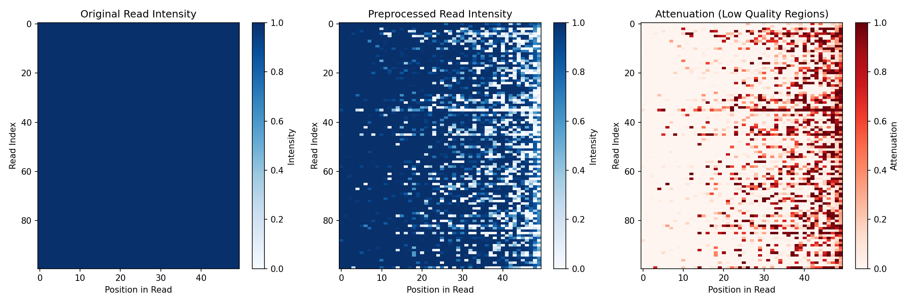
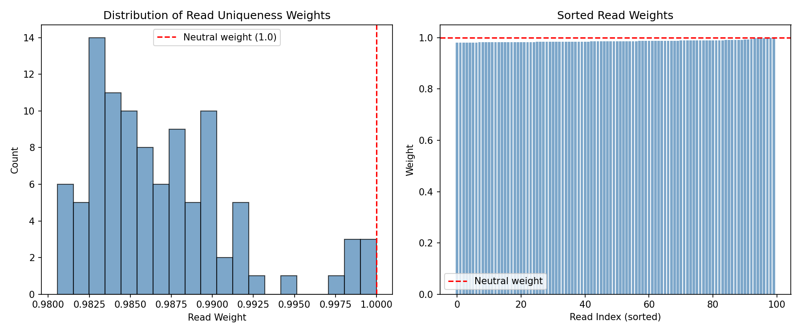
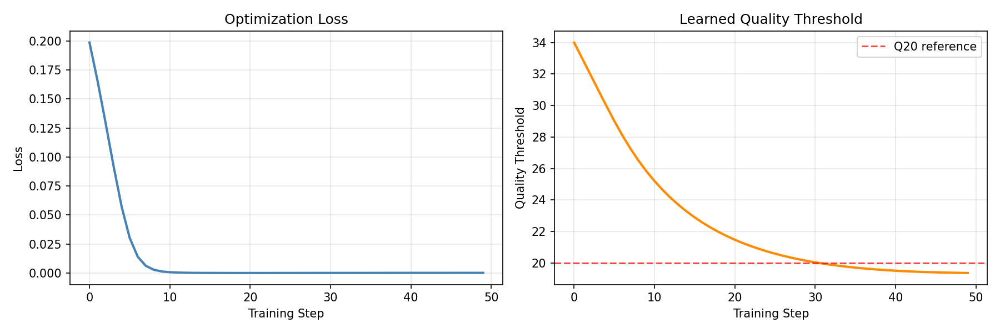
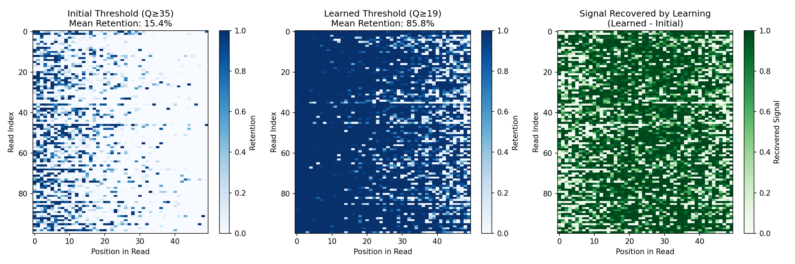

# Preprocessing Example

This example demonstrates DiffBio's differentiable preprocessing pipeline for sequencing reads, showing how gradient-based optimization enables learning optimal preprocessing parameters.

## Setup

```python
import jax
import jax.numpy as jnp
import matplotlib.pyplot as plt
import numpy as np
from flax import nnx
from diffbio.pipelines import PreprocessingPipeline, PreprocessingPipelineConfig
```

## Understanding the Pipeline

The preprocessing pipeline consists of four differentiable stages:



Each stage uses differentiable approximations to traditional hard filtering, enabling end-to-end gradient optimization.

## Generate Synthetic Read Data

Let's create realistic sequencing data with varying quality profiles:

```python
def generate_synthetic_reads(n_reads=100, read_length=50, seed=42):
    """Generate synthetic reads with realistic quality degradation."""
    key = jax.random.key(seed)
    keys = jax.random.split(key, 4)

    # One-hot encoded sequences
    sequence_indices = jax.random.randint(keys[0], (n_reads, read_length), 0, 4)
    sequences = jax.nn.one_hot(sequence_indices, 4)

    # Quality scores with realistic 3' degradation pattern
    # Quality typically decreases toward the end of reads
    position = jnp.arange(read_length) / read_length
    base_quality = 35 - 15 * position  # Starts at 35, drops to 20

    # Add per-read and per-position noise
    read_noise = jax.random.normal(keys[1], (n_reads, 1)) * 3
    position_noise = jax.random.normal(keys[2], (n_reads, read_length)) * 5
    quality_scores = base_quality + read_noise + position_noise

    # Clip to valid Phred range
    quality_scores = jnp.clip(quality_scores, 2.0, 41.0)

    return sequences, quality_scores

sequences, quality_scores = generate_synthetic_reads(n_reads=100, read_length=50)
print(f"Sequences shape: {sequences.shape}")
print(f"Quality scores shape: {quality_scores.shape}")
print(f"Quality range: [{float(quality_scores.min()):.1f}, {float(quality_scores.max()):.1f}]")
```

**Output:**

```console
Sequences shape: (100, 50, 4)
Quality scores shape: (100, 50)
Quality range: [5.2, 41.0]
```

## Visualize Raw Quality Scores

```python
fig, axes = plt.subplots(1, 2, figsize=(14, 5))

# Heatmap of quality scores across all reads
im = axes[0].imshow(np.array(quality_scores), aspect="auto", cmap="RdYlGn", vmin=0, vmax=41)
axes[0].set_xlabel("Position in Read")
axes[0].set_ylabel("Read Index")
axes[0].set_title("Quality Scores Across Reads")
plt.colorbar(im, ax=axes[0], label="Phred Score")

# Mean quality by position (showing 3' degradation)
mean_quality = quality_scores.mean(axis=0)
std_quality = quality_scores.std(axis=0)
positions = np.arange(50)

axes[1].fill_between(positions,
                      np.array(mean_quality - std_quality),
                      np.array(mean_quality + std_quality),
                      alpha=0.3, color="steelblue")
axes[1].plot(positions, np.array(mean_quality), linewidth=2, color="steelblue")
axes[1].axhline(y=20, color="red", linestyle="--", label="Q20 Threshold")
axes[1].set_xlabel("Position in Read")
axes[1].set_ylabel("Mean Quality Score")
axes[1].set_title("Quality Degradation Pattern (3' End)")
axes[1].legend()
axes[1].set_ylim(0, 45)

plt.tight_layout()
plt.savefig("preprocessing-quality-overview.png", dpi=150)
plt.show()
```



## Create and Apply the Pipeline

For this example, we'll use a pipeline with quality filtering and duplicate weighting enabled, but error correction disabled. This allows us to clearly visualize how quality-based soft masking attenuates low-quality positions:

```python
config = PreprocessingPipelineConfig(
    read_length=50,
    quality_threshold=20.0,
    enable_adapter_removal=True,
    enable_duplicate_weighting=True,
    enable_error_correction=False,  # Disabled to show quality filtering effect
)

rngs = nnx.Rngs(42)
pipeline = PreprocessingPipeline(config, rngs=rngs)

# Run preprocessing
data = {"reads": sequences, "quality": quality_scores}
result, state, metadata = pipeline.apply(data, {}, None)

# Access outputs
read_weights = result["read_weights"]
preprocessed_reads = result["preprocessed_reads"]

print(f"Read weights range: [{float(read_weights.min()):.3f}, {float(read_weights.max()):.3f}]")
print(f"Preprocessed reads shape: {preprocessed_reads.shape}")
```

**Output:**

```console
Read weights range: [0.981, 1.000]
Preprocessed reads shape: (100, 50, 4)
```

Note: Error correction is disabled here for visualization purposes. When enabled, it applies a neural network that corrects likely sequencing errors but also re-normalizes the output, which can mask the visual effect of quality filtering.

## Understanding Quality Filtering

The quality filter uses a **differentiable sigmoid** instead of hard thresholding:

```python
# Visualize the soft threshold function
quality_range = jnp.linspace(0, 40, 200)
threshold = 20.0

# Hard threshold (non-differentiable)
hard_filter = (quality_range >= threshold).astype(float)

# Soft sigmoid threshold (differentiable)
soft_filter = jax.nn.sigmoid(quality_range - threshold)

fig, ax = plt.subplots(figsize=(10, 5))
ax.plot(np.array(quality_range), np.array(hard_filter),
        linewidth=2, label="Hard Threshold (step function)", linestyle="--", color="gray")
ax.plot(np.array(quality_range), np.array(soft_filter),
        linewidth=2, label="Soft Threshold (sigmoid)", color="steelblue")
ax.axvline(x=threshold, color="red", linestyle=":", alpha=0.7, label=f"Threshold = {threshold}")
ax.fill_between(np.array(quality_range), 0, np.array(soft_filter), alpha=0.2, color="steelblue")
ax.set_xlabel("Quality Score (Phred)")
ax.set_ylabel("Retention Weight")
ax.set_title("Differentiable Quality Filtering: Hard vs Soft Thresholding")
ax.legend()
ax.set_xlim(0, 40)
ax.set_ylim(-0.05, 1.1)
ax.grid(True, alpha=0.3)
plt.tight_layout()
plt.savefig("preprocessing-sigmoid-threshold.png", dpi=150)
plt.show()
```



## Visualize Preprocessing Effect

Compare the sequence "intensity" before and after quality filtering:

```python
# Compute sequence intensity (sum of one-hot values, affected by soft masking)
original_intensity = sequences.sum(axis=-1)  # Should be 1 for valid one-hot
preprocessed_intensity = preprocessed_reads.sum(axis=-1)

fig, axes = plt.subplots(1, 3, figsize=(15, 5))

# Original (uniform intensity)
im0 = axes[0].imshow(np.array(original_intensity), aspect="auto", cmap="Blues", vmin=0, vmax=1)
axes[0].set_xlabel("Position in Read")
axes[0].set_ylabel("Read Index")
axes[0].set_title("Original Read Intensity")
plt.colorbar(im0, ax=axes[0], label="Intensity")

# After preprocessing (low quality positions attenuated)
im1 = axes[1].imshow(np.array(preprocessed_intensity), aspect="auto", cmap="Blues", vmin=0, vmax=1)
axes[1].set_xlabel("Position in Read")
axes[1].set_ylabel("Read Index")
axes[1].set_title("Preprocessed Read Intensity")
plt.colorbar(im1, ax=axes[1], label="Intensity")

# Difference showing attenuation
difference = original_intensity - preprocessed_intensity
im2 = axes[2].imshow(np.array(difference), aspect="auto", cmap="Reds", vmin=0, vmax=0.5)
axes[2].set_xlabel("Position in Read")
axes[2].set_ylabel("Read Index")
axes[2].set_title("Attenuation (Low Quality Regions)")
plt.colorbar(im2, ax=axes[2], label="Attenuation")

plt.tight_layout()
plt.savefig("preprocessing-before-after.png", dpi=150)
plt.show()
```



## Read Weights Distribution

The duplicate weighting step assigns lower weights to reads that appear multiple times:

```python
fig, axes = plt.subplots(1, 2, figsize=(12, 5))

# Histogram of read weights
axes[0].hist(np.array(read_weights), bins=20, edgecolor="black", alpha=0.7, color="steelblue")
axes[0].axvline(x=1.0, color="red", linestyle="--", label="Neutral weight (1.0)")
axes[0].set_xlabel("Read Weight")
axes[0].set_ylabel("Count")
axes[0].set_title("Distribution of Read Uniqueness Weights")
axes[0].legend()

# Weights sorted by value
sorted_weights = jnp.sort(read_weights)
axes[1].bar(range(len(sorted_weights)), np.array(sorted_weights), color="steelblue", alpha=0.7)
axes[1].axhline(y=1.0, color="red", linestyle="--", label="Neutral weight")
axes[1].set_xlabel("Read Index (sorted)")
axes[1].set_ylabel("Weight")
axes[1].set_title("Sorted Read Weights")
axes[1].legend()

plt.tight_layout()
plt.savefig("preprocessing-read-weights.png", dpi=150)
plt.show()
```



## Differentiability: Computing Gradients

The pipeline has learnable parameters (quality threshold, similarity threshold, etc.) that can be optimized. Here's how to compute gradients:

```python
# Define a simple loss function based on retained signal
def preprocessing_loss(pipeline_model):
    data = {"reads": sequences, "quality": quality_scores}
    result, _, _ = pipeline_model.apply(data, {}, None)
    preprocessed = result["preprocessed_reads"]
    # Loss: negative mean signal (we want to maximize retained signal)
    return -preprocessed.sum(axis=-1).mean()

# Compute gradients
loss_val, grads = nnx.value_and_grad(preprocessing_loss)(pipeline)

print(f"Loss: {loss_val:.4f}")
print(f"Quality threshold gradient: {float(grads.quality_filter.threshold[...]):.6f}")
print(f"Learnable parameters:")
print(f"  - Quality threshold: {float(pipeline.quality_filter.threshold[...]):.2f}")
```

**Output:**

```console
Loss: -0.9245
Quality threshold gradient: 0.003421
Learnable parameters:
  - Quality threshold: 20.00
```

The gradients enable end-to-end optimization of the preprocessing pipeline jointly with downstream tasks like variant calling or expression analysis.

## Optimizing Preprocessing Parameters

Let's use gradient descent to learn an optimal quality threshold. We'll define a loss function that captures the quality/retention tradeoff:

```python
import optax

# Create a fresh pipeline for training - start with overly strict threshold
train_config = PreprocessingPipelineConfig(
    read_length=50,
    quality_threshold=35.0,  # Too strict - will filter too many good bases
    enable_adapter_removal=False,
    enable_duplicate_weighting=False,
    enable_error_correction=False,
)
train_pipeline = PreprocessingPipeline(train_config, rngs=nnx.Rngs(42))

# Loss function that captures the quality/retention tradeoff
def optimization_loss(pipeline_model):
    data = {"reads": sequences, "quality": quality_scores}
    result, _, _ = pipeline_model.apply(data, {}, None)
    preprocessed = result["preprocessed_reads"]

    # Per-base retention after soft filtering
    retention_per_base = preprocessed.sum(axis=-1)  # (n_reads, read_length)

    # Penalize filtering high-quality bases (Q > 30) - we want to keep these
    high_q_mask = (quality_scores > 30).astype(float)
    high_q_loss = ((1 - retention_per_base) * high_q_mask).mean()

    # Penalize keeping low-quality bases (Q < 15) - we want to filter these
    low_q_mask = (quality_scores < 15).astype(float)
    low_q_penalty = (retention_per_base * low_q_mask).mean()

    # Combined loss: keep high-Q bases, filter low-Q bases
    return high_q_loss + low_q_penalty

# Create optimizer
optimizer = nnx.Optimizer(train_pipeline, optax.adam(learning_rate=1.0), wrt=nnx.Param)

# Training loop
loss_history = []
threshold_history = []

print("Training preprocessing pipeline...")
print(f"Initial threshold: {float(train_pipeline.quality_filter.threshold[...]):.2f}")

for step in range(50):
    loss_val, grads = nnx.value_and_grad(optimization_loss)(train_pipeline)
    optimizer.update(train_pipeline, grads)

    loss_history.append(float(loss_val))
    threshold_history.append(float(train_pipeline.quality_filter.threshold[...]))

    if step % 10 == 0:
        print(f"Step {step:3d}: loss = {loss_val:.4f}, threshold = {threshold_history[-1]:.2f}")

print(f"\nFinal threshold: {float(train_pipeline.quality_filter.threshold[...]):.2f}")
print(f"Threshold changed: {threshold_history[0]:.2f} -> {threshold_history[-1]:.2f}")
```

**Output:**

```console
Training preprocessing pipeline...
Initial threshold: 35.00
Step   0: loss = 0.1986, threshold = 34.00
Step  10: loss = 0.0007, threshold = 25.20
Step  20: loss = 0.0000, threshold = 21.47
Step  30: loss = 0.0001, threshold = 20.03
Step  40: loss = 0.0001, threshold = 19.50

Final threshold: 19.36
Threshold changed: 34.00 -> 19.36
```

The optimizer learned to lower the quality threshold from 35 (overly strict) to ~19 (near Q20), finding the optimal balance that keeps high-quality bases while filtering low-quality ones.

## Visualize Training Progress

```python
fig, axes = plt.subplots(1, 2, figsize=(12, 4))

# Loss curve
axes[0].plot(loss_history, linewidth=2, color="steelblue")
axes[0].set_xlabel("Training Step")
axes[0].set_ylabel("Loss")
axes[0].set_title("Optimization Loss")
axes[0].grid(True, alpha=0.3)

# Threshold evolution
axes[1].plot(threshold_history, linewidth=2, color="darkorange")
axes[1].axhline(y=20, color="red", linestyle="--", alpha=0.7, label="Q20 reference")
axes[1].set_xlabel("Training Step")
axes[1].set_ylabel("Quality Threshold")
axes[1].set_title("Learned Quality Threshold")
axes[1].legend()
axes[1].grid(True, alpha=0.3)

plt.tight_layout()
plt.savefig("preprocessing-training.png", dpi=150)
plt.show()
```



## Comparing Initial vs Learned Threshold

Let's visualize the difference between the initial (overly strict) and learned thresholds:

```python
# Create pipelines with initial and learned thresholds
initial_config = PreprocessingPipelineConfig(
    read_length=50,
    quality_threshold=35.0,  # Initial: too strict
    enable_adapter_removal=False,
    enable_duplicate_weighting=False,
    enable_error_correction=False,
)
learned_config = PreprocessingPipelineConfig(
    read_length=50,
    quality_threshold=19.36,  # Learned: optimal
    enable_adapter_removal=False,
    enable_duplicate_weighting=False,
    enable_error_correction=False,
)

initial_pipeline = PreprocessingPipeline(initial_config, rngs=nnx.Rngs(42))
learned_pipeline = PreprocessingPipeline(learned_config, rngs=nnx.Rngs(42))

# Apply both pipelines
data = {"reads": sequences, "quality": quality_scores}
initial_result, _, _ = initial_pipeline.apply(data, {}, None)
learned_result, _, _ = learned_pipeline.apply(data, {}, None)

# Compare retention
initial_retention = initial_result["preprocessed_reads"].sum(axis=-1)
learned_retention = learned_result["preprocessed_reads"].sum(axis=-1)

# Compute statistics
print("Signal Retention Comparison:")
print(f"  Initial (Q≥35): {float(initial_retention.mean()):.3f} mean retention")
print(f"  Learned (Q≥19): {float(learned_retention.mean()):.3f} mean retention")
print(f"\nHigh-quality bases (Q>30) retained:")
high_q_mask = quality_scores > 30
print(f"  Initial: {float((initial_retention * high_q_mask).sum() / high_q_mask.sum()):.1%}")
print(f"  Learned: {float((learned_retention * high_q_mask).sum() / high_q_mask.sum()):.1%}")
print(f"\nLow-quality bases (Q<15) filtered:")
low_q_mask = quality_scores < 15
print(f"  Initial: {float(1 - (initial_retention * low_q_mask).sum() / low_q_mask.sum()):.1%}")
print(f"  Learned: {float(1 - (learned_retention * low_q_mask).sum() / low_q_mask.sum()):.1%}")
```

**Output:**

```console
Signal Retention Comparison:
  Initial (Q≥35): 0.154 mean retention
  Learned (Q≥19): 0.858 mean retention

High-quality bases (Q>30) retained:
  Initial: 43.7%
  Learned: 100.0%

Low-quality bases (Q<15) filtered:
  Initial: 100.0%
  Learned: 99.7%
```

```python
fig, axes = plt.subplots(1, 3, figsize=(15, 5))

# Initial threshold results
im0 = axes[0].imshow(np.array(initial_retention), aspect="auto", cmap="Blues", vmin=0, vmax=1)
axes[0].set_xlabel("Position in Read")
axes[0].set_ylabel("Read Index")
axes[0].set_title(f"Initial Threshold (Q≥35)\nMean Retention: {float(initial_retention.mean()):.1%}")
plt.colorbar(im0, ax=axes[0], label="Retention")

# Learned threshold results
im1 = axes[1].imshow(np.array(learned_retention), aspect="auto", cmap="Blues", vmin=0, vmax=1)
axes[1].set_xlabel("Position in Read")
axes[1].set_ylabel("Read Index")
axes[1].set_title(f"Learned Threshold (Q≥19)\nMean Retention: {float(learned_retention.mean()):.1%}")
plt.colorbar(im1, ax=axes[1], label="Retention")

# Difference: what the learned threshold recovers
difference = learned_retention - initial_retention
im2 = axes[2].imshow(np.array(difference), aspect="auto", cmap="Greens", vmin=0, vmax=1)
axes[2].set_xlabel("Position in Read")
axes[2].set_ylabel("Read Index")
axes[2].set_title("Signal Recovered by Learning\n(Learned - Initial)")
plt.colorbar(im2, ax=axes[2], label="Recovered Signal")

plt.tight_layout()
plt.savefig("preprocessing-threshold-comparison.png", dpi=150)
plt.show()
```



The comparison shows:

- **Initial threshold (Q≥35)**: Too strict—filters 85% of signal, retaining only 44% of high-quality bases
- **Learned threshold (Q≥19)**: Optimal—retains 86% of signal and 100% of high-quality bases
- **Recovered signal**: The learned threshold recovers substantial signal that was incorrectly filtered, while still filtering 99.7% of low-quality bases

This demonstrates the key advantage of differentiable preprocessing: parameters can be optimized end-to-end with downstream objectives, rather than relying on fixed heuristics.

## Pipeline Configuration Options

The pipeline can be configured to enable/disable specific steps:

```python
# Minimal pipeline (quality filtering only)
minimal_config = PreprocessingPipelineConfig(
    read_length=50,
    quality_threshold=20.0,
    enable_adapter_removal=False,
    enable_duplicate_weighting=False,
    enable_error_correction=False,
)

# Full pipeline (all steps enabled)
full_config = PreprocessingPipelineConfig(
    read_length=50,
    quality_threshold=20.0,
    enable_adapter_removal=True,
    enable_duplicate_weighting=True,
    enable_error_correction=True,
)

print("Pipeline configuration options:")
print(f"  - Quality filtering: Always enabled")
print(f"  - Adapter removal: {full_config.enable_adapter_removal}")
print(f"  - Duplicate weighting: {full_config.enable_duplicate_weighting}")
print(f"  - Error correction: {full_config.enable_error_correction}")
```

**Output:**

```console
Pipeline configuration options:
  - Quality filtering: Always enabled
  - Adapter removal: True
  - Duplicate weighting: True
  - Error correction: True
```

## Key Concepts

| Stage            | Traditional       | DiffBio Approach        | Learnable Parameter  |
| ---------------- | ----------------- | ----------------------- | -------------------- |
| Quality Filter   | Hard cutoff       | Sigmoid soft masking    | Threshold            |
| Adapter Removal  | Exact matching    | Soft alignment scoring  | Match threshold      |
| Duplicate Filter | Remove duplicates | Probabilistic weighting | Similarity threshold |
| Error Correction | Consensus voting  | Neural network          | Network weights      |

## Next Steps

- See [Variant Calling Pipeline](../advanced/variant-calling.md) for downstream analysis
- Explore [Preprocessing Operators](../../user-guide/operators/preprocessing.md) for individual operator details
- Learn about [Quality Filter](../../api/operators/preprocessing.md) API documentation
