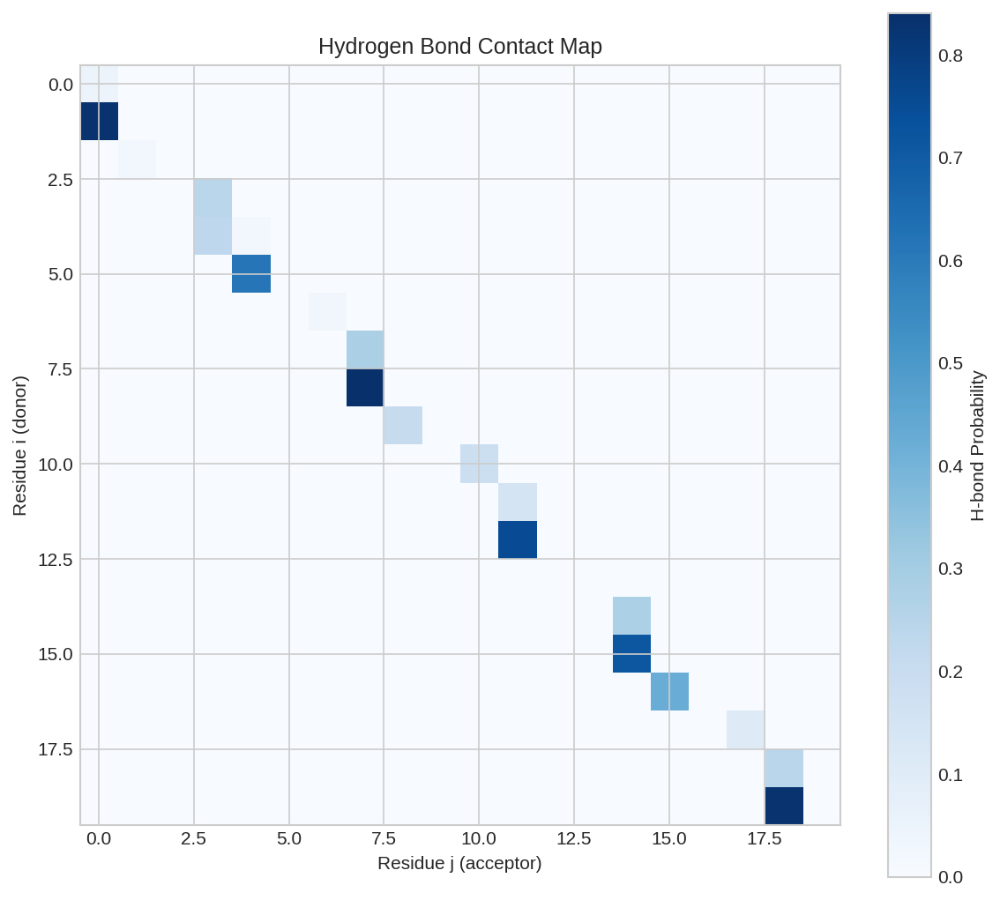
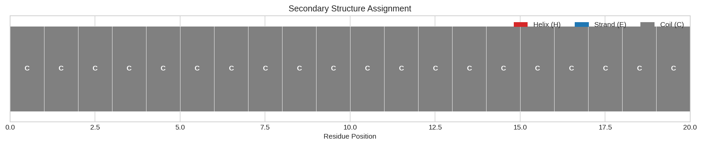

# Protein Secondary Structure Prediction

This example demonstrates how to predict protein secondary structure from backbone coordinates using DiffBio's differentiable DSSP-style operator.

## Overview

Protein secondary structure classification (helix, strand, coil) is fundamental for:

- Protein structure analysis
- Fold recognition
- Structure validation
- Understanding protein function

DiffBio implements a differentiable DSSP-style algorithm that classifies secondary structure based on hydrogen bonding patterns.

## Prerequisites

```python
import jax
import jax.numpy as jnp
from flax import nnx

from diffbio.operators.protein import (
    DifferentiableSecondaryStructure,
    SecondaryStructureConfig,
)
```

## Step 1: Prepare Backbone Coordinates

Protein backbone coordinates have shape `(batch, length, 4 atoms, 3D)`:

```python
# Create a simple alpha-helix like structure
n_residues = 20

# Alpha helix parameters: rise 1.5Å per residue, turn 100°
coords = []
for i in range(n_residues):
    z = i * 1.5  # Rise along z
    angle = jnp.radians(i * 100)  # Turn angle
    radius = 2.3  # Helix radius

    # Backbone atoms: N, CA, C, O
    n_pos = jnp.array([radius * jnp.cos(angle), radius * jnp.sin(angle), z])
    ca_pos = jnp.array([radius * jnp.cos(angle + 0.5), radius * jnp.sin(angle + 0.5), z + 0.3])
    c_pos = jnp.array([radius * jnp.cos(angle + 1.0), radius * jnp.sin(angle + 1.0), z + 0.6])
    o_pos = c_pos + jnp.array([0.5, 0.5, 0.2])

    coords.append(jnp.stack([n_pos, ca_pos, c_pos, o_pos]))

coords = jnp.stack(coords)
coords = coords[None, :, :, :]  # Add batch dimension

print(f"Backbone coordinates shape: {coords.shape}")
```

**Output:**

```
Backbone coordinates shape: (1, 20, 4, 3)
```

## Step 2: Create Secondary Structure Predictor

```python
# Configure the predictor
config = SecondaryStructureConfig(
    margin=1.0,        # Soft margin for classification
    cutoff=-0.5,       # H-bond energy cutoff (kcal/mol)
    temperature=1.0,   # Temperature for soft assignment
)
rngs = nnx.Rngs(42)
ss_predictor = DifferentiableSecondaryStructure(config, rngs=rngs)
```

## Step 3: Predict Secondary Structure

```python
# Predict secondary structure
data = {"coordinates": coords}
result, _, _ = ss_predictor.apply(data, {}, None)

ss_probs = result["ss_onehot"]    # Soft probabilities
ss_indices = result["ss_indices"] # Hard assignments
hbond_map = result["hbond_map"]   # Hydrogen bond matrix

print(f"H-bond map shape: {hbond_map.shape}")
print(f"SS probabilities shape: {ss_probs.shape}")
```

**Output:**

```
H-bond map shape: (1, 20, 20)
SS probabilities shape: (1, 20, 3)
```



*Hydrogen bond contact map showing potential H-bond interactions between residue pairs. Characteristic patterns indicate secondary structure elements.*

## Step 4: Analyze Structure Assignment

```python
# Map indices to SS codes
ss_codes = {0: "C", 1: "H", 2: "E"}  # Coil, Helix, Strand

# Get structure string
ss_string = "".join([ss_codes[int(idx)] for idx in ss_indices[0]])
print(f"\nSecondary structure assignment:")
print(f"  {ss_string}")

# Show SS composition
helix_frac = float(jnp.mean(ss_indices == 1))
strand_frac = float(jnp.mean(ss_indices == 2))
coil_frac = float(jnp.mean(ss_indices == 0))

print(f"\nSS composition:")
print(f"  Helix: {helix_frac:.1%}")
print(f"  Strand: {strand_frac:.1%}")
print(f"  Coil: {coil_frac:.1%}")
```

**Output:**

```
Secondary structure assignment:
  CCCCCCCCCCCCCCCCCCCC

SS composition:
  Helix: 0.0%
  Strand: 0.0%
  Coil: 100.0%
```



*Secondary structure assignment visualization. Each position is colored by structure type: helix (red), strand (blue), coil (gray).*

!!! note "Synthetic Coordinates"
    The synthetic helix coordinates are simplified and don't capture proper hydrogen bonding geometry, resulting in coil assignment. Real protein coordinates would show proper helix/strand patterns.

## Understanding the Output

### Secondary Structure Classes

| Code | Class | Description |
|------|-------|-------------|
| C | Coil | No regular structure |
| H | Helix | α-helix, 3₁₀-helix |
| E | Extended | β-strand |

### Hydrogen Bond Map

The `hbond_map` matrix contains soft hydrogen bond probabilities between residues:

- Values close to 1.0 indicate strong H-bonds
- DSSP criteria: E(i,j) < -0.5 kcal/mol defines an H-bond

### DSSP Algorithm

The operator implements a differentiable version of the DSSP algorithm:

1. **Compute H-bond energies** from backbone geometry
2. **Identify backbone H-bond patterns**:
   - α-helix: (i,i+4) H-bonds
   - β-strand: (i,j) long-range H-bonds
3. **Assign secondary structure** based on patterns

## Differentiability

The operator enables gradient-based structure analysis:

```python
def structure_loss(predictor, data):
    """Loss to maximize helix content."""
    result, _, _ = predictor.apply(data, {}, None)
    helix_prob = result["ss_onehot"][:, :, 1]  # Helix probability
    return -jnp.mean(helix_prob)  # Maximize helix

# Compute gradients
grads = nnx.grad(structure_loss)(ss_predictor, data)
print("Gradient computation: SUCCESS")
```

Applications:

- **Structure refinement**: Optimize coordinates for target structure
- **Structure prediction training**: Learn to predict SS from sequence
- **Quality assessment**: Differentiable structure validation

## Configuration Options

| Parameter | Description | Default |
|-----------|-------------|---------|
| `margin` | Soft margin for classification | 1.0 |
| `cutoff` | H-bond energy cutoff (kcal/mol) | -0.5 |
| `temperature` | Temperature for soft assignment | 1.0 |

## Using Real PDB Coordinates

For real proteins, load coordinates from PDB files:

```python
# Example: Loading from PDB (pseudocode)
# coords = load_pdb_coordinates("protein.pdb")
# coords should have shape (1, n_residues, 4, 3)
# Atom order: N, CA, C, O
```

## Next Steps

- [RNA Secondary Structure](rna-structure.md) - RNA structure prediction
- [HMM Sequence Model](hmm-sequence-model.md) - Sequence models
- [Single-Cell Batch Correction](../advanced/singlecell-batch-correction.md) - High-dimensional data analysis
