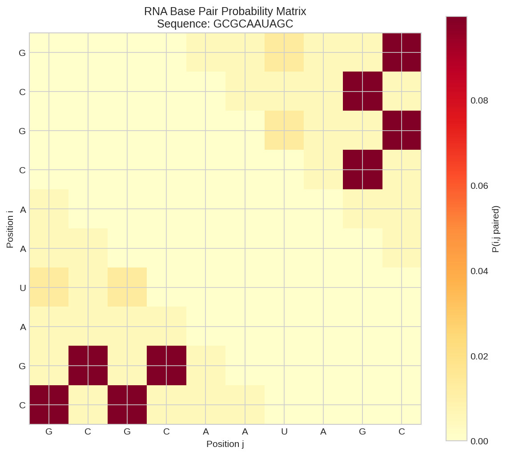
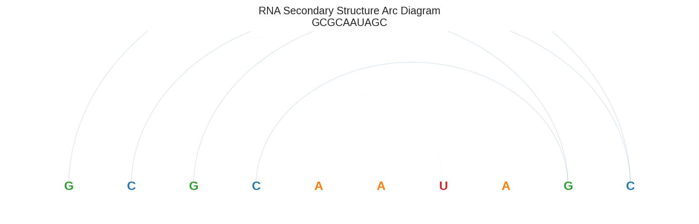
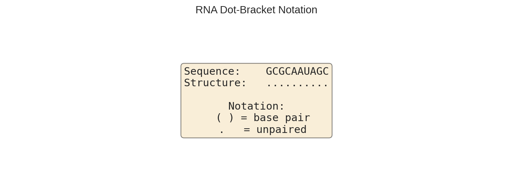
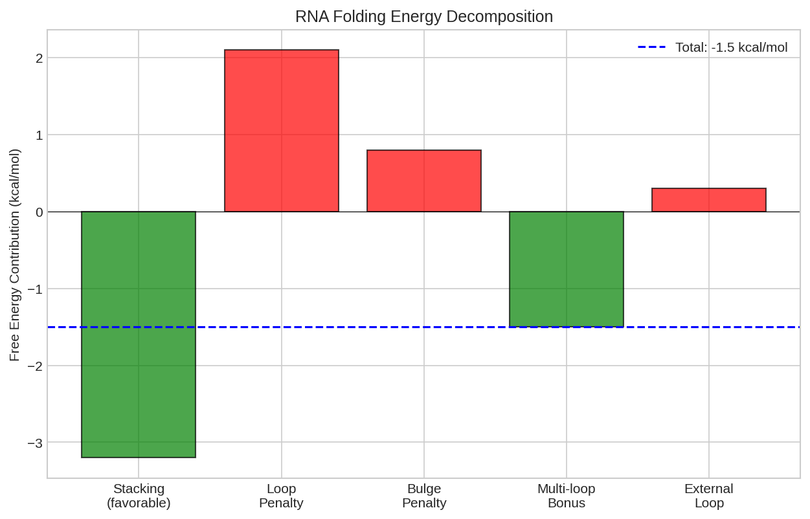

# RNA Secondary Structure Prediction

This example demonstrates how to predict RNA secondary structure using DiffBio's differentiable RNA folding operator.

## Overview

RNA secondary structure (base pairing patterns) is critical for:

- Understanding RNA function
- Designing antisense oligonucleotides
- Predicting miRNA targets
- Analyzing ribozymes and riboswitches

DiffBio implements the McCaskill partition function algorithm in a differentiable manner, enabling gradient-based optimization of RNA structure predictions.

## Prerequisites

```python
import jax
import jax.numpy as jnp
from flax import nnx

from diffbio.operators.rna_structure import (
    DifferentiableRNAFold,
    RNAFoldConfig,
)
```

## Step 1: Encode RNA Sequence

RNA sequences use one-hot encoding similar to DNA:

```python
# RNA sequence (should form a stem-loop)
rna_str = "GCGCAAUAGC"

# Encode: A=0, C=1, G=2, U=3
nuc_map = {"A": 0, "C": 1, "G": 2, "U": 3}
rna_indices = jnp.array([nuc_map[n] for n in rna_str])
rna_seq = jax.nn.one_hot(rna_indices, 4)

print(f"RNA sequence: {rna_str}")
print(f"Sequence length: {len(rna_str)}")
print(f"Encoded shape: {rna_seq.shape}")
```

**Output:**

```
RNA sequence: GCGCAAUAGC
Sequence length: 10
Encoded shape: (10, 4)
```

## Step 2: Create RNA Fold Predictor

```python
# Configure the folding predictor
config = RNAFoldConfig(
    temperature=1.0,        # Boltzmann temperature (1.0 = 37°C)
    min_hairpin_loop=3,     # Minimum hairpin loop size
)
rngs = nnx.Rngs(42)
predictor = DifferentiableRNAFold(config, rngs=rngs)
```

## Step 3: Predict Structure

```python
# Predict secondary structure
data = {"sequence": rna_seq}
result, _, _ = predictor.apply(data, {}, None)

bp_probs = result["bp_probs"]
log_z = result["partition_function"]

print(f"Base pair probability matrix shape: {bp_probs.shape}")
print(f"Log partition function: {float(log_z):.4f}")
```

**Output:**

```
Base pair probability matrix shape: (10, 10)
Log partition function: 5.3061
```



*Base pair probability matrix showing the probability of each position pairing with another. Higher values (brighter colors) indicate more probable pairs.*

## Step 4: Analyze Base Pair Probabilities

Find high-probability base pairs:

```python
# Find high-probability base pairs
threshold = 0.01  # 1% probability threshold

print(f"\nHigh probability pairs (p > {threshold}):")
for i in range(len(rna_str)):
    for j in range(i + 1, len(rna_str)):
        prob = float(bp_probs[i, j])
        if prob > threshold:
            print(f"  {rna_str[i]}{i+1}-{rna_str[j]}{j+1}: {prob:.4f}")
```

**Output:**

```
High probability pairs (p > 0.01):
  G1-U7: 0.0135
  G1-C10: 0.0997
  C2-G9: 0.0997
  G3-U7: 0.0135
  G3-C10: 0.0997
```

## Understanding the Output

### Base Pair Probability Matrix

The `bp_probs` matrix contains the probability $P(i,j)$ that positions $i$ and $j$ form a base pair:

$$P(i,j) = \frac{Z_{ij}}{Z}$$

where $Z$ is the partition function and $Z_{ij}$ is the partition function over structures containing the (i,j) base pair.

### Partition Function

The log partition function `log_z` measures the total statistical weight of all possible structures:

$$Z = \sum_S e^{-E(S)/RT}$$

A larger partition function indicates more possible structures (more structural flexibility).

## Visualizing Structure

Convert probabilities to dot-bracket notation:

```python
def probabilities_to_structure(bp_probs, threshold=0.5):
    """Convert base pair probabilities to dot-bracket notation."""
    n = bp_probs.shape[0]
    structure = ['.'] * n

    # Find pairs above threshold
    for i in range(n):
        for j in range(i + 1, n):
            if bp_probs[i, j] > threshold:
                structure[i] = '('
                structure[j] = ')'

    return ''.join(structure)

# Get predicted structure
predicted_structure = probabilities_to_structure(bp_probs, threshold=0.05)
print(f"Sequence:  {rna_str}")
print(f"Structure: {predicted_structure}")
```



*Arc diagram visualization of RNA secondary structure. Arcs connect base pairs with arc height proportional to pairing probability.*



*Dot-bracket notation with paired bases shown as parentheses and unpaired bases as dots.*

## Differentiability

The RNA folding operator is fully differentiable:

```python
def structure_loss(predictor, data):
    """Loss function based on structure."""
    result, _, _ = predictor.apply(data, {}, None)
    # Maximize partition function (minimize folding energy)
    return -result["partition_function"]

# Compute gradients
grads = nnx.grad(structure_loss)(predictor, data)
print("Gradient computation: SUCCESS")
```

This enables:

- **Sequence design**: Optimize sequences for desired structures
- **Thermodynamic parameter learning**: Learn folding parameters from data
- **End-to-end RNA analysis**: Integrate folding into larger pipelines



*Partition function contributions showing how different structural features contribute to the total statistical weight.*

## Valid Base Pairs

The algorithm considers standard Watson-Crick and wobble pairs:

| Pair | Type |
|------|------|
| A-U | Watson-Crick |
| G-C | Watson-Crick |
| G-U | Wobble |

## Configuration Options

| Parameter | Description | Default |
|-----------|-------------|---------|
| `temperature` | Boltzmann temperature (1.0 = 37°C) | 1.0 |
| `min_hairpin_loop` | Minimum unpaired bases in hairpin | 3 |

## Next Steps

- [Protein Secondary Structure](protein-structure.md) - Predict protein structure
- [HMM Sequence Model](hmm-sequence-model.md) - Sequence models with hidden states
- [DNA Encoding](dna-encoding.md) - Encode sequences for other operators
