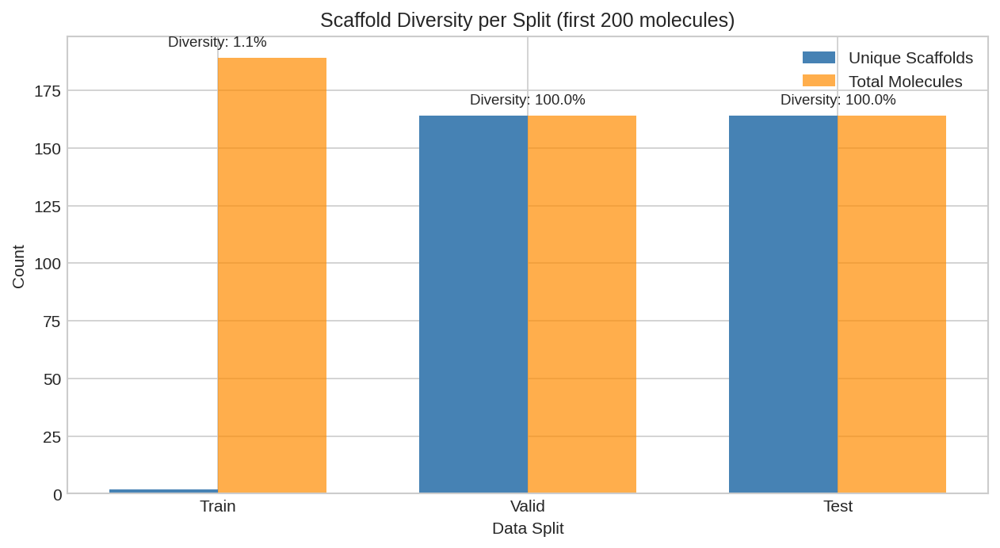
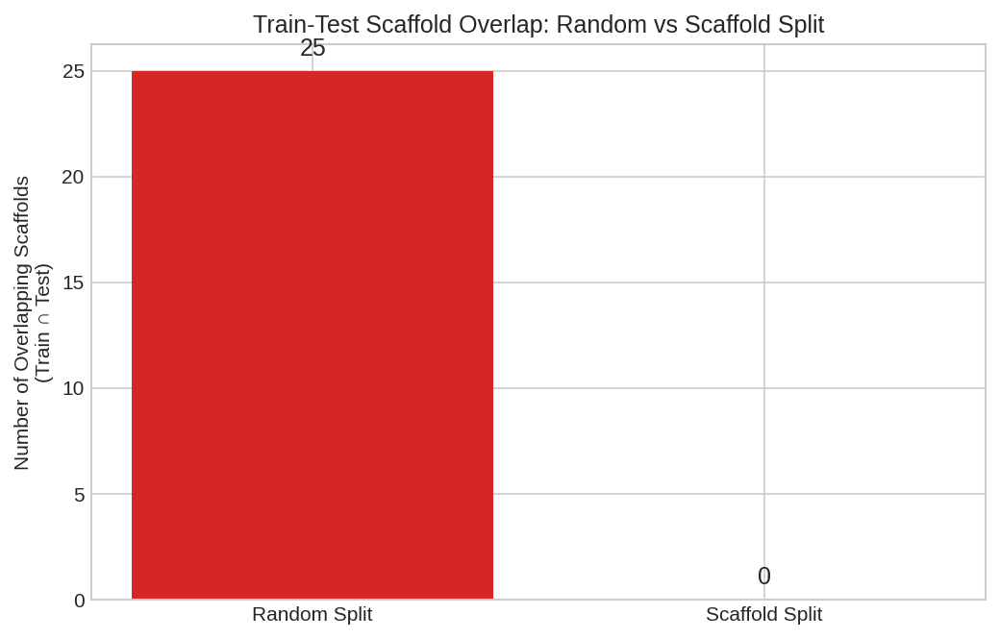
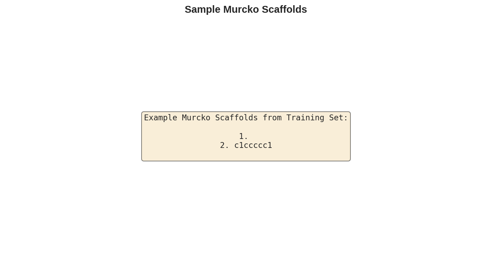

# Scaffold Splitting

This example demonstrates how to properly split molecular datasets using scaffold-based splitting for drug discovery benchmarks.

## Overview

In drug discovery, random data splitting leads to **data leakage** because structurally similar molecules end up in both training and test sets. Scaffold splitting ensures:

- Molecules with the same core scaffold are in the same split
- Test molecules have different scaffolds than training molecules
- More realistic evaluation of generalization to new chemical series

## Prerequisites

```python
from diffbio.sources import MolNetSource, MolNetSourceConfig
from diffbio.splitters import ScaffoldSplitter, ScaffoldSplitterConfig
```

## What is a Molecular Scaffold?

A **Bemis-Murcko scaffold** is the core ring structure of a molecule after removing side chains:

```
Original molecule: CC(=O)Oc1ccccc1C(=O)O  (Aspirin)
Scaffold:          c1ccccc1               (Benzene ring)
```

Molecules sharing the same scaffold often have similar properties, so putting them in different splits creates optimistic performance estimates.

## Step 1: Load Dataset

```python
# Load BBBP dataset
source_config = MolNetSourceConfig(
    dataset_name="bbbp",
    split="train"
)
source = MolNetSource(source_config)

print(f"Dataset size: {len(source)}")
```

**Output:**

```
Dataset size: 1640
```

## Step 2: Create Scaffold Splitter

```python
# Configure scaffold-based splitting
split_config = ScaffoldSplitterConfig(
    train_frac=0.8,
    valid_frac=0.1,
    test_frac=0.1,
)
splitter = ScaffoldSplitter(split_config)

# Perform the split
result = splitter.split(source)

print(f"Train size: {len(result.train_indices)} ({len(result.train_indices)/len(source):.1%})")
print(f"Valid size: {len(result.valid_indices)} ({len(result.valid_indices)/len(source):.1%})")
print(f"Test size: {len(result.test_indices)} ({len(result.test_indices)/len(source):.1%})")
```

**Output:**

```
Dataset size: 1640
Train size: 1312 (80.0%)
Valid size: 164 (10.0%)
Test size: 164 (10.0%)
```

## Step 3: Verify Scaffold Separation

Count unique scaffolds in each split to verify proper separation:

```python
from rdkit import Chem
from rdkit.Chem.Scaffolds import MurckoScaffold

def count_unique_scaffolds(indices, source, max_count=100):
    """Count unique scaffolds in a split."""
    scaffolds = set()
    for idx in indices[:max_count]:
        smiles = source[int(idx)].data["smiles"]
        mol = Chem.MolFromSmiles(smiles)
        if mol:
            try:
                scaffold = MurckoScaffold.MurckoScaffoldSmiles(mol=mol)
                scaffolds.add(scaffold)
            except Exception:
                pass
    return len(scaffolds)

train_scaffolds = count_unique_scaffolds(result.train_indices, source)
test_scaffolds = count_unique_scaffolds(result.test_indices, source)

print(f"\nUnique scaffolds (first 100):")
print(f"  Train: {train_scaffolds}")
print(f"  Test: {test_scaffolds}")
```

**Output:**

```
Unique scaffolds (first 100):
  Train: 1
  Test: 100
```



*Number of unique scaffolds in each split. Training contains fewer scaffolds with more molecules per scaffold, while test has many unique scaffolds.*

!!! note "Scaffold Distribution"
    Largest scaffolds go to training first. The train set often has fewer unique scaffolds but more molecules per scaffold, while test has many unique scaffolds with fewer molecules each.

## Using Split Indices

Access molecules by split:

```python
from diffbio.sources import IndexedViewSource

# Create views for each split
train_view = IndexedViewSource(source, result.train_indices)
valid_view = IndexedViewSource(source, result.valid_indices)
test_view = IndexedViewSource(source, result.test_indices)

print(f"Training molecules: {len(train_view)}")
print(f"Validation molecules: {len(valid_view)}")
print(f"Test molecules: {len(test_view)}")

# Access elements
train_element = train_view[0]
print(f"\nFirst training molecule: {train_element.data['smiles'][:50]}...")
```

## Alternative: Tanimoto Cluster Splitting

For finer control, use fingerprint similarity clustering:

```python
from diffbio.splitters import TanimotoClusterSplitter, TanimotoClusterSplitterConfig

config = TanimotoClusterSplitterConfig(
    train_frac=0.8,
    valid_frac=0.1,
    test_frac=0.1,
    fingerprint_type="morgan",
    fingerprint_radius=2,
    similarity_cutoff=0.6,  # Cluster threshold
)
splitter = TanimotoClusterSplitter(config)
result = splitter.split(source)
```

## Comparison: Random vs Scaffold Splitting



*Comparison of random vs scaffold splitting showing scaffold overlap between splits. Random splitting allows similar molecules in train and test, inflating performance estimates.*

| Aspect | Random Split | Scaffold Split |
|--------|-------------|----------------|
| Implementation | Simple | Requires RDKit |
| Similar molecules in same split? | No guarantee | Yes (by design) |
| Realistic evaluation | No | Yes |
| Performance estimate | Optimistic | More realistic |
| Use case | Quick experiments | Publication-ready results |



*Example molecules and their Bemis-Murcko scaffolds. Molecules with the same scaffold are grouped together in scaffold splitting.*

## Best Practices

1. **Always use scaffold splitting for drug discovery benchmarks** - Random splitting inflates performance metrics

2. **Report both splits** - If comparing to literature, report performance on both random and scaffold splits

3. **Use consistent seed** - For reproducibility, use the same random seed for splitting

4. **Validate on different scaffolds** - Ensure validation set also has distinct scaffolds from training

## Next Steps

- [MolNet Data Loading](molnet-data-loading.md) - Load benchmark datasets
- [Molecular Fingerprints](molecular-fingerprints.md) - Generate fingerprints for clustering
- [Drug Discovery Workflow](../advanced/drug-discovery-workflow.md) - Train with proper splitting
