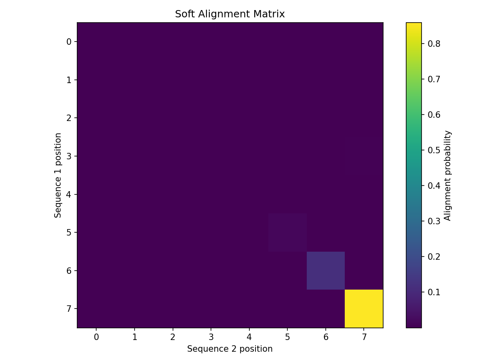
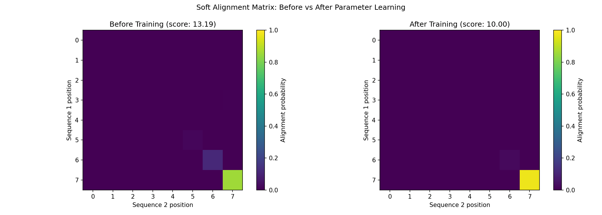

# Simple Alignment Example

This example demonstrates basic differentiable sequence alignment using DiffBio's Smith-Waterman operator.

## Setup

```python
import jax
import jax.numpy as jnp
from diffbio.operators.alignment import (
    SmoothSmithWaterman,
    SmithWatermanConfig,
    create_dna_scoring_matrix,
)
```

## Create the Aligner

```python
# Create a DNA scoring matrix
# match=2.0 for identical nucleotides, mismatch=-1.0 for different ones
scoring_matrix = create_dna_scoring_matrix(match=2.0, mismatch=-1.0)

# Configure the Smith-Waterman aligner
config = SmithWatermanConfig(
    temperature=1.0,      # Smoothness parameter (1.0 is balanced)
    gap_open=-10.0,       # Penalty for starting a gap
    gap_extend=-1.0,      # Penalty per additional gap position
)

# Create the aligner
aligner = SmoothSmithWaterman(config, scoring_matrix=scoring_matrix)
```

## Encode Sequences

DiffBio uses one-hot encoding for sequences. The DNA alphabet is A=0, C=1, G=2, T=3.

```python
def one_hot_dna(sequence_string):
    """Convert DNA sequence string to one-hot encoding."""
    mapping = {'A': 0, 'C': 1, 'G': 2, 'T': 3}
    indices = jnp.array([mapping[c] for c in sequence_string])
    return jnp.eye(4)[indices]

# Example sequences
seq1 = one_hot_dna("ACGTACGT")  # 8 nucleotides
seq2 = one_hot_dna("ACATACGT")  # Different at position 3 (G->A)

print(f"Sequence 1 shape: {seq1.shape}")  # (8, 4)
print(f"Sequence 2 shape: {seq2.shape}")  # (8, 4)
```

**Output:**

```console
Sequence 1 shape: (8, 4)
Sequence 2 shape: (8, 4)
```

## Perform Alignment

```python
# Run the alignment
result = aligner.align(seq1, seq2)

print(f"Alignment score: {result.score:.4f}")
print(f"Alignment matrix shape: {result.alignment_matrix.shape}")  # (9, 9)
print(f"Soft alignment shape: {result.soft_alignment.shape}")      # (8, 8)
```

**Output:**

```console
Alignment score: 13.1916
Alignment matrix shape: (9, 9)
Soft alignment shape: (8, 8)
```

## Interpret Results

### Alignment Score

The alignment score indicates overall similarity:

```python
# Higher score = better alignment
print(f"Score: {result.score:.4f}")
```

**Output:**

```console
Score: 13.1916
```

### Soft Alignment Matrix

The soft alignment shows position correspondences as probabilities:

```python
# Find most likely corresponding positions
best_matches = jnp.argmax(result.soft_alignment, axis=1)
print(f"Position correspondences: {best_matches}")
# Position i in seq1 corresponds to position best_matches[i] in seq2
```

**Output:**

```console
Position correspondences: [2 5 6 7 4 5 6 7]
```

### Visualization (Optional)

```python
import matplotlib.pyplot as plt

plt.figure(figsize=(8, 6))
plt.imshow(result.soft_alignment, cmap='viridis')
plt.colorbar(label='Alignment probability')
plt.xlabel('Sequence 2 position')
plt.ylabel('Sequence 1 position')
plt.title('Soft Alignment Matrix')
plt.show()
```



## Compute Gradients

The key feature of DiffBio is differentiability:

```python
# Define a loss function based on alignment score
def alignment_loss(scoring_matrix, seq1, seq2):
    config = SmithWatermanConfig(temperature=1.0)
    aligner = SmoothSmithWaterman(config, scoring_matrix=scoring_matrix)
    result = aligner.align(seq1, seq2)
    return -result.score  # Negative because we want to maximize

# Compute gradient w.r.t. scoring matrix
grad_fn = jax.grad(alignment_loss)
grads = grad_fn(scoring_matrix, seq1, seq2)

print("Scoring matrix gradients:")
print(grads)
```

**Output:**

```console
Scoring matrix gradients:
[[-1.8247273e+00 -1.9172340e-07 -2.9888235e-15 -7.5641262e-09]
 [-5.5532780e-07 -1.9372165e+00 -1.4243892e-10 -5.4443811e-12]
 [-9.5245820e-01 -3.6374666e-07 -9.9998236e-01 -5.4135889e-08]
 [-6.1676126e-08 -1.7161713e-12 -2.0101693e-11 -1.9935606e+00]]
```

The gradients tell us how to adjust the scoring matrix to improve alignment.

## Using the Datarax Interface

For batch processing, use the `apply()` method:

```python
# Prepare data as dictionary
data = {
    "seq1": seq1,
    "seq2": seq2,
}

# Apply operator
result_data, state, metadata = aligner.apply(data, {}, None)

# Access results
print(f"Score: {result_data['score']:.4f}")
print(f"Keys: {result_data.keys()}")
```

**Output:**

```console
Score: 13.1916
Keys: ['seq1', 'seq2', 'score', 'alignment_matrix', 'soft_alignment']
```

## Batch Processing with vmap

Process multiple sequence pairs in parallel:

```python
# Create batch of sequence pairs
batch_seq1 = jnp.stack([
    one_hot_dna("ACGTACGT"),
    one_hot_dna("TTTTAAAA"),
    one_hot_dna("GCGCGCGC"),
])

batch_seq2 = jnp.stack([
    one_hot_dna("ACATACGT"),
    one_hot_dna("TTTTAAAG"),
    one_hot_dna("GCGCATGC"),
])

# Vectorize alignment
def align_pair(s1, s2):
    return aligner.align(s1, s2)

batch_align = jax.vmap(align_pair)
batch_results = batch_align(batch_seq1, batch_seq2)

print(f"Batch scores: {batch_results.score}")
```

**Output:**

```console
Batch scores: [13.191646 14.145432 10.148667]
```

## Temperature Effects

The temperature parameter controls the smoothness of the alignment:

```python
temperatures = [0.1, 1.0, 5.0, 10.0]

for temp in temperatures:
    config = SmithWatermanConfig(temperature=temp)
    aligner = SmoothSmithWaterman(config, scoring_matrix=scoring_matrix)
    result = aligner.align(seq1, seq2)
    print(f"Temperature {temp}: score = {result.score:.4f}")
```

**Output:**

```console
Temperature 0.1: score = 13.0000
Temperature 1.0: score = 13.1916
Temperature 5.0: score = 22.2542
Temperature 10.0: score = 58.6904
```

- **Low temperature** (0.1): Near-discrete, sharp alignment
- **High temperature** (10.0): Very smooth, gradients flow more easily

## Learning Optimal Parameters

Train the scoring matrix for a specific task:

```python
import optax
from flax import nnx

# Initial scoring matrix
initial_scoring = create_dna_scoring_matrix(match=2.0, mismatch=-1.0)

# Create aligner with learnable scoring
config = SmithWatermanConfig(temperature=1.0)
aligner = SmoothSmithWaterman(config, scoring_matrix=initial_scoring)

# Define target (we want seq1 and seq2 to align with score > 10)
target_score = 10.0

def loss(aligner, seq1, seq2, target):
    result = aligner.align(seq1, seq2)
    return (result.score - target) ** 2

# Optimizer
params = nnx.state(aligner, nnx.Param)
optimizer = optax.adam(learning_rate=0.1)
opt_state = optimizer.init(params)

# Training loop
for step in range(100):
    loss_val, grads = jax.value_and_grad(loss)(aligner, seq1, seq2, target_score)

    params = nnx.state(aligner, nnx.Param)
    updates, opt_state = optimizer.update(grads, opt_state, params)
    nnx.update(aligner, optax.apply_updates(params, updates))

    if step % 20 == 0:
        print(f"Step {step}: loss = {loss_val:.4f}")

# Final score
final_result = aligner.align(seq1, seq2)
print(f"Final score: {final_result.score:.4f} (target: {target_score})")
```

**Output:**

```console
Step 0: loss = 10.1866
Step 20: loss = 0.6327
Step 40: loss = 0.0532
Step 60: loss = 0.0085
Step 80: loss = 0.0015
Final score: 10.0036 (target: 10.0)
```

### Visualize Learned Alignment

Compare the soft alignment before and after training:

```python
# Get alignment after training
final_result = aligner.align(seq1, seq2)

# Visualization comparing before and after
fig, axes = plt.subplots(1, 2, figsize=(14, 5))

# Before training (using initial aligner)
initial_aligner = SmoothSmithWaterman(config, scoring_matrix=initial_scoring)
initial_result = initial_aligner.align(seq1, seq2)

im1 = axes[0].imshow(initial_result.soft_alignment, cmap='viridis', vmin=0, vmax=1)
axes[0].set_xlabel('Sequence 2 position')
axes[0].set_ylabel('Sequence 1 position')
axes[0].set_title(f'Before Training (score: {initial_result.score:.2f})')
plt.colorbar(im1, ax=axes[0], label='Alignment probability')

# After training
im2 = axes[1].imshow(final_result.soft_alignment, cmap='viridis', vmin=0, vmax=1)
axes[1].set_xlabel('Sequence 2 position')
axes[1].set_ylabel('Sequence 1 position')
axes[1].set_title(f'After Training (score: {final_result.score:.2f})')
plt.colorbar(im2, ax=axes[1], label='Alignment probability')

plt.suptitle('Soft Alignment Matrix: Before vs After Parameter Learning')
plt.tight_layout()
plt.show()
```



## Summary

This example demonstrated:

1. Creating a differentiable Smith-Waterman aligner
2. One-hot encoding DNA sequences
3. Performing smooth alignments
4. Computing gradients for optimization
5. Using vmap for batch processing
6. Learning optimal alignment parameters

## Next Steps

- Try [Pileup Generation](pileup-generation.md) for variant calling
- See [Variant Calling Pipeline](../advanced/variant-calling.md) for a complete workflow
