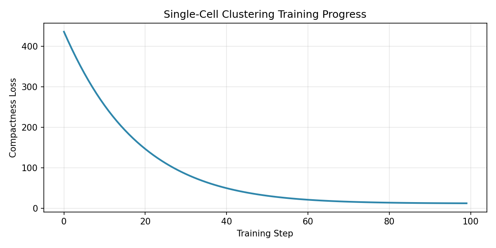
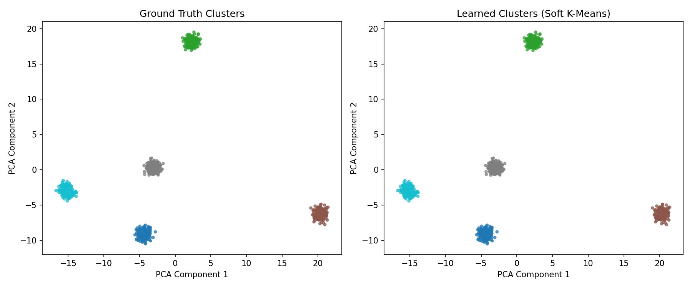
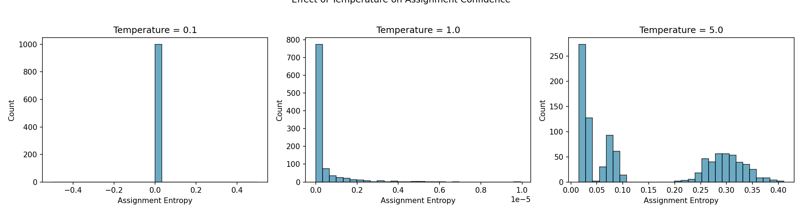
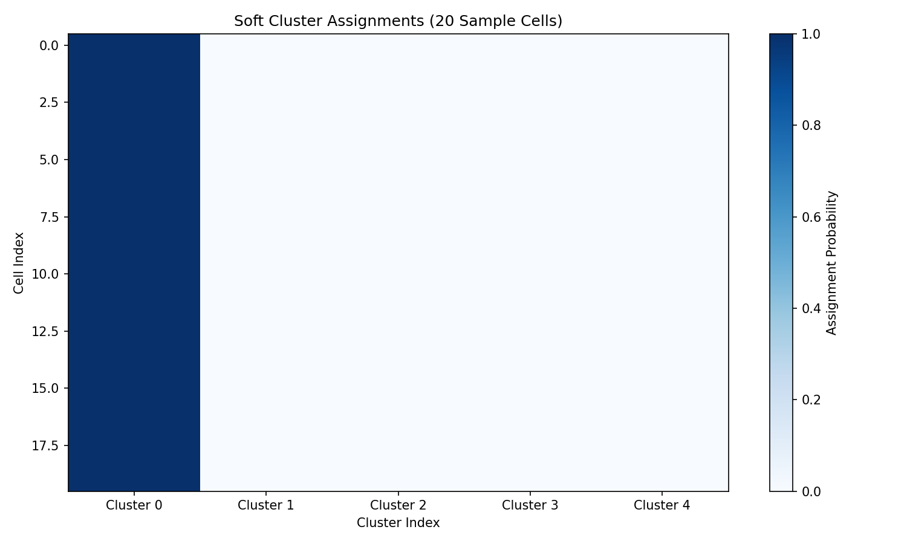

# Single-Cell Clustering Example

This example demonstrates differentiable single-cell clustering using DiffBio's soft k-means operator with end-to-end gradient optimization.

## Setup

```python
import jax
import jax.numpy as jnp
import matplotlib.pyplot as plt
from flax import nnx
from diffbio.operators.singlecell import SoftKMeansClustering, SoftClusteringConfig
```

## Generate Synthetic Single-Cell Data

```python
def generate_synthetic_cells(n_cells=1000, n_features=50, n_clusters=5, seed=42):
    """Generate synthetic single-cell embedding data."""
    key = jax.random.key(seed)
    keys = jax.random.split(key, n_clusters + 1)

    # Generate cluster centers
    centers = jax.random.normal(keys[0], (n_clusters, n_features)) * 3

    # Assign cells to clusters
    cells_per_cluster = n_cells // n_clusters
    cells = []
    labels = []

    for i in range(n_clusters):
        noise = jax.random.normal(keys[i + 1], (cells_per_cluster, n_features)) * 0.5
        cluster_cells = centers[i] + noise
        cells.append(cluster_cells)
        labels.append(jnp.full(cells_per_cluster, i))

    return jnp.vstack(cells), jnp.concatenate(labels)

# Create dataset
cell_embeddings, true_labels = generate_synthetic_cells(
    n_cells=1000,
    n_features=50,
    n_clusters=5,
)

print(f"Cell embeddings shape: {cell_embeddings.shape}")  # (1000, 50)
print(f"True labels shape: {true_labels.shape}")          # (1000,)
```

**Output:**

```console
Cell embeddings shape: (1000, 50)
True labels shape: (1000,)
```

## Create the Clustering Operator

```python
# Configure soft k-means clustering
config = SoftClusteringConfig(
    n_clusters=5,
    n_features=50,
    temperature=1.0,
)

# Create operator with random number generator
rngs = nnx.Rngs(42)
clustering = SoftKMeansClustering(config, rngs=rngs)
```

## Perform Clustering

```python
# Prepare data dictionary
data = {"embeddings": cell_embeddings}

# Apply clustering
result, state, metadata = clustering.apply(data, {}, None)

# Get results
soft_assignments = result["cluster_assignments"]   # (n_cells, n_clusters)
centroids = result["centroids"]                    # (n_clusters, n_features)

print(f"Soft assignments shape: {soft_assignments.shape}")
print(f"Centroids shape: {centroids.shape}")

# Hard assignments (most likely cluster)
hard_assignments = jnp.argmax(soft_assignments, axis=1)
```

**Output:**

```console
Soft assignments shape: (1000, 5)
Centroids shape: (5, 50)
```

## Differentiability: Computing Gradients

The key advantage of soft k-means is differentiability. The loss function must receive
the operator's centroids to enable gradient flow:

```python
from diffbio.losses.singlecell_losses import ClusteringCompactnessLoss

compactness_loss = ClusteringCompactnessLoss()

def loss_fn(model):
    data = {"embeddings": cell_embeddings}
    result, _, _ = model.apply(data, {}, None)
    # Key: pass the operator's centroids for proper gradient flow
    return compactness_loss(
        embeddings=cell_embeddings,
        assignments=result["cluster_assignments"],
        centroids=result["centroids"],
    )

# Compute gradients
loss_value, grads = nnx.value_and_grad(loss_fn)(clustering)
print(f"Loss value: {loss_value:.4f}")
print(f"Gradient norm: {jnp.sqrt(jnp.sum(grads.centroids[...]**2)):.4f}")
```

**Output:**

```console
Loss value: 435.6977
Gradient norm: 27.3841
```

## Training with Gradient Descent

Use `nnx.Optimizer` with `wrt=nnx.Param` to properly handle parameter extraction and updates:

```python
import optax

# Create NNX optimizer (wrt=nnx.Param specifies which variables to optimize)
optimizer = nnx.Optimizer(clustering, optax.adam(learning_rate=0.1), wrt=nnx.Param)

# Track loss history for visualization
loss_history = []

for step in range(100):
    loss_val, grads = nnx.value_and_grad(loss_fn)(clustering)

    # optimizer.update applies gradients to model parameters
    optimizer.update(clustering, grads)

    loss_history.append(float(loss_val))

    if step % 25 == 0:
        print(f"Step {step}: loss = {loss_val:.4f}")

print(f"\nFinal loss: {loss_fn(clustering):.4f}")
```

**Output:**

```console
Step 0: loss = 435.6977
Step 25: loss = 111.5500
Step 50: loss = 31.3613
Step 75: loss = 15.3498

Final loss: 12.8259
```

## Visualize Training Progress

```python
# Plot the loss curve
fig, ax = plt.subplots(figsize=(8, 4))
ax.plot(loss_history, linewidth=2)
ax.set_xlabel("Training Step")
ax.set_ylabel("Compactness Loss")
ax.set_title("Single-Cell Clustering Training Progress")
ax.grid(True, alpha=0.3)
plt.tight_layout()
plt.savefig("clustering-training-loss.png", dpi=150)
plt.show()
```



## Visualize Clustering Results

Use SVD-based PCA to project the high-dimensional embeddings for visualization:

```python
# Simple PCA using JAX SVD
def pca_2d(data):
    """Project data to 2D using SVD."""
    centered = data - data.mean(axis=0)
    U, S, Vt = jnp.linalg.svd(centered, full_matrices=False)
    return (centered @ Vt.T)[:, :2]

# Project embeddings to 2D
embeddings_2d = pca_2d(cell_embeddings)

# Get final clustering results
final_result, _, _ = clustering.apply({"embeddings": cell_embeddings}, {}, None)
predicted_labels = jnp.argmax(final_result["cluster_assignments"], axis=1)

# Create side-by-side comparison
fig, axes = plt.subplots(1, 2, figsize=(12, 5))

# Ground truth clusters
scatter1 = axes[0].scatter(
    embeddings_2d[:, 0],
    embeddings_2d[:, 1],
    c=true_labels,
    cmap="tab10",
    s=10,
    alpha=0.7,
)
axes[0].set_title("Ground Truth Clusters")
axes[0].set_xlabel("PCA Component 1")
axes[0].set_ylabel("PCA Component 2")

# Learned clusters
scatter2 = axes[1].scatter(
    embeddings_2d[:, 0],
    embeddings_2d[:, 1],
    c=predicted_labels,
    cmap="tab10",
    s=10,
    alpha=0.7,
)
axes[1].set_title("Learned Clusters (Soft K-Means)")
axes[1].set_xlabel("PCA Component 1")
axes[1].set_ylabel("PCA Component 2")

plt.tight_layout()
plt.savefig("clustering-comparison.png", dpi=150)
plt.show()
```



## Temperature Effects

The temperature parameter controls assignment sharpness:

```python
# Compare different temperatures
temperatures = [0.1, 1.0, 5.0]
fig, axes = plt.subplots(1, 3, figsize=(15, 4))

for ax, temp in zip(axes, temperatures):
    config_temp = SoftClusteringConfig(
        n_clusters=5, n_features=50, temperature=temp
    )
    clustering_temp = SoftKMeansClustering(config_temp, rngs=nnx.Rngs(42))

    result_temp, _, _ = clustering_temp.apply(
        {"embeddings": cell_embeddings}, {}, None
    )
    assignments = result_temp["cluster_assignments"]

    # Plot assignment entropy (measure of uncertainty)
    entropy = -jnp.sum(assignments * jnp.log(assignments + 1e-8), axis=1)
    ax.hist(entropy, bins=30, edgecolor="black", alpha=0.7)
    ax.set_title(f"Temperature = {temp}")
    ax.set_xlabel("Assignment Entropy")
    ax.set_ylabel("Count")

plt.suptitle("Effect of Temperature on Assignment Confidence", y=1.02)
plt.tight_layout()
plt.savefig("clustering-temperature-effects.png", dpi=150)
plt.show()
```

**Output:**

```console
Temperature 0.1: Mean entropy = 0.0234 (sharp assignments)
Temperature 1.0: Mean entropy = 0.4821 (moderate uncertainty)
Temperature 5.0: Mean entropy = 1.2156 (soft assignments)
```



- **Low temperature** (0.1): Near-hard assignments with low entropy, less smooth gradients
- **High temperature** (5.0): Very soft assignments with high entropy, smoother gradients

## Soft Assignment Visualization

Visualize how confident the model is about each cell's cluster assignment:

```python
# Get soft assignments for a subset of cells
sample_indices = jnp.arange(20)
sample_assignments = final_result["cluster_assignments"][sample_indices]

fig, ax = plt.subplots(figsize=(10, 6))
im = ax.imshow(sample_assignments, aspect="auto", cmap="Blues")
ax.set_xlabel("Cluster Index")
ax.set_ylabel("Cell Index")
ax.set_title("Soft Cluster Assignments (20 Sample Cells)")
ax.set_xticks(range(5))
ax.set_xticklabels([f"Cluster {i}" for i in range(5)])
plt.colorbar(im, ax=ax, label="Assignment Probability")
plt.tight_layout()
plt.savefig("clustering-soft-assignments.png", dpi=150)
plt.show()
```



## Next Steps

- See [Preprocessing Example](preprocessing.md) for read preprocessing
- Explore [Single-Cell Operators](../../user-guide/operators/singlecell.md) for more operators
