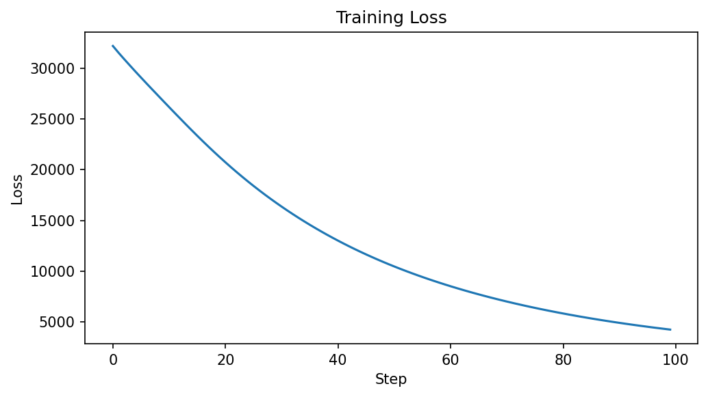
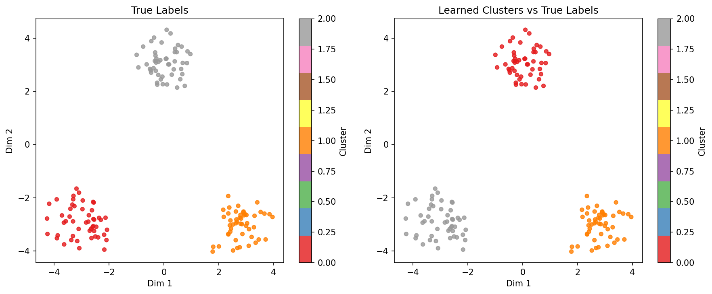

# Soft K-Means Clustering with Training

**Duration:** 10 min | **Level:** Basic | **Device:** CPU-compatible

## Overview

Trains `SoftKMeansClustering` with optax on synthetic 3-cluster data projected from 2D into 20D. Evaluates clustering accuracy against ground truth using best-permutation matching and explores the effect of temperature on assignment sharpness.

## Quick Start

```bash
source ./activate.sh
uv run python examples/singlecell/clustering.py
```

## Key Code

```python
config = SoftClusteringConfig(n_clusters=3, n_features=n_features, temperature=1.0)
operator = SoftKMeansClustering(config, rngs=nnx.Rngs(42))

graphdef, params, other = nnx.split(operator, nnx.Param, ...)
optimizer = optax.adam(learning_rate=0.05)
opt_state = optimizer.init(params)

for step in range(100):
    params, opt_state, loss = train_step(params, other, opt_state, data)
```

## Results



The loss decreases monotonically from 32236 to 4208 over 100 steps, indicating successful centroid convergence.



The scatter plot shows perfect recovery of the 3 ground-truth clusters after training, with each learned cluster mapping 1:1 to a true cluster.

```
Data shape: (150, 20) (150 cells, 20 features)
True labels: 3 clusters, 50 cells each
Initial assignment distribution: [50, 100, 0]
Step   0: loss = 32236.2695
Step  20: loss = 20734.6699
Step  40: loss = 12995.3467
Step  60: loss = 8489.3184
Step  80: loss = 5796.8643
Step  99: loss = 4208.3389
Clustering accuracy (best permutation): 100.00%
Learned label distribution: [50, 50, 50]
Mean assignment entropy: -0.0000 (lower = more confident)
Gradient shape: (150, 20)
Gradient is non-zero: True
Gradient is finite: True
Assignments match (eager vs JIT): True
Temperature -> Mean max assignment probability:
  T=0.1: 0.9987
  T=0.5: 0.9380
  T=1.0: 0.8197
  T=5.0: 0.4643
```

## Next Steps

- [Operator Pattern](operator-pattern.md) -- the universal DiffBio operator pattern
- [Imputation](../intermediate/imputation.md) -- recover gene expression lost to dropout
- [API Reference: Single-Cell Operators](../../api/operators/singlecell.md)
