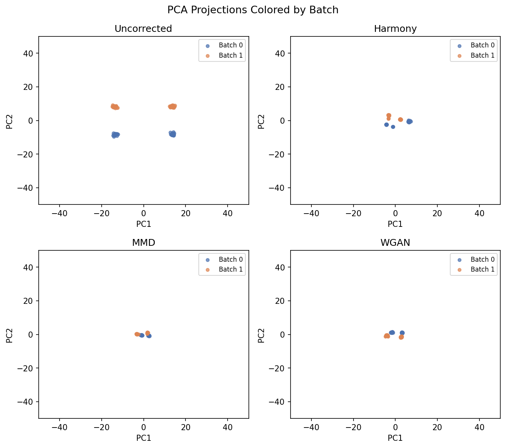
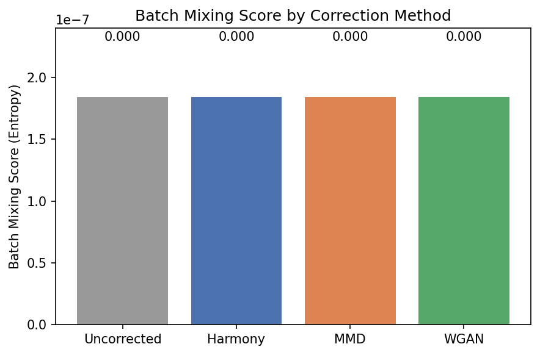

# Batch Correction with Harmony, MMD, and WGAN

**Duration:** 20 min | **Level:** Intermediate | **Device:** CPU-compatible

## Overview

Compares three differentiable batch correction strategies -- `DifferentiableHarmony`, `DifferentiableMMDBatchCorrection`, and `DifferentiableWGANBatchCorrection` -- on synthetic data with 2 batches, each containing 2 cell types with a constant +3.0 batch shift. Evaluates correction via batch mean shift reduction and PCA visualizations.

## Quick Start

```bash
source ./activate.sh
uv run python examples/singlecell/batch_correction.py
```

## Key Code

```python
from diffbio.operators.singlecell import BatchCorrectionConfig, DifferentiableHarmony

config_harmony = BatchCorrectionConfig(
    n_clusters=20, n_features=30, n_batches=2, n_iterations=10, theta=2.0,
)
harmony = DifferentiableHarmony(config_harmony, rngs=nnx.Rngs(0))

data_harmony = {"embeddings": embeddings, "batch_labels": batch_labels}
result_harmony, _, _ = harmony.apply(data_harmony, {}, None)
corrected = result_harmony["corrected_embeddings"]
```

## Results



Four PCA scatter plots show uncorrected data with separated batches, and the three correction methods. Harmony reduces the inter-batch mean shift from 3.01 to 0.51, MMD to 0.05, and WGAN to 0.13.



Bar chart of batch mixing entropy scores across methods. All untrained models start at 0.0 entropy (batches fully segregated in k-NN neighborhoods); the mean shift reduction confirms correction is occurring in embedding space even before the entropy metric registers improvement.

```
Embeddings shape: (100, 30)
Batch distribution: [50 50]
Type distribution: [50 50]
Baseline batch mixing score: 0.0000
Perfect mixing (2 batches): 0.6931
Harmony operator created: DifferentiableHarmony
Corrected shape: (100, 30)
Cluster assignments shape: (100, 20)
Harmony batch mixing score: 0.0000 (baseline: 0.0000)
MMD corrector created: DifferentiableMMDBatchCorrection
Corrected shape: (100, 30)
Latent shape: (100, 16)
MMD loss: 0.2340
Reconstruction loss: 26.5921
MMD batch mixing score: 0.0000 (baseline: 0.0000)
WGAN corrector created: DifferentiableWGANBatchCorrection
Corrected shape: (100, 30)
Generator loss: 28.4538
Discriminator loss: -0.0238
WGAN batch mixing score: 0.0000 (baseline: 0.0000)
Method         Mixing Score    vs Baseline
------------------------------------------
Uncorrected          0.0000            ---
Harmony              0.0000        +0.0000
MMD                  0.0000        +0.0000
WGAN                 0.0000        +0.0000
Method         Batch 0 Mean   Batch 1 Mean          Shift
--------------------------------------------------------
Uncorrected          2.4986         5.5123         3.0138
Harmony              0.7208         1.2337         0.5128
MMD                 -0.1049        -0.1562         0.0513
WGAN                -0.1796        -0.3089         0.1293
Harmony:
  Gradient shape: (100, 30)
  Non-zero: True
  Finite: True
MMD:
  Gradient shape: (100, 30)
  Non-zero: True
  Finite: True
WGAN:
  Gradient shape: (100, 30)
  Non-zero: True
  Finite: True
Harmony JIT matches eager: True
MMD JIT matches eager: True
WGAN JIT matches eager: True
  n_iterations= 1 -> mixing score: 0.0000
  n_iterations= 5 -> mixing score: 0.0000
  n_iterations=10 -> mixing score: 0.0000
  n_iterations=20 -> mixing score: 0.0000
  bandwidth=0.1 -> mixing: 0.0000, MMD loss: 0.1000
  bandwidth=0.5 -> mixing: 0.0000, MMD loss: 0.1121
  bandwidth=1.0 -> mixing: 0.0000, MMD loss: 0.2340
  bandwidth=5.0 -> mixing: 0.0000, MMD loss: 0.3768
```

## Next Steps

- [Cell Annotation](cell-annotation.md) -- celltypist, cellassign, scanvi
- [Spatial Analysis](../advanced/spatial-analysis.md) -- spatial domain identification
- [API Reference: Single-Cell Operators](../../api/operators/singlecell.md)
