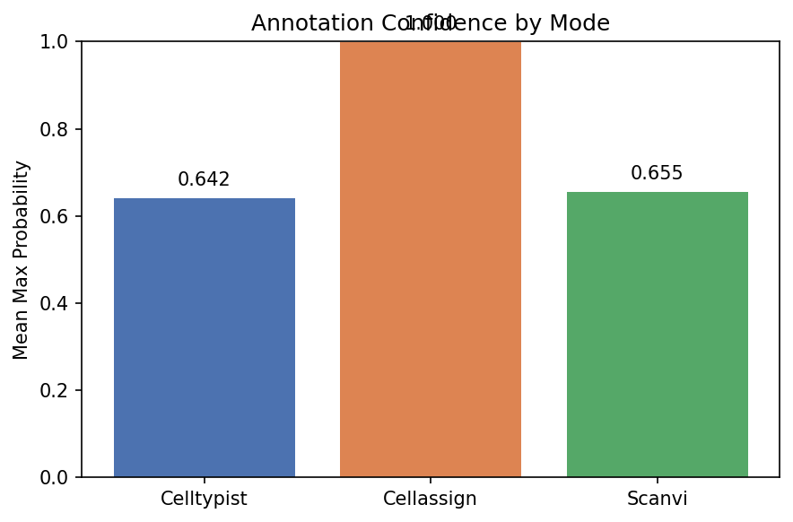
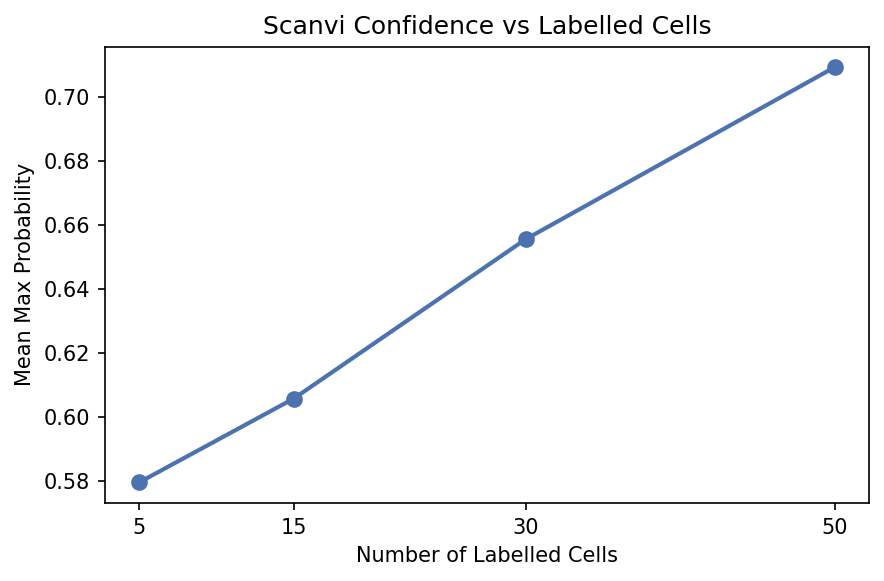

# Cell Type Annotation with Three Modes

**Duration:** 15 min | **Level:** Intermediate | **Device:** CPU-compatible

## Overview

Applies `DifferentiableCellAnnotator` in three modes -- celltypist (MLP classifier), cellassign (marker-gene guided), and scanvi (semi-supervised VAE) -- on synthetic 3-type expression data. Compares prediction distributions and annotation confidence across modes, and explores the effect of labelled fraction on scanvi performance.

## Quick Start

```bash
source ./activate.sh
uv run python examples/singlecell/cell_annotation.py
```

## Key Code

```python
from diffbio.operators.singlecell import CellAnnotatorConfig, DifferentiableCellAnnotator

config_ct = CellAnnotatorConfig(
    annotation_mode="celltypist", n_cell_types=3, n_genes=20,
    latent_dim=8, hidden_dims=[32, 16],
)
annotator_ct = DifferentiableCellAnnotator(config_ct, rngs=nnx.Rngs(0))

data_ct = {"counts": counts}
result_ct, _, _ = annotator_ct.apply(data_ct, {}, None)
```

## Results



Bar chart compares mean max probability across three modes: cellassign achieves 1.0 confidence with explicit marker knowledge, while celltypist and scanvi show lower confidence from untrained initial weights.



Scanvi annotation confidence increases from 0.58 to 0.71 as the number of labelled cells grows from 5 to 50, demonstrating the benefit of semi-supervised labels.

```
Expression matrix shape: (150, 20)
True label distribution: [50 50 50]
Celltypist annotator created: DifferentiableCellAnnotator
Probabilities shape: (150, 3)
Predicted labels shape: (150,)
Latent shape: (150, 8)
Predicted label counts: [46  8 96]
Marker matrix shape: (3, 20)
Markers per type: [7. 7. 6.]
Cellassign predicted labels: [50 50 50]
Max probability per cell (mean): 1.0000
Scanvi predicted labels: [43 19 88]
Labelled cell predictions match known: True
Mode           Type 0   Type 1   Type 2  Mean Confidence
------------------------------------------------------
Celltypist         46        8       96           0.6415
Cellassign         50       50       50           1.0000
Scanvi             43       19       88           0.6554
Cellassign accuracy with known markers: 1.0000
Celltypist:
  Gradient shape: (150, 20)
  Non-zero: True
  Finite: True
Cellassign:
  Gradient shape: (150, 20)
  Non-zero: True
  Finite: True
Scanvi:
  Gradient shape: (150, 20)
  Non-zero: True
  Finite: True
Celltypist JIT matches eager: True
Cellassign JIT matches eager: True
Scanvi JIT matches eager: True
    5 labelled cells -> mean confidence: 0.5795
   15 labelled cells -> mean confidence: 0.6056
   30 labelled cells -> mean confidence: 0.6554
   50 labelled cells -> mean confidence: 0.7092
Scanvi gene likelihood comparison:
  Poisson predictions: [43 19 88]
  ZINB predictions:    [90 19 41]
```

## Next Steps

- [Doublet Detection](doublet-detection.md) -- Scrublet and Solo doublet scoring
- [Batch Correction](batch-correction.md) -- Harmony, MMD, and WGAN
- [API Reference: Single-Cell Operators](../../api/operators/singlecell.md)
