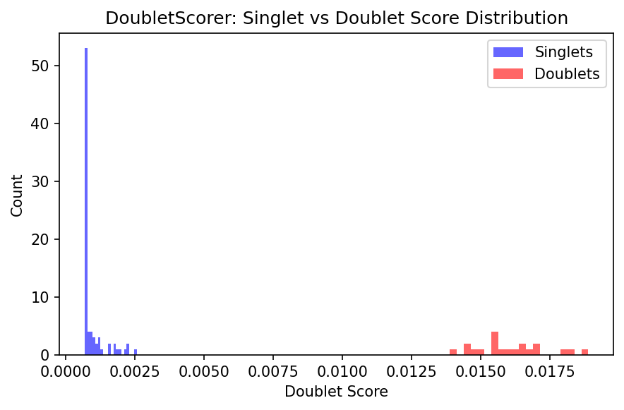
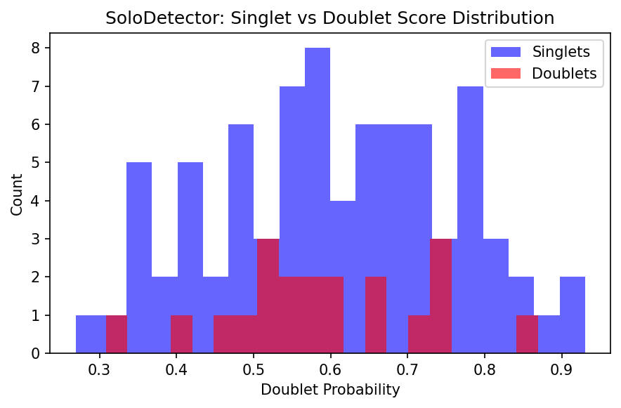
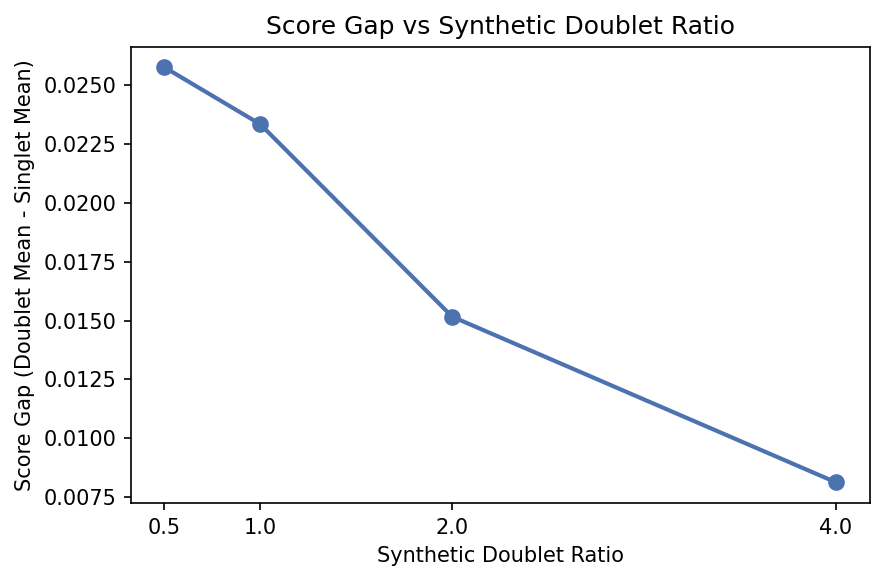

# Doublet Detection with Scrublet and Solo

**Duration:** 15 min | **Level:** Intermediate | **Device:** CPU-compatible

## Overview

Applies two doublet detection strategies -- `DifferentiableDoubletScorer` (Scrublet-style Bayesian k-NN) and `DifferentiableSoloDetector` (VAE latent-space classifier) -- on synthetic data with 80 known singlets and 20 known doublets. Compares score distributions and explores the effect of synthetic doublet ratio on discrimination.

## Quick Start

```bash
source ./activate.sh
uv run python examples/singlecell/doublet_detection.py
```

## Key Code

```python
from diffbio.operators.singlecell import DifferentiableDoubletScorer, DoubletScorerConfig

config_scrub = DoubletScorerConfig(
    n_neighbors=15, expected_doublet_rate=0.06, sim_doublet_ratio=2.0,
    n_pca_components=20, n_genes=50,
)
scorer = DifferentiableDoubletScorer(config_scrub, rngs=nnx.Rngs(0))
random_params = scorer.generate_random_params(jax.random.key(10), {"counts": counts.shape})

result_scrub, _, _ = scorer.apply({"counts": counts}, {}, None, random_params=random_params)
scores = result_scrub["doublet_scores"]
```

## Results



Histogram of Scrublet-style doublet scores shows clear separation between singlets (mean 0.001) and doublets (mean 0.016), confirming that the k-NN scoring discriminates known doublets.



Histogram of Solo VAE doublet probabilities shows overlapping distributions for the untrained model; training via `compute_solo_loss()` would improve separation.



The score gap between doublets and singlets decreases as the synthetic doublet ratio increases from 0.5 to 4.0, showing a trade-off between reference density and discrimination.

```
Total cells: 100 (80 singlets + 20 doublets)
Counts shape: (100, 50)
Mean expression - singlets: 5.39, doublets: 10.72
DoubletScorer created: DifferentiableDoubletScorer
Doublet scores shape: (100,)
Predicted doublets shape: (100,)
Doublet score statistics:
  Singlets - mean: 0.0009, std: 0.0004
  Doublets - mean: 0.0161, std: 0.0013
SoloDetector created: DifferentiableSoloDetector
Doublet probabilities shape: (100,)
Latent shape: (100, 8)
Solo doublet probability statistics:
  Singlets - mean: 0.6057, std: 0.1546
  Doublets - mean: 0.5924, std: 0.1277
Method            Singlet Mean   Doublet Mean      Gap
-----------------------------------------------------
Scrublet                0.0009         0.0161   0.0152
Solo                    0.6057         0.5924  -0.0133
DoubletScorer:
  Gradient shape: (100, 50)
  Non-zero: True
  Finite: True
SoloDetector:
  Gradient shape: (100, 50)
  Non-zero: True
  Finite: True
DoubletScorer JIT matches eager: True
SoloDetector JIT matches eager: True
  ratio=0.5 -> singlet mean: 0.0055, doublet mean: 0.0313, gap: 0.0258
  ratio=1.0 -> singlet mean: 0.0021, doublet mean: 0.0254, gap: 0.0233
  ratio=2.0 -> singlet mean: 0.0009, doublet mean: 0.0161, gap: 0.0152
  ratio=4.0 -> singlet mean: 0.0016, doublet mean: 0.0097, gap: 0.0081
  n_pca= 5 -> singlet mean: 0.0010, doublet mean: 0.0190, gap: 0.0180
  n_pca=10 -> singlet mean: 0.0010, doublet mean: 0.0183, gap: 0.0173
  n_pca=20 -> singlet mean: 0.0009, doublet mean: 0.0161, gap: 0.0152
  n_pca=30 -> singlet mean: 0.0009, doublet mean: 0.0149, gap: 0.0139
```

## Next Steps

- [Batch Correction](batch-correction.md) -- Harmony, MMD, and WGAN
- [Cell Annotation](cell-annotation.md) -- celltypist, cellassign, scanvi
- [API Reference: Single-Cell Operators](../../api/operators/singlecell.md)
