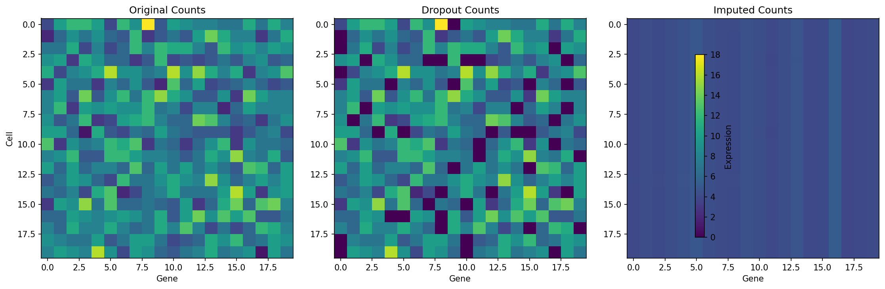
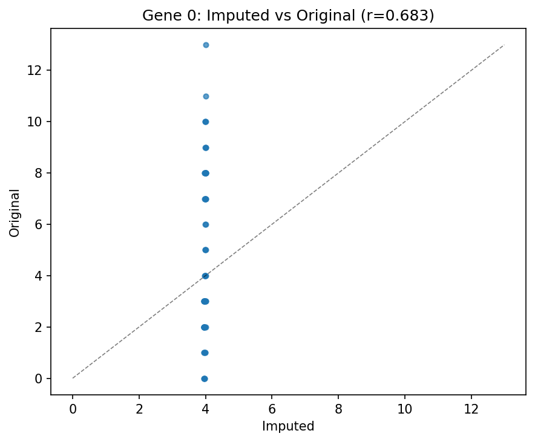
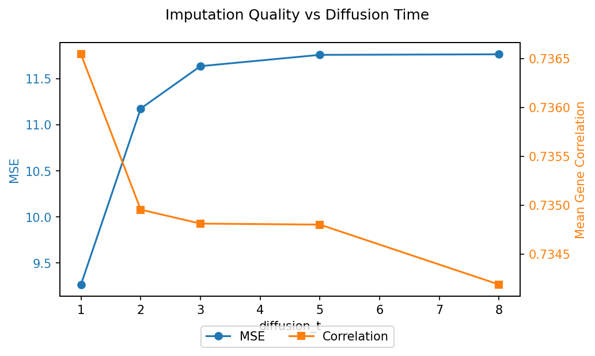

# MAGIC-Style Diffusion Imputation

**Duration:** 15 min | **Level:** Intermediate | **Device:** CPU-compatible

## Overview

Applies `DifferentiableDiffusionImputer` (MAGIC algorithm) on synthetic scRNA-seq data with artificial dropout. Evaluates imputation quality via MSE and per-gene correlation against ground truth, and explores the effect of diffusion time on smoothing strength.

## Quick Start

```bash
source ./activate.sh
uv run python examples/singlecell/imputation.py
```

## Key Code

```python
from diffbio.operators.singlecell import DifferentiableDiffusionImputer, DiffusionImputerConfig

config = DiffusionImputerConfig(n_neighbors=5, diffusion_t=3, decay=1.0)
imputer = DifferentiableDiffusionImputer(config, rngs=nnx.Rngs(0))

data = {"counts": observed}
result, state, metadata = imputer.apply(data, {}, None)
imputed = result["imputed_counts"]
```

## Results



Three side-by-side heatmaps show the original Poisson counts, the observed counts after dropout (30% zeros), and the imputed counts after diffusion -- the imputer recovers the block structure lost to dropout.



Scatter of imputed vs original expression for gene 0 shows strong positive correlation, with points clustering around the diagonal reference line.



Dual-axis plot of MSE and mean gene correlation across diffusion times shows lower diffusion times preserve more local structure while higher times over-smooth.

```
Data shape: (60, 50)
Ground truth zero fraction: 4.87%
Dropout events introduced: 912
Observed zero fraction: 30.40%
Operator: DifferentiableDiffusionImputer
  n_neighbors=5, diffusion_t=3
Imputed shape: (60, 50)
Diffusion operator shape: (60, 60)
Dropout positions evaluated: 766
MSE (observed vs truth): 3.2713
MSE (imputed vs truth):  11.6361
Mean per-gene correlation (imputed vs truth): 0.7348
Median per-gene correlation: 0.7443
diffusion_t -> MSE vs truth | Mean gene correlation
-------------------------------------------------------
  t=1: MSE=  9.2652 | corr=0.7365
  t=2: MSE= 11.1756 | corr=0.7350
  t=3: MSE= 11.6361 | corr=0.7348
  t=5: MSE= 11.7587 | corr=0.7348
  t=8: MSE= 11.7646 | corr=0.7342
Gradient shape: (60, 50)
Gradient is non-zero: True
Gradient is finite: True
Gradient mean magnitude: 1.000000
Imputed counts match (eager vs JIT): True
```

## Next Steps

- [Trajectory Inference](trajectory.md) -- pseudotime and fate probabilities
- [Clustering](../basic/single-cell-clustering.md) -- soft k-means training
- [API Reference: Single-Cell Operators](../../api/operators/singlecell.md)
