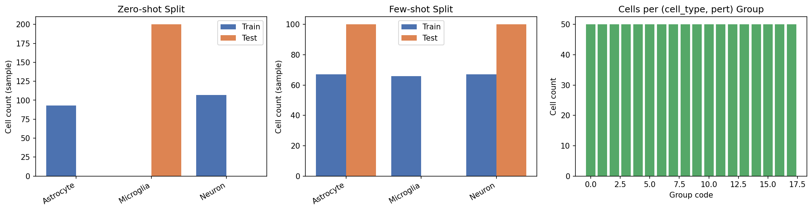
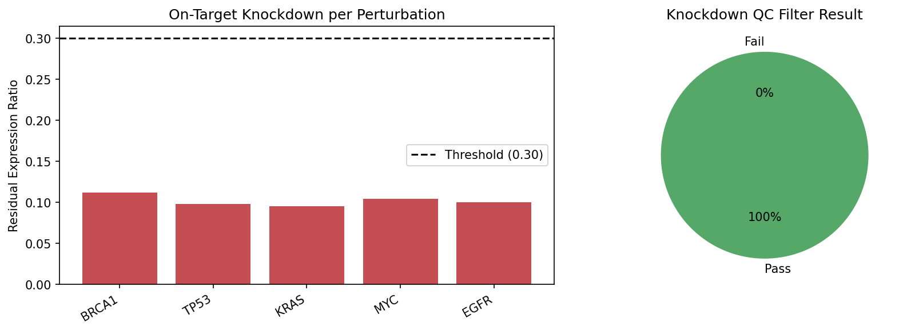
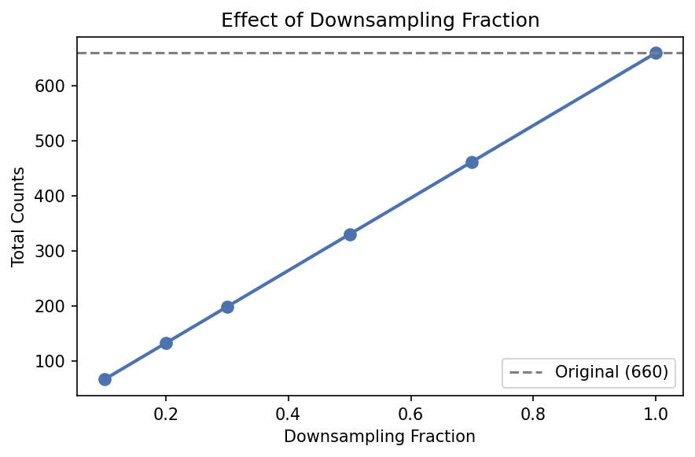

# Perturbation Experiment Data Loading

**Duration:** 15 min | **Level:** Intermediate | **Device:** CPU-compatible

## Overview

Demonstrates DiffBio's perturbation data loading stack, which ports features from the cell-load library to JAX/datarax. Covers loading perturbation-annotated H5AD files, mapping perturbed cells to controls, sentence-based batch sampling, zero-shot and few-shot splitting, knockdown QC filtering, differentiable count downsampling, and end-to-end pipeline orchestration.

## Quick Start

```bash
source ./activate.sh
uv run python examples/perturbation/perturbation_data_loading.py
```

## Key Code

### Load perturbation data

```python
from diffbio.sources.perturbation import (
    PerturbationAnnDataSource,
    PerturbationSourceConfig,
)

source = PerturbationAnnDataSource(
    PerturbationSourceConfig(
        file_path="screen.h5ad",
        pert_col="perturbation",
        cell_type_col="cell_type",
        control_pert="non-targeting",
        output_space="all",
    )
)
```

### Full pipeline in one call

```python
from diffbio.pipelines.perturbation import PerturbationPipeline, PerturbationPipelineConfig

pipeline = PerturbationPipeline(
    PerturbationPipelineConfig(
        split_mode="fewshot",
        held_out_perturbations=("BRCA1", "TP53"),
        mapping_strategy="random",
        enable_knockdown_filter=True,
        var_gene_col="gene_name",
    )
)
result = pipeline.setup(["screen.h5ad"])

for batch_indices in result.train_sampler:
    elements = [result.get_element(int(result.train_indices[i])) for i in batch_indices]
```

## Results

### Splitting and Group Structure



Left: zero-shot split holds out Microglia entirely for testing. Center: few-shot split holds out BRCA1 and TP53 perturbations. Right: cells are evenly distributed across 18 (cell_type, perturbation) groups, each with 50 cells.

### Knockdown Quality Control



Left: all 5 perturbations show strong knockdown (residual ratio ~0.1, well below the 0.30 threshold). Right: all cells pass QC because the synthetic knockdown signal is strong.

### Differentiable Downsampling



Total counts scale linearly with the downsampling fraction. Gradients flow through the straight-through estimator, enabling end-to-end optimization of downsampling as part of a training pipeline.

```
Total cells: 900
  3 cell types x 6 perturbations x 50 cells
Loaded 900 cells
Perturbation categories: ['BRCA1', 'EGFR', 'KRAS', 'MYC', 'TP53', 'non-targeting']
Cell type categories: ['Astrocyte', 'Microglia', 'Neuron']
Control cells: 150
Unique groups: 18

Zero-shot split:
  Train: 533 cells
  Valid: 67 cells
  Test:  300 cells
  Test cell types: {'Microglia'}

Few-shot split:
  Train: 550 cells
  Valid: 50 cells
  Test:  300 cells
  Test perturbations: {'TP53', 'BRCA1'}

Gradient shape: (1, 5)
Gradient is non-zero: True
Gradient is finite: True
```

## Components

| Component | Purpose |
|---|---|
| `PerturbationAnnDataSource` | Load H5AD with perturbation/cell_type/batch metadata |
| `RandomControlMapping` / `BatchControlMapping` | Pair perturbed cells to matched controls |
| `PerturbationBatchSampler` | Sentence-based batch construction by (cell_type, pert) |
| `ZeroShotSplitter` / `FewShotSplitter` | Evaluation split strategies |
| `OnTargetKnockdownFilter` | 3-stage knockdown QC |
| `ReadDownsampler` | Differentiable count downsampling |
| `PerturbationPipeline` | End-to-end orchestration |
| `ExperimentConfig` | TOML-based experiment configuration (cell-load compatible) |

## Next Steps

- [Single-Cell Pipeline](../../examples/advanced/singlecell-pipeline.md) — chain perturbation loading with downstream differentiable analysis
- [Batch Correction](batch-correction.md) — correct batch effects in perturbation embeddings
- [Cell Annotation](cell-annotation.md) — annotate cell types in perturbation screens
