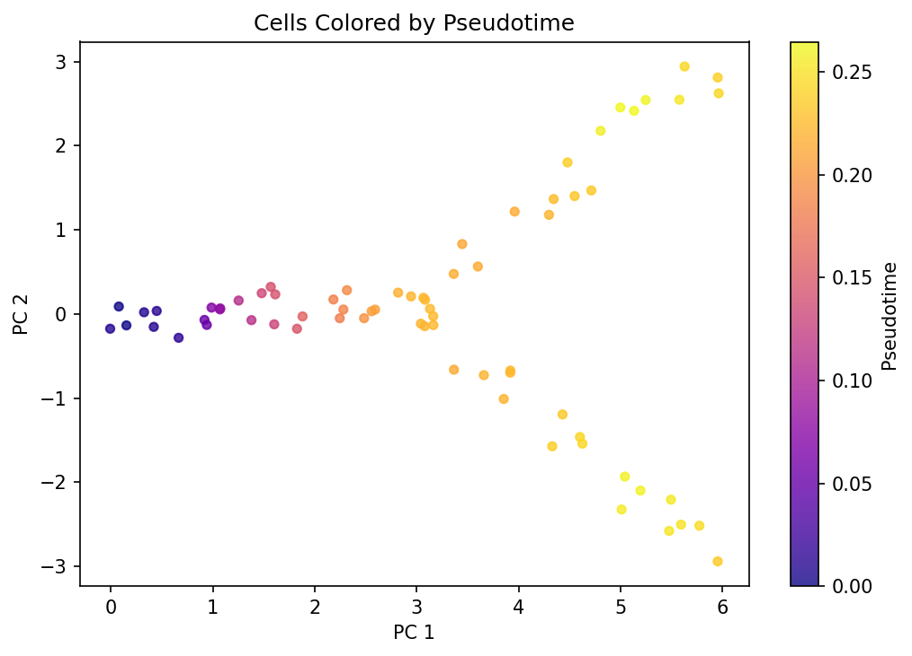
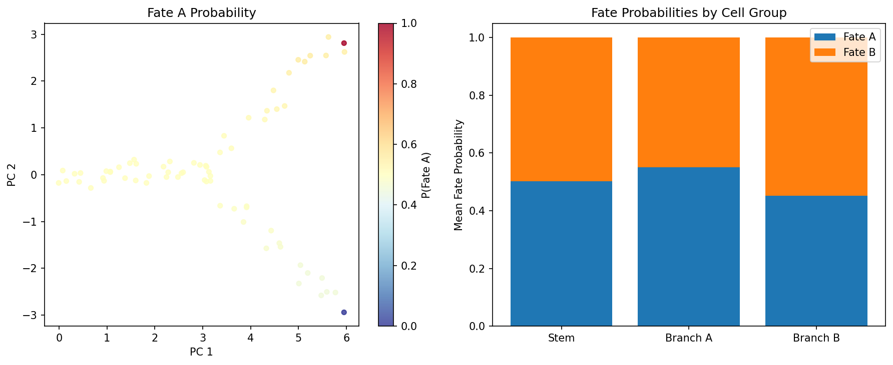
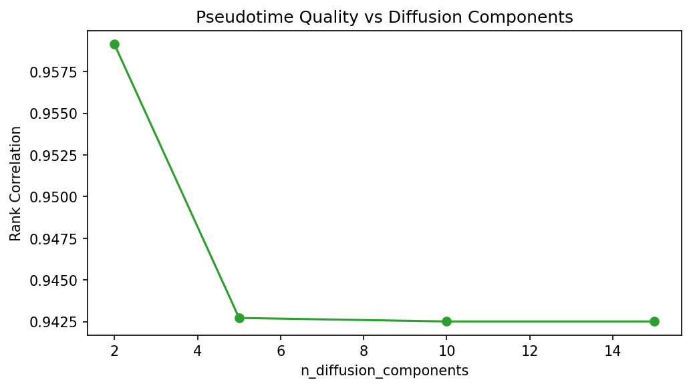

# Trajectory Inference: Pseudotime and Fate Probability

**Duration:** 15 min | **Level:** Intermediate | **Device:** CPU-compatible

## Overview

Constructs a synthetic Y-shaped branching trajectory and applies `DifferentiablePseudotime` (diffusion maps) and `DifferentiableFateProbability` (absorption probabilities). Evaluates pseudotime ordering via rank correlation with ground truth and checks that fate probabilities correctly separate two terminal lineages.

## Quick Start

```bash
source ./activate.sh
uv run python examples/singlecell/trajectory.py
```

## Key Code

```python
from diffbio.operators.singlecell import DifferentiablePseudotime, PseudotimeConfig

pt_config = PseudotimeConfig(n_neighbors=10, n_diffusion_components=5, root_cell_index=0)
pseudotime_op = DifferentiablePseudotime(pt_config, rngs=nnx.Rngs(0))

data = {"embeddings": embeddings}
pt_result, _, _ = pseudotime_op.apply(data, {}, None)
pseudotime = pt_result["pseudotime"]
```

## Results



Scatter plot of the 2D trajectory colored by inferred pseudotime shows a smooth gradient from root (stem) to tips (branches), demonstrating correct temporal ordering with rank correlation 0.94.



Left panel shows cells colored by fate A probability; right panel shows mean fate probabilities per cell group (stem, branch A, branch B), with terminal cells receiving probability 1.0 for their own fate.



Rank correlation remains stable (0.94-0.96) across different numbers of diffusion components, with 2 components performing slightly best on this synthetic data.

```
Total cells: 70 (stem=30, branch_a=20, branch_b=20)
Embedding shape: (70, 20)
Pseudotime shape: (70,)
Pseudotime range: [0.0000, 0.2647]
Diffusion components shape: (70, 5)
Transition matrix shape: (70, 70)
Rank correlation (inferred vs true pseudotime): 0.9427
Root cell pseudotime: 0.000000 (should be 0)
Mean pseudotime - stem: 0.1170, branches: 0.2362
Fate probabilities shape: (70, 2)
Macrostates shape: (70,)
Fate probability row sums: min=1.0000, max=1.0000
Branch A cells -> fate A probability: mean=0.5508
Branch B cells -> fate B probability: mean=0.5478
Terminal A fate probs: [1.0, 0.0]
Terminal B fate probs: [0.0, 1.0]
Pseudotime operator gradients:
  Shape: (70, 20)
  Non-zero: True
  Finite: True
Fate probability operator gradients:
  Shape: (70, 70)
  Non-zero: True
  Finite: True
Pseudotime matches (eager vs JIT): True
Fate probabilities match (eager vs JIT): True
n_components -> Rank correlation with true pseudotime
-------------------------------------------------------
  n_components= 2: rank_corr=0.9591
  n_components= 5: rank_corr=0.9427
  n_components=10: rank_corr=0.9425
  n_components=15: rank_corr=0.9425
```

## Next Steps

- [Clustering](../basic/single-cell-clustering.md) -- soft k-means training
- [Imputation](imputation.md) -- MAGIC-style diffusion imputation
- [API Reference: Single-Cell Operators](../../api/operators/singlecell.md)
