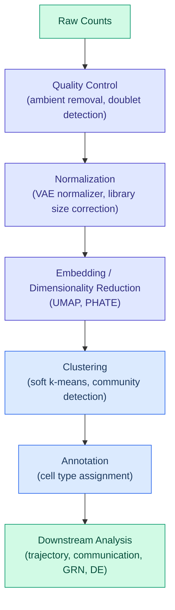

# Single-Cell Analysis

Single-cell RNA sequencing (scRNA-seq) measures gene expression in individual
cells, revealing cellular heterogeneity hidden in bulk experiments. DiffBio
provides 24 differentiable operators covering the full single-cell analysis
workflow — from raw count processing to trajectory inference and spatial
analysis.

---

## What scRNA-seq Measures

A scRNA-seq experiment produces a **count matrix** of shape
$(n_{\text{cells}}, n_{\text{genes}})$, where each entry is the number of
mRNA transcripts detected for a given gene in a given cell. Typical scale:
500-50,000 cells, 2,000-30,000 genes.

This matrix is the starting point for all downstream analysis. Its key
properties:

- **Sparse**: Most entries are zero (dropout)
- **Noisy**: Poisson/negative-binomial sampling noise
- **Batch-dependent**: Technical variation between experiments
- **High-dimensional**: Thousands of genes per cell

---

## Key Challenges

### Dropout

Low-abundance transcripts are frequently missed during library preparation.
A gene may be expressed in a cell but recorded as zero. This is not true
absence — it is a sampling artifact.

DiffBio addresses dropout with **diffusion imputation**
(`DifferentiableDiffusionImputer`), which propagates information between
similar cells via a learned affinity graph, and **transformer denoising**
(`DifferentiableTransformerDenoiser`), which reconstructs missing values from
context.

### Batch Effects

When cells are processed in different experiments, batches, or labs, technical
variation introduces systematic shifts that can mask biological signal. Cells
from the same type but different batches may appear more different than cells
from different types in the same batch.

DiffBio provides three differentiable correction strategies:

| Operator | Strategy | When to Use |
|---|---|---|
| `DifferentiableHarmony` | Soft clustering + batch-aware centroid updates | Default choice, fast |
| `DifferentiableMMDBatchCorrection` | Autoencoder with MMD regularization | When batch effects are non-linear |
| `DifferentiableWGANBatchCorrection` | Adversarial training with gradient reversal | When other methods under-correct |

### Doublets

When two cells are captured in the same droplet, their transcriptomes merge
into a single observation that looks like a hybrid cell type. Doublets
confuse clustering and annotation.

`DifferentiableDoubletScorer` (Scrublet-style k-NN scoring) and
`DifferentiableSoloDetector` (VAE latent-space classification) both produce
continuous doublet probability scores that can be thresholded or used as soft
weights.

### Ambient RNA

Free-floating mRNA from lysed cells contaminates all droplets, adding a
background expression profile to every cell. `DifferentiableAmbientRemoval`
uses a VAE to separate the true cell expression from the ambient profile.

---

## The Analysis Workflow

A typical single-cell analysis follows this progression:

DiffBio provides differentiable operators for every step. Because each step is
differentiable, you can define a loss at any point and optimize upstream
parameters.

---

## Trajectory Inference

Cells captured at a single time point often represent a continuum of states —
differentiation, activation, or disease progression. Trajectory inference
orders cells along this continuum.

**Pseudotime** (`DifferentiablePseudotime`): Assigns each cell a scalar value
representing its position along a trajectory. Uses diffusion maps to capture
the manifold structure.

**Fate Probability** (`DifferentiableFateProbability`): For branching
trajectories, estimates the probability that each cell will reach each terminal
state. Uses absorption probabilities on a Markov chain over the cell graph.

**OT Trajectory** (`DifferentiableOTTrajectory`): Reconstructs temporal
trajectories from snapshots at different time points using optimal transport
to match cell distributions across time.

All three are differentiable — gradients flow from trajectory outputs back to
the count matrix, enabling joint optimization of normalization and trajectory
inference.

---

## Cell Type Annotation

Assigning biological identities to clusters. DiffBio's `DifferentiableCellAnnotator`
supports three strategies in one operator:

| Mode | Input | Method |
|---|---|---|
| `celltypist` | Expression only | MLP classifier on VAE latent space |
| `cellassign` | Expression + marker gene matrix | Guided Poisson likelihood |
| `scanvi` | Expression + partial labels | Semi-supervised VAE |

The marker-guided mode (`cellassign`) is useful when known marker genes exist.
The semi-supervised mode (`scanvi`) leverages a small number of labelled cells
to improve annotation of the rest.

---

## Spatial Transcriptomics

Spatial methods (Visium, MERFISH, Slide-seq) preserve the physical location of
cells within tissue. This adds coordinates to the count matrix:

- **Expression**: $(n_{\text{spots}}, n_{\text{genes}})$
- **Coordinates**: $(n_{\text{spots}}, 2)$

**Spatial Domain Identification** (`DifferentiableSpatialDomain`): Uses a
GATv2 autoencoder on a spatial neighborhood graph to identify spatially
coherent expression domains. The graph attention learns which neighbors are
most informative for each spot.

**Slice Alignment** (`DifferentiablePASTEAlignment`): Aligns multiple tissue
sections using fused Gromov-Wasserstein optimal transport, matching both
expression profiles and spatial geometry.

---

## Gene Regulatory Networks

`DifferentiableGRN` infers regulatory relationships between transcription
factors and target genes using GATv2 attention on a bipartite TF-gene graph.
The attention weights form a differentiable adjacency matrix that can be
thresholded to extract a regulatory network.

This is differentiable end-to-end — gradients from a reconstruction loss
update the attention parameters, enabling the network to learn which TF-gene
relationships best explain the observed expression patterns.

---

## Why Differentiability Matters for Single-Cell

Traditional single-cell tools (scanpy, Seurat) apply each step independently.
Normalization does not know what clustering will follow. Clustering does not
know what trajectory inference needs.

DiffBio's differentiable operators enable:

1. **Joint normalization-clustering**: Learn a normalizer that produces
   embeddings optimized for downstream clustering quality
2. **End-to-end pipelines**: A loss on trajectory accuracy updates the
   imputer, normalizer, and clustering parameters together
3. **Learnable preprocessing**: Quality thresholds, diffusion times, and
   correction strengths adapt to the specific dataset
4. **Gradient-based benchmarking**: Compare operators not just by output
   quality but by how well gradients propagate through them

---

## Further Reading

- [Single-Cell Operators](../operators/singlecell.md) — all 24 operators with usage examples
- [Single-Cell Pipeline](../pipelines/single-cell.md) — end-to-end pipeline composition
- [Single-Cell API](../../api/operators/singlecell.md) — full API reference
- [Clustering Example](../../examples/basic/single-cell-clustering.md) — basic soft k-means
- [Trajectory Example](../../examples/intermediate/trajectory.md) — pseudotime and fate estimation
- [Pipeline Example](../../examples/advanced/singlecell-pipeline.md) — five-operator chain

### References

1. Wolf et al. "SCANPY: large-scale single-cell gene expression data analysis."
   *Genome Biology* 19, 2018.
2. Lopez et al. "Deep generative modeling for single-cell transcriptomics."
   *Nature Methods* 15, 2018.
3. La Manno et al. "RNA velocity of single cells."
   *Nature* 560, 2018.
