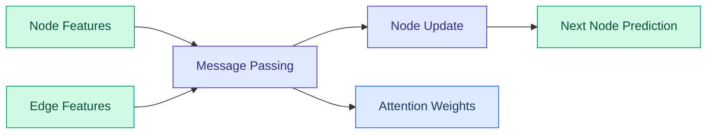
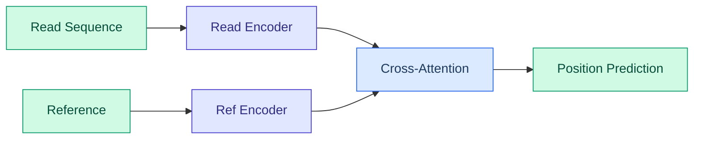
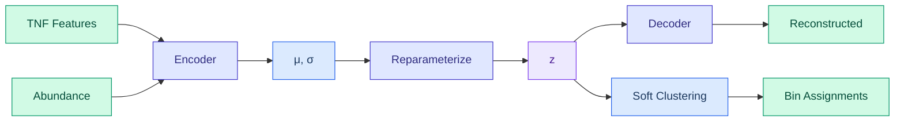

# Assembly & Mapping Operators

DiffBio provides differentiable operators for genome assembly and read mapping using neural networks.

<span class="operator-assembly">Assembly</span> <span class="operator-mapping">Mapping</span> <span class="diff-high">Fully Differentiable</span>

## Overview

Assembly and mapping operators enable end-to-end optimization of:

- **GNNAssemblyNavigator**: GNN for assembly graph traversal
- **NeuralReadMapper**: Cross-attention based read mapping
- **DifferentiableMetagenomicBinner**: VAMB-style VAE for metagenomic binning

## GNNAssemblyNavigator

Graph Neural Network for navigating de Bruijn or overlap assembly graphs.

### Quick Start

```python
from flax import nnx
from diffbio.operators.assembly import GNNAssemblyNavigator, GNNAssemblyConfig

# Configure GNN navigator
config = GNNAssemblyConfig(
    node_dim=64,
    edge_dim=32,
    hidden_dim=128,
    n_layers=3,
    n_heads=4,
)

# Create operator
rngs = nnx.Rngs(42)
navigator = GNNAssemblyNavigator(config, rngs=rngs)

# Apply to assembly graph
data = {
    "node_features": node_feats,     # (n_nodes, node_dim)
    "edge_index": edges,             # (2, n_edges)
    "edge_features": edge_feats,     # (n_edges, edge_dim)
}
result, state, metadata = navigator.apply(data, {}, None)

# Get navigation scores
next_node_probs = result["next_node_probs"]   # (n_nodes, n_nodes)
path_scores = result["path_scores"]           # Path quality scores
```

### Configuration

| Parameter | Type | Default | Description |
|-----------|------|---------|-------------|
| `node_dim` | int | 64 | Input node feature dimension |
| `edge_dim` | int | 32 | Input edge feature dimension |
| `hidden_dim` | int | 128 | GNN hidden dimension |
| `n_layers` | int | 3 | Number of GNN layers |
| `n_heads` | int | 4 | Number of attention heads |

### GNN Architecture



The GNN uses graph attention to learn:

1. Which edges to follow in the assembly graph
2. How to handle repeat regions
3. Optimal path through branching points

### Graph Construction

For de Bruijn graphs:
```python
# k-mer nodes with coverage features
node_features = jnp.concatenate([
    kmer_embeddings,     # (n_nodes, kmer_dim)
    coverage[:, None],   # (n_nodes, 1)
], axis=-1)

# Edges represent k-1 overlaps
edge_index = jnp.array([source_nodes, target_nodes])
edge_features = overlap_scores[:, None]
```

## NeuralReadMapper

Cross-attention based neural read mapper for aligning reads to reference.

### Quick Start

```python
from diffbio.operators.mapping import NeuralReadMapper, NeuralMapperConfig

# Configure neural mapper
config = NeuralMapperConfig(
    read_length=150,
    reference_length=1000,
    hidden_dim=128,
    n_layers=4,
    n_heads=8,
)

# Create operator
rngs = nnx.Rngs(42)
mapper = NeuralReadMapper(config, rngs=rngs)

# Map reads to reference
data = {
    "reads": read_sequences,         # (n_reads, read_length, alphabet_size)
    "reference": reference_seq,      # (ref_length, alphabet_size)
}
result, state, metadata = mapper.apply(data, {}, None)

# Get mapping results
positions = result["positions"]          # Mapped positions (n_reads,)
mapping_scores = result["scores"]        # Mapping quality
alignment_probs = result["alignment"]    # Soft alignment matrix
```

### Configuration

| Parameter | Type | Default | Description |
|-----------|------|---------|-------------|
| `read_length` | int | 150 | Expected read length |
| `reference_length` | int | 1000 | Reference sequence length |
| `hidden_dim` | int | 128 | Transformer hidden dimension |
| `n_layers` | int | 4 | Number of transformer layers |
| `n_heads` | int | 8 | Number of attention heads |

### Neural Mapper Architecture



The mapper uses:

1. **Read encoder**: Encode reads to embeddings
2. **Reference encoder**: Encode reference positions
3. **Cross-attention**: Match reads to reference positions
4. **Position head**: Predict mapping position

### Soft Position Prediction

Instead of argmax for position:

```python
# Soft position via attention-weighted average
position_logits = attention_scores.sum(axis=-1)  # (n_reads, ref_length)
position_weights = jax.nn.softmax(position_logits / temperature, axis=-1)
soft_position = jnp.sum(position_weights * positions, axis=-1)
```

## DifferentiableMetagenomicBinner

VAMB-style Variational Autoencoder for metagenomic binning. Encodes tetranucleotide frequencies (TNF) and abundance profiles into a latent space where contigs from the same genome cluster together.

### Quick Start

```python
from flax import nnx
from diffbio.operators.assembly import (
    DifferentiableMetagenomicBinner,
    MetagenomicBinnerConfig,
)

# Configure binner
config = MetagenomicBinnerConfig(
    n_tnf_features=136,          # Tetranucleotide frequencies
    n_abundance_features=10,     # Sample abundance features
    latent_dim=32,               # Latent space dimension
    hidden_dims=[512, 256],      # Encoder/decoder layers
    n_clusters=100,              # Number of bins
    temperature=1.0,             # Clustering temperature
)

# Create operator
rngs = nnx.Rngs(42)
binner = DifferentiableMetagenomicBinner(config, rngs=rngs)

# Apply binning
data = {
    "tnf": tnf_features,        # (n_contigs, 136) - TNF frequencies
    "abundance": abundances,     # (n_contigs, n_samples) - Sample abundances
}
result, state, metadata = binner.apply(data, {}, None)

# Get binning results
latent_z = result["latent_z"]                    # Latent representations
cluster_assignments = result["cluster_assignments"]  # Soft bin assignments
bins = cluster_assignments.argmax(axis=-1)       # Hard bin assignments
```

### Configuration

| Parameter | Type | Default | Description |
|-----------|------|---------|-------------|
| `n_tnf_features` | int | 136 | Number of TNF features (4^4/2 canonical k-mers) |
| `n_abundance_features` | int | 10 | Number of sample abundance features |
| `latent_dim` | int | 32 | Dimension of latent space |
| `hidden_dims` | list[int] | [512, 256] | Hidden layer dimensions |
| `n_clusters` | int | 100 | Number of clusters/bins |
| `temperature` | float | 1.0 | Temperature for soft clustering |
| `dropout_rate` | float | 0.2 | Dropout rate for regularization |
| `beta` | float | 1.0 | KL divergence weight (beta-VAE) |

### VAE Architecture



The binner uses:

1. **Encoder**: Maps TNF + abundance to latent distribution (μ, σ)
2. **Reparameterization**: Samples z = μ + σ * ε for differentiability
3. **Decoder**: Reconstructs TNF (softmax) and abundance (softplus)
4. **Soft clustering**: Distance-based assignment to learnable centroids

### Training/Evaluation Mode

Use NNX's built-in `train()` and `eval()` methods:

```python
# Training mode: stochastic sampling, dropout enabled
binner.train()
result, _, _ = binner.apply(data, {}, None)

# Evaluation mode: deterministic (z = μ), dropout disabled
binner.eval()
result, _, _ = binner.apply(data, {}, None)
```

### Training for Binning

```python
def binning_loss(binner, data):
    """Combined VAE + clustering loss."""
    result, _, _ = binner.apply(data, {}, None)

    # Reconstruction loss
    tnf_loss = jnp.mean((result["reconstructed_tnf"] - data["tnf"]) ** 2)
    abundance_loss = jnp.mean(
        (result["reconstructed_abundance"] - data["abundance"]) ** 2
    )

    # KL divergence
    mu, logvar = result["latent_mu"], result["latent_logvar"]
    kl_loss = -0.5 * jnp.mean(1 + logvar - mu**2 - jnp.exp(logvar))

    # Clustering compactness (entropy minimization)
    assignments = result["cluster_assignments"]
    entropy = -jnp.mean(jnp.sum(assignments * jnp.log(assignments + 1e-10), axis=-1))

    return tnf_loss + abundance_loss + config.beta * kl_loss + 0.1 * entropy
```

## Training Assembly/Mapping Models

### GNN Training for Assembly

```python
def assembly_loss(navigator, graph, target_paths):
    """Train GNN to predict correct assembly paths."""
    result, _, _ = navigator.apply(graph, {}, None)

    # Cross-entropy over next-node predictions
    next_probs = result["next_node_probs"]
    loss = -jnp.mean(jnp.log(next_probs[target_paths[:, 0], target_paths[:, 1]] + 1e-8))
    return loss
```

### Neural Mapper Training

```python
def mapping_loss(mapper, reads, reference, true_positions):
    """Train mapper to predict correct positions."""
    data = {"reads": reads, "reference": reference}
    result, _, _ = mapper.apply(data, {}, None)

    # Position regression loss
    predicted = result["positions"]
    loss = jnp.mean((predicted - true_positions) ** 2)
    return loss
```

## Use Cases

| Application | Operator | Description |
|-------------|----------|-------------|
| De novo assembly | GNNAssemblyNavigator | Navigate assembly graphs |
| Repeat resolution | GNNAssemblyNavigator | Handle repetitive regions |
| Read mapping | NeuralReadMapper | Align reads to reference |
| Variant discovery | NeuralReadMapper | Find mapping differences |
| Metagenomic binning | DifferentiableMetagenomicBinner | Cluster contigs by genome |
| MAG recovery | DifferentiableMetagenomicBinner | Metagenome-assembled genomes |

## Advanced Usage

### Handling Long Reads

For PacBio/Nanopore reads:

```python
config = NeuralMapperConfig(
    read_length=10000,
    reference_length=100000,
    hidden_dim=256,
    n_layers=6,
    n_heads=16,
)
```

### Assembly with Coverage

Include coverage information for better assembly:

```python
node_features = jnp.concatenate([
    kmer_embedding,
    jnp.log1p(coverage)[:, None],  # Log-scaled coverage
    gc_content[:, None],            # GC content
], axis=-1)
```

## Next Steps

- See [Alignment Operators](alignment.md) for sequence alignment
- Explore [Variant Operators](variant.md) for variant calling
