# CRISPR Guide Design Operators

DiffBio provides differentiable operators for CRISPR guide RNA design and scoring, enabling gradient-based optimization of guide selection.

<span class="operator-crispr">CRISPR</span> <span class="diff-high">Fully Differentiable</span>

## Overview

CRISPR guide design operators enable end-to-end optimization of:

- **DifferentiableCRISPRScorer**: DeepCRISPR-inspired CNN for on-target efficiency prediction

## DifferentiableCRISPRScorer

CNN-based guide RNA scoring that predicts on-target cleavage efficiency from sequence features.

### Quick Start

```python
from flax import nnx
import jax
import jax.numpy as jnp
from diffbio.operators.crispr import (
    DifferentiableCRISPRScorer,
    CRISPRScorerConfig,
    create_crispr_scorer,
)

# Configure scorer
config = CRISPRScorerConfig(
    guide_length=23,          # 20nt guide + 3nt PAM
    hidden_channels=(64, 128, 256),  # CNN channels
    fc_dims=(256, 128),       # Fully connected layers
    dropout_rate=0.2,         # Regularization
)

# Create operator
rngs = nnx.Rngs(42)
scorer = DifferentiableCRISPRScorer(config, rngs=rngs)

# Prepare guide sequences (one-hot encoded)
# A=0, C=1, G=2, T=3
guide_indices = jax.random.randint(jax.random.PRNGKey(0), (100, 23), 0, 4)
guides = jax.nn.one_hot(guide_indices, 4)  # (n_guides, length, 4)

# Apply scoring
data = {"guides": guides}
result, state, metadata = scorer.apply(data, {}, None)

# Get efficiency scores
scores = result["efficiency_scores"]  # (n_guides,) in [0, 1]
```

### Configuration

| Parameter | Type | Default | Description |
|-----------|------|---------|-------------|
| `guide_length` | int | 23 | Length of guide RNA + PAM context |
| `alphabet_size` | int | 4 | Nucleotide alphabet size (A/C/G/T) |
| `hidden_channels` | tuple[int, ...] | (64, 128, 256) | CNN hidden channel dimensions |
| `fc_dims` | tuple[int, ...] | (256, 128) | Fully connected layer dimensions |
| `dropout_rate` | float | 0.2 | Dropout rate for regularization |

### Architecture

The scorer uses a 1D CNN architecture inspired by [DeepCRISPR](https://github.com/bm2-lab/DeepCRISPR):

```mermaid
graph LR
    A["Guides<br/>(n, 23, 4)"] --> B["Conv1D + BN + ReLU"]
    B --> C["Conv1D + BN + ReLU"]
    C --> D["Conv1D + BN + ReLU"]
    D --> E["Flatten"]
    E --> F["FC + ReLU + Dropout"]
    F --> G["FC + Sigmoid"]
    G --> H["Efficiency Score<br/>(n,) [0,1]"]

    style A fill:#d1fae5,stroke:#059669,color:#064e3b
    style B fill:#e0e7ff,stroke:#4338ca,color:#312e81
    style C fill:#e0e7ff,stroke:#4338ca,color:#312e81
    style D fill:#e0e7ff,stroke:#4338ca,color:#312e81
    style E fill:#e0e7ff,stroke:#4338ca,color:#312e81
    style F fill:#e0e7ff,stroke:#4338ca,color:#312e81
    style G fill:#e0e7ff,stroke:#4338ca,color:#312e81
    style H fill:#d1fae5,stroke:#059669,color:#064e3b
```



The architecture consists of:

1. **1D Convolutional layers**: Extract sequence motif patterns
2. **Batch normalization**: Stabilize training
3. **Fully connected layers**: Map features to efficiency score
4. **Sigmoid output**: Bound score to [0, 1]

### Guide Encoding

Guides are one-hot encoded with channels for each nucleotide:

```python
# One-hot encoding: A=[1,0,0,0], C=[0,1,0,0], G=[0,0,1,0], T=[0,0,0,1]
import jax.numpy as jnp

# From sequence string
def encode_guide(sequence):
    mapping = {'A': 0, 'C': 1, 'G': 2, 'T': 3}
    indices = jnp.array([mapping[nt] for nt in sequence])
    return jax.nn.one_hot(indices, 4)

# Example: 20nt guide + NGG PAM
guide_seq = "ATCGATCGATCGATCGATCG" + "AGG"  # 23nt total
encoded = encode_guide(guide_seq)  # (23, 4)
```

### Training

```python
import optax
from flax import nnx

scorer = create_crispr_scorer(guide_length=23)
optimizer = optax.adam(1e-3)
opt_state = optimizer.init(nnx.state(scorer, nnx.Param))

def loss_fn(model, guides, target_scores):
    """MSE loss for efficiency prediction."""
    result, _, _ = model.apply({"guides": guides}, {}, None)
    predicted = result["efficiency_scores"]
    return jnp.mean((predicted - target_scores) ** 2)

@jax.jit
def train_step(model, opt_state, guides, targets):
    loss, grads = jax.value_and_grad(loss_fn)(model, guides, targets)
    params = nnx.state(model, nnx.Param)
    updates, opt_state = optimizer.update(grads, opt_state, params)
    nnx.update(model, optax.apply_updates(params, updates))
    return loss, opt_state

# Training loop
scorer.train()
for epoch in range(100):
    loss, opt_state = train_step(scorer, opt_state, train_guides, train_scores)

scorer.eval()
```

### Inference

```python
scorer.eval()

# Score a batch of guides
result, _, _ = scorer.apply({"guides": test_guides}, {}, None)
scores = result["efficiency_scores"]

# Rank guides by predicted efficiency
ranked_indices = jnp.argsort(scores)[::-1]
top_guides = test_guides[ranked_indices[:10]]
top_scores = scores[ranked_indices[:10]]

print("Top 10 guides by predicted efficiency:")
for i, (guide, score) in enumerate(zip(top_guides, top_scores)):
    print(f"{i+1}. Score: {score:.3f}")
```

### Batch Processing

```python
# Process many guides efficiently
batch_size = 1000
all_scores = []

for i in range(0, len(all_guides), batch_size):
    batch = all_guides[i:i+batch_size]
    result, _, _ = scorer.apply({"guides": batch}, {}, None)
    all_scores.append(result["efficiency_scores"])

all_scores = jnp.concatenate(all_scores)
```

## CRISPR Guide Design Workflow

### Complete Guide Selection Pipeline

```python
from diffbio.operators.crispr import create_crispr_scorer
from diffbio.operators.alignment import SmoothSmithWaterman

# 1. Generate candidate guides from target sequence
def generate_candidates(target_seq, pam="NGG"):
    """Find all PAM sites and extract guide sequences."""
    candidates = []
    for i in range(len(target_seq) - 22):
        if target_seq[i+20:i+23] in ["AGG", "CGG", "GGG", "TGG"]:
            guide = target_seq[i:i+23]
            candidates.append(guide)
    return candidates

# 2. Score guides for on-target efficiency
scorer = create_crispr_scorer(guide_length=23)
scorer.eval()

candidate_seqs = generate_candidates(target_dna)
encoded = jnp.stack([encode_guide(seq) for seq in candidate_seqs])

result, _, _ = scorer.apply({"guides": encoded}, {}, None)
efficiency_scores = result["efficiency_scores"]

# 3. Filter by efficiency threshold
threshold = 0.7
good_guides = [(seq, score) for seq, score in
               zip(candidate_seqs, efficiency_scores) if score > threshold]

print(f"Found {len(good_guides)} guides with efficiency > {threshold}")
```

## Use Cases

| Application | Operator | Description |
|-------------|----------|-------------|
| Guide selection | DifferentiableCRISPRScorer | Rank guides by efficiency |
| Library design | DifferentiableCRISPRScorer | Score large guide libraries |
| Optimization | DifferentiableCRISPRScorer | Gradient-based guide design |

## References

1. Chuai et al. (2018). "DeepCRISPR: Optimized CRISPR guide RNA design by deep learning." *Genome Biology*.

2. Liu et al. (2021). "Enhancing CRISPR-Cas9 gRNA efficiency prediction by data integration and deep learning." *Nature Communications*.

3. Wessels et al. (2020). "Massively parallel Cas13 screens reveal principles for guide RNA design." *Nature Biotechnology*.

## Next Steps

- See [Alignment Operators](alignment.md) for off-target search
- Explore [Preprocessing Operators](preprocessing.md) for sequence preparation
