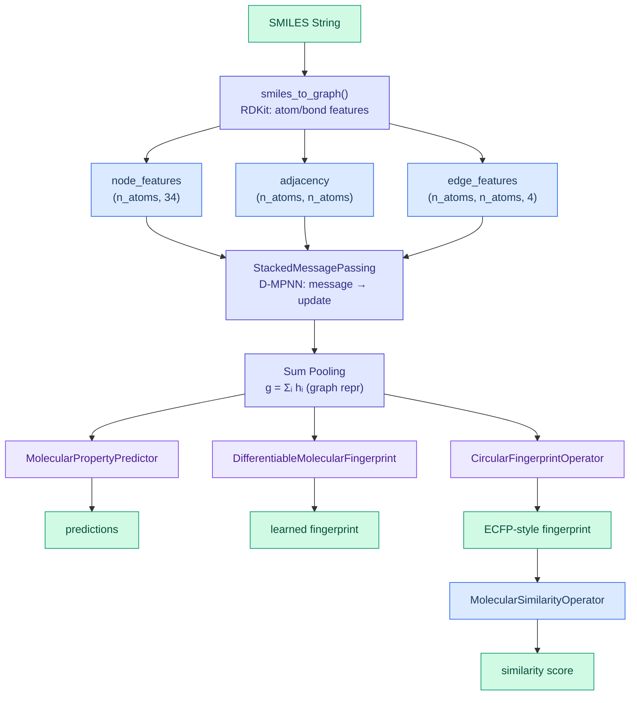

# Drug Discovery Operators

DiffBio provides differentiable operators for molecular property prediction, fingerprint computation, and similarity scoring using message passing neural networks (MPNNs).

<span class="operator-md">Drug Discovery</span> <span class="diff-high">Fully Differentiable</span>

## Overview

Drug discovery operators enable gradient-based optimization for chemoinformatics tasks:

- **MolecularPropertyPredictor**: ChemProp-style D-MPNN for property prediction
- **ADMETPredictor**: Multi-task ADMET property prediction (22 TDC endpoints)
- **DifferentiableMolecularFingerprint**: Learned neural graph fingerprints
- **CircularFingerprintOperator**: Differentiable ECFP/Morgan fingerprints
- **MACCSKeysOperator**: Differentiable MACCS 166 structural keys
- **AttentiveFP**: Attention-based molecular fingerprint with GRU
- **MolecularSimilarityOperator**: Differentiable Tanimoto/cosine/Dice similarity
- **DifferentiableDTIPipeline**: shared drug-target interaction pipeline that
  combines a protein sequence foundation encoder with a differentiable molecular
  fingerprint encoder

## Benchmark Coverage

The current benchmarked drug-discovery surface has two layers:

- stable property-prediction benchmarking via MoleculeNet BBBP
- DTI benchmarks for Davis and BioSNAP, using deterministic paired
  protein-plus-drug sources and `DifferentiableDTIPipeline`

The DTI benchmarks are still synthetic-fallback aware, but they now exercise the
integrated differentiable path. Proteins are one-hot encoded with the shared
20-residue alignment alphabet and passed through `TransformerSequenceEncoder`;
drugs are converted with `batch_smiles_to_graphs()` and passed through
`DifferentiableMolecularFingerprint`; a shared pair scorer trains on top of the
concatenated embeddings.
Each DTI benchmark result carries the shared paired-input required keys,
`dataset_provenance`, and a `metric_contract` that separates Davis regression
metrics from BioSNAP classification and protein-grouped ranking metrics. The
default Davis and BioSNAP fallback sources are synthetic scaffolds with
`promotion_eligible=false`; they are contract evidence, not stable biological
promotion evidence.
The DTI comparison report records the integrated differentiable pipeline next
to a fixed, non-differentiable scaffold-feature baseline using shared
`dataset`, `task`, and `encoder_path` comparison axes. That report is
synthetic-scaffold comparison evidence for the differentiable upgrade boundary;
it is not stable biological promotion evidence until an external
promotion-eligible source is benchmarked.
Mini-batches created with `build_paired_dti_batch()` keep the split-level source
size under `source_n_pairs` and set `n_pairs` to the current batch size, so each
batch remains valid under `validate_dti_dataset()`.

## Architecture



## Converting SMILES to Graphs

### Basic Conversion

```python
from diffbio.operators.drug_discovery import (
    smiles_to_graph,
    batch_smiles_to_graphs,
    DEFAULT_ATOM_FEATURES,
)

# Convert single molecule
smiles = "CCO"  # Ethanol
node_features, adjacency, edge_features = smiles_to_graph(smiles)

print(f"Atoms: {node_features.shape[0]}")      # 3 atoms
print(f"Features per atom: {node_features.shape[1]}")  # 34 features
print(f"Adjacency: {adjacency.shape}")         # (3, 3)
```

### Batch Processing

```python
# Convert multiple molecules with padding
smiles_list = ["CCO", "CC(=O)O", "c1ccccc1"]  # Ethanol, Acetic acid, Benzene
node_features, adjacency, edge_features, masks = batch_smiles_to_graphs(
    smiles_list,
    max_atoms=20,
)

print(f"Batch shape: {node_features.shape}")  # (3, 20, 34)
print(f"Masks shape: {masks.shape}")          # (3, 20)
```

### Atom Features

The default atom featurizer extracts 34 features per atom:

| Feature | Dimensions | Description |
|---------|------------|-------------|
| Atom type | 10 | One-hot: C, N, O, S, F, Cl, Br, I, P, other |
| Degree | 6 | One-hot: 0-5+ |
| Formal charge | 5 | One-hot: -2 to +2 |
| Hybridization | 5 | One-hot: SP, SP2, SP3, SP3D, SP3D2 |
| Aromaticity | 1 | Binary |
| Hydrogens | 5 | One-hot: 0-4+ |
| In ring | 1 | Binary |
| Chiral | 1 | Binary |

## MolecularPropertyPredictor

ChemProp-style directed message passing neural network for molecular property prediction.

### Quick Start

```python
from flax import nnx
import jax.numpy as jnp
from diffbio.operators.drug_discovery import (
    MolecularPropertyPredictor,
    MolecularPropertyConfig,
    create_property_predictor,
    smiles_to_graph,
    DEFAULT_ATOM_FEATURES,
)

# Create predictor for real molecules (34 atom features)
predictor = create_property_predictor(
    hidden_dim=64,
    num_layers=3,
    num_tasks=1,
)

# Or with full configuration
config = MolecularPropertyConfig(
    hidden_dim=64,
    num_message_passing_steps=3,
    num_output_tasks=1,
    in_features=DEFAULT_ATOM_FEATURES,  # 34 for real molecules
)
predictor = MolecularPropertyPredictor(config, rngs=nnx.Rngs(42))

# Convert SMILES and predict
smiles = "c1ccccc1"  # Benzene
node_features, adjacency, edge_features = smiles_to_graph(smiles)

data = {
    "node_features": node_features,
    "adjacency": adjacency,
    "edge_features": edge_features,
}
result, state, metadata = predictor.apply(data, {}, None)

predictions = result["predictions"]  # (num_tasks,)
graph_repr = result["graph_representation"]  # (hidden_dim,)
```

### Configuration

| Parameter | Type | Default | Description |
|-----------|------|---------|-------------|
| `hidden_dim` | int | 300 | Hidden dimension for message passing |
| `num_message_passing_steps` | int | 3 | Number of message passing iterations |
| `num_output_tasks` | int | 1 | Number of prediction tasks (multi-task) |
| `dropout_rate` | float | 0.0 | Dropout rate for regularization |
| `in_features` | int | 4 | Input node features (use 34 for real molecules) |
| `num_edge_features` | int | 4 | Number of bond features |

### Multi-Task Prediction

```python
# Predict multiple properties simultaneously
config = MolecularPropertyConfig(
    hidden_dim=128,
    num_message_passing_steps=4,
    num_output_tasks=5,  # E.g., logP, TPSA, MW, HBD, HBA
    in_features=DEFAULT_ATOM_FEATURES,
)
predictor = MolecularPropertyPredictor(config, rngs=nnx.Rngs(42))

result, _, _ = predictor.apply(data, {}, None)
predictions = result["predictions"]  # (5,)
```

## ADMETPredictor

Multi-task predictor for Absorption, Distribution, Metabolism, Excretion, and Toxicity (ADMET) properties following the TDC benchmark with 22 standard endpoints.

### What is ADMET?

ADMET properties determine a drug's pharmacokinetic profile:

- **Absorption**: How the drug enters the bloodstream (Caco2, HIA, Pgp, Bioavailability, etc.)
- **Distribution**: How the drug spreads through the body (BBB, PPBR, VDss)
- **Metabolism**: How the drug is broken down (CYP450 enzymes)
- **Excretion**: How the drug is eliminated (Half-life, Clearance)
- **Toxicity**: Adverse effects (hERG, AMES, DILI, LD50)

### Quick Start

```python
from flax import nnx
from diffbio.operators.drug_discovery import (
    ADMETPredictor,
    ADMETConfig,
    create_admet_predictor,
    ADMET_TASK_NAMES,
    ADMET_TASK_TYPES,
    smiles_to_graph,
)

# Create predictor (quick start)
admet = create_admet_predictor(hidden_dim=256, num_layers=3)

# Or with full configuration
config = ADMETConfig(
    hidden_dim=300,
    num_message_passing_steps=3,
    num_tasks=22,  # Standard TDC benchmark
    dropout_rate=0.1,
    in_features=34,  # Real molecule features
)
admet = ADMETPredictor(config, rngs=nnx.Rngs(42))

# Predict ADMET properties
node_features, adjacency, edge_features = smiles_to_graph("CCO")
data = {
    "node_features": node_features,
    "adjacency": adjacency,
    "edge_features": edge_features,
}
result, _, _ = admet.apply(data, {}, None)

predictions = result["predictions"]  # (22,) for all ADMET tasks
print(f"BBB permeability: {predictions[6]:.3f}")  # BBB_Martins is index 6
```

### TDC ADMET Endpoints

| Task | Index | Type | Description |
|------|-------|------|-------------|
| Caco2_Wang | 0 | Regression | Intestinal permeability |
| HIA_Hou | 1 | Classification | Human intestinal absorption |
| Pgp_Broccatelli | 2 | Classification | P-glycoprotein inhibition |
| Bioavailability_Ma | 3 | Classification | Oral bioavailability |
| Lipophilicity_AstraZeneca | 4 | Regression | LogD7.4 |
| Solubility_AqSolDB | 5 | Regression | Aqueous solubility |
| BBB_Martins | 6 | Classification | Blood-brain barrier |
| PPBR_AZ | 7 | Regression | Plasma protein binding |
| VDss_Lombardo | 8 | Regression | Volume of distribution |
| CYP2C9_Veith | 9 | Classification | CYP2C9 inhibition |
| CYP2D6_Veith | 10 | Classification | CYP2D6 inhibition |
| CYP3A4_Veith | 11 | Classification | CYP3A4 inhibition |
| Half_Life_Obach | 15 | Regression | Half-life |
| hERG | 19 | Classification | hERG channel inhibition (cardiotox) |
| AMES | 20 | Classification | Mutagenicity |
| DILI | 21 | Classification | Drug-induced liver injury |

### Configuration

| Parameter | Type | Default | Description |
|-----------|------|---------|-------------|
| `hidden_dim` | int | 300 | Hidden dimension for message passing |
| `num_message_passing_steps` | int | 3 | D-MPNN iterations |
| `num_tasks` | int | 22 | Number of ADMET tasks |
| `dropout_rate` | float | 0.0 | Dropout for regularization |
| `ffn_hidden_dim` | int | None | FFN hidden dim (defaults to hidden_dim) |
| `ffn_num_layers` | int | 2 | Number of FFN layers |
| `apply_task_activations` | bool | False | Apply sigmoid for classification tasks |

## MACCSKeysOperator

Differentiable implementation of MACCS (Molecular ACCess System) 166 structural keys fingerprint.

### What are MACCS Keys?

MACCS keys are 166 predefined structural patterns that encode the presence/absence of specific molecular substructures:

- Atom types (C, N, O, S, halides)
- Functional groups (carbonyl, hydroxyl, amine)
- Ring systems (aromatic, aliphatic)
- Bond patterns and connectivity

### Quick Start

```python
from flax import nnx
from diffbio.operators.drug_discovery import (
    MACCSKeysOperator,
    MACCSKeysConfig,
    create_maccs_operator,
    smiles_to_graph,
)

# Create operator (quick start)
maccs = create_maccs_operator(differentiable=True, temperature=1.0)

# Or with configuration
config = MACCSKeysConfig(
    n_bits=166,  # Standard MACCS keys
    differentiable=True,
    temperature=1.0,  # Lower = sharper bit assignment
    hidden_dim=64,
    num_layers=2,
    in_features=34,
)
maccs = MACCSKeysOperator(config, rngs=nnx.Rngs(42))

# Compute fingerprint
node_features, adjacency, _ = smiles_to_graph("c1ccccc1")  # Benzene
data = {
    "node_features": node_features,
    "adjacency": adjacency,
}
result, _, _ = maccs.apply(data, {}, None)

fingerprint = result["fingerprint"]  # (166,) soft bits in [0, 1]
```

### Differentiable vs RDKit Mode

**Differentiable Mode** (default): Uses learned pattern detectors with temperature-controlled soft assignment.

```python
config = MACCSKeysConfig(
    differentiable=True,
    temperature=0.5,  # Lower = more binary-like
)
maccs = MACCSKeysOperator(config, rngs=nnx.Rngs(42))

# Input: molecular graph
data = {"node_features": node_features, "adjacency": adjacency}
result, _, _ = maccs.apply(data, {}, None)
# Output: soft probabilities in [0, 1]
```

**RDKit Mode**: Uses exact RDKit MACCS implementation (non-differentiable).

```python
config = MACCSKeysConfig(differentiable=False)
maccs = MACCSKeysOperator(config)

# Input: SMILES string
data = {"smiles": "CCO"}
result, _, _ = maccs.apply(data, {}, None)
# Output: binary fingerprint
```

### Configuration

| Parameter | Type | Default | Description |
|-----------|------|---------|-------------|
| `n_bits` | int | 166 | Output fingerprint bits |
| `differentiable` | bool | True | Use learned pattern matching |
| `temperature` | float | 1.0 | Softmax temperature |
| `hidden_dim` | int | 64 | Hidden dim for pattern networks |
| `num_layers` | int | 2 | Message passing layers |
| `in_features` | int | 4 | Input node features |

## AttentiveFP

Attention-based graph fingerprint following the AttentiveFP architecture from Xiong et al. 2019, combining graph attention with GRU cells for molecular representation learning.

### Architecture

AttentiveFP uses a two-level attention mechanism:

1. **Atom-level**: GATE convolutions with GRU refinement
2. **Molecule-level**: Attention-weighted aggregation with GRU

The model provides interpretable attention weights showing atom importance.

### Quick Start

```python
from flax import nnx
from diffbio.operators.drug_discovery import (
    AttentiveFP,
    AttentiveFPConfig,
    create_attentive_fp,
    smiles_to_graph,
)

# Create operator (quick start)
afp = create_attentive_fp(hidden_dim=200, out_dim=256, num_layers=2)

# Or with configuration
config = AttentiveFPConfig(
    hidden_dim=200,
    out_dim=256,
    num_layers=2,  # Atom-level attention layers
    num_timesteps=2,  # Molecule-level GRU iterations
    dropout_rate=0.0,
    in_features=34,
    edge_dim=4,
)
afp = AttentiveFP(config, rngs=nnx.Rngs(42))

# Compute fingerprint
node_features, adjacency, edge_features = smiles_to_graph("c1ccccc1")
data = {
    "node_features": node_features,
    "adjacency": adjacency,
    "edge_features": edge_features,
}
result, _, _ = afp.apply(data, {}, None)

fingerprint = result["fingerprint"]  # (256,)
attention = result["attention_weights"]  # Interpretability
mol_attention = result["molecule_attention"]  # Atom importance
```

### Interpretability

AttentiveFP provides attention weights for understanding which atoms contribute most:

```python
# Get atom importance scores
mol_attention = result["molecule_attention"]  # (n_atoms,)

# Find most important atoms
top_atoms = jnp.argsort(mol_attention)[::-1][:5]
print(f"Top 5 important atom indices: {top_atoms}")
```

### Configuration

| Parameter | Type | Default | Description |
|-----------|------|---------|-------------|
| `hidden_dim` | int | 200 | Hidden dimension for GNN |
| `out_dim` | int | 200 | Output fingerprint dimension |
| `num_layers` | int | 2 | Atom-level attention layers |
| `num_timesteps` | int | 2 | Molecule-level GRU iterations |
| `dropout_rate` | float | 0.0 | Dropout for regularization |
| `in_features` | int | 39 | Input node features |
| `edge_dim` | int | 10 | Edge feature dimension |
| `negative_slope` | float | 0.2 | LeakyReLU negative slope |

### References

- Xiong et al. "Pushing the Boundaries of Molecular Representation for Drug Discovery with the Graph Attention Mechanism" JCIM 2019

## DifferentiableMolecularFingerprint

Neural graph fingerprints that provide learned, differentiable alternatives to traditional fingerprints like ECFP/Morgan.

### Quick Start

```python
from diffbio.operators.drug_discovery import (
    DifferentiableMolecularFingerprint,
    MolecularFingerprintConfig,
    create_fingerprint_operator,
    DEFAULT_ATOM_FEATURES,
)

# Create fingerprint operator
fingerprint_op = create_fingerprint_operator(
    fingerprint_dim=256,
    num_layers=3,
    normalize=True,
)

# Or with full configuration
config = MolecularFingerprintConfig(
    fingerprint_dim=256,
    hidden_dim=128,
    num_layers=3,
    in_features=DEFAULT_ATOM_FEATURES,
    normalize=True,  # L2-normalize fingerprint
)
fingerprint_op = DifferentiableMolecularFingerprint(config, rngs=nnx.Rngs(42))

# Compute fingerprint
node_features, adjacency, edge_features = smiles_to_graph("CCO")
data = {
    "node_features": node_features,
    "adjacency": adjacency,
}
result, _, _ = fingerprint_op.apply(data, {}, None)

fingerprint = result["fingerprint"]  # (256,)
```

### Configuration

| Parameter | Type | Default | Description |
|-----------|------|---------|-------------|
| `fingerprint_dim` | int | 256 | Output fingerprint dimension |
| `hidden_dim` | int | 128 | Hidden dimension for GNN |
| `num_layers` | int | 3 | Number of message passing layers |
| `in_features` | int | 4 | Input node features (use 34 for real molecules) |
| `normalize` | bool | False | L2-normalize the fingerprint |

### Comparing Fingerprints

```python
# Compute fingerprints for two molecules
fp1_data = {"node_features": node_features1, "adjacency": adj1}
fp2_data = {"node_features": node_features2, "adjacency": adj2}

result1, _, _ = fingerprint_op.apply(fp1_data, {}, None)
result2, _, _ = fingerprint_op.apply(fp2_data, {}, None)

fp1 = result1["fingerprint"]
fp2 = result2["fingerprint"]

# Cosine similarity
similarity = jnp.dot(fp1, fp2) / (jnp.linalg.norm(fp1) * jnp.linalg.norm(fp2))
```

## CircularFingerprintOperator (ECFP/Morgan)

Differentiable implementation of Extended-Connectivity Fingerprints (ECFP), also known as Morgan fingerprints. These are the industry standard for molecular similarity and virtual screening.

### What are Circular Fingerprints?

Circular fingerprints encode molecular structure by:

1. **Starting from each atom**: Each atom becomes a center
2. **Expanding in circles**: Collect neighbors at radius 0, 1, 2, ...
3. **Hashing to bits**: Each substructure maps to a bit position

```
Radius 0: Just the atom
    C

Radius 1: Atom + immediate neighbors
    O-C-C

Radius 2: Atom + neighbors + next neighbors
    H-O-C-C-H
        |
        H
```

### Quick Start

```python
from diffbio.operators.drug_discovery import (
    CircularFingerprintOperator,
    CircularFingerprintConfig,
    create_ecfp4_operator,
    smiles_to_graph,
    DEFAULT_ATOM_FEATURES,
)
from flax import nnx

# Using factory function (recommended)
ecfp4_op = create_ecfp4_operator(n_bits=2048)

# Convert SMILES to graph
node_features, adjacency, _ = smiles_to_graph("CCO")  # Ethanol

# Compute fingerprint
data = {
    "node_features": node_features,
    "adjacency": adjacency,
}
result, _, _ = ecfp4_op.apply(data, {}, None)
fingerprint = result["fingerprint"]  # (2048,) soft probabilities
```

### Fingerprint Types

| Type | Factory Function | Radius | Description |
|------|-----------------|--------|-------------|
| ECFP4 | `create_ecfp4_operator()` | 2 | Standard for similarity search |
| ECFP6 | `create_ecfp6_operator()` | 3 | Larger context, more specific |
| FCFP4 | `create_fcfp4_operator()` | 2 | Feature-based (pharmacophore) |

```python
from diffbio.operators.drug_discovery import (
    create_ecfp4_operator,
    create_ecfp6_operator,
    create_fcfp4_operator,
)

# ECFP4: Standard choice for most applications
ecfp4 = create_ecfp4_operator(n_bits=2048)

# ECFP6: More specific substructures
ecfp6 = create_ecfp6_operator(n_bits=2048)

# FCFP4: Pharmacophore-aware features
fcfp4 = create_fcfp4_operator(n_bits=2048)
```

### Differentiable vs RDKit Mode

The operator supports two modes:

**Differentiable Mode** (default): Uses learned hash functions with softmax for gradient flow.

```python
config = CircularFingerprintConfig(
    radius=2,
    n_bits=2048,
    differentiable=True,  # Learned hash functions
    hash_hidden_dim=128,  # Hash network hidden dimension
    temperature=1.0,      # Softmax temperature (lower = sharper)
    in_features=DEFAULT_ATOM_FEATURES,
)
fp_op = CircularFingerprintOperator(config, rngs=nnx.Rngs(42))

# Input: molecular graph
data = {"node_features": node_features, "adjacency": adjacency}
result, _, _ = fp_op.apply(data, {}, None)
# Output: soft probabilities in [0, 1]
```

**RDKit Mode**: Uses exact RDKit fingerprints (non-differentiable).

```python
config = CircularFingerprintConfig(
    radius=2,
    n_bits=2048,
    differentiable=False,  # Use RDKit
)
fp_op = CircularFingerprintOperator(config)

# Input: SMILES string
data = {"smiles": "CCO"}
result, _, _ = fp_op.apply(data, {}, None)
# Output: binary fingerprint
```

### Configuration Options

| Parameter | Type | Default | Description |
|-----------|------|---------|-------------|
| `radius` | int | 2 | Neighborhood radius (ECFP4=2, ECFP6=3) |
| `n_bits` | int | 2048 | Output fingerprint dimension |
| `use_chirality` | bool | False | Include stereochemistry |
| `use_bond_types` | bool | True | Distinguish bond types |
| `use_features` | bool | False | Use pharmacophore features (FCFP) |
| `differentiable` | bool | True | Use learned hash functions |
| `hash_hidden_dim` | int | 128 | Hidden dimension for hash network |
| `temperature` | float | 1.0 | Softmax temperature |
| `in_features` | int | 4 | Input node feature dimension |

### Gradient-Based Optimization

```python
import jax
from flax import nnx

# Create differentiable fingerprint operator
ecfp4_op = create_ecfp4_operator(n_bits=256)

def similarity_loss(fp_op, query_data, target_data):
    """Optimize fingerprint similarity."""
    query_result, _, _ = fp_op.apply(query_data, {}, None)
    target_result, _, _ = fp_op.apply(target_data, {}, None)

    query_fp = query_result["fingerprint"]
    target_fp = target_result["fingerprint"]

    # Tanimoto similarity (differentiable)
    dot = jnp.dot(query_fp, target_fp)
    norm_sq = jnp.sum(query_fp**2) + jnp.sum(target_fp**2)
    return 1.0 - dot / (norm_sq - dot + 1e-8)

# Compute gradients
grads = nnx.grad(similarity_loss)(ecfp4_op, query_data, target_data)
```

### Use Cases

| Application | Fingerprint | Why |
|-------------|-------------|-----|
| Similarity search | ECFP4 | Good balance of specificity/generality |
| Scaffold hopping | FCFP4 | Focus on pharmacophore |
| Activity cliffs | ECFP6 | Fine-grained differences |
| Virtual screening | ECFP4 | Fast, reliable |
| End-to-end learning | Differentiable | Gradient flow |

## MolecularSimilarityOperator

Differentiable similarity metrics for comparing molecular fingerprints.

### Quick Start

```python
from diffbio.operators.drug_discovery import (
    MolecularSimilarityOperator,
    MolecularSimilarityConfig,
    create_similarity_operator,
    tanimoto_similarity,
    cosine_similarity,
    dice_similarity,
)

# Create similarity operator
sim_op = create_similarity_operator(similarity_type="tanimoto")

# Or with configuration
config = MolecularSimilarityConfig(similarity_type="tanimoto")
sim_op = MolecularSimilarityOperator(config, rngs=nnx.Rngs(42))

# Compute similarity
data = {
    "fingerprint_a": fp1,
    "fingerprint_b": fp2,
}
result, _, _ = sim_op.apply(data, {}, None)

similarity = result["similarity"]  # scalar in [0, 1]
```

### Supported Similarity Metrics

#### Tanimoto Similarity

Standard metric for molecular fingerprints:

$$T(a, b) = \frac{a \cdot b}{|a|^2 + |b|^2 - a \cdot b}$$

```python
sim_op = create_similarity_operator(similarity_type="tanimoto")
```

#### Cosine Similarity

Angle-based similarity:

$$\cos(a, b) = \frac{a \cdot b}{|a| \cdot |b|}$$

```python
sim_op = create_similarity_operator(similarity_type="cosine")
```

#### Dice Similarity

Alternative overlap metric:

$$D(a, b) = \frac{2 \cdot a \cdot b}{|a|^2 + |b|^2}$$

```python
sim_op = create_similarity_operator(similarity_type="dice")
```

### Using Standalone Functions

```python
import jax.numpy as jnp
from diffbio.operators.drug_discovery import tanimoto_similarity

# Direct computation without operator
fp1 = jnp.array([1.0, 0.5, 0.0, 0.8])
fp2 = jnp.array([0.9, 0.6, 0.1, 0.7])

similarity = tanimoto_similarity(fp1, fp2)  # ~0.93
```

## Complete Pipeline Example

### SMILES to Property Prediction

```python
from flax import nnx
import jax.numpy as jnp
from diffbio.operators.drug_discovery import (
    smiles_to_graph,
    MolecularPropertyPredictor,
    MolecularPropertyConfig,
    DEFAULT_ATOM_FEATURES,
)

# Create predictor
config = MolecularPropertyConfig(
    hidden_dim=128,
    num_message_passing_steps=3,
    num_output_tasks=1,
    in_features=DEFAULT_ATOM_FEATURES,
)
predictor = MolecularPropertyPredictor(config, rngs=nnx.Rngs(42))

# Process molecules
smiles_list = ["CCO", "CC(=O)O", "c1ccccc1", "CC(C)O"]

predictions = []
for smiles in smiles_list:
    node_features, adjacency, edge_features = smiles_to_graph(smiles)
    data = {
        "node_features": node_features,
        "adjacency": adjacency,
        "edge_features": edge_features,
    }
    result, _, _ = predictor.apply(data, {}, None)
    predictions.append(result["predictions"])

predictions = jnp.stack(predictions)  # (4, 1)
```

### Fingerprint-Based Virtual Screening

```python
from diffbio.operators.drug_discovery import (
    smiles_to_graph,
    create_fingerprint_operator,
    tanimoto_similarity,
    DEFAULT_ATOM_FEATURES,
)

# Create fingerprint operator
fp_op = create_fingerprint_operator(
    fingerprint_dim=256,
    num_layers=3,
    normalize=True,
)

# Query molecule
query_smiles = "c1ccc(O)cc1"  # Phenol
query_node, query_adj, _ = smiles_to_graph(query_smiles)
query_result, _, _ = fp_op.apply(
    {"node_features": query_node, "adjacency": query_adj}, {}, None
)
query_fp = query_result["fingerprint"]

# Screen database
database = ["CCO", "c1ccccc1", "c1ccc(N)cc1", "CC(=O)O"]
similarities = []

for smiles in database:
    node_features, adjacency, _ = smiles_to_graph(smiles)
    result, _, _ = fp_op.apply(
        {"node_features": node_features, "adjacency": adjacency}, {}, None
    )
    sim = tanimoto_similarity(query_fp, result["fingerprint"])
    similarities.append((smiles, float(sim)))

# Sort by similarity
similarities.sort(key=lambda x: x[1], reverse=True)
for smiles, sim in similarities:
    print(f"{smiles}: {sim:.3f}")
```

## Gradient-Based Optimization

### Training Property Predictor

```python
import jax
import optax
from flax import nnx

# Create predictor
config = MolecularPropertyConfig(
    hidden_dim=64,
    num_message_passing_steps=2,
    num_output_tasks=1,
    in_features=DEFAULT_ATOM_FEATURES,
)
predictor = MolecularPropertyPredictor(config, rngs=nnx.Rngs(42))

# Optimizer
optimizer = optax.adam(1e-3)
opt_state = optimizer.init(nnx.state(predictor, nnx.Param))

def loss_fn(model, data, target):
    result, _, _ = model.apply(data, {}, None)
    return jnp.mean((result["predictions"] - target) ** 2)

@nnx.jit
def train_step(model, opt_state, data, target):
    loss, grads = nnx.value_and_grad(loss_fn)(model, data, target)
    params = nnx.state(model, nnx.Param)
    updates, opt_state = optimizer.update(grads, opt_state, params)
    nnx.update(model, optax.apply_updates(params, updates))
    return loss, opt_state
```

### End-to-End Gradient Flow

```python
from flax import nnx

# Verify gradients flow through entire pipeline
def end_to_end_loss(predictor, fingerprint_op, sim_op, data1, data2):
    # Fingerprints
    fp1 = fingerprint_op.apply(data1, {}, None)[0]["fingerprint"]
    fp2 = fingerprint_op.apply(data2, {}, None)[0]["fingerprint"]

    # Similarity
    sim_data = {"fingerprint_a": fp1, "fingerprint_b": fp2}
    sim = sim_op.apply(sim_data, {}, None)[0]["similarity"]

    # Property prediction
    pred1 = predictor.apply(data1, {}, None)[0]["predictions"]

    return sim + pred1.sum()

# Compute gradients
grads = nnx.grad(end_to_end_loss)(predictor, fingerprint_op, sim_op, data1, data2)
```

## Input/Output Formats

### smiles_to_graph

**Input**

| Parameter | Type | Description |
|-----------|------|-------------|
| `smiles` | str | Valid SMILES string |
| `config` | AtomFeatureConfig | Optional feature configuration |

**Output**

| Return | Shape | Description |
|--------|-------|-------------|
| `node_features` | (n_atoms, 34) | Atom feature vectors |
| `adjacency` | (n_atoms, n_atoms) | Binary adjacency matrix |
| `edge_features` | (n_atoms, n_atoms, 4) | Bond type one-hot |

### MolecularPropertyPredictor

**Input**

| Key | Shape | Description |
|-----|-------|-------------|
| `node_features` | (n_atoms, in_features) | Atom features |
| `adjacency` | (n_atoms, n_atoms) | Adjacency matrix |
| `edge_features` | (n_atoms, n_atoms, num_edge_features) | Optional bond features |
| `node_mask` | (n_atoms,) | Optional mask for valid atoms |

**Output**

| Key | Shape | Description |
|-----|-------|-------------|
| `predictions` | (num_output_tasks,) | Property predictions |
| `graph_representation` | (hidden_dim,) | Graph-level embedding |

## Use Cases

| Application | Description |
|-------------|-------------|
| Property prediction | LogP, solubility, TPSA, toxicity |
| Virtual screening | Similarity-based compound retrieval |
| Lead optimization | Gradient-guided molecular design |
| QSAR modeling | Quantitative structure-activity relationships |
| Fingerprint learning | Task-specific molecular representations |

## References

1. Yang, K. et al. (2019). "Analyzing Learned Molecular Representations for Property Prediction." *JCIM* 59(8), 3370-3388. (ChemProp)

2. Duvenaud, D. et al. (2015). "Convolutional Networks on Graphs for Learning Molecular Fingerprints." *NeurIPS 2015*.

3. Gilmer, J. et al. (2017). "Neural Message Passing for Quantum Chemistry." *ICML 2017*.

4. Rogers, D. & Hahn, M. (2010). "Extended-Connectivity Fingerprints." *JCIM* 50(5), 742-754.

## Next Steps

- See [Protein Structure Operators](protein.md) for structure prediction
- Explore [Molecular Dynamics Operators](molecular-dynamics.md) for simulations
- Check [Statistical Operators](statistical.md) for analysis methods

## Related Resources

### Data Loading

- **[MolNet Datasets](../sources.md#molnet-benchmark-datasets)**: Load MoleculeNet benchmark datasets for training and evaluation
- **[Data Sources Overview](../sources.md)**: All available data source modules

### Dataset Splitting

- **[ScaffoldSplitter](../splitters.md#scaffoldsplitter)**: Structure-aware splitting for drug discovery benchmarks
- **[TanimotoClusterSplitter](../splitters.md#tanimotoclustersplitter)**: Fingerprint similarity-based splitting
- **[Dataset Splitters Overview](../splitters.md)**: All available splitting strategies

### API Reference

- **[Drug Discovery API](../../api/operators/drug-discovery.md)**: Complete API documentation for all drug discovery operators
