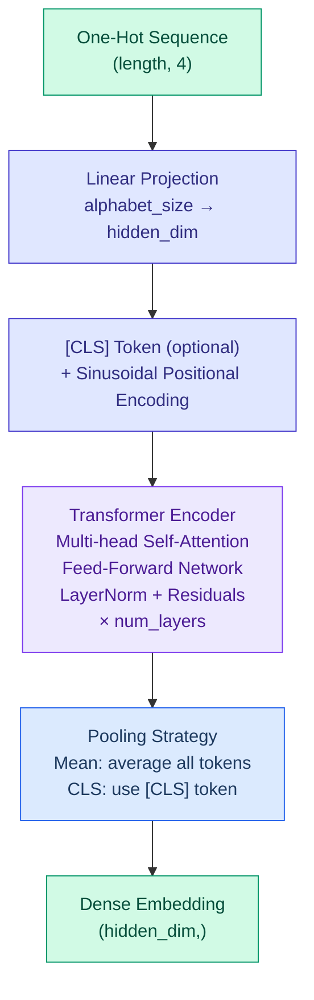

# DNA/RNA Foundation Model Operators

DiffBio provides differentiable foundation-model operators for DNA/RNA
sequences and single-cell expression. The current stable imported-model surface
is intentionally narrow: precomputed Geneformer and scGPT artifacts for
single-cell annotation and batch correction. Sequence/genomics adapters and
frozen benchmark paths exist as Phase 4 pre-promotion scaffold until genomics
realism and promotion evidence is attached.

These operators sit in DiffBio's biology-specific layer and reuse the wider
ecosystem stack: Datarax for operator contracts, Artifex for transformer/model
components, Opifex for advanced scientific-training workflows, and Calibrax for
benchmark evaluation.

<span class="operator-lm">Foundation Models</span> <span class="diff-high">Fully Differentiable</span>

## Overview

Foundation model operators convert nucleotide sequences and gene-expression
profiles into dense embeddings using transformer architectures:

- **TransformerSequenceEncoder**: BERT-style transformer for DNA/RNA sequence embedding
- **DifferentiableFoundationModel**: Geneformer/scGPT-style masked gene expression model
- **GeneTokenizer**: Geneformer-style rank-value gene tokenization via soft sorting
- **GeneformerPrecomputedAdapter**: strict adapter for externally generated
  Geneformer embeddings with explicit cell-order alignment
- **SequencePrecomputedAdapter**: strict base contract for imported sequence
  embedding artifacts with explicit sequence-order alignment
- **FrozenSequenceEncoderAdapter**: in-process benchmark adapter for a frozen
  DiffBio sequence encoder using the shared sequence adapter contract
- **DNABERT2PrecomputedAdapter**: strict adapter for precomputed DNABERT-2
  sequence embeddings
- **NucleotideTransformerPrecomputedAdapter**: strict adapter for precomputed
  Nucleotide Transformer sequence embeddings

## Post-DTI Stable Boundary

Post-DTI stable boundary: benchmark-backed operator support is separate from imported foundation-model promotion.

For Phase 7 domains, the stable surface is intentionally smaller than the
available experimental interfaces:

| Domain | Verified Capability | Stable Boundary |
|--------|---------------------|-----------------|
| Protein | secondary-structure scaffold context | excluded from stable imported protein-LM promotion |
| Multi-omics | seqFISH spatial deconvolution | benchmark-backed operator benchmark |
| Metabolomics | precomputed spectrum embedding alignment | not benchmark-promoted |

This boundary means that exported embedding alignment can exist as shared
infrastructure without implying checkpoint loading, tokenizer interchange, broad
fine-tuning, or unrelated biomedical language-model coverage. New post-DTI
domains move into stable support only when benchmark provenance, comparison
metadata, and regression checks are attached.

## Experimental Foundation-Model Boundary

Experimental foundation-model boundary: long-context sequence models,
Hyena-style systems, external native_trainable checkpoint import, PEFT, and
LoRA are not stable DiffBio support.

The only public namespace for these capabilities is
`diffbio.operators.foundation_models.experimental`. That namespace currently
exposes policy records, not runtime implementations. The stable
`native_trainable` adapter mode remains limited to DiffBio-native operators and
does not imply external checkpoint conversion or checkpoint-compatible training.

| Experimental Capability | Current Boundary |
|-------------------------|------------------|
| long-context sequence models | benchmark-unverified; excluded from stable support |
| Hyena-style sequence models | benchmark-unverified; excluded from stable support |
| external native_trainable checkpoint import | benchmark-unverified; excluded from stable support |
| PEFT fine-tuning utilities | not shipped as stable DiffBio support |
| LoRA adaptation utilities | not shipped as stable DiffBio support |

Promotion out of the experimental namespace requires one shared checklist:
explicit experimental namespace, canonical artifact provenance, downstream
benchmark suite, Calibrax regression guard, shared audit bundle, and stable
documentation update. Until all criteria are attached, stable docs and APIs must
continue to describe these items as excluded experimental scope.

## Imported Single-Cell Workflows

DiffBio's current stable imported single-cell foundation-model workflow is
**precomputed artifact integration**. The supported adapters today are
`GeneformerPrecomputedAdapter` and `ScGPTPrecomputedAdapter`, which load saved
embedding matrices and align them to benchmark or dataset cell IDs before
downstream evaluation.

This intentionally does **not** claim generic Geneformer checkpoint loading,
tokenizer interchangeability, or arbitrary fine-tuning support. The stable
contract today is:

1. upstream model produces a cell embedding artifact
2. artifact stores `embeddings` and `cell_ids`
3. DiffBio aligns rows to the dataset order
4. downstream DiffBio operators and benchmarks consume the aligned embeddings

## Single-Cell Support Matrix

This is the canonical support matrix for imported single-cell foundation-model
work. It is derived from the shared benchmark harness and contract tests, not
from intended future scope.

| Adapter | Stable Mode | Verified Downstream Tasks | Stable Scope Exclusions |
|---------|-------------|---------------------------|-------------------------|
| `GeneformerPrecomputedAdapter` | `precomputed` | `cell_annotation`, `batch_correction` | generic checkpoint loading, tokenizer interchange, generic fine-tuning |
| `ScGPTPrecomputedAdapter` | `precomputed` | `cell_annotation`, `batch_correction` | generic checkpoint loading, tokenizer interchange, generic fine-tuning |

`GRN transfer` remains planned in the single-cell suite scenarios, but it is
not yet a stable imported-model claim because the imported foundation-model
path is only benchmarked today on annotation and batch correction. Phase 3
keeps GRN outside stable imported-model promotion until a dedicated foundation-aware GRN harness exists.

### Precomputed Adapter Examples

```python
from pathlib import Path

from diffbio.operators.foundation_models import (
    GeneformerPrecomputedAdapter,
    ScGPTPrecomputedAdapter,
)

geneformer_adapter = GeneformerPrecomputedAdapter(
    artifact_path=Path("geneformer_embeddings.npz"),
    artifact_id="geneformer.v1",
    preprocessing_version="rank_value_v1",
)

scgpt_adapter = ScGPTPrecomputedAdapter(
    artifact_path=Path("scgpt_embeddings.npz"),
    artifact_id="scgpt.v1",
    preprocessing_version="gene_vocab_v1",
)

aligned_embeddings = geneformer_adapter.load_aligned_embeddings(
    reference_cell_ids=dataset_cell_ids,
)
metadata = scgpt_adapter.result_data()["foundation_model"]
```

The artifact metadata stays explicit:

- `model_family`: `single_cell_transformer`
- `adapter_mode`: `precomputed`
- `artifact_id`: upstream artifact/version identifier
- `preprocessing_version`: tokenizer or preprocessing version used upstream
- `pooling_strategy`: pooling used to generate the exported embedding

## Imported Sequence Workflows

DiffBio now also exposes a shared sequence benchmark adapter contract. These
Phase 4 pre-promotion scaffold integrations are available for interface
validation and benchmark development:

- `SequencePrecomputedAdapter` for aligned imported artifacts
- `DNABERT2PrecomputedAdapter` for DNABERT-2-style exported embeddings
- `NucleotideTransformerPrecomputedAdapter` for exported Nucleotide
  Transformer embeddings
- `FrozenSequenceEncoderAdapter` for in-process DiffBio sequence encoders that
  must be benchmarked as frozen feature extractors

The current pre-promotion promise is still narrow:

1. an upstream sequence model exports a rank-2 embedding matrix
2. the artifact optionally stores `sequence_ids`
3. DiffBio aligns rows to the benchmark sequence order or runs a frozen
   in-process sequence encoder through the same contract
4. downstream genomics benchmarks consume those sequence embeddings

This does **not** mean arbitrary DNABERT-2 or Nucleotide Transformer
checkpoints are already supported in-process, and it does not mean genomics has
been promoted as a stable imported-model domain. The sequence surface today is
interface validation over precomputed artifacts plus DiffBio-native frozen
in-process sequence encoder benchmarking. Phase 4 must attach dataset
provenance, realism, and promotion evidence before genomics can be described as
stable.

## Genomics Scaffold Support Matrix

This scaffold support matrix is derived from the genomics foundation benchmark
harness and contract tests. It is intentionally not a stable genomics support
matrix until Phase 4 promotion evidence exists.

| Adapter | Adapter Mode | Verified Scaffold Tasks | Scope Exclusions |
|---------|--------------|--------------------------|------------------|
| `FrozenSequenceEncoderAdapter` | `frozen_encoder` | `promoter`, `tfbs`, `splice_site` | external frozen checkpoint import, stable genomics promotion |
| `DNABERT2PrecomputedAdapter` | `precomputed` | `promoter`, `tfbs`, `splice_site` | generic checkpoint loading, tokenizer interchange, stable genomics promotion |
| `NucleotideTransformerPrecomputedAdapter` | `precomputed` | `promoter`, `tfbs`, `splice_site` | generic checkpoint loading, tokenizer interchange, stable genomics promotion |

The expected artifact shape is:

- `embeddings`: `(n_sequences, embedding_dim)`
- `sequence_ids`: optional row identities for strict alignment

### Benchmark Usage

The single-cell foundation annotation and batch-correction benchmarks can both
consume the same adapter:

```python
from benchmarks.singlecell.bench_batch_correction import BatchCorrectionBenchmark
from benchmarks.singlecell.bench_foundation_annotation import (
    SingleCellFoundationAnnotationBenchmark,
)

annotation_result = SingleCellFoundationAnnotationBenchmark(
    quick=True,
    embedding_adapter=geneformer_adapter,
).run()

integration_result = BatchCorrectionBenchmark(
    quick=True,
    embedding_adapter=scgpt_adapter,
).run()
```

Both benchmarks emit the shared `foundation_model` metadata and promote the
canonical artifact fields into Calibrax tags for comparison and regression
tracking.

For suite-level transfer comparisons, DiffBio also provides a shared harness
that runs native DiffBio embeddings, Geneformer artifacts, and scGPT artifacts
through the same annotation and batch-correction contracts and builds a
deterministic report from stable metrics and artifact-aware tags:

```python
from benchmarks.singlecell.foundation_suite import (
    build_singlecell_foundation_suite_report,
    run_singlecell_foundation_suite,
)

results = run_singlecell_foundation_suite(
    quick=True,
    adapters={
        "geneformer_precomputed": geneformer_adapter,
        "scgpt_precomputed": scgpt_adapter,
    },
)
report = build_singlecell_foundation_suite_report(results)
```

That suite report also carries one canonical `deferred_tasks` block so planned
but unverified work stays explicit in stored artifacts. Today that means
`grn_transfer` is marked deferred from Phase 3 stable scope until a dedicated foundation-aware GRN harness exists.
When a stable-scope review is needed, the same suite report can be paired with
the stored Calibrax regression result to produce one promotion-review artifact
instead of a benchmark-specific summary path. Use
`build_singlecell_foundation_promotion_report()` for that review; it fails
closed when no Calibrax baseline exists unless baseline bootstrap is requested
explicitly.

When scGPT artifacts depend on explicit batch context, that requirement is
carried in benchmark metadata through `requires_batch_context`, `batch_key`,
and `context_version` so the comparison report stays explicit about the upstream
context contract.

For genomics, DiffBio now provides a three-task quick suite scaffold covering
promoter classification, TFBS classification, and splice-site classification.
That suite can run the native DiffBio sequence encoder, a frozen in-process
DiffBio sequence encoder, and the current precomputed DNABERT-2 and Nucleotide
Transformer adapters through the same deterministic reporting layer. This is
Phase 4 scaffold evidence, not a stable genomics promotion claim.

The genomics suite reports this boundary as machine-readable
`dataset_provenance`. The default `synthetic_genomics` scaffold records
`source_type`: `scaffold`, `curation_status`: `synthetic`,
`biological_validation`: `interface_validation_only`, and
`promotion_eligible`: `false`. Custom curated datasets must provide their own
provenance payload before they can enter the foundation-suite report path.
For promotion review, use `build_genomics_foundation_promotion_report()` so the
suite report is first persisted into the shared Calibrax guard store and checked
against an explicit baseline. Without an attached guard result, the shared
promotion artifact remains a non-candidate by construction.

## TransformerSequenceEncoder

Differentiable transformer encoder for nucleotide sequences. It converts
one-hot encoded DNA or RNA inputs into dense embeddings for downstream
bioinformatics tasks and the shared frozen-adapter benchmark path.

The encoder reuses Artifex's transformer core rather than maintaining a
parallel generic transformer implementation inside DiffBio.

### Architecture



### Quick Start

```python
from flax import nnx
import jax
import jax.numpy as jnp
from diffbio.operators.foundation_models import (
    TransformerSequenceEncoder,
    TransformerSequenceEncoderConfig,
    create_dna_encoder,
    create_rna_encoder,
)

# Create DNA encoder using factory function
encoder = create_dna_encoder(
    hidden_dim=256,
    num_layers=4,
    num_heads=4,
)

# Prepare one-hot encoded DNA sequence
# A=0, C=1, G=2, T=3
seq_len = 100
sequence_indices = jax.random.randint(
    jax.random.PRNGKey(0), (seq_len,), 0, 4
)
sequence = jax.nn.one_hot(sequence_indices, num_classes=4)

# Apply encoder
data = {"sequence": sequence}
result, state, metadata = encoder.apply(data, {}, None)

# Get embeddings
global_embedding = result["embeddings"]       # (256,)
token_embeddings = result["token_embeddings"]  # (100, 256)
foundation_metadata = result["foundation_model"]
```

### Configuration

| Parameter | Type | Default | Description |
|-----------|------|---------|-------------|
| `hidden_dim` | int | 256 | Dimension of hidden states and embeddings |
| `num_layers` | int | 4 | Number of transformer encoder layers |
| `num_heads` | int | 4 | Number of attention heads |
| `intermediate_dim` | int | 1024 | FFN intermediate dimension |
| `max_length` | int | 512 | Maximum sequence length |
| `alphabet_size` | int | 4 | Size of nucleotide alphabet |
| `dropout_rate` | float | 0.1 | Dropout rate for regularization |
| `pooling` | str | "mean" | Pooling strategy ("mean" or "cls") |

### Input/Output Formats

**Input**

| Key | Shape | Description |
|-----|-------|-------------|
| `sequence` | (length, 4) or (batch, length, 4) | One-hot encoded nucleotide sequence |
| `attention_mask` | (length,) or (batch, length) | Optional attention mask (1=valid, 0=padded) |

**Output**

| Key | Shape | Description |
|-----|-------|-------------|
| `sequence` | same as input | Original input sequence |
| `embeddings` | (hidden_dim,) or (batch, hidden_dim) | Global sequence embedding |
| `token_embeddings` | (length, hidden_dim) or (batch, length, hidden_dim) | Per-position hidden states |
| `foundation_model` | metadata dict | JIT-safe artifact metadata for model family, artifact ID, preprocessing version, adapter mode, and pooling strategy |

### Factory Functions

DiffBio provides convenient factory functions for common use cases:

```python
# DNA encoder (A, C, G, T)
dna_encoder = create_dna_encoder(
    hidden_dim=256,
    num_layers=4,
    num_heads=4,
    pooling="mean",
)

# RNA encoder (A, C, G, U)
rna_encoder = create_rna_encoder(
    hidden_dim=512,
    num_layers=8,
    num_heads=8,
    pooling="cls",
)
```

### Pooling Strategies

#### Mean Pooling

Averages all token representations. Works well for variable-length sequences and tasks where global context matters.

```python
config = TransformerSequenceEncoderConfig(pooling="mean")
encoder = TransformerSequenceEncoder(config, rngs=nnx.Rngs(42))
```

#### CLS Token Pooling

Uses a learnable [CLS] token prepended to the sequence, following BERT-style models.

```python
config = TransformerSequenceEncoderConfig(pooling="cls")
encoder = TransformerSequenceEncoder(config, rngs=nnx.Rngs(42))
```

### Attention Masking

For variable-length sequences with padding:

```python
# Sequence of length 80, padded to 100
sequence = jnp.zeros((100, 4))
sequence = sequence.at[:80].set(actual_one_hot_sequence)

# Create mask (1 for valid positions, 0 for padding)
mask = jnp.concatenate([jnp.ones(80), jnp.zeros(20)])

data = {"sequence": sequence, "attention_mask": mask}
result, _, _ = encoder.apply(data, {}, None)
```

### Training Example

```python
import optax
from flax import nnx

encoder = create_dna_encoder(hidden_dim=128, num_layers=2)
optimizer = optax.adam(1e-4)
opt_state = optimizer.init(nnx.state(encoder, nnx.Param))

def loss_fn(model, sequence, target_embedding):
    """MSE loss for embedding similarity."""
    data = {"sequence": sequence}
    result, _, _ = model.apply(data, {}, None)
    return jnp.mean((result["embeddings"] - target_embedding) ** 2)

@nnx.jit
def train_step(model, opt_state, sequence, target):
    loss, grads = nnx.value_and_grad(loss_fn)(model, sequence, target)
    params = nnx.state(model, nnx.Param)
    updates, opt_state = optimizer.update(grads, opt_state, params)
    nnx.update(model, optax.apply_updates(params, updates))
    return loss, opt_state
```

### Gradient Flow

The encoder is fully differentiable with respect to both input sequences and model parameters:

```python
# Gradients w.r.t. input sequence (for sequence optimization)
def embedding_loss(seq):
    result, _, _ = encoder.apply({"sequence": seq}, {}, None)
    return result["embeddings"].sum()

# Use soft one-hot (probabilities) for gradient flow
logits = jax.random.normal(jax.random.PRNGKey(0), (100, 4))
soft_sequence = jax.nn.softmax(logits, axis=-1)

grads = jax.grad(embedding_loss)(soft_sequence)
```

### Illustrative Configuration Scales

| Model | hidden_dim | num_layers | num_heads | intermediate_dim |
|-------|------------|------------|-----------|------------------|
| Small (default) | 256 | 4 | 4 | 1024 |
| Medium | 512 | 8 | 8 | 2048 |
| Large | 768 | 12 | 12 | 3072 |

## DifferentiableFoundationModel

Geneformer/scGPT-inspired masked gene expression model for single-cell genomics. Tokenizes gene expression via rank-value encoding, embeds gene identities and expression values, applies random masking, and predicts masked values through a transformer encoder.

### Quick Start

```python
from diffbio.operators.foundation_models import (
    DifferentiableFoundationModel, FoundationModelConfig,
)

config = FoundationModelConfig(
    n_genes=2000,
    hidden_dim=128,
    num_layers=2,
    num_heads=4,
    mask_ratio=0.15,
)

model = DifferentiableFoundationModel(
    config, rngs=nnx.Rngs(params=0, sample=1, dropout=2)
)
rp = model.generate_random_params(jax.random.key(0), {"counts": (100, 2000)})
data = {"counts": counts, "gene_ids": jnp.arange(2000)}
result, state, metadata = model.apply(data, {}, None, random_params=rp)

cell_embeddings = result["embeddings"]             # (n_cells, hidden_dim)
gene_context = result["token_embeddings"]          # (n_cells, n_genes, hidden_dim)
predicted = result["predicted_expression"]         # (n_cells, n_genes)
foundation_metadata = result["foundation_model"]
```

### Configuration

| Parameter | Type | Default | Description |
|-----------|------|---------|-------------|
| `n_genes` | int | 2000 | Number of genes in vocabulary |
| `hidden_dim` | int | 128 | Hidden states and embeddings dimension |
| `num_layers` | int | 2 | Transformer encoder layers |
| `num_heads` | int | 4 | Attention heads |
| `mask_ratio` | float | 0.15 | Fraction of genes to mask |
| `dropout_rate` | float | 0.1 | Dropout rate |

### Algorithm

1. **Tokenize**: Rank genes by expression via soft sort (Geneformer-style)
2. **Embed gene IDs** via token embedding layer
3. **Add expression projection**: scalar values projected to hidden_dim (scGPT-style)
4. **Random mask**: Replace masked gene embeddings with learned mask token
5. **Transformer encoder**: Contextualize gene representations
6. **Predict**: Linear output head predicts masked expression
7. **Cell embedding**: Mean pooling of non-masked gene representations

## GeneTokenizer

Geneformer-style rank-value gene tokenizer using differentiable soft sorting. Converts gene expression vectors into rank-ordered soft permutation matrices.

### Quick Start

```python
from diffbio.operators.foundation_models import GeneTokenizer

tokenizer = GeneTokenizer(n_genes=2000, rngs=nnx.Rngs(0))

# Compute soft permutation for one cell
permutation = tokenizer(expression, temperature=1.0)  # (n_genes, n_genes)
# permutation[i, j] = probability gene j occupies rank i (descending)
```

At low temperature the soft permutation approaches the hard argsort. The key insight from Geneformer: token IDs are gene indices sorted by expression magnitude.

## Use Cases

| Application | Description |
|-------------|-------------|
| Sequence classification | Classify DNA/RNA sequences using the global embedding |
| Variant effect prediction | Encode sequences with/without variants and compare embeddings |
| Motif discovery | Analyze token embeddings for learned sequence features |
| Transfer learning | Use pre-trained embeddings for downstream tasks |
| Sequence similarity | Compute similarity between sequence embeddings |
| Cell embedding | DifferentiableFoundationModel produces per-cell embeddings from expression |
| Gene program discovery | Contextual token embeddings capture cell-specific co-regulation structure |
| Masked expression prediction | Self-supervised pre-training on gene expression |

## References

1. Ji, Y. et al. (2021). "DNABERT: pre-trained Bidirectional Encoder Representations from Transformers model for DNA-language in genome." *Bioinformatics* 37, 2112-2120.

2. Zhou, Z. et al. (2023). "DNABERT-2: Efficient Foundation Model and Benchmark For Multi-Species Genome." arXiv:2306.15006.

## Next Steps

- See [Protein Structure Operators](protein.md) for protein analysis
- Explore [Statistical Operators](statistical.md) for downstream analysis
- Check [Normalization Operators](normalization.md) for embedding post-processing
