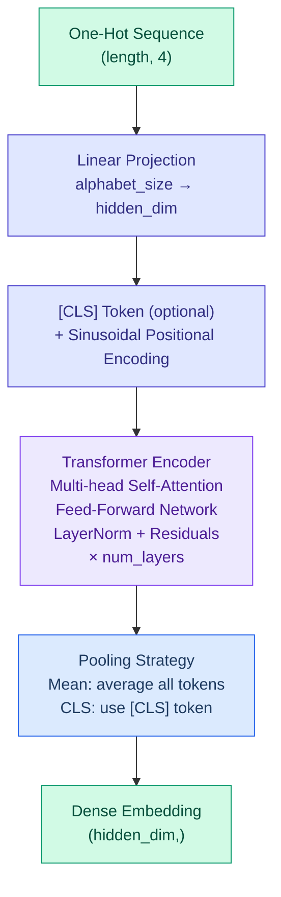

# DNA/RNA Language Model Operators

DiffBio provides differentiable transformer-based sequence encoders following DNABERT and RNA-FM architecture patterns for embedding DNA/RNA sequences.

<span class="operator-lm">Language Models</span> <span class="diff-high">Fully Differentiable</span>

## Overview

Language model operators convert nucleotide sequences into dense embeddings using transformer architectures:

- **TransformerSequenceEncoder**: BERT-style transformer for DNA/RNA sequence embedding
- **DifferentiableFoundationModel**: Geneformer/scGPT-style masked gene expression model
- **GeneTokenizer**: Geneformer-style rank-value gene tokenization via soft sorting

## TransformerSequenceEncoder

Differentiable transformer encoder following DNABERT/RNA-FM patterns. Converts one-hot encoded nucleotide sequences into dense embeddings suitable for downstream bioinformatics tasks.

### Architecture



### Quick Start

```python
from flax import nnx
import jax
import jax.numpy as jnp
from diffbio.operators.language_models import (
    TransformerSequenceEncoder,
    TransformerSequenceEncoderConfig,
    create_dna_encoder,
    create_rna_encoder,
)

# Create DNA encoder using factory function
encoder = create_dna_encoder(
    hidden_dim=256,
    num_layers=4,
    num_heads=4,
)

# Prepare one-hot encoded DNA sequence
# A=0, C=1, G=2, T=3
seq_len = 100
sequence_indices = jax.random.randint(
    jax.random.PRNGKey(0), (seq_len,), 0, 4
)
sequence = jax.nn.one_hot(sequence_indices, num_classes=4)

# Apply encoder
data = {"sequence": sequence}
result, state, metadata = encoder.apply(data, {}, None)

# Get embeddings
global_embedding = result["embedding"]       # (256,)
position_embeddings = result["position_embeddings"]  # (100, 256)
```

### Configuration

| Parameter | Type | Default | Description |
|-----------|------|---------|-------------|
| `hidden_dim` | int | 256 | Dimension of hidden states and embeddings |
| `num_layers` | int | 4 | Number of transformer encoder layers |
| `num_heads` | int | 4 | Number of attention heads |
| `intermediate_dim` | int | 1024 | FFN intermediate dimension |
| `max_length` | int | 512 | Maximum sequence length |
| `alphabet_size` | int | 4 | Size of nucleotide alphabet |
| `dropout_rate` | float | 0.1 | Dropout rate for regularization |
| `pooling` | str | "mean" | Pooling strategy ("mean" or "cls") |

### Input/Output Formats

**Input**

| Key | Shape | Description |
|-----|-------|-------------|
| `sequence` | (length, 4) or (batch, length, 4) | One-hot encoded nucleotide sequence |
| `attention_mask` | (length,) or (batch, length) | Optional attention mask (1=valid, 0=padded) |

**Output**

| Key | Shape | Description |
|-----|-------|-------------|
| `sequence` | same as input | Original input sequence |
| `embedding` | (hidden_dim,) or (batch, hidden_dim) | Global sequence embedding |
| `position_embeddings` | (length, hidden_dim) or (batch, length, hidden_dim) | Per-position hidden states |

### Factory Functions

DiffBio provides convenient factory functions for common use cases:

```python
# DNA encoder (A, C, G, T)
dna_encoder = create_dna_encoder(
    hidden_dim=256,
    num_layers=4,
    num_heads=4,
    pooling="mean",
)

# RNA encoder (A, C, G, U)
rna_encoder = create_rna_encoder(
    hidden_dim=640,  # RNA-FM style
    num_layers=12,
    num_heads=20,
    pooling="cls",
)
```

### Pooling Strategies

#### Mean Pooling

Averages all token representations. Works well for variable-length sequences and tasks where global context matters.

```python
config = TransformerSequenceEncoderConfig(pooling="mean")
encoder = TransformerSequenceEncoder(config, rngs=nnx.Rngs(42))
```

#### CLS Token Pooling

Uses a learnable [CLS] token prepended to the sequence, following BERT-style models.

```python
config = TransformerSequenceEncoderConfig(pooling="cls")
encoder = TransformerSequenceEncoder(config, rngs=nnx.Rngs(42))
```

### Attention Masking

For variable-length sequences with padding:

```python
# Sequence of length 80, padded to 100
sequence = jnp.zeros((100, 4))
sequence = sequence.at[:80].set(actual_one_hot_sequence)

# Create mask (1 for valid positions, 0 for padding)
mask = jnp.concatenate([jnp.ones(80), jnp.zeros(20)])

data = {"sequence": sequence, "attention_mask": mask}
result, _, _ = encoder.apply(data, {}, None)
```

### Training Example

```python
import optax
from flax import nnx

encoder = create_dna_encoder(hidden_dim=128, num_layers=2)
optimizer = optax.adam(1e-4)
opt_state = optimizer.init(nnx.state(encoder, nnx.Param))

def loss_fn(model, sequence, target_embedding):
    """MSE loss for embedding similarity."""
    data = {"sequence": sequence}
    result, _, _ = model.apply(data, {}, None)
    return jnp.mean((result["embedding"] - target_embedding) ** 2)

@nnx.jit
def train_step(model, opt_state, sequence, target):
    loss, grads = nnx.value_and_grad(loss_fn)(model, sequence, target)
    params = nnx.state(model, nnx.Param)
    updates, opt_state = optimizer.update(grads, opt_state, params)
    nnx.update(model, optax.apply_updates(params, updates))
    return loss, opt_state
```

### Gradient Flow

The encoder is fully differentiable with respect to both input sequences and model parameters:

```python
# Gradients w.r.t. input sequence (for sequence optimization)
def embedding_loss(seq):
    result, _, _ = encoder.apply({"sequence": seq}, {}, None)
    return result["embedding"].sum()

# Use soft one-hot (probabilities) for gradient flow
logits = jax.random.normal(jax.random.PRNGKey(0), (100, 4))
soft_sequence = jax.nn.softmax(logits, axis=-1)

grads = jax.grad(embedding_loss)(soft_sequence)
```

### Reference Architectures

| Model | hidden_dim | num_layers | num_heads | intermediate_dim |
|-------|------------|------------|-----------|------------------|
| DNABERT | 768 | 12 | 12 | 3072 |
| RNA-FM | 640 | 12 | 20 | 5120 |
| Small (default) | 256 | 4 | 4 | 1024 |

## DifferentiableFoundationModel

Geneformer/scGPT-inspired masked gene expression model for single-cell genomics. Tokenizes gene expression via rank-value encoding, embeds gene identities and expression values, applies random masking, and predicts masked values through a transformer encoder.

### Quick Start

```python
from diffbio.operators.language_models import (
    DifferentiableFoundationModel, FoundationModelConfig,
)

config = FoundationModelConfig(
    n_genes=2000,
    hidden_dim=128,
    num_layers=2,
    num_heads=4,
    mask_ratio=0.15,
)

model = DifferentiableFoundationModel(
    config, rngs=nnx.Rngs(params=0, sample=1, dropout=2)
)
rp = model.generate_random_params(jax.random.key(0), {"counts": (100, 2000)})
data = {"counts": counts, "gene_ids": jnp.arange(2000)}
result, state, metadata = model.apply(data, {}, None, random_params=rp)

cell_embeddings = result["cell_embeddings"]        # (n_cells, hidden_dim)
gene_embeddings = result["gene_embeddings"]        # (n_genes, hidden_dim)
predicted = result["predicted_expression"]         # (n_cells, n_genes)
```

### Configuration

| Parameter | Type | Default | Description |
|-----------|------|---------|-------------|
| `n_genes` | int | 2000 | Number of genes in vocabulary |
| `hidden_dim` | int | 128 | Hidden states and embeddings dimension |
| `num_layers` | int | 2 | Transformer encoder layers |
| `num_heads` | int | 4 | Attention heads |
| `mask_ratio` | float | 0.15 | Fraction of genes to mask |
| `dropout_rate` | float | 0.1 | Dropout rate |

### Algorithm

1. **Tokenize**: Rank genes by expression via soft sort (Geneformer-style)
2. **Embed gene IDs** via token embedding layer
3. **Add expression projection**: scalar values projected to hidden_dim (scGPT-style)
4. **Random mask**: Replace masked gene embeddings with learned mask token
5. **Transformer encoder**: Contextualize gene representations
6. **Predict**: Linear output head predicts masked expression
7. **Cell embedding**: Mean pooling of non-masked gene representations

## GeneTokenizer

Geneformer-style rank-value gene tokenizer using differentiable soft sorting. Converts gene expression vectors into rank-ordered soft permutation matrices.

### Quick Start

```python
from diffbio.operators.language_models import GeneTokenizer

tokenizer = GeneTokenizer(n_genes=2000, rngs=nnx.Rngs(0))

# Compute soft permutation for one cell
permutation = tokenizer(expression, temperature=1.0)  # (n_genes, n_genes)
# permutation[i, j] = probability gene j occupies rank i (descending)
```

At low temperature the soft permutation approaches the hard argsort. The key insight from Geneformer: token IDs are gene indices sorted by expression magnitude.

## Use Cases

| Application | Description |
|-------------|-------------|
| Sequence classification | Classify DNA/RNA sequences using the global embedding |
| Variant effect prediction | Encode sequences with/without variants and compare embeddings |
| Motif discovery | Analyze position embeddings for learned sequence features |
| Transfer learning | Use pre-trained embeddings for downstream tasks |
| Sequence similarity | Compute similarity between sequence embeddings |
| Cell embedding | DifferentiableFoundationModel produces per-cell embeddings from expression |
| Gene program discovery | Foundation model gene embeddings capture co-regulation |
| Masked expression prediction | Self-supervised pre-training on gene expression |

## References

1. Ji, Y. et al. (2021). "DNABERT: pre-trained Bidirectional Encoder Representations from Transformers model for DNA-language in genome." *Bioinformatics* 37, 2112-2120.

2. Chen, J. et al. (2022). "Interpretable RNA Foundation Model from Unannotated Data for Highly Accurate RNA Structure and Function Predictions." *Nature Methods*.

3. Zhou, Z. et al. (2023). "DNABERT-2: Efficient Foundation Model and Benchmark For Multi-Species Genome." arXiv:2306.15006.

## Next Steps

- See [Protein Structure Operators](protein.md) for protein analysis
- Explore [Statistical Operators](statistical.md) for downstream analysis
- Check [Normalization Operators](normalization.md) for embedding post-processing
