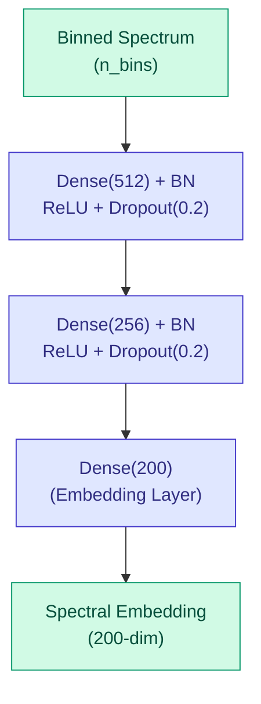

# Metabolomics Operators

DiffBio provides differentiable operators for metabolomics analysis, including spectral similarity computation using deep learning.

<span class="operator-metabolomics">Metabolomics</span> <span class="diff-high">Fully Differentiable</span>

## Overview

Metabolomics operators enable gradient-based optimization for mass spectrometry analysis:

- **DifferentiableSpectralSimilarity**: MS2DeepScore-style Siamese network for predicting molecular structural similarity from MS/MS spectra

## Metabolomics expansion scope

Experimental scope adds shared artifact handling for precomputed metabolomics embeddings
through `MetabolomicsEmbeddingSource`, which aligns imported spectrum
embeddings by `spectrum_ids`. This reuses the same indexed embedding substrate
as other imported artifacts and keeps spectrum-row identity explicit.

Post-DTI stable boundary: benchmark-backed operator support is separate from imported foundation-model promotion.

The metabolomics operator surface remains operator-tested but not yet benchmark-promoted.
`DifferentiableSpectralSimilarity` is available for
synthetic correctness and gradient checks, while stable benchmark promotion
requires a dedicated metabolomics benchmark with canonical provenance and
comparison metadata.

## DifferentiableSpectralSimilarity

Siamese neural network for predicting molecular structural similarity from tandem mass spectra (MS/MS), based on the MS2DeepScore architecture.

### Architecture

The network uses a shared encoder to generate spectral embeddings, then computes cosine similarity between pairs:



For paired spectra, cosine similarity is computed between embeddings to predict structural similarity (Tanimoto scores).

### Quick Start

```python
from flax import nnx
import jax
import jax.numpy as jnp
from diffbio.operators.metabolomics import (
    DifferentiableSpectralSimilarity,
    SpectralSimilarityConfig,
    create_spectral_similarity,
    bin_spectrum,
)

# Configure network
config = SpectralSimilarityConfig(
    n_bins=1000,              # m/z bins (0-1000 at 1 m/z resolution)
    embedding_dim=200,        # Embedding dimension
    hidden_dims=(512, 256),   # Hidden layer sizes
    dropout_rate=0.2,         # Dropout for regularization
)

# Create operator
rngs = nnx.Rngs(42)
operator = DifferentiableSpectralSimilarity(config, rngs=rngs)

# Prepare binned spectra (already discretized)
spectra = jax.random.uniform(jax.random.PRNGKey(0), (10, 1000))

# Get embeddings
data = {"spectra": spectra}
result, state, metadata = operator.apply(data, {}, None)
embeddings = result["embeddings"]  # (10, 200)

# Compute pairwise similarity
spectra_a = jax.random.uniform(jax.random.PRNGKey(0), (5, 1000))
spectra_b = jax.random.uniform(jax.random.PRNGKey(1), (5, 1000))

data = {"spectra_a": spectra_a, "spectra_b": spectra_b}
result, _, _ = operator.apply(data, {}, None)
similarity = result["similarity_scores"]  # (5,) in [-1, 1]
```

### Configuration

| Parameter | Type | Default | Description |
|-----------|------|---------|-------------|
| `n_bins` | int | 1000 | Number of m/z bins for spectrum discretization |
| `embedding_dim` | int | 200 | Dimension of spectral embeddings |
| `hidden_dims` | tuple[int, ...] | (512, 256) | Hidden layer dimensions |
| `dropout_rate` | float | 0.2 | Dropout rate for regularization |
| `min_mz` | float | 0.0 | Minimum m/z value for binning |
| `max_mz` | float | 1000.0 | Maximum m/z value for binning |
| `use_batch_norm` | bool | True | Whether to use batch normalization |

### Spectrum Binning

Mass spectra must be discretized into fixed-width bins before processing:

```python
from diffbio.operators.metabolomics import bin_spectrum

# Raw spectrum: m/z values and intensities
mz_values = jnp.array([100.0, 200.0, 300.0, 400.0, 500.0])
intensities = jnp.array([0.5, 1.0, 0.3, 0.8, 0.6])

# Bin into 1000 bins from 0-1000 m/z
binned = bin_spectrum(
    mz_values,
    intensities,
    n_bins=1000,
    min_mz=0.0,
    max_mz=1000.0,
    normalize=True,  # Normalize to max=1.0
)

# binned.shape == (1000,)
```

### Input/Output Formats

**Single Spectra Mode (Embedding Generation)**

| Input Key | Shape | Description |
|-----------|-------|-------------|
| `spectra` | (n, n_bins) | Binned mass spectra |

| Output Key | Shape | Description |
|------------|-------|-------------|
| `spectra` | (n, n_bins) | Original input spectra |
| `embeddings` | (n, embedding_dim) | Spectral embeddings |

**Paired Spectra Mode (Similarity Computation)**

| Input Key | Shape | Description |
|-----------|-------|-------------|
| `spectra_a` | (n, n_bins) | First set of binned spectra |
| `spectra_b` | (n, n_bins) | Second set of binned spectra |

| Output Key | Shape | Description |
|------------|-------|-------------|
| `spectra_a` | (n, n_bins) | Original first spectra |
| `spectra_b` | (n, n_bins) | Original second spectra |
| `embeddings_a` | (n, embedding_dim) | First set embeddings |
| `embeddings_b` | (n, embedding_dim) | Second set embeddings |
| `similarity_scores` | (n,) | Cosine similarity in [-1, 1] |

### Training

```python
import optax
from flax import nnx

operator = create_spectral_similarity(n_bins=1000, embedding_dim=200)
optimizer = optax.adam(1e-3)
opt_state = optimizer.init(nnx.state(operator, nnx.Param))

def loss_fn(model, spectra_a, spectra_b, target_tanimoto):
    """MSE loss between predicted and actual Tanimoto scores."""
    emb_a = model.encode(spectra_a)
    emb_b = model.encode(spectra_b)
    predicted = model.cosine_similarity(emb_a, emb_b)
    return jnp.mean((predicted - target_tanimoto) ** 2)

@nnx.jit
def train_step(model, opt_state, batch):
    spectra_a, spectra_b, targets = batch
    loss, grads = nnx.value_and_grad(loss_fn)(model, spectra_a, spectra_b, targets)
    params = nnx.state(model, nnx.Param)
    updates, opt_state = optimizer.update(grads, opt_state, params)
    nnx.update(model, optax.apply_updates(params, updates))
    return loss, opt_state

# Training loop
for epoch in range(100):
    for batch in train_dataloader:
        loss, opt_state = train_step(operator, opt_state, batch)
```

### Batch Processing

```python
# Compute all pairwise similarities
n_spectra = 100
spectra = jax.random.uniform(jax.random.PRNGKey(0), (n_spectra, 1000))

# Get all embeddings first
result, _, _ = operator.apply({"spectra": spectra}, {}, None)
embeddings = result["embeddings"]

# Compute similarity matrix using cosine similarity
norms = jnp.linalg.norm(embeddings, axis=-1, keepdims=True)
normalized = embeddings / jnp.maximum(norms, 1e-8)
similarity_matrix = normalized @ normalized.T  # (100, 100)
```

## Use Cases

| Application | Operator | Description |
|-------------|----------|-------------|
| Library matching | DifferentiableSpectralSimilarity | Find similar known compounds |
| Molecular networking | DifferentiableSpectralSimilarity | Cluster related metabolites |
| Compound identification | DifferentiableSpectralSimilarity | Predict structural similarity |
| Spectral clustering | DifferentiableSpectralSimilarity | Group spectra by embedding |

## References

1. Huber et al. (2021). "MS2DeepScore: a novel deep learning similarity measure to compare tandem mass spectra." *Journal of Cheminformatics*.

2. de Jonge et al. (2024). "MS2DeepScore 2.0: Cross-ionization mode chemical similarity prediction." *bioRxiv*.

## Next Steps

- See [Statistical Operators](statistical.md) for related analysis methods
- Explore [Normalization Operators](normalization.md) for data preprocessing
