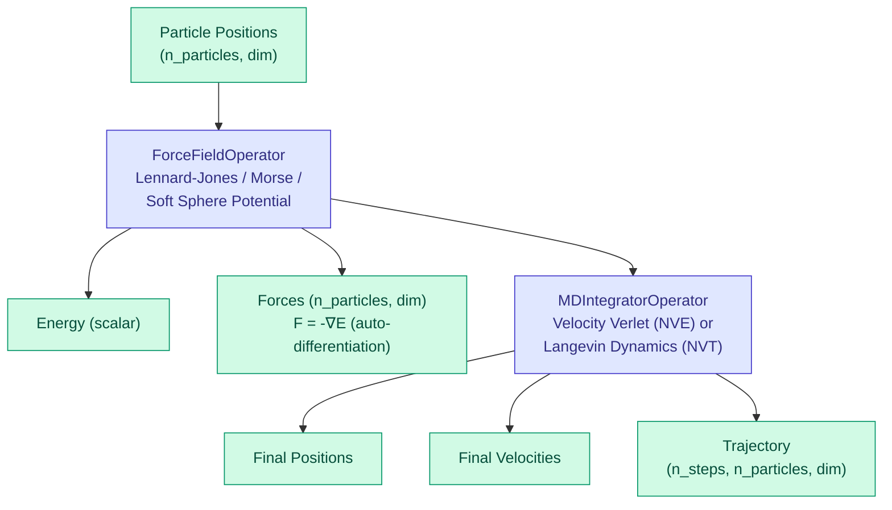

# Molecular Dynamics Operators

DiffBio provides differentiable operators for molecular dynamics simulations, wrapping JAX-MD for seamless integration with DiffBio pipelines.

<span class="operator-md">Molecular Dynamics</span> <span class="diff-high">Fully Differentiable</span>

## Overview

Molecular dynamics operators enable gradient-based optimization of molecular simulations:

- **ForceFieldOperator**: Compute energies and forces from particle positions
- **MDIntegratorOperator**: Time integration for MD simulations (NVE, NVT)

## Architecture



## ForceFieldOperator

Computes potential energy and forces for a system of particles using classical pairwise potentials.

### Quick Start

```python
from flax import nnx
import jax
import jax.numpy as jnp
from diffbio.operators.molecular_dynamics import (
    ForceFieldOperator,
    ForceFieldConfig,
    PotentialType,
    create_force_field,
)

# Create force field operator
force_field = create_force_field(
    potential_type=PotentialType.LENNARD_JONES,
    sigma=1.0,        # Particle diameter
    epsilon=1.0,      # Well depth
    box_size=10.0,    # Periodic box size
)

# Generate random particle positions
n_particles = 20
dim = 3
key = jax.random.PRNGKey(0)
positions = jax.random.uniform(key, (n_particles, dim), minval=0, maxval=10.0)

# Compute energy and forces
data = {"positions": positions}
result, state, metadata = force_field.apply(data, {}, None)

energy = result["energy"]   # Scalar total energy
forces = result["forces"]   # (n_particles, dim) force vectors
```

### Configuration

| Parameter | Type | Default | Description |
|-----------|------|---------|-------------|
| `potential_type` | str | "lennard_jones" | Potential type: "lennard_jones", "morse", "soft_sphere" |
| `sigma` | float | 1.0 | Length scale parameter (particle diameter) |
| `epsilon` | float | 1.0 | Energy scale parameter (well depth) |
| `cutoff` | float \| None | 2.5 | Cutoff distance (units of sigma). None for no cutoff |
| `box_size` | float \| None | None | Periodic box size. None for free boundaries |
| `alpha` | float | 5.0 | Morse potential width parameter |

### Supported Potentials

#### Lennard-Jones (12-6)

Standard potential for van der Waals interactions:

$$V(r) = 4\epsilon \left[ \left(\frac{\sigma}{r}\right)^{12} - \left(\frac{\sigma}{r}\right)^{6} \right]$$

```python
lj_field = create_force_field(
    potential_type=PotentialType.LENNARD_JONES,
    sigma=1.0,
    epsilon=1.0,
    cutoff=2.5,
)
```

#### Soft Sphere

Purely repulsive potential:

```python
soft_field = create_force_field(
    potential_type=PotentialType.SOFT_SPHERE,
    sigma=1.0,
    epsilon=1.0,
)
```

#### Morse Potential

For bonded interactions with anharmonicity:

```python
morse_field = create_force_field(
    potential_type=PotentialType.MORSE,
    sigma=1.0,      # Equilibrium distance
    epsilon=1.0,    # Well depth
    alpha=5.0,      # Width parameter
)
```

### Input/Output Formats

**Input**

| Key | Shape | Description |
|-----|-------|-------------|
| `positions` | (n_particles, dim) or (batch, n_particles, dim) | Particle positions |

**Output**

| Key | Shape | Description |
|-----|-------|-------------|
| `positions` | same as input | Original positions |
| `energy` | () or (batch,) | Total potential energy |
| `forces` | same as positions | Force vectors (F = -∇E) |

## MDIntegratorOperator

Evolves particle positions and velocities over time using molecular dynamics integration.

### Quick Start

```python
from diffbio.operators.molecular_dynamics import (
    MDIntegratorOperator,
    MDIntegratorConfig,
    create_integrator,
    create_verlet_integrator,
)

# Create velocity Verlet integrator
integrator = create_verlet_integrator(
    dt=0.001,         # Time step
    n_steps=1000,     # Number of steps
    box_size=10.0,    # Periodic box size
    sigma=1.0,        # LJ sigma
    epsilon=1.0,      # LJ epsilon
)

# Initial conditions
n_particles = 20
dim = 3
key = jax.random.PRNGKey(0)
key1, key2 = jax.random.split(key)
positions = jax.random.uniform(key1, (n_particles, dim), minval=2, maxval=8.0)
velocities = jax.random.normal(key2, (n_particles, dim)) * 0.1

# Run simulation
data = {"positions": positions, "velocities": velocities}
result, state, metadata = integrator.apply(data, {}, None)

final_positions = result["positions"]    # Final positions
final_velocities = result["velocities"]  # Final velocities
trajectory = result["trajectory"]        # (n_steps+1, n_particles, dim)
```

### Configuration

| Parameter | Type | Default | Description |
|-----------|------|---------|-------------|
| `integrator_type` | str | "velocity_verlet" | Integrator: "velocity_verlet" (NVE), "nvt_langevin" (NVT) |
| `dt` | float | 0.001 | Time step |
| `n_steps` | int | 100 | Number of integration steps |
| `box_size` | float \| None | 10.0 | Periodic box size |
| `potential_type` | str | "lennard_jones" | Potential type |
| `sigma` | float | 1.0 | Potential length scale |
| `epsilon` | float | 1.0 | Potential energy scale |
| `mass` | float | 1.0 | Particle mass (uniform) |
| `kT` | float | 1.0 | Thermal energy (for Langevin) |
| `gamma` | float | 1.0 | Friction coefficient (for Langevin) |

### Integrator Types

#### Velocity Verlet (NVE)

Symplectic integrator for microcanonical ensemble (constant energy):

```python
nve_integrator = create_integrator(
    integrator_type="velocity_verlet",
    dt=0.001,
    n_steps=1000,
)
```

#### Langevin Dynamics (NVT)

Stochastic integrator for canonical ensemble (constant temperature):

```python
nvt_integrator = create_integrator(
    integrator_type="nvt_langevin",
    dt=0.001,
    n_steps=1000,
    kT=1.0,       # Temperature
    gamma=1.0,    # Friction
)
```

### Input/Output Formats

**Input**

| Key | Shape | Description |
|-----|-------|-------------|
| `positions` | (n_particles, dim) | Initial particle positions |
| `velocities` | (n_particles, dim) | Initial particle velocities |

**Output**

| Key | Shape | Description |
|-----|-------|-------------|
| `positions` | (n_particles, dim) | Final particle positions |
| `velocities` | (n_particles, dim) | Final particle velocities |
| `trajectory` | (n_steps+1, n_particles, dim) | Position trajectory |

## Gradient-Based Optimization

### Optimizing Initial Conditions

```python
import optax
from flax import nnx

integrator = create_verlet_integrator(dt=0.001, n_steps=100, box_size=10.0)

def loss_fn(positions, velocities):
    """Loss based on final energy."""
    result, _, _ = integrator.apply(
        {"positions": positions, "velocities": velocities},
        {}, None
    )
    # Example: minimize distance from target configuration
    target = jnp.zeros_like(result["positions"])
    return jnp.mean((result["positions"] - target) ** 2)

# Compute gradients
grads = jax.grad(loss_fn, argnums=0)(positions, velocities)
```

### Training with Force Field Parameters

```python
from flax import nnx

# Create learnable force field
config = ForceFieldConfig(potential_type="lennard_jones", box_size=10.0)
force_field = ForceFieldOperator(config, rngs=nnx.Rngs(42))

# Add learnable parameter (e.g., epsilon)
force_field.epsilon = nnx.Param(jnp.array(1.0))

optimizer = optax.adam(1e-3)
opt_state = optimizer.init(nnx.state(force_field, nnx.Param))

def loss_fn(model, positions, target_energy):
    result, _, _ = model.apply({"positions": positions}, {}, None)
    return (result["energy"] - target_energy) ** 2

@nnx.jit
def train_step(model, opt_state, positions, target):
    loss, grads = nnx.value_and_grad(loss_fn)(model, positions, target)
    params = nnx.state(model, nnx.Param)
    updates, opt_state = optimizer.update(grads, opt_state, params)
    nnx.update(model, optax.apply_updates(params, updates))
    return loss, opt_state
```

## Boundary Conditions

### Periodic Boundaries

For simulating bulk systems:

```python
# Periodic box of size 10
force_field = create_force_field(box_size=10.0)
```

### Free Boundaries

For isolated systems (e.g., molecules, clusters):

```python
# Non-periodic (free) boundaries
force_field = create_force_field(box_size=None)
```

## Performance Tips

1. **JIT Compilation**: All operators are JIT-compatible for fast execution
2. **Batched Processing**: Force field supports batched positions
3. **Pre-computed Functions**: Energy/force functions are created once at initialization
4. **Use scan for trajectories**: Integrator uses `jax.lax.scan` internally for efficiency

## Use Cases

| Application | Description |
|-------------|-------------|
| Protein folding | Energy minimization and dynamics |
| Materials science | Crystal structure optimization |
| Drug design | Binding energy calculations |
| Coarse-grained models | Efficient simulation of large systems |
| Force field fitting | Parameter optimization from ab initio data |

## References

1. Schoenholz, S. S. & Cubuk, E. D. (2020). "JAX, M.D.: A Framework for Differentiable Physics." *NeurIPS 2020*.

2. Doerr, S. et al. (2021). "TorchMD: A Deep Learning Framework for Molecular Simulations." *JCTC* 17(4), 2355-2363.

3. Frenkel, D. & Smit, B. (2002). "Understanding Molecular Simulation." *Academic Press*.

## Next Steps

- See [Protein Structure Operators](protein.md) for secondary structure prediction
- Explore [Statistical Operators](statistical.md) for analysis methods
- Check [Preprocessing Operators](preprocessing.md) for data preparation
