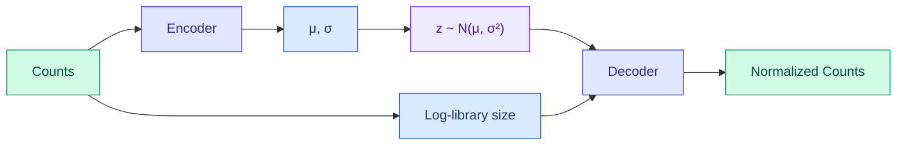

# Normalization Operators

DiffBio provides differentiable normalization operators for count data, dimensionality reduction, and sequence embeddings.

<span class="operator-normalization">Normalization</span> <span class="diff-high">Fully Differentiable</span>

## Overview

Normalization operators enable end-to-end optimization of:

- **VAENormalizer**: scVI-style VAE for count normalization
- **DifferentiableUMAP**: Differentiable UMAP dimensionality reduction
- **DifferentiablePHATE**: Differentiable PHATE dimensionality reduction
- **SequenceEmbedding**: Learned sequence embeddings

## VAENormalizer

Variational autoencoder for count data normalization, inspired by scVI.

### Quick Start

```python
from flax import nnx
from diffbio.operators.normalization import VAENormalizer, VAENormalizerConfig

# Configure VAE normalizer
config = VAENormalizerConfig(
    n_genes=2000,
    latent_dim=10,
    hidden_dim=128,
    n_layers=2,
)

# Create operator
rngs = nnx.Rngs(42)
vae_normalizer = VAENormalizer(config, rngs=rngs)

# Apply to count data
data = {"counts": raw_counts}  # (n_cells, n_genes)
result, state, metadata = vae_normalizer.apply(data, {}, None)

# Get normalized output
normalized = result["normalized"]      # Normalized counts
latent = result["latent"]              # Latent representation
reconstructed = result["reconstructed"] # Reconstructed counts
```

### Configuration

| Parameter | Type | Default | Description |
|-----------|------|---------|-------------|
| `n_genes` | int | 2000 | Number of genes |
| `latent_dim` | int | 10 | Latent space dimension |
| `hidden_dim` | int | 128 | Encoder/decoder hidden dimension |
| `n_layers` | int | 2 | Number of hidden layers |

### VAE Architecture



The VAE learns to:

1. Remove technical variation (library size, batch effects)
2. Preserve biological variation in latent space
3. Output normalized expression values

## DifferentiableUMAP

Differentiable UMAP for dimensionality reduction with gradient flow.

### Quick Start

```python
from diffbio.operators.normalization import DifferentiableUMAP, UMAPConfig

# Configure UMAP
config = UMAPConfig(
    n_components=2,
    n_neighbors=15,
    min_dist=0.1,
    input_features=50,
    hidden_dim=32,
)

# Create operator
rngs = nnx.Rngs(42)
umap = DifferentiableUMAP(config, rngs=rngs)

# Apply dimensionality reduction
data = {"features": high_dim_data}  # (n_samples, n_features)
result, state, metadata = umap.apply(data, {}, None)

# Get low-dimensional embedding
embedding = result["embedding"]  # (n_samples, n_components)
```

### Configuration

| Parameter | Type | Default | Description |
|-----------|------|---------|-------------|
| `n_components` | int | 2 | Output embedding dimension |
| `n_neighbors` | int | 15 | Number of neighbors for local structure |
| `min_dist` | float | 0.1 | Minimum distance between embedded points |
| `input_features` | int | 64 | Input feature dimension |
| `hidden_dim` | int | 32 | Projection network hidden dimension |
| `metric` | str | "euclidean" | Distance metric ("euclidean" or "cosine") |

### UMAP Loss Function

The differentiable UMAP optimizes a cross-entropy loss:

$$L = -\sum_{ij} [p_{ij} \log q_{ij} + (1-p_{ij}) \log(1-q_{ij})]$$

Where:

- $p_{ij}$ = high-dimensional similarity (fuzzy set membership)
- $q_{ij}$ = low-dimensional similarity

### Learnable Parameters

```python
# UMAP curve parameters
umap.a_param  # Controls q(d) = 1/(1 + a*d^(2b))
umap.b_param  # Shape parameter

# Projection network
umap.projection_layer1  # Input → Hidden
umap.projection_layer2  # Hidden → Output
```

## DifferentiablePHATE

Differentiable PHATE (Potential of Heat-diffusion for Affinity-based Trajectory Embedding) for dimensionality reduction with end-to-end gradient flow. Particularly well-suited for trajectory-structured data in single-cell analysis.

### Quick Start

```python
from diffbio.operators.normalization import DifferentiablePHATE, PHATEConfig

config = PHATEConfig(
    n_components=2,
    n_neighbors=5,
    decay=40.0,
    diffusion_t=10,
    gamma=1.0,
)

rngs = nnx.Rngs(42)
phate = DifferentiablePHATE(config, rngs=rngs)

data = {"features": high_dim_data}  # (n_samples, n_features)
result, state, metadata = phate.apply(data, {}, None)

embedding = result["embedding"]                  # (n_samples, n_components)
potential_distances = result["potential_distances"]  # (n_samples, n_samples)
diffusion_op = result["diffusion_operator"]      # M^t matrix
```

### Configuration

| Parameter | Type | Default | Description |
|-----------|------|---------|-------------|
| `n_components` | int | 2 | Output embedding dimensions |
| `n_neighbors` | int | 5 | Neighbors for local bandwidth |
| `decay` | float | 40.0 | Alpha-decaying kernel exponent (higher = sharper) |
| `diffusion_t` | int | 10 | Diffusion time (matrix power) |
| `gamma` | float | 1.0 | Informational distance constant (1=log, 0=sqrt) |
| `input_features` | int | 64 | Input feature dimension |
| `hidden_dim` | int | 32 | Projection network hidden dimension |

### PHATE Algorithm

1. **Pairwise distances** between samples
2. **Alpha-decay affinity kernel**: $K(i,j) = \exp(-\alpha \cdot (d / \sigma_i)^2)$ with adaptive bandwidth
3. **Symmetrize** and row-normalize to Markov matrix $M$
4. **Diffusion** $M^t$ via eigendecomposition
5. **Potential distances**: $-\log(M^t + \epsilon)$ for $\gamma=1$
6. **Classical MDS** on the potential distance matrix for low-dimensional embedding

### Use Cases

- Visualizing developmental trajectories in single-cell data
- Embedding data with branching structures
- Alternative to UMAP when trajectory preservation is important

## SequenceEmbedding

Learned embeddings for biological sequences.

### Quick Start

```python
from diffbio.operators.normalization import SequenceEmbedding, SequenceEmbeddingConfig

# Configure embedding
config = SequenceEmbeddingConfig(
    alphabet_size=4,
    max_length=100,
    embedding_dim=64,
    n_layers=2,
)

# Create operator
rngs = nnx.Rngs(42)
seq_embed = SequenceEmbedding(config, rngs=rngs)

# Get sequence embeddings
data = {"sequences": sequences}  # (n_seqs, seq_length, alphabet_size)
result, state, metadata = seq_embed.apply(data, {}, None)

# Get embeddings
embeddings = result["embeddings"]  # (n_seqs, embedding_dim)
```

### Configuration

| Parameter | Type | Default | Description |
|-----------|------|---------|-------------|
| `alphabet_size` | int | 4 | Input alphabet size |
| `max_length` | int | 100 | Maximum sequence length |
| `embedding_dim` | int | 64 | Output embedding dimension |
| `n_layers` | int | 2 | Number of encoder layers |

### Embedding Architecture


## Training with Normalization

### VAE Training

```python
from diffbio.losses.statistical_losses import VAELoss

vae_loss = VAELoss(kl_weight=1.0)

def train_vae(normalizer, counts):
    data = {"counts": counts}
    result, _, _ = normalizer.apply(data, {}, None)

    # Reconstruction + KL loss
    loss = vae_loss(
        reconstructed=result["reconstructed"],
        target=counts,
        mu=result["mu"],
        log_var=result["log_var"],
    )
    return loss
```

### UMAP Training

```python
def train_umap(umap, features):
    data = {"features": features}
    result, _, _ = umap.apply(data, {}, None)

    # UMAP cross-entropy loss
    p_ij = result["high_dim_similarities"]
    q_ij = result["low_dim_similarities"]

    loss = umap._compute_umap_loss(p_ij, q_ij)
    return loss
```

## Use Cases

| Application | Operator | Description |
|-------------|----------|-------------|
| scRNA-seq normalization | VAENormalizer | Remove technical variation |
| Visualization | DifferentiableUMAP | 2D/3D cell embeddings |
| Sequence similarity | SequenceEmbedding | Compare sequences |
| Trajectory visualization | DifferentiablePHATE | PHATE embedding |
| Feature extraction | All | Learned representations |

## Next Steps

- See [Single-Cell Operators](singlecell.md) for clustering and batch correction
- Explore [Statistical Operators](statistical.md) for differential expression
- Check [VAE Loss](../losses/statistical.md) for training objectives
