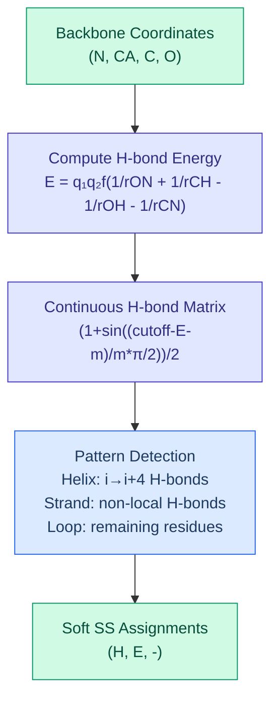

# Protein Structure Operators

DiffBio provides differentiable operators for protein structure analysis, including secondary structure prediction using the DSSP algorithm.

<span class="operator-protein">Protein</span> <span class="diff-high">Fully Differentiable</span>

## Overview

Protein structure operators enable gradient-based optimization for structural bioinformatics:

- **DifferentiableSecondaryStructure**: PyDSSP-style DSSP algorithm with continuous hydrogen bond matrix

## Protein foundation-model scope

Phase 7 protein foundation-model support is deliberately narrow. DiffBio now
uses the shared sequence foundation substrate for protein sequence context in
the secondary-structure benchmark and provides a strict adapter contract for
precomputed protein-LM artifacts. This means exported embedding matrices can be
aligned by `sequence_ids` through the same sequence adapter path used for other
foundation-model benchmarks.

Post-DTI stable boundary: benchmark-backed operator support is separate from imported foundation-model promotion.

This is not stable imported protein-LM support. It does not claim external
protein-LM checkpoint loading, tokenizer interchangeability, or broad protein
task promotion. The current benchmark evidence is limited to synthetic
secondary-structure scaffold context with stable scope excluded.

## DifferentiableSecondaryStructure

Differentiable implementation of the DSSP algorithm for assigning secondary structure (helix, strand, loop) to protein backbone atoms.

### Algorithm

The DSSP algorithm (Kabsch & Sander, 1983) assigns secondary structure based on hydrogen bonding patterns:



### Quick Start

```python
from flax import nnx
import jax
import jax.numpy as jnp
from diffbio.operators.protein import (
    DifferentiableSecondaryStructure,
    SecondaryStructureConfig,
    create_secondary_structure_predictor,
)

# Create operator
predictor = create_secondary_structure_predictor(
    margin=1.0,      # Smoothing margin
    cutoff=-0.5,     # H-bond energy threshold (kcal/mol)
    temperature=1.0, # Softmax temperature
)

# Prepare backbone coordinates (N, CA, C, O atoms)
# Shape: (batch, n_residues, 4, 3)
n_residues = 50
coords = jax.random.uniform(jax.random.PRNGKey(0), (1, n_residues, 4, 3)) * 10

# Apply operator
data = {"coordinates": coords}
result, state, metadata = predictor.apply(data, {}, None)

# Get results
ss_probs = result["ss_onehot"]     # (1, 50, 3) - soft probabilities
ss_indices = result["ss_indices"]   # (1, 50) - hard assignments
hbond_map = result["hbond_map"]     # (1, 50, 50) - H-bond matrix
```

### Configuration

| Parameter | Type | Default | Description |
|-----------|------|---------|-------------|
| `margin` | float | 1.0 | Smoothing margin for H-bond transformation |
| `cutoff` | float | -0.5 | H-bond energy threshold (kcal/mol) |
| `min_helix_length` | int | 4 | Minimum residues for helix assignment |
| `temperature` | float | 1.0 | Softmax temperature for assignments |

### Input/Output Formats

**Input**

| Key | Shape | Description |
|-----|-------|-------------|
| `coordinates` | (batch, length, 4, 3) | Backbone atom coordinates (N, CA, C, O) |

**Output**

| Key | Shape | Description |
|-----|-------|-------------|
| `coordinates` | (batch, length, 4, 3) | Original coordinates |
| `ss_onehot` | (batch, length, 3) | Soft SS probabilities (loop, helix, strand) |
| `ss_indices` | (batch, length) | Hard assignments (0=loop, 1=helix, 2=strand) |
| `hbond_map` | (batch, length, length) | Continuous H-bond matrix in [0, 1] |

### Hydrogen Bond Energy

The hydrogen bond energy is computed using the Kabsch-Sander electrostatic formula:

$$E = q_1 q_2 \cdot f \cdot \left(\frac{1}{r_{ON}} + \frac{1}{r_{CH}} - \frac{1}{r_{OH}} - \frac{1}{r_{CN}}\right)$$

Where:

- $q_1 q_2 = 0.084$ (partial charges in electron units)
- $f = 332$ (conversion factor to kcal/mol)
- $r_{XY}$ = distance between atoms X and Y

Donor: N-H from residue i, Acceptor: C=O from residue j

### Continuous H-bond Matrix

The energy is transformed to a continuous [0,1] matrix using:

$$\text{HbondMat}(i,j) = \frac{1 + \sin\left(\frac{\text{cutoff} - E(i,j) - \text{margin}}{\text{margin}} \cdot \frac{\pi}{2}\right)}{2}$$

This smooth transformation enables gradient flow through secondary structure prediction.

### Secondary Structure Classes

| Index | Symbol | Name | Pattern |
|-------|--------|------|---------|
| 0 | `-` | Loop/Coil | No characteristic H-bonds |
| 1 | `H` | α-Helix | i→i+4 backbone H-bonds |
| 2 | `E` | β-Strand | Non-local parallel/antiparallel H-bonds |

### Training Example

```python
import optax
from flax import nnx

predictor = create_secondary_structure_predictor()
optimizer = optax.adam(1e-3)
opt_state = optimizer.init(nnx.state(predictor, nnx.Param))

def loss_fn(model, coords, target_ss):
    """Cross-entropy loss for SS prediction."""
    data = {"coordinates": coords}
    result, _, _ = model.apply(data, {}, None)
    log_probs = jnp.log(result["ss_onehot"] + 1e-10)
    return -jnp.mean(jnp.sum(target_ss * log_probs, axis=-1))

@nnx.jit
def train_step(model, opt_state, coords, target_ss):
    loss, grads = nnx.value_and_grad(loss_fn)(model, coords, target_ss)
    params = nnx.state(model, nnx.Param)
    updates, opt_state = optimizer.update(grads, opt_state, params)
    nnx.update(model, optax.apply_updates(params, updates))
    return loss, opt_state
```

### Accessing the H-bond Map

```python
# Get continuous H-bond matrix for analysis
result, _, _ = predictor.apply({"coordinates": coords}, {}, None)
hbond_map = result["hbond_map"]  # (batch, length, length)

# Find strong H-bonds (threshold at 0.5 matches original DSSP)
strong_hbonds = hbond_map > 0.5

# Visualize H-bond pattern
import matplotlib.pyplot as plt
plt.imshow(hbond_map[0], cmap='viridis')
plt.xlabel('Acceptor residue')
plt.ylabel('Donor residue')
plt.colorbar(label='H-bond probability')
plt.title('Hydrogen Bond Matrix')
```

## Use Cases

| Application | Operator | Description |
|-------------|----------|-------------|
| Structure validation | DifferentiableSecondaryStructure | Validate predicted structures |
| Fold recognition | DifferentiableSecondaryStructure | Compare SS patterns |
| Protein design | DifferentiableSecondaryStructure | Optimize for target SS |
| MD analysis | DifferentiableSecondaryStructure | Track SS changes during simulation |

## References

1. Kabsch, W. & Sander, C. (1983). "Dictionary of protein secondary structure: pattern recognition of hydrogen-bonded and geometrical features." *Biopolymers* 22, 2577-2637.

2. Minami, S. (2023). "PyDSSP: A simplified implementation of DSSP algorithm for PyTorch and NumPy." GitHub repository.

## Next Steps

- See [Alignment Operators](alignment.md) for sequence-structure alignment
- Explore [Statistical Operators](statistical.md) for related analysis methods
