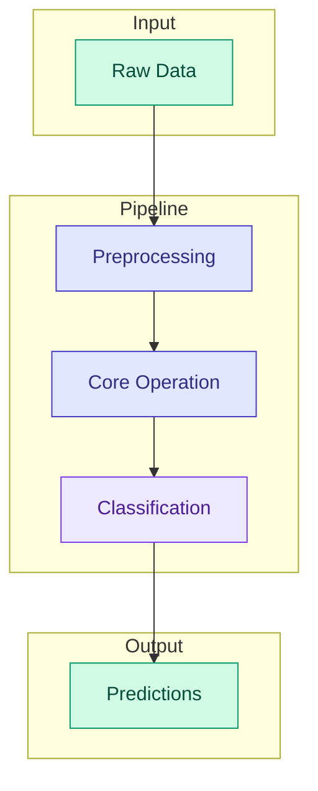

# Pipelines Overview

DiffBio pipelines compose multiple operators into end-to-end differentiable workflows. This enables joint optimization of all pipeline components.

## Available Pipelines

| Pipeline | Description | Status |
|----------|-------------|--------|
| [Variant Calling](variant-calling.md) | Reads → Pileup → Variants | <span class="diff-high">Implemented</span> |
| [Enhanced Variant Calling](enhanced-variant-calling.md) | DeepVariant-style CNN variant calling with quality recalibration | <span class="diff-high">Implemented</span> |
| [Single-Cell Analysis](single-cell.md) | scVI-style VAE + Harmony batch correction + soft clustering | <span class="diff-high">Implemented</span> |
| [Preprocessing](preprocessing.md) | Quality filtering → Adapter removal → Error correction | <span class="diff-high">Implemented</span> |
| [Differential Expression](differential-expression.md) | DESeq2-style differential expression analysis | <span class="diff-high">Implemented</span> |
| Alignment Pipeline | Raw reads → Aligned reads | <span class="diff-medium">Planned</span> |
| De Novo Assembly | Reads → Contigs | <span class="diff-low">Research</span> |

## Pipeline Architecture

DiffBio pipelines follow a modular architecture:



## Pipeline Benefits

### End-to-End Optimization

Traditional pipelines optimize each step independently:

```
Input → [Optimize A] → [Optimize B] → [Optimize C] → Output
           ↑              ↑              ↑
        (separate)    (separate)     (separate)
```

DiffBio optimizes the entire pipeline jointly:

```
Input → [A] → [B] → [C] → Output
          ↖    ↑    ↗
            (joint optimization)
```

### Gradient Flow

Gradients flow through all pipeline stages:

```python
def pipeline_loss(params, data, targets):
    # Step 1: Quality filtering (gradients to threshold)
    # Step 2: Pileup (gradients to weighting)
    # Step 3: Classification (gradients to classifier weights)
    predictions = pipeline(params, data)
    return loss(predictions, targets)

# Single gradient computation optimizes all components
grads = jax.grad(pipeline_loss)(params, data, targets)
```

## Creating Pipelines

### Using Factory Functions

```python
from diffbio.pipelines import create_variant_calling_pipeline

# Quick creation with sensible defaults
pipeline = create_variant_calling_pipeline(
    reference_length=1000,
    num_classes=3,
    quality_threshold=20.0,
)
```

### Manual Configuration

```python
from diffbio.pipelines import VariantCallingPipeline, VariantCallingPipelineConfig
from flax import nnx

# Full control over configuration
config = VariantCallingPipelineConfig(
    reference_length=1000,
    num_classes=3,
    quality_threshold=20.0,
    pileup_window_size=11,
    classifier_hidden_dim=64,
    use_quality_weights=True,
)

# Initialize with random number generator
rngs = nnx.Rngs(seed=42)
pipeline = VariantCallingPipeline(config, rngs=rngs)
```

## Using Pipelines

### Single Sample Processing

```python
# Prepare input data
data = {
    "reads": reads,           # (num_reads, read_length, 4)
    "positions": positions,   # (num_reads,)
    "quality": quality,       # (num_reads, read_length)
}

# Apply pipeline
result_data, state, metadata = pipeline.apply(data, {}, None)

# Access outputs
pileup = result_data["pileup"]          # (reference_length, 4)
logits = result_data["logits"]          # (reference_length, num_classes)
probabilities = result_data["probabilities"]  # (reference_length, num_classes)
```

### Batch Processing

```python
from datarax.core.element_batch import Batch, Element

# Create batch
elements = [
    Element(data=sample_data, state={}, metadata={})
    for sample_data in samples
]
batch = Batch.from_elements(elements)

# Process batch
result_batch = pipeline.apply_batch(batch)
```

### Training Mode

```python
# Enable dropout and other training-specific behavior
pipeline.train_mode()

# ... training loop ...

# Disable for inference
pipeline.eval_mode()
```

## Pipeline Components

Each pipeline composes multiple operators:

### Variant Calling Pipeline

```python
class VariantCallingPipeline:
    def __init__(self, config, rngs):
        # 1. Quality filter
        self.quality_filter = DifferentiableQualityFilter(...)

        # 2. Pileup generator
        self.pileup = DifferentiablePileup(...)

        # 3. Variant classifier
        self.classifier = VariantClassifier(...)
```

### Accessing Sub-Components

```python
pipeline = create_variant_calling_pipeline(reference_length=100)

# Access individual operators
print(pipeline.quality_filter.threshold)  # Quality threshold
print(pipeline.pileup.temperature)        # Pileup temperature
print(pipeline.classifier)                # Neural network classifier
```

## Custom Pipelines

Create custom pipelines by composing operators:

```python
from datarax.core.operator import OperatorModule
from flax import nnx

class CustomPipeline(OperatorModule):
    def __init__(self, config, rngs):
        super().__init__(config, rngs=rngs)

        # Initialize your operators
        self.op1 = Operator1(config.op1_config, rngs=rngs)
        self.op2 = Operator2(config.op2_config, rngs=rngs)
        self.op3 = Operator3(config.op3_config, rngs=rngs)

    def apply(self, data, state, metadata, random_params=None, stats=None):
        # Chain operators
        data, state, metadata = self.op1.apply(data, state, metadata)
        data, state, metadata = self.op2.apply(data, state, metadata)
        data, state, metadata = self.op3.apply(data, state, metadata)

        return data, state, metadata
```

## Best Practices

### 1. Match Reference Lengths

All operators in a pipeline must agree on reference length:

```python
# Consistent reference length
ref_len = 1000
pileup_config = PileupConfig(reference_length=ref_len)
pipeline_config = VariantCallingPipelineConfig(reference_length=ref_len)
```

### 2. Set Mode Appropriately

```python
# Training
pipeline.train_mode()
for batch in train_data:
    loss = train_step(pipeline, batch)

# Evaluation
pipeline.eval_mode()
for batch in test_data:
    metrics = evaluate(pipeline, batch)
```

### 3. JIT Compile for Performance

```python
@jax.jit
def predict(pipeline, data):
    result, _, _ = pipeline.apply(data, {}, None)
    return result["probabilities"]

# First call compiles, subsequent calls are fast
preds = predict(pipeline, sample_data)
```

### 4. Save and Load Checkpoints

```python
import pickle
from flax import nnx

# Save
state = nnx.state(pipeline, nnx.Param)
with open("checkpoint.pkl", "wb") as f:
    pickle.dump(state, f)

# Load
with open("checkpoint.pkl", "rb") as f:
    state = pickle.load(f)
nnx.update(pipeline, state)
```

## Next Steps

- See the [Variant Calling Pipeline](variant-calling.md) for detailed documentation
- Learn about [Training](../training/overview.md) pipelines
- Explore [Examples](../../examples/overview.md) for complete use cases
